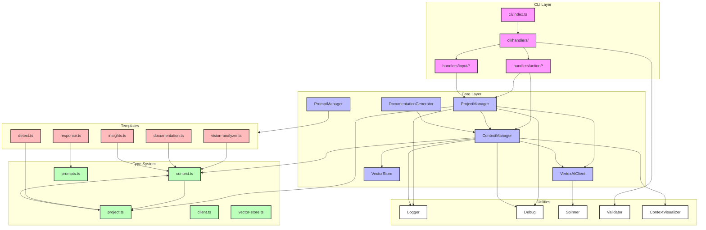

# CLI Architecture



## Key Components

### CLI Layer
- Entry point and command handling
- Action handlers for specific commands
- Interactive input handling

### Core Layer
- Project and context management
- AI client integration
- Vector storage
- Documentation generation

### Type System
- Shared type definitions
- Project and context types
- Client interfaces

### Templates
- AI prompt templates
- Response formatting
- Analysis templates

### Utilities
- Logging and debugging
- Progress indication
- Validation
- Visualization

## Type Dependencies

The type system is built around two main concepts:
1. **Context Types** (`context.ts`)
   - Base types for all contexts
   - Enhanced context types with metadata
   - Project-specific context extensions

2. **Project Types** (`project.ts`)
   - Project type definitions
   - Project insights
   - Type detection interfaces

These two type modules are interdependent:
- `ProjectType` is used in `SystemMetadata` (context.ts)
- `ProjectInsights` extends `ContextInsights` (context.ts)
- `EnhancedProjectContext` extends `EnhancedContext` with project-specific constraints

## Flow of Control

1. CLI commands → Action Handlers
2. Action Handlers → Core Managers
3. Core Managers ↔ Type System
4. Core Managers → Templates
5. Core Managers → Utils

## Key Interfaces

### EnhancedContext vs EnhancedProjectContext

EnhancedContext provides the base structure:
```typescript
interface EnhancedContext extends Context {
  insights: ContextInsights;
  _system: {
    embeddings: ContextEmbeddings;
    metadata: SystemMetadata;
    similarity?: number;
    matchType?: string;
  };
  embeddings: ContextEmbeddings;
  metadata: SystemMetadata;
  similarity?: number;
  matchType?: string;
}
```

EnhancedProjectContext adds project-specific constraints:
```typescript
interface EnhancedProjectContext extends EnhancedContext {
  insights: ProjectInsights;  // More specific insight types
  metadata: SystemMetadata & {
    projectType: ProjectType;  // Required project type
  };
}
```

The key differences:
1. `insights` is constrained to `ProjectInsights`
2. `metadata` requires a `projectType`
3. Inherits all base functionality from `EnhancedContext`
