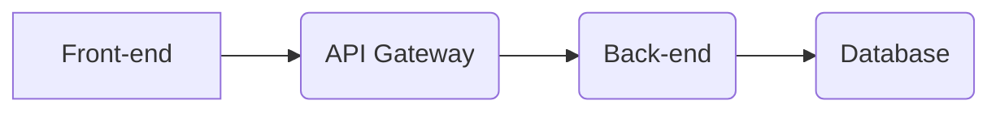

## ARCHITECTURE

This document outlines the architecture for the project, focusing specifically on the . category.

### Project Context

- Project Type: Unknown
- Technical Requirements: None specified
- Technical Integrations: None specified
- UX Requirements: None specified

### Technical Overview

Due to the lack of specific project details, this section provides a general overview of potential architectural considerations for the . category.

#### Key Components

- **Front-end:** Responsible for user interface and interaction.
- **Back-end:** Handles data processing, business logic, and database interaction.
- **Database:** Stores application data.

#### Technologies

- **Front-end:** 
    - HTML, CSS, JavaScript
    - Frameworks: React, Angular, Vue.js
- **Back-end:**
    - Python, Java, Node.js
    - Frameworks: Django, Spring, Express.js
- **Database:**
    - MySQL, PostgreSQL, MongoDB

#### Architecture Diagram

This is a basic representation of a typical architecture. Specific technologies and components will depend on project requirements.

### .-Specific Considerations

- **Data Model:** Define the data structures and relationships specific to the . category.
- **API Design:** Design APIs to handle . related data and functionalities.
- **Security:** Implement appropriate security measures to protect sensitive data.
- **Scalability:** Consider scalability requirements for the . category.

### Next Steps

- Gather detailed project requirements to refine the architecture.
- Choose specific technologies based on project needs.
- Design and develop the . specific components and functionalities.
- Implement security measures and test the architecture thoroughly.

### Additional Resources

- [Software Architecture Patterns](https://martinfowler.com/articles/patterns-of-enterprise-application-architecture.html)
- [Microservices Architecture](https://microservices.io/)
- [Cloud Architecture](https://cloud.google.com/architecture/)

This document provides a starting point for understanding and designing the architecture of the . category. As the project evolves and more information becomes available, this document should be updated to reflect the specific details and needs of the project.