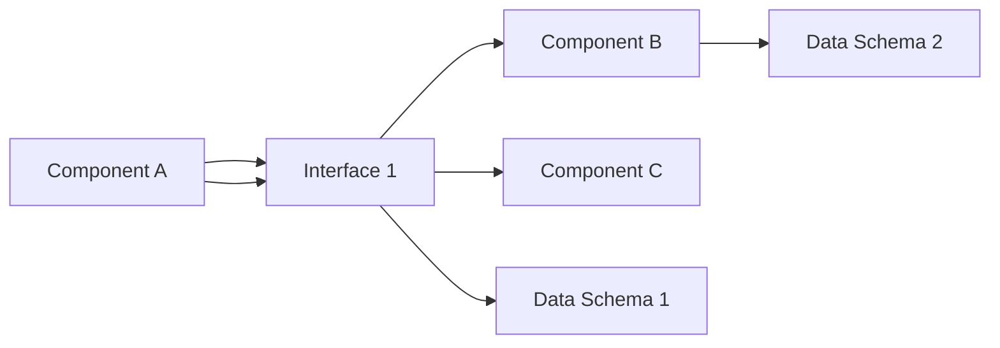

## Data Model: Architecture Category

This document outlines the data model for the architecture category of the project.

**Purpose:**

This data model defines the structure and relationships of data elements related to the architecture of the project. It serves as a reference for developers and designers working on the project, ensuring consistency and clarity in data representation.

**Data Model Specification:**

### Entities:

- **Component:** Represents a functional unit within the architecture.
  - Properties:
    - Name: Unique identifier for the component.
    - Description: Detailed explanation of the component's functionality.
    - Type: Classification of the component (e.g., API, database, service).
    - Inputs: List of data inputs the component receives.
    - Outputs: List of data outputs the component produces.
    - Dependencies: List of other components the component relies on.
    - Technologies: List of technologies used to implement the component.
- **Interface:** Represents a communication channel between components.
  - Properties:
    - Name: Unique identifier for the interface.
    - Description: Explanation of the data exchanged through the interface.
    - Protocol: Communication protocol used by the interface (e.g., HTTP, gRPC).
    - Data Format: Format of the data exchanged through the interface (e.g., JSON, XML).
    - Producer: Component that sends data through the interface.
    - Consumer: Component that receives data through the interface.
- **Data Schema:** Represents the structure of data used by components.
  - Properties:
    - Name: Unique identifier for the data schema.
    - Description: Explanation of the data elements and their relationships.
    - Fields: List of fields within the data schema, including data types and constraints.
    - Version: Version number of the data schema.
- **Deployment:** Represents an instance of a component deployed in a specific environment.
  - Properties:
    - Component: Reference to the component deployed.
    - Environment: Name of the environment where the component is deployed (e.g., production, staging).
    - Configuration: Specific configuration parameters for the deployed component.

### Relationships:

- **Component uses Interface:** A component can use multiple interfaces to communicate with other components.
- **Interface connects Components:** An interface connects two components to enable data exchange.
- **Component uses Data Schema:** A component may use one or more data schemas to define the structure of its inputs and outputs.
- **Deployment realizes Component:** A deployment represents a specific instance of a component in a given environment.

**Example:**

This diagram illustrates how Component A communicates with Component B and Component C through Interface 1. Component A also uses Data Schema 1, while Component B and Component C use Data Schema 2.

**Next Steps:**

- Review and refine the data model based on specific project requirements.
- Define data validation rules to ensure data integrity.
- Develop data documentation that explains the meaning and usage of each data element.
- Implement the data model in the project's data storage and processing systems.