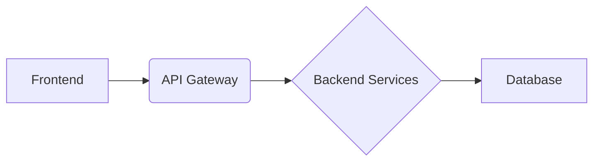

## Architecture Overview

This document provides an overview of the architecture for this project. It describes the key components, their interactions, and the technologies used. 

### System Architecture

**High-Level Diagram:**

**Components:**

* **Frontend:** This is the user interface that interacts with the API Gateway. It can be a web application, mobile app, or any other client application.
* **API Gateway:** This is the entry point for all API requests. It handles authentication, authorization, routing, and load balancing.
* **Backend Services:** These are the services that implement the business logic of the application. They can be implemented in various languages and technologies.
* **Database:** This is where the application data is stored. It can be a relational database, NoSQL database, or any other type of data store.

**Data Flow:**

1. The user interacts with the frontend.
2. The frontend sends requests to the API Gateway.
3. The API Gateway routes the requests to the appropriate backend service.
4. The backend service processes the request and returns a response.
5. The API Gateway returns the response to the frontend.
6. The frontend displays the response to the user.

### Technology Stack

The following technologies are used in this project:

* Frontend: [List of frontend technologies]
* API Gateway: [API Gateway technology]
* Backend Services: [List of backend technologies]
* Database: [Database technology]

### Next Steps

* Define the detailed architecture for each component.
* Identify the specific technologies to be used for each component.
* Develop the API specification for the API Gateway.
* Design the database schema.

This document provides a high-level overview of the architecture. More detailed information will be provided in subsequent documents.