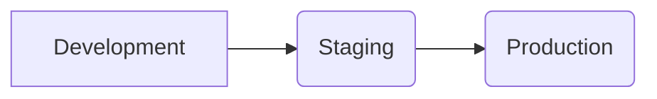

## Deployment Environments

This document outlines the different environments used for deploying the project. Each environment serves a specific purpose and has its own requirements and configurations.

### Types of Environments

The following environment types are used in the project:

* **Development:** This environment is used for active development and testing of new features. It is typically accessible only to developers.
* **Staging:** This environment is used for integration testing and simulating production conditions. It is typically accessible to a wider audience, including testers and stakeholders.
* **Production:** This environment is the live environment where the project is deployed and used by end users. It is typically the most stable and secure environment.

### Environment Requirements

Each environment has specific requirements that must be met before the project can be deployed. These requirements may include:

* **Hardware:** The type and amount of hardware resources required, such as CPU, memory, and storage.
* **Software:** The specific software versions and configurations required, such as operating system, web server, and database.
* **Network:** The network connectivity required, such as firewall rules and access controls.

### Environment Configurations

The specific configurations for each environment will vary depending on the project requirements. However, some common configurations include:

* **Database connection strings:** The connection strings for connecting to the database in each environment.
* **Application settings:** The configuration settings for the application, such as API keys and environment variables.
* **Logging and monitoring:** The configuration for logging and monitoring the application in each environment.

### Deployment Process

The process for deploying the project to each environment will vary depending on the project and the tools used. However, a typical deployment process may include the following steps:

1. Build the project artifacts.
2. Upload the artifacts to the target environment.
3. Configure the environment.
4. Start the application.
5. Verify the deployment.

### Example Deployment Process

Here is an example deployment process for a Node.js application using Docker:

1. Build the Docker image for the application.
2. Push the Docker image to a container registry.
3. Deploy the Docker image to a Kubernetes cluster in the target environment.
4. Configure the Kubernetes deployment with the necessary environment variables and resources.
5. Verify that the application is running and accessible in the target environment.

### Diagrams

**Example Deployment Architecture:**

## Next Steps

* Review the environment requirements and configurations for each environment.
* Develop a deployment plan for each environment.
* Implement the deployment process for each environment.
* Monitor the application in each environment and address any issues that arise.

This documentation provides a high-level overview of the deployment environments for the project. For more specific information, please refer to the project documentation and the relevant deployment tools.