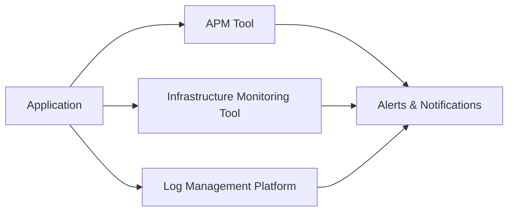

## Monitoring in the Deployment Category

This document provides an overview of monitoring practices specific to the deployment category. 

### Introduction

Deployment monitoring plays a crucial role in ensuring the successful operation and performance of deployed applications. By actively monitoring various aspects of the deployment environment, we can identify and address potential issues before they impact users.

### Key Metrics and Monitoring Strategies

Specific metrics and monitoring strategies will vary depending on the project type and technical requirements. However, some key areas to consider include:

**Application Health:**
* **Availability:** Monitoring application uptime and responsiveness.
* **Performance:** Tracking response times, resource utilization, and error rates.
* **Functionality:** Verifying core functionalities are working as expected.

**Infrastructure Health:**
* **Resource utilization:** Monitoring CPU, memory, and storage usage of deployed instances.
* **Network health:** Tracking network connectivity and latency.
* **Log analysis:** Analyzing application and system logs for errors and warnings.

**Deployment Process:**
* **Deployment success rate:** Monitoring the success rate of individual deployments.
* **Rollback capabilities:** Verifying the ability to roll back deployments in case of issues.

### Tools and Techniques

Various tools and techniques can be used for deployment monitoring. Here are some examples:

* **Application Performance Monitoring (APM):** Tools like Datadog, Dynatrace, and New Relic offer comprehensive monitoring of application performance and health.
* **Infrastructure Monitoring Tools:** Tools like Prometheus and Grafana provide detailed insights into resource utilization and infrastructure health.
* **Log Management Platforms:** Platforms like Splunk and ELK stack facilitate centralized log collection and analysis.
* **Cloud Monitoring Services:** Cloud providers like AWS and Azure offer native monitoring services for infrastructure and applications deployed on their platforms.

### Practical Example

Consider a web application deployed on a cloud platform. We can monitor the following:

* **Application availability:** Using a synthetic monitoring tool to simulate user requests and track response times.
* **Resource utilization:** Monitoring CPU and memory usage of the application servers.
* **Log analysis:** Setting up alerts for critical errors and warnings in application logs.
* **Deployment success rate:** Tracking the success rate of each deployment through CI/CD pipeline logs.

By continuously monitoring these metrics, we can quickly identify and address issues that could potentially impact the application's availability and performance.

### Diagrams

This diagram illustrates how various monitoring tools can be used to collect data from the application and infrastructure, and how alerts and notifications can be generated based on predefined thresholds.

### Next Steps

* Define specific monitoring requirements and metrics based on project needs.
* Select appropriate tools and techniques for implementing the monitoring strategy.
* Configure monitoring tools and set up alerts and notifications.
* Establish clear procedures for responding to monitoring alerts and resolving issues.
* Regularly review and refine the monitoring strategy based on experience and changing needs.

This documentation provides a foundation for understanding and implementing effective deployment monitoring. Remember to adapt the approach based on your specific project context and technical requirements.