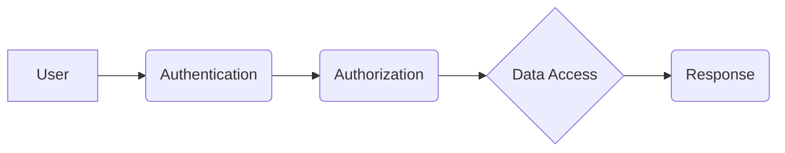

## Non-Functional Requirements

This document outlines the non-functional requirements for the project. These requirements address how the system should behave in terms of performance, security, usability, and other quality attributes. 

### Performance

* **Response Time:** The system shall respond to user requests within 2 seconds.
* **Throughput:** The system shall be able to handle 1000 concurrent users.
* **Scalability:** The system shall be able to scale to support increased user load without impacting performance.
* **Availability:** The system shall be available 99.9% of the time.

### Security

* **Data Security:** All user data shall be encrypted at rest and in transit.
* **Authentication:** Users shall be authenticated using a secure mechanism such as multi-factor authentication.
* **Authorization:** Users shall only have access to the data and functionality that they are authorized to use.
* **Auditing:** All user activity shall be logged and audited.

### Usability

* **User Interface:** The user interface shall be intuitive and easy to use.
* **Accessibility:** The user interface shall be accessible to users with disabilities.
* **Localization:** The user interface shall be localized for different languages and cultures.
* **Help and Documentation:** Comprehensive help and documentation shall be provided for users.

### Maintainability

* **Code Quality:** The code shall be well-documented, modular, and reusable.
* **Testability:** The code shall be easy to test and debug.
* **Deployment:** The system shall be easy to deploy and update.
* **Monitoring:** The system shall be monitored for performance and availability issues.

### Other Non-Functional Requirements

* **Compliance:** The system shall comply with all applicable laws and regulations.
* **Portability:** The system shall be portable to different platforms and environments.
* **Interoperability:** The system shall be able to interoperate with other systems.

**Next Steps:**

* Review and finalize the non-functional requirements.
* Develop test cases to verify that the non-functional requirements are met.
* Implement the system to meet the non-functional requirements.

## Diagrams

**Example Diagram:**

This diagram illustrates the authentication and authorization process. The user first authenticates with the system. Once authenticated, the user is authorized to access specific data. The system then retrieves the requested data and returns it to the user.

## Additional Notes

* This is a non-exhaustive list of non-functional requirements. 
* Additional non-functional requirements may be added as needed.
* The specific values for the performance requirements (e.g., response time, throughput) may need to be adjusted based on the specific needs of the project.
