-e \n\n=== START OF FILE: /Users/nit/Developer/apps/drib/drib-app/ctx/_templates/architecture.md
# [Component Name] Architecture

#[semantic=architecture]
#[intent=implementation]
#[audience=technical]
#[lifecycle=living]

## LLM Context
- Key Concepts: [concept1, concept2]
- Technical Stack: [tech1, tech2]
- Design Patterns: [pattern1, pattern2]

## Related Documents
- Direct: [[file1]], [[file2]]
- Indirect: [[file3]]
- Prerequisites: [[file4]]
- Successors: [[file5]]

## Overview

Brief description of the component and its role in the system.

## System Architecture

### 1. Component Overview
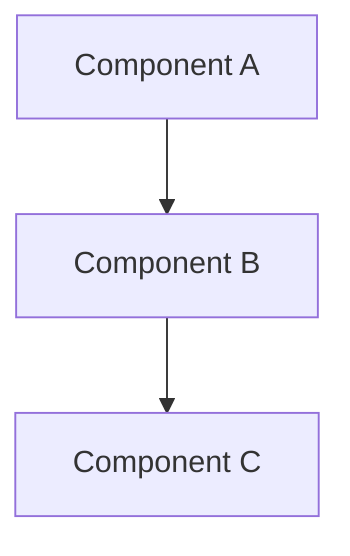

## Component Models

### 1. Data Models
```typescript
interface MainModel {
  property: string
  nestedObject: {
    key: string
    value: number
  }
}
```

## Implementation Details

### 1. Core Components
- Component A: Description
- Component B: Description

### 2. Integration Points
- System X Integration
- System Y Integration

## Technical Requirements

### 1. Performance
- Latency: <XXms
- Throughput: >XX/second
- Reliability: >XX.XX%

### 2. Scalability
- Load capacity: XX concurrent users
- Data volume: XX GB/day
- Growth rate: XX% monthly

### 3. Security
- Authentication: [method]
- Authorization: [approach]
- Data protection: [standards]

## Implementation Status
- Stage: planning|development|live
- Priority: p0|p1|p2
- Dependencies: [[dep1]], [[dep2]]

## Version Control
- Last Updated: YYYY-MM-DD
- Change Type: major|minor|patch
- Migration Required: yes|no

## Related Documentation
- Link to related doc 1
- Link to related doc 2
-e \n=== END OF FILE: /Users/nit/Developer/apps/drib/drib-app/ctx/_templates/architecture.md\n
-e \n\n=== START OF FILE: /Users/nit/Developer/apps/drib/drib-app/ctx/_templates/feature-spec.md
# [Feature Name]

#[semantic=feature]
#[intent=specification]
#[audience=product]
#[lifecycle=living]

## LLM Context
- Key Concepts: [concept1, concept2]
- User Stories: [story1, story2]
- Technical Requirements: [req1, req2]

## Related Documents
- Direct: [[file1]], [[file2]]
- Indirect: [[file3]]
- Prerequisites: [[file4]]
- Successors: [[file5]]

## Overview
Brief description of the feature and its value proposition.

## User Stories

### Primary Stories
```typescript
interface UserStory {
  as: string
  want: string
  so: string
  acceptance: string[]
}
```

### Edge Cases
- Case 1: Description
- Case 2: Description

## Technical Specification

### 1. Architecture
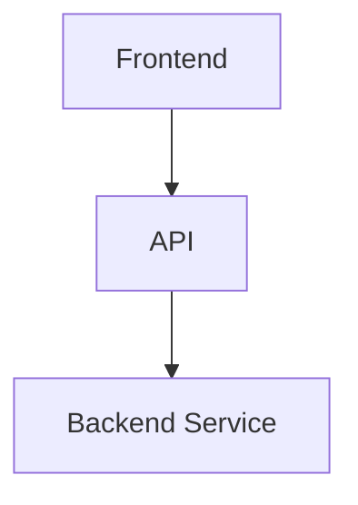

### 2. Data Models
```typescript
interface FeatureModel {
  property: string
  config: {
    key: string
    value: any
  }
}
```

### 3. API Endpoints
- `GET /api/feature`
- `POST /api/feature`

## Implementation Plan

### 1. Development Phases
- Phase 1: [Description]
- Phase 2: [Description]

### 2. Dependencies
- Frontend: [[dep1]]
- Backend: [[dep2]]
- Infrastructure: [[dep3]]

## Testing Strategy

### 1. Unit Tests
- Test case 1
- Test case 2

### 2. Integration Tests
- Scenario 1
- Scenario 2

## Metrics & Analytics

### 1. Success Metrics
- Metric 1: [Description]
- Metric 2: [Description]

### 2. Monitoring
- Alert 1: [Condition]
- Alert 2: [Condition]

## Implementation Status
- Stage: planning|development|live
- Priority: p0|p1|p2
- Dependencies: [[dep1]], [[dep2]]

## Version Control
- Last Updated: YYYY-MM-DD
- Change Type: major|minor|patch
- Migration Required: yes|no
-e \n=== END OF FILE: /Users/nit/Developer/apps/drib/drib-app/ctx/_templates/feature-spec.md\n
-e \n\n=== START OF FILE: /Users/nit/Developer/apps/drib/drib-app/ctx/_templates/metrics-spec.md
# [Metric Name]

#[semantic=metric]
#[intent=measurement]
#[audience=business]
#[lifecycle=living]

## LLM Context
- Key Concepts: [concept1, concept2]
- Business Impact: [impact1, impact2]
- Data Requirements: [data1, data2]

## Related Documents
- Direct: [[file1]], [[file2]]
- Indirect: [[file3]]
- Prerequisites: [[file4]]
- Successors: [[file5]]

## Overview
Brief description of the metric and its significance.

## Definition

### 1. Formula
```typescript
interface MetricCalculation {
  inputs: string[]
  formula: string
  output: string
}
```

### 2. Components
- Component 1: [Description]
- Component 2: [Description]

## Data Requirements

### 1. Data Sources
```typescript
interface DataSource {
  source: string
  frequency: string
  format: string
  validation: string[]
}
```

### 2. Collection Method
- Method 1: [Description]
- Method 2: [Description]

## Implementation

### 1. Collection Pipeline
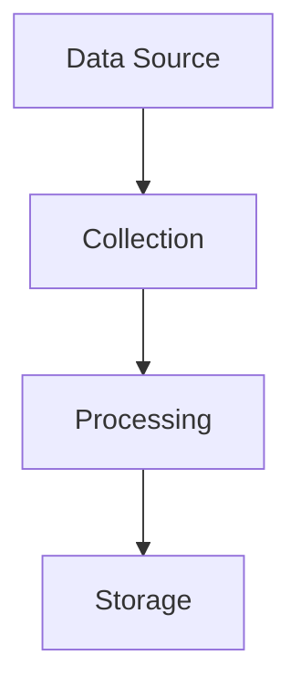

### 2. Visualization
- Chart Type: [Description]
- Dimensions: [List]
- Filters: [List]

## Analysis

### 1. Benchmarks
- Industry: [Value]
- Internal: [Value]
- Target: [Value]

### 2. Segmentation
- Segment 1: [Criteria]
- Segment 2: [Criteria]

## Actions

### 1. Thresholds
- Warning: [Value]
- Critical: [Value]

### 2. Response Plan
- Scenario 1: [Action]
- Scenario 2: [Action]

## Implementation Status
- Stage: planning|development|live
- Priority: p0|p1|p2
- Dependencies: [[dep1]], [[dep2]]

## Version Control
- Last Updated: YYYY-MM-DD
- Change Type: major|minor|patch
- Migration Required: yes|no
-e \n=== END OF FILE: /Users/nit/Developer/apps/drib/drib-app/ctx/_templates/metrics-spec.md\n
-e \n\n=== START OF FILE: /Users/nit/Developer/apps/drib/drib-app/ctx/_templates/abstract.md
# [Concept Name]: [Subtitle]

#[semantic=concept]
#[intent=definition]
#[audience=all]
#[lifecycle=living]

*Inspirational Quote or Theme*

## LLM Context
- Key Concepts: [concept1, concept2]
- Critical Dependencies: [dep1, dep2]
- Usage Patterns: [pattern1, pattern2]

## Related Documents
- Direct: [[file1]], [[file2]]
- Indirect: [[file3]]
- Prerequisites: [[file4]]
- Successors: [[file5]]

## The Vision

Brief poetic description of the concept and its significance.

## Core Principles

### 1. [First Principle]
- Key aspects
- Manifestations
- Applications

### 2. [Second Principle]
- Key aspects
- Manifestations
- Applications

## Technical Manifestation

```typescript
interface ConceptImplementation {
  core: {
    principles: string[]
    patterns: Pattern[]
    manifestations: Implementation[]
  }

  application: {
    technical: TechnicalApproach
    experiential: UserExperience
    social: CommunityAspect
  }

  impact: {
    immediate: Impact[]
    longTerm: Vision[]
    collective: Community[]
  }
}
```

## Practical Application

### 1. In Development
- How it guides code
- How it shapes architecture
- How it influences decisions

### 2. In Experience
- How users feel it
- How it manifests
- How it transforms

### 3. In Community
- How it connects
- How it grows
- How it evolves

## Implementation Status
- Stage: planning|development|live
- Priority: p0|p1|p2
- Dependencies: [[dep1]], [[dep2]]

## Version Control
- Last Updated: YYYY-MM-DD
- Change Type: major|minor|patch
- Migration Required: yes|no

## Related Concepts
- Link to related concept 1
- Link to related concept 2
- Link to related concept 3
-e \n=== END OF FILE: /Users/nit/Developer/apps/drib/drib-app/ctx/_templates/abstract.md\n
-e \n\n=== START OF FILE: /Users/nit/Developer/apps/drib/drib-app/ctx/2-technical/12-workflows/05-monitoring-workflow.md
# Monitoring Workflow

#monitoring #observability #workflow

## Overview

This document outlines the monitoring and observability practices for the Drib platform.

## Monitoring Strategy

### 1. Core Metrics
```typescript
interface CoreMetrics {
  application: {
    latency: "Response time tracking"
    throughput: "Request handling capacity"
    error_rate: "Error frequency monitoring"
    saturation: "Resource utilization"
  }
  
  infrastructure: {
    cpu: "CPU utilization"
    memory: "Memory usage"
    disk: "Storage metrics"
    network: "Network performance"
  }
  
  business: {
    users: "Active user tracking"
    features: "Feature usage metrics"
    conversion: "User journey tracking"
    satisfaction: "User experience metrics"
  }
}
```

### 2. Alerting System
```typescript
interface AlertSystem {
  severity_levels: {
    p0: "Critical - Immediate response"
    p1: "High - Response within 1 hour"
    p2: "Medium - Response within 4 hours"
    p3: "Low - Response within 24 hours"
  }
  
  notification_channels: {
    emergency: ["PagerDuty", "Phone"]
    urgent: ["Slack", "Email"]
    normal: ["Dashboard", "Email"]
    info: ["Dashboard"]
  }
}
```

## Observability Stack

### 1. Logging System
- Structured logging
- Log aggregation
- Log retention policies
- Search capabilities

### 2. Metrics Collection
- Time-series metrics
- Custom metrics
- Business metrics
- Performance metrics

### 3. Tracing System
- Distributed tracing
- Request tracking
- Performance profiling
- Error tracking

## Incident Response

### 1. Response Process
```typescript
interface IncidentResponse {
  detection: {
    automated: "Alert triggering"
    manual: "User reports"
    proactive: "Performance degradation"
  }
  
  triage: {
    severity: "Impact assessment"
    ownership: "Team assignment"
    communication: "Stakeholder notification"
  }
  
  resolution: {
    investigation: "Root cause analysis"
    mitigation: "Immediate fixes"
    prevention: "Long-term solutions"
  }
}
```

### 2. Post-Mortem
- Incident documentation
- Root cause analysis
- Action items
- Process improvements

## Performance Monitoring

### 1. Application Performance
```typescript
interface PerformanceMonitoring {
  frontend: {
    load_time: "Page load metrics"
    interaction: "User interaction timing"
    resources: "Resource usage tracking"
  }
  
  backend: {
    api_latency: "API response times"
    database: "Query performance"
    caching: "Cache effectiveness"
  }
  
  infrastructure: {
    scaling: "Auto-scaling metrics"
    capacity: "Resource utilization"
    costs: "Resource cost tracking"
  }
}
```

### 2. User Experience
- Real user monitoring
- Synthetic monitoring
- Feature usage tracking
- Error impact analysis

## Security Monitoring

### 1. Security Metrics
- Authentication events
- Authorization failures
- Rate limiting
- Vulnerability scanning

### 2. Compliance Monitoring
- Data access logs
- Audit trails
- Compliance reports
- Security posture

## Related Documentation

- [[development-workflow|Development Workflow]]
- [[deployment-workflow|Deployment Workflow]]
- [[../architecture/11-monitoring|Monitoring Systems]]
- [[incident-response|Incident Response]]
- [[../architecture/14-cost-management|Cost Management]]
- [[../implementation/02-technical-specifications|Technical Specifications]] -e \n=== END OF FILE: /Users/nit/Developer/apps/drib/drib-app/ctx/2-technical/12-workflows/05-monitoring-workflow.md\n
-e \n\n=== START OF FILE: /Users/nit/Developer/apps/drib/drib-app/ctx/2-technical/12-workflows/01-implementation-roadmap.md
# Implementation Roadmap

Related Documents:
- [[../architecture/12-ai-platform-strategy|AI Platform Strategy]] - Core AI infrastructure
- [[../architecture/13-security|Security Architecture]] - Security framework
- [[../architecture/14-cost-management|Cost Management]] - Resource optimization
- [[02-technical-specifications|Technical Specifications]] - Detailed specifications
- [[../1-core-systems/ai-integration|AI Integration]] - AI system implementation
- [[../4-workflows/development-workflow|Development Workflow]] - Development practices

## Overview

This document outlines the phased implementation plan for Drib's AI-powered football analytics platform, incorporating our technical decisions and platform integrations.

## Phase 1: Foundation (Months 1-2)

See also: [[../3-infrastructure/cloud-setup|Cloud Infrastructure Setup]]

### 1. Infrastructure Setup
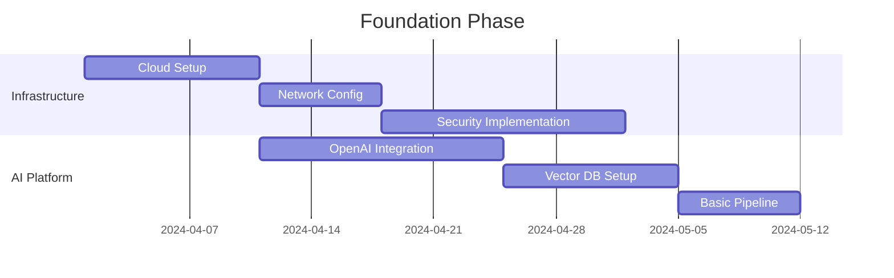

### 2. Core Components
```typescript
interface Phase1Deliverables {
  infrastructure: {
    cloud: {
      provider: "AWS" | "GCP"
      services: [
        "Kubernetes",
        "Container Registry",
        "Load Balancer",
        "Monitoring"
      ]
    }
    security: {
      auth: "Auth0"
      encryption: "AWS KMS"
      network: "CloudFlare"
    }
  }

  aiPlatform: {
    language: {
      provider: "OpenAI"
      models: ["gpt-4-turbo-preview"]
      integration: "REST API"
    }
    storage: {
      vector: "Pinecone"
      cache: "Redis"
      data: "PostgreSQL"
    }
  }
}
```

## Phase 2: Core Features (Months 3-4)

See also: 
- [[../1-core-systems/match-analysis|Match Analysis Engine]]
- [[../1-core-systems/computer-vision|Computer Vision Pipeline]]
- [[../1-core-systems/data-pipeline|Data Pipeline Architecture]]

### 1. Feature Implementation
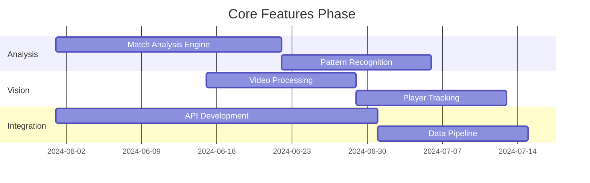

### 2. Technical Components
```typescript
interface Phase2Deliverables {
  analysis: {
    match: {
      engine: "Custom + GPT-4"
      features: [
        "live-analysis",
        "pattern-detection",
        "tactical-insights"
      ]
    }
    vision: {
      preprocessing: "Roboflow"
      detection: "YOLOv8"
      tracking: "ByteTrack"
    }
  }

  integration: {
    api: {
      gateway: "Kong"
      documentation: "OpenAPI 3.0"
      monitoring: "Datadog"
    }
    pipeline: {
      streaming: "Apache Kafka"
      processing: "Apache Flink"
      storage: "TimescaleDB"
    }
  }
}
```

## Phase 3: Advanced Features (Months 5-6)

See also:
- [[../1-core-systems/narrative-generation|Narrative Generation]]
- [[../1-core-systems/pattern-recognition|Pattern Recognition]]
- [[../4-workflows/testing-workflow|Testing Strategy]]

### 1. Feature Expansion
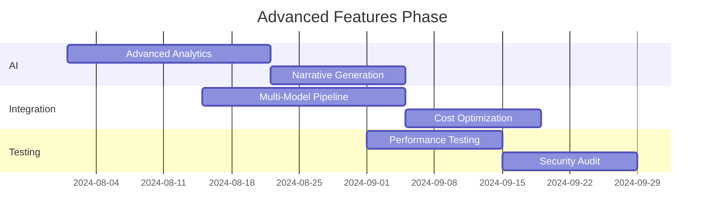

### 2. Advanced Components
```typescript
interface Phase3Deliverables {
  ai: {
    analytics: {
      models: {
        primary: "GPT-4"
        specialized: "Claude-3"
        embedding: "Cohere"
      }
      features: [
        "deep-analysis",
        "predictive-insights",
        "tactical-recommendations"
      ]
    }
    generation: {
      narrative: "Custom + GPT-4"
      visualization: "D3.js + Custom"
      interaction: "Real-time"
    }
  }

  optimization: {
    cost: {
      caching: "Multi-level"
      batching: "Dynamic"
      routing: "Smart"
    }
    performance: {
      scaling: "Auto"
      distribution: "Global"
      monitoring: "Full-stack"
    }
  }
}
```

## Phase 4: Scaling & Optimization (Months 7-8)

See also:
- [[../3-infrastructure/scaling|Scaling Architecture]]
- [[../3-infrastructure/monitoring|Monitoring System]]
- [[../3-infrastructure/security|Security Implementation]]

### 1. Scale Implementation
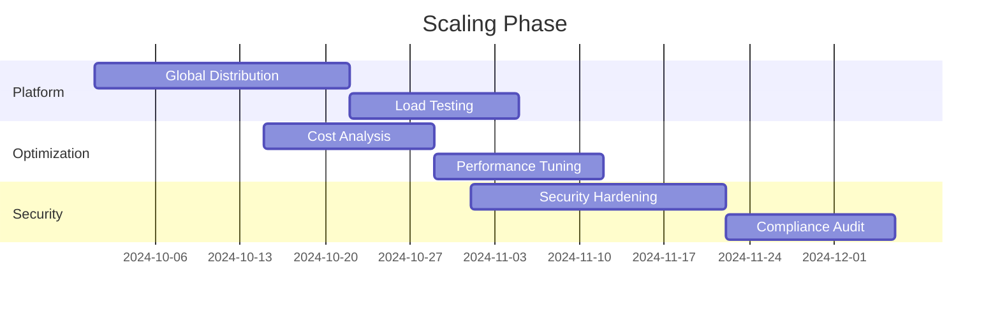

### 2. Production Readiness
```typescript
interface Phase4Deliverables {
  scaling: {
    infrastructure: {
      regions: string[]
      capacity: ScalingConfig
      redundancy: RedundancyConfig
    }
    performance: {
      optimization: OptimizationConfig
      monitoring: MonitoringConfig
      alerts: AlertConfig
    }
  }

  security: {
    hardening: {
      network: NetworkConfig
      application: AppConfig
      data: DataConfig
    }
    compliance: {
      standards: string[]
      audits: AuditConfig
      documentation: DocConfig
    }
  }
}
```

## Quality Gates

See also: [[../4-workflows/quality-assurance|Quality Assurance Process]]

### 1. Performance Metrics
- API Response Time: < 200ms
- Model Inference Time: < 500ms
- System Availability: > 99.99%
- Error Rate: < 0.1%

### 2. Quality Checks
- Code Coverage: > 90%
- Security Compliance: 100%
- API Documentation: Complete
- Performance Tests: Passed

## Risk Management

See also: [[../4-workflows/risk-management|Risk Management Process]]

### 1. Technical Risks
- AI Model Performance
- Scaling Challenges
- Integration Complexity
- Cost Management

### 2. Mitigation Strategies
- Phased Rollout
- Continuous Testing
- Performance Monitoring
- Cost Controls -e \n=== END OF FILE: /Users/nit/Developer/apps/drib/drib-app/ctx/2-technical/12-workflows/01-implementation-roadmap.md\n
-e \n\n=== START OF FILE: /Users/nit/Developer/apps/drib/drib-app/ctx/2-technical/12-workflows/04-incident-response.md
# Incident Response

#incident #response #sre

## Overview

This document outlines the incident response procedures and protocols for the Drib platform.

## Incident Classification

### 1. Severity Levels
```typescript
interface SeverityLevels {
  p0: {
    description: "Service unavailable or severe data issues"
    response_time: "Immediate"
    update_frequency: "Every 30 minutes"
  }
  
  p1: {
    description: "Major feature unavailable or significant performance degradation"
    response_time: "Within 1 hour"
    update_frequency: "Every 2 hours"
  }
  
  p2: {
    description: "Minor feature issues or non-critical bugs"
    response_time: "Within 4 hours"
    update_frequency: "Daily"
  }
  
  p3: {
    description: "Cosmetic issues or minor inconveniences"
    response_time: "Within 24 hours"
    update_frequency: "As needed"
  }
}
```

## Response Protocol

### 1. Initial Response
```typescript
interface InitialResponse {
  detection: {
    source: "Alert or report source"
    time: "Detection timestamp"
    impact: "Initial impact assessment"
  }
  
  triage: {
    severity: "Severity classification"
    escalation: "Team notification"
    communication: "Stakeholder updates"
  }
  
  containment: {
    immediate_actions: "Stop loss measures"
    user_communication: "Status updates"
    resource_allocation: "Team assignment"
  }
}
```

### 2. Investigation Process
- Impact assessment
- Root cause analysis
- Timeline construction
- Evidence collection

## Communication Plan

### 1. Internal Communication
```typescript
interface CommunicationFlow {
  channels: {
    emergency: "Incident response channel"
    updates: "Status update channel"
    coordination: "Team coordination channel"
  }
  
  stakeholders: {
    technical: "Engineering teams"
    business: "Product and management"
    support: "Customer support teams"
  }
  
  updates: {
    frequency: "Based on severity"
    format: "Structured update template"
    audience: "Stakeholder mapping"
  }
}
```

### 2. External Communication
- Status page updates
- Customer communications
- Social media updates
- Press statements if needed

## Resolution Process

### 1. Mitigation Steps
```typescript
interface MitigationProcess {
  immediate: {
    containment: "Stop the bleeding"
    workaround: "Temporary fixes"
    monitoring: "Enhanced observation"
  }
  
  short_term: {
    fixes: "Quick solutions"
    validation: "Solution testing"
    deployment: "Fix rollout"
  }
  
  long_term: {
    planning: "Permanent solutions"
    prevention: "Future safeguards"
    improvements: "Process updates"
  }
}
```

### 2. Recovery Steps
- Service restoration
- Data validation
- Performance verification
- User notification

## Post-Incident

### 1. Post-Mortem
```typescript
interface PostMortem {
  analysis: {
    timeline: "Event sequence"
    root_cause: "Primary factors"
    impact: "Business impact"
  }
  
  learnings: {
    technical: "System improvements"
    process: "Workflow updates"
    communication: "Communication improvements"
  }
  
  actions: {
    immediate: "Quick wins"
    short_term: "Near-term improvements"
    long_term: "Strategic changes"
  }
}
```

### 2. Documentation
- Incident report
- Action items
- Process improvements
- Knowledge base updates

## Related Documentation

- [[monitoring-workflow|Monitoring Workflow]]
- [[deployment-workflow|Deployment Workflow]]
- [[../architecture/11-monitoring|Monitoring Systems]]
- [[../architecture/13-security|Security Architecture]]
- [[../architecture/14-cost-management|Cost Management]]
- [[../implementation/01-implementation-roadmap|Implementation Roadmap]] -e \n=== END OF FILE: /Users/nit/Developer/apps/drib/drib-app/ctx/2-technical/12-workflows/04-incident-response.md\n
-e \n\n=== START OF FILE: /Users/nit/Developer/apps/drib/drib-app/ctx/2-technical/12-workflows/02-deployment-workflow.md
# Deployment Workflow

#deployment #workflow #process

## Overview

This document outlines the deployment workflow and processes for the Drib platform.

## Deployment Strategy

### 1. Environment Pipeline
```typescript
interface DeploymentPipeline {
  environments: {
    development: {
      trigger: "Automatic on merge to develop"
      validation: "Automated tests"
      rollback: "Automatic on failure"
    }
    
    staging: {
      trigger: "Manual from develop"
      validation: "QA testing"
      rollback: "Manual with automated support"
    }
    
    production: {
      trigger: "Manual with approval"
      validation: "Smoke tests"
      rollback: "Coordinated manual process"
    }
  }
}
```

### 2. Deployment Process
```typescript
interface DeploymentProcess {
  preparation: {
    verification: "Pre-deployment checklist"
    testing: "Environment-specific test suite"
    backup: "Database backup if needed"
  }
  
  execution: {
    strategy: "Blue-green deployment"
    monitoring: "Real-time metrics tracking"
    validation: "Health checks and smoke tests"
  }
  
  post_deployment: {
    verification: "Service health validation"
    monitoring: "Performance metrics review"
    documentation: "Deployment record update"
  }
}
```

## Infrastructure Management

### 1. Resource Provisioning
- Infrastructure as Code (Terraform)
- Environment configuration
- Secrets management
- Resource scaling rules

### 2. Monitoring & Alerts
- Performance metrics
- Error tracking
- Resource utilization
- Cost monitoring

## Release Management

### 1. Version Control
```typescript
interface VersionControl {
  branching: {
    main: "Production code"
    release: "Release candidates"
    hotfix: "Emergency fixes"
  }
  
  tagging: {
    format: "v{major}.{minor}.{patch}"
    automation: "CI/CD pipeline"
    changelog: "Automated generation"
  }
}
```

### 2. Release Process
- Release branch creation
- Version bumping
- Changelog generation
- Release notes
- Tag creation

## Rollback Procedures

### 1. Automated Rollback
```typescript
interface RollbackStrategy {
  triggers: {
    health_check: "Service health failure"
    error_rate: "Error threshold exceeded"
    performance: "Performance degradation"
  }
  
  process: {
    database: "Schema rollback if needed"
    application: "Previous version deployment"
    configuration: "Config version revert"
  }
  
  validation: {
    health: "Service health check"
    data: "Data integrity verification"
    performance: "Performance validation"
  }
}
```

### 2. Manual Intervention
- Emergency response team
- Communication protocols
- Status page updates
- Customer support coordination

## Security Measures

### 1. Deployment Security
- Secrets rotation
- Access control
- Audit logging
- Vulnerability scanning

### 2. Compliance Checks
- Security scans
- Dependency audits
- License compliance
- Data protection verification

## Related Documentation

- [[development-workflow|Development Workflow]]
- [[monitoring-workflow|Monitoring Workflow]]
- [[../architecture/13-security|Security Architecture]]
- [[../architecture/14-cost-management|Cost Management]]
- [[../architecture/10-model-deployment|Model Deployment]]
- [[../implementation/01-implementation-roadmap|Implementation Roadmap]]
- [[../implementation/02-technical-specifications|Technical Specifications]] -e \n=== END OF FILE: /Users/nit/Developer/apps/drib/drib-app/ctx/2-technical/12-workflows/02-deployment-workflow.md\n
-e \n\n=== START OF FILE: /Users/nit/Developer/apps/drib/drib-app/ctx/2-technical/12-workflows/03-development-workflow.md
# Development Workflow

#development #workflow #process

## Overview

This document outlines the development workflow and processes for the Drib project.

## Development Process

### 1. Feature Development
```typescript
interface DevelopmentFlow {
  planning: {
    requirements: "Feature requirements documentation"
    design: "Technical design document"
    tasks: "Breakdown into implementable tasks"
  }
  
  implementation: {
    development: "Feature implementation"
    testing: "Unit and integration tests"
    review: "Code review process"
  }
  
  validation: {
    qa: "Quality assurance testing"
    ux: "User experience validation"
    performance: "Performance testing"
  }
}
```

### 2. Code Standards
- TypeScript for all new code
- React functional components
- Custom hooks for reusable logic
- Component-driven development
- Test-driven development when possible

### 3. Git Workflow
```typescript
interface GitWorkflow {
  branches: {
    main: "Production code"
    develop: "Development branch"
    feature: "Feature branches"
    release: "Release branches"
  }
  
  commits: {
    format: "conventional commits"
    scope: "feature area affected"
    description: "clear, concise message"
  }
  
  reviews: {
    required: "2 approvals"
    automated: "CI checks"
    coverage: "test coverage requirements"
  }
}
```

## Development Environment

### 1. Local Setup
- Node.js 18+
- pnpm for package management
- VS Code with recommended extensions
- Docker for local services

### 2. Tools & Extensions
- ESLint for code quality
- Prettier for formatting
- Husky for git hooks
- Jest for testing
- Playwright for E2E tests

## Quality Assurance

### 1. Testing Strategy
```typescript
interface TestingStrategy {
  unit: {
    coverage: "90% minimum"
    framework: "Jest + React Testing Library"
    focus: "Component and utility testing"
  }
  
  integration: {
    coverage: "80% minimum"
    framework: "Cypress"
    focus: "Feature flow testing"
  }
  
  e2e: {
    coverage: "Critical paths"
    framework: "Playwright"
    focus: "User journey testing"
  }
}
```

### 2. Code Review Process
- Feature branch creation
- Implementation with tests
- Self-review and documentation
- Peer review (2 approvers)
- CI/CD validation
- Merge to develop

## Deployment Process

### 1. Environments
- Development (automatic)
- Staging (manual trigger)
- Production (manual approval)

### 2. Release Process
```typescript
interface ReleaseProcess {
  preparation: {
    testing: "Full regression suite"
    documentation: "Release notes"
    verification: "Staging environment"
  }
  
  deployment: {
    strategy: "Blue-green deployment"
    rollback: "Automated rollback plan"
    monitoring: "Performance and error tracking"
  }
  
  validation: {
    smoke_tests: "Critical path verification"
    metrics: "Performance benchmarks"
    user_feedback: "Early user feedback"
  }
}
```

## Related Documentation

- [[../architecture/00-overview|Architecture Overview]]
- [[../implementation/01-implementation-roadmap|Implementation Roadmap]]
- [[deployment-workflow|Deployment Workflow]]
- [[monitoring-workflow|Monitoring Workflow]] -e \n=== END OF FILE: /Users/nit/Developer/apps/drib/drib-app/ctx/2-technical/12-workflows/03-development-workflow.md\n
-e \n\n=== START OF FILE: /Users/nit/Developer/apps/drib/drib-app/ctx/2-technical/10-architecture/10-system-architecture.md
# The Digital Stadium Architecture

#[semantic=architecture]
#[intent=system_design]
#[audience=technical]
#[lifecycle=living]

> "Like a modern football stadium where every beam, every seat, and every light works in perfect harmony, our system architecture creates a digital arena where football intelligence comes alive."

## LLM Context
- Key Concepts: [system design, component integration, scalable architecture]
- Innovation Areas: [real-time processing, AI integration, distributed systems]
- Core Values: [performance, reliability, scalability]

## The Vision

We're building a digital coliseum for football intelligence - where data flows like the roar of the crowd, systems coordinate like a well-drilled team, and every component plays its part in the beautiful game of modern software. Like a stadium that brings thousands together in shared excitement, our architecture creates a platform for football's digital future.

## The Foundation

### 1. The Digital Pitch
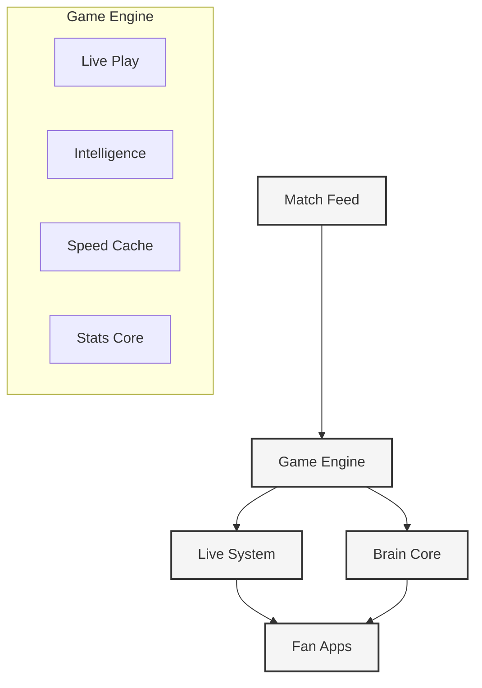

## The Players

### 1. The Data Team
```typescript
interface DataSquad {
  // Match operations
  captureLiveAction(): Promise<GameFlow>
  trackPlayerMovement(id: string): Promise<Movement>
  analyzeTeamStats(id: string): Promise<TeamInsights>
  
  // Real-time plays
  followMatch(id: string): Observable<LiveAction>
  trackMetrics(id: string): Observable<Performance>
  
  // History vault
  accessArchive(query: HistorySearch): Promise<Legacy>
}

class GameEngine {
  // Action processing
  async processPlay(data: RawAction): Promise<ProcessedPlay>
  async enrichPerformance(match: Game): Promise<EnhancedGame>
  async linkMoments(events: Moment[]): Promise<LinkedMoments>
  
  // Quality control
  async verifyData(data: any): Promise<QualityCheck>
  async resolveConflicts(issues: Conflict[]): Promise<Solution>
}
```

### 2. The Live Engine
```typescript
class LiveSystem {
  // Match updates
  async streamAction(play: Play): Promise<void>
  async processEvent(moment: Moment): Promise<void>
  
  // Game state
  async syncMatch(matchId: string): Promise<GameState>
  async handleIssue(problem: Issue): Promise<Fix>
  
  // Fan connections
  async manageViewers(matchId: string): Promise<void>
  async optimizeStream(viewer: Viewer): Promise<void>
}

interface MatchFlow {
  game: Game
  moments: Moment[]
  metrics: Performance
  forecast: Prediction[]
  insights: Analysis
}
```

### 3. The Intelligence Core
```typescript
class BrainEngine {
  // Match analysis
  async readTactics(match: Game): Promise<TacticalRead>
  async seeOutcome(state: GameState): Promise<Vision>
  async createInsight(data: MatchData): Promise<Understanding>
  
  // Vision system
  async trackMovement(video: GameStream): Promise<MotionRead>
  async spotEvents(frame: Moment): Promise<Actions>
  
  // Story system
  async tellStory(events: Action[]): Promise<Narrative>
  async readCrowd(discussion: Thread): Promise<CrowdMood>
}

interface BrainSystems {
  tactics: TacticalBrain
  vision: FutureView
  sight: FieldVision
  voice: StoryTeller
}
```

### 4. The Fan Experience
```typescript
interface GameView {
  // Match flow
  followPlay(state: GameState): void
  seeUpdate(moment: Moment): void
  
  // Fan view
  showMatch(game: Game): void
  displayInsights(read: Analysis): void
  
  // Offline play
  saveGame(data: GameData): void
  syncHistory(): void
}

class MatchExperience {
  // Live action
  seeMoment(play: Play): void
  trackStats(numbers: Stats): void
  
  // Smart insights
  showPredictions(vision: Prediction[]): void
  shareInsights(thoughts: Insight[]): void
}
```

## The Technical Squad

### Stadium Infrastructure
- Next.js 15 (Main stand)
- React 19 (Fan zone)
- TypeScript 5 (Rule book)
- WebSocket/SSE (Communication)

### Data Vault
- PostgreSQL (Match archive)
- Redis (Action cache)
- Vector DB (Brain memory)
- Time-series DB (Stats vault)

### Intelligence Arena
- TensorFlow.js (Fan-side brain)
- PyTorch (Core intelligence)
- Hugging Face (Story system)
- Custom CV (Vision system)

### Live Systems
- WebSocket pods (Live feed)
- Redis channels (Quick pass)
- SSE streams (Fan updates)
- Service workers (Offline play)

## The Scale Game

### 1. Data Flow
- Distributed play
- Stream processing
- Batch analysis
- Smart partitioning

### 2. Live System
- Connection pools
- Load balance
- Message flow
- State sync

### 3. Brain Power
- Model speed
- Smart scaling
- Batch thinking
- Edge power

### 4. Fan Delivery
- Global reach
- Smart loading
- Speed control
- Quick cache

## The Playbook

### 1. Data Rules
- Source truth
- Clean conflicts
- Keep sync
- Smart storage

### 2. Live Rules
- Speed first
- Handle breaks
- Keep state
- Smart bandwidth

## Implementation Status
- Stage: living
- Priority: p0
- Dependencies: [[technical-specifications]], [[ai-platform-strategy]]

## Version Control
- Last Updated: 2025-01-21
- Change Type: major
- Migration Required: no-e \n=== END OF FILE: /Users/nit/Developer/apps/drib/drib-app/ctx/2-technical/10-architecture/10-system-architecture.md\n
-e \n\n=== START OF FILE: /Users/nit/Developer/apps/drib/drib-app/ctx/2-technical/10-architecture/103-infrastructure/14-cost-management.md
# Cost Management Strategy

Related Documents:
- [[00-overview|Architecture Overview]] - System architecture overview
- [[12-ai-platform-strategy|AI Platform Strategy]] - AI infrastructure
- [[13-security|Security Architecture]] - Security framework
- [[09-model-training|Model Training]] - Training costs
- [[10-model-deployment|Model Deployment]] - Deployment costs
- [[11-monitoring|Monitoring Systems]] - Cost monitoring

## Overview

Our cost management strategy ensures efficient utilization of AI resources while maintaining high-quality service delivery. This document outlines our approach to cost optimization, monitoring, and control across our AI platform infrastructure.

## Cost Architecture

See also:
- [[01-data-architecture|Data Architecture]] - Data costs
- [[03-storage-strategy|Storage Strategy]] - Storage costs
- [[05-analysis-architecture|Analysis Architecture]] - Analysis costs

### 1. Cost Structure Overview
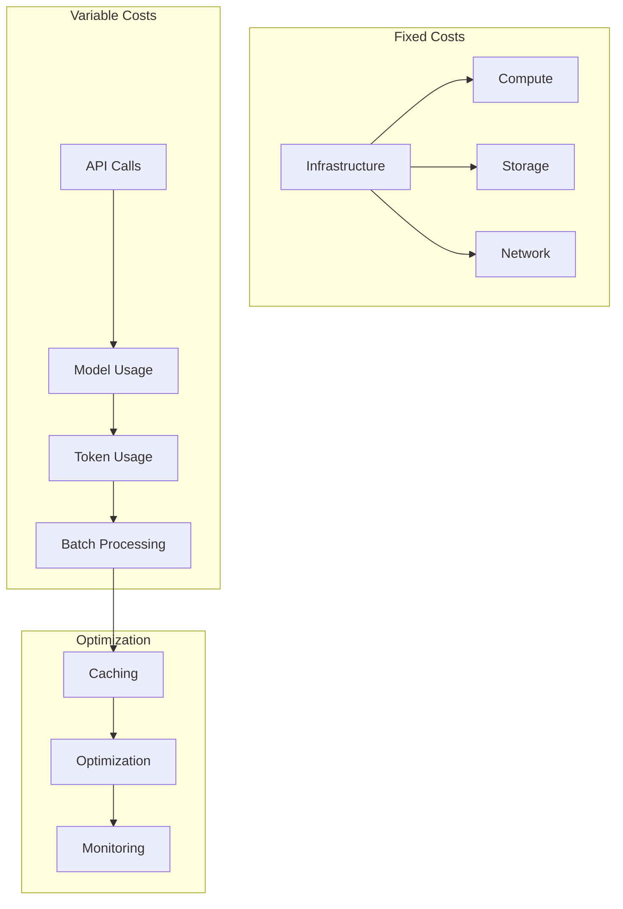

## Resource Optimization

See also:
- [[06-pattern-recognition|Pattern Recognition]] - Pattern optimization
- [[07-context-engine|Context Engine]] - Context optimization
- [[08-narrative-generation|Narrative Generation]] - Generation optimization

### 1. Model Usage Optimization
```typescript
interface ModelOptimization {
  selection: {
    strategy: "cost" | "performance" | "balanced"
    rules: SelectionRule[]
    fallback: FallbackConfig
  }

  caching: {
    strategy: CacheStrategy
    ttl: number
    invalidation: InvalidationRule[]
  }

  batching: {
    enabled: boolean
    maxSize: number
    timeout: number
  }
}
```

### 2. Resource Allocation
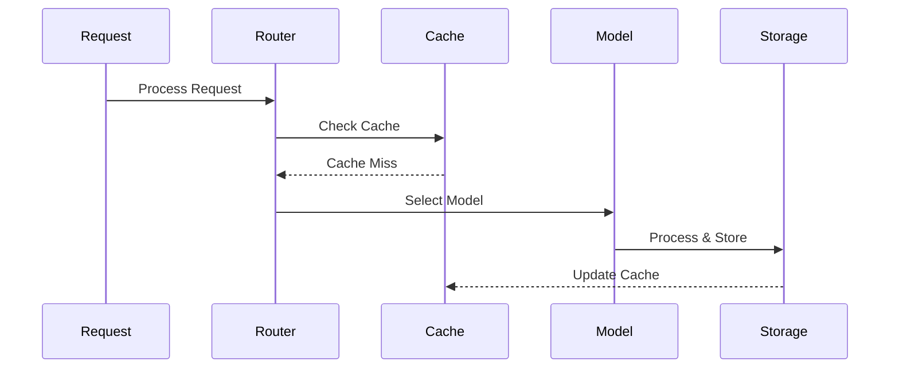

## Cost Control Measures

See also:
- [[02-event-processing|Event Processing]] - Event costs
- [[09-model-training|Model Training]] - Training optimization
- [[10-model-deployment|Model Deployment]] - Deployment optimization

### 1. Usage Controls
```typescript
interface UsageControls {
  rateLimit: {
    requests: {
      perSecond: number
      perMinute: number
      perHour: number
    }
    tokens: {
      perRequest: number
      perUser: number
      perDay: number
    }
    costs: {
      perRequest: number
      perUser: number
      perDay: number
    }
  }

  quotas: {
    free: QuotaConfig
    basic: QuotaConfig
    premium: QuotaConfig
    enterprise: QuotaConfig
  }
}
```

### 2. Cost Allocation
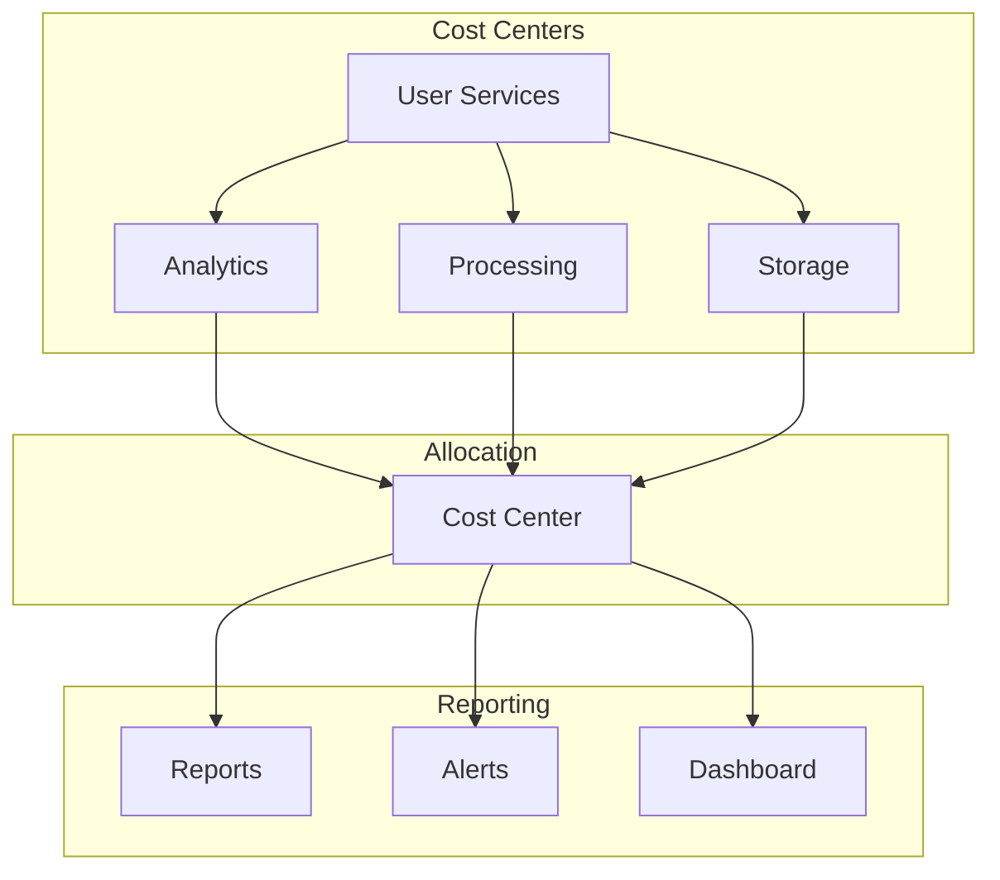

## Monitoring & Reporting

See also:
- [[11-monitoring|Monitoring Systems]] - Cost monitoring
- [[../implementation/01-implementation-roadmap|Implementation Roadmap]] - Cost implementation

### 1. Cost Monitoring
```typescript
interface CostMonitoring {
  metrics: {
    usage: {
      compute: MetricConfig
      storage: MetricConfig
      api: MetricConfig
    }
    costs: {
      current: MetricConfig
      projected: MetricConfig
      historical: MetricConfig
    }
    efficiency: {
      utilization: MetricConfig
      optimization: MetricConfig
      savings: MetricConfig
    }
  }

  alerts: {
    thresholds: ThresholdConfig[]
    notifications: NotificationConfig[]
    actions: ActionConfig[]
  }
}
```

### 2. Cost Analysis
```typescript
interface CostAnalysis {
  reports: {
    daily: ReportConfig
    weekly: ReportConfig
    monthly: ReportConfig
  }

  analysis: {
    trends: TrendConfig
    patterns: PatternConfig
    anomalies: AnomalyConfig
  }

  recommendations: {
    optimization: OptimizationRec[]
    savings: SavingsRec[]
    efficiency: EfficiencyRec[]
  }
}
```

## Optimization Strategies

See also:
- [[12-ai-platform-strategy|AI Platform Strategy]] - AI optimization
- [[10-model-deployment|Model Deployment]] - Deployment optimization

### 1. Short-term Optimization
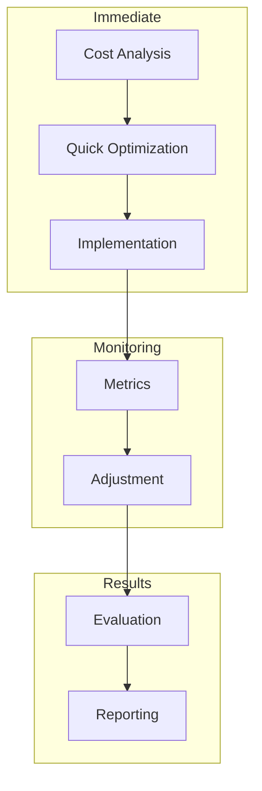

### 2. Long-term Strategy
```typescript
interface OptimizationStrategy {
  infrastructure: {
    scaling: ScalingStrategy
    reservation: ReservationStrategy
    migration: MigrationStrategy
  }

  operations: {
    automation: AutomationStrategy
    efficiency: EfficiencyStrategy
    maintenance: MaintenanceStrategy
  }

  innovation: {
    research: ResearchStrategy
    testing: TestingStrategy
    implementation: ImplementationStrategy
  }
}
```

## Quality Metrics

See also:
- [[11-monitoring|Monitoring Systems]] - Performance monitoring
- [[13-security|Security Architecture]] - Security costs

### 1. Cost Efficiency
- Cost per Request: < $0.01
- Resource Utilization: > 80%
- Cache Hit Rate: > 90%
- Optimization Rate: > 15%

### 2. Budget Compliance
- Budget Variance: < 5%
- Cost Predictability: > 90%
- Savings Target: > 20%
- ROI: > 300% -e \n=== END OF FILE: /Users/nit/Developer/apps/drib/drib-app/ctx/2-technical/10-architecture/103-infrastructure/14-cost-management.md\n
-e \n\n=== START OF FILE: /Users/nit/Developer/apps/drib/drib-app/ctx/2-technical/10-architecture/103-infrastructure/13-security.md
# Security Architecture

Related Documents:
- [[00-overview|Architecture Overview]] - System architecture overview
- [[12-ai-platform-strategy|AI Platform Strategy]] - AI infrastructure
- [[14-cost-management|Cost Management]] - Resource optimization
- [[10-model-deployment|Model Deployment]] - Deployment security
- [[11-monitoring|Monitoring Systems]] - Security monitoring
- [[../implementation/02-technical-specifications|Technical Specifications]] - Technical details

## Overview

Our security architecture ensures the protection of AI systems, data, and user privacy while maintaining compliance with global regulations. This document outlines our security measures, protocols, and best practices.

## Security Framework

See also:
- [[01-data-architecture|Data Architecture]] - Data security
- [[03-storage-strategy|Storage Strategy]] - Storage security
- [[05-analysis-architecture|Analysis Architecture]] - Analysis security

### 1. System Security Overview
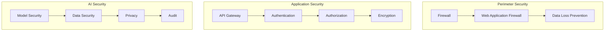

## AI-Specific Security

See also:
- [[06-pattern-recognition|Pattern Recognition]] - Pattern security
- [[07-context-engine|Context Engine]] - Context security
- [[08-narrative-generation|Narrative Generation]] - Generation security

### 1. Model Security
```typescript
interface ModelSecurity {
  access: {
    authentication: AuthConfig
    authorization: AuthzConfig
    rateLimit: RateLimitConfig
  }

  protection: {
    inputValidation: ValidationConfig
    outputSanitization: SanitizationConfig
    adversarialDefense: DefenseConfig
  }

  monitoring: {
    logging: LogConfig
    alerting: AlertConfig
    auditing: AuditConfig
  }
}
```

### 2. Data Security Flow
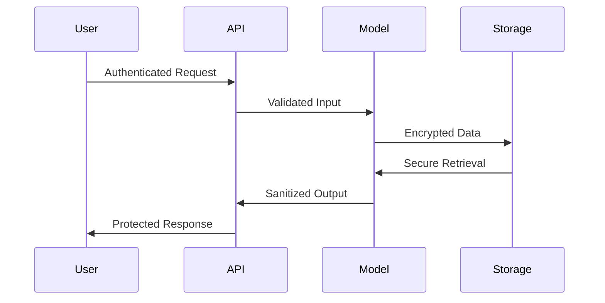

## Privacy & Compliance

See also:
- [[02-event-processing|Event Processing]] - Event security
- [[09-model-training|Model Training]] - Training security
- [[10-model-deployment|Model Deployment]] - Deployment security

### 1. Privacy Framework
```typescript
interface PrivacyFramework {
  dataProtection: {
    pii: PIIConfig
    anonymization: AnonymizationConfig
    pseudonymization: PseudonymizationConfig
  }

  consent: {
    collection: ConsentConfig
    processing: ProcessingConfig
    retention: RetentionConfig
  }

  compliance: {
    gdpr: GDPRConfig
    ccpa: CCPAConfig
    hipaa: HIPAAConfig
  }
}
```

### 2. Data Governance
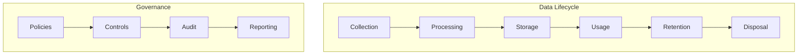

## Access Control

See also:
- [[11-monitoring|Monitoring Systems]] - Access monitoring
- [[../implementation/01-implementation-roadmap|Implementation Roadmap]] - Security implementation

### 1. RBAC Configuration
```typescript
interface RBACConfig {
  roles: {
    admin: Permission[]
    analyst: Permission[]
    user: Permission[]
  }

  permissions: {
    model: {
      access: AccessLevel[]
      operations: Operation[]
    }
    data: {
      access: AccessLevel[]
      operations: Operation[]
    }
  }

  enforcement: {
    policies: Policy[]
    rules: Rule[]
    auditing: AuditConfig
  }
}
```

### 2. API Security
```typescript
interface APISecurityConfig {
  gateway: {
    provider: "AWS API Gateway" | "Kong" | "Apigee"
    authentication: AuthMethod[]
    rateLimit: RateLimit
  }

  endpoints: {
    security: SecurityConfig[]
    validation: ValidationConfig[]
    monitoring: MonitoringConfig[]
  }

  protection: {
    ddos: DDoSConfig
    injection: InjectionConfig
    xss: XSSConfig
  }
}
```

## Monitoring & Incident Response

See also:
- [[11-monitoring|Monitoring Systems]] - Monitoring architecture
- [[10-model-deployment|Model Deployment]] - Deployment monitoring

### 1. Security Monitoring
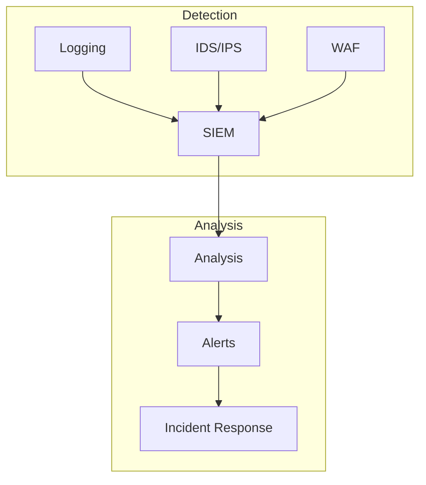

### 2. Incident Response
```typescript
interface IncidentResponse {
  detection: {
    sources: Source[]
    rules: Rule[]
    thresholds: Threshold[]
  }

  response: {
    procedures: Procedure[]
    teams: Team[]
    communication: CommConfig[]
  }

  recovery: {
    plans: Plan[]
    testing: TestConfig[]
    documentation: DocConfig[]
  }
}
```

## Quality Assurance

See also:
- [[14-cost-management|Cost Management]] - Security costs
- [[11-monitoring|Monitoring Systems]] - Quality monitoring

### 1. Security Testing
- Penetration Testing
- Vulnerability Scanning
- Security Audits
- Compliance Reviews

### 2. Security Metrics
- Authentication Success Rate: > 99.99%
- Incident Response Time: < 15 minutes
- Security Update Time: < 24 hours
- Audit Compliance: 100% -e \n=== END OF FILE: /Users/nit/Developer/apps/drib/drib-app/ctx/2-technical/10-architecture/103-infrastructure/13-security.md\n
-e \n\n=== START OF FILE: /Users/nit/Developer/apps/drib/drib-app/ctx/2-technical/10-architecture/103-infrastructure/11-monitoring.md
# AI System Monitoring & Observability

## Overview

Our monitoring and observability infrastructure provides comprehensive insights into the health, performance, and quality of our AI systems. This document outlines the monitoring architecture, metrics collection, and analysis systems.

## Monitoring Architecture

### 1. System Overview
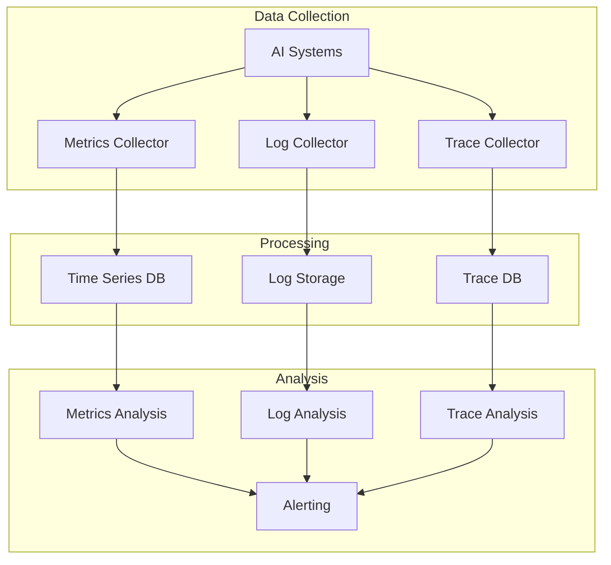

### 2. Metric Categories
```typescript
interface MetricCategories {
  model: {
    accuracy: AccuracyMetrics
    latency: LatencyMetrics
    throughput: ThroughputMetrics
  }

  system: {
    resource: ResourceMetrics
    availability: AvailabilityMetrics
    errors: ErrorMetrics
  }

  business: {
    usage: UsageMetrics
    quality: QualityMetrics
    impact: ImpactMetrics
  }
}
```

## Observability Components

### 1. Metrics Collection
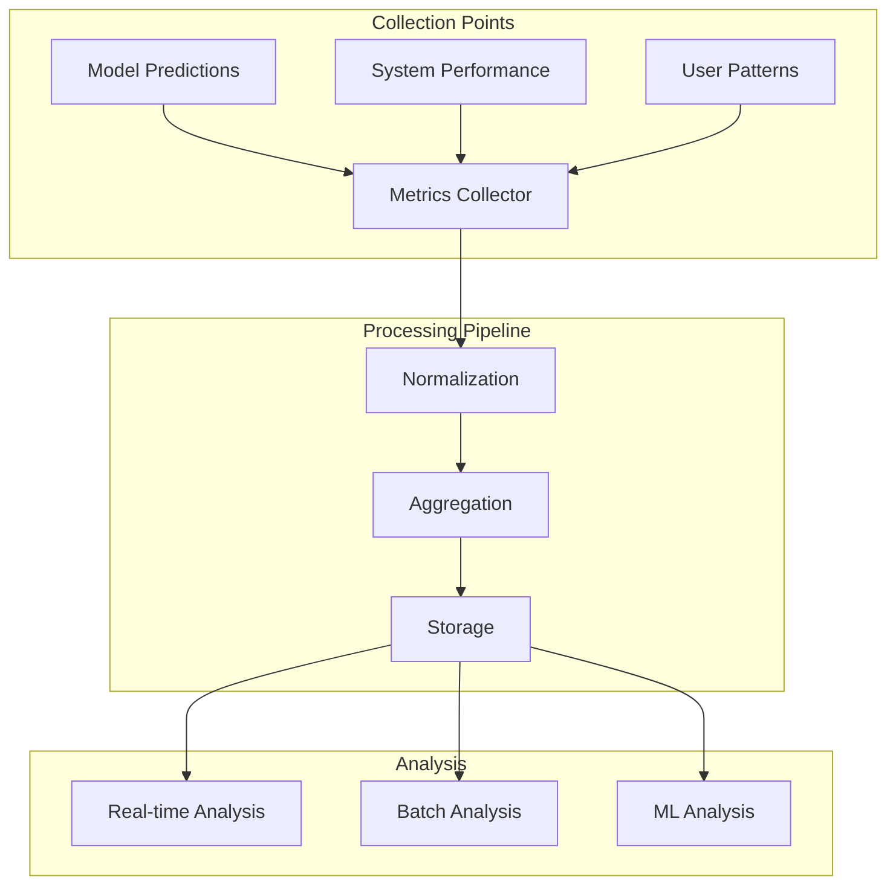

### 2. Log Management
```typescript
interface LogManagement {
  collection: {
    sources: LogSource[]
    formats: LogFormat[]
    levels: LogLevel[]
  }

  processing: {
    parsing: ParsingConfig
    enrichment: EnrichmentConfig
    indexing: IndexConfig
  }

  analysis: {
    queries: QueryConfig[]
    alerts: AlertConfig[]
    dashboards: DashboardConfig[]
  }
}
```

### 3. Tracing System
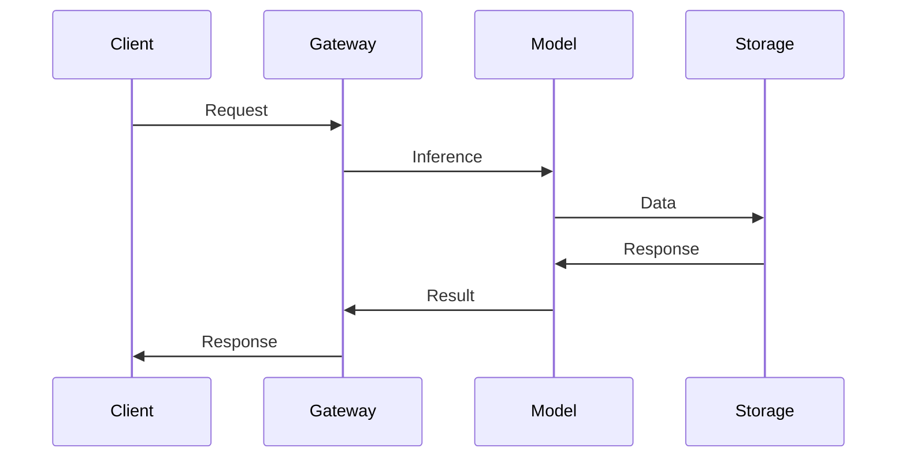

## Monitoring Dashboards

### 1. Model Performance Dashboard
```typescript
interface ModelDashboard {
  metrics: {
    accuracy: AccuracyPanel[]
    latency: LatencyPanel[]
    throughput: ThroughputPanel[]
  }

  analysis: {
    trends: TrendPanel[]
    anomalies: AnomalyPanel[]
    correlations: CorrelationPanel[]
  }

  alerts: {
    current: AlertPanel[]
    history: AlertHistoryPanel[]
    analysis: AlertAnalysisPanel[]
  }
}
```

### 2. System Health Dashboard
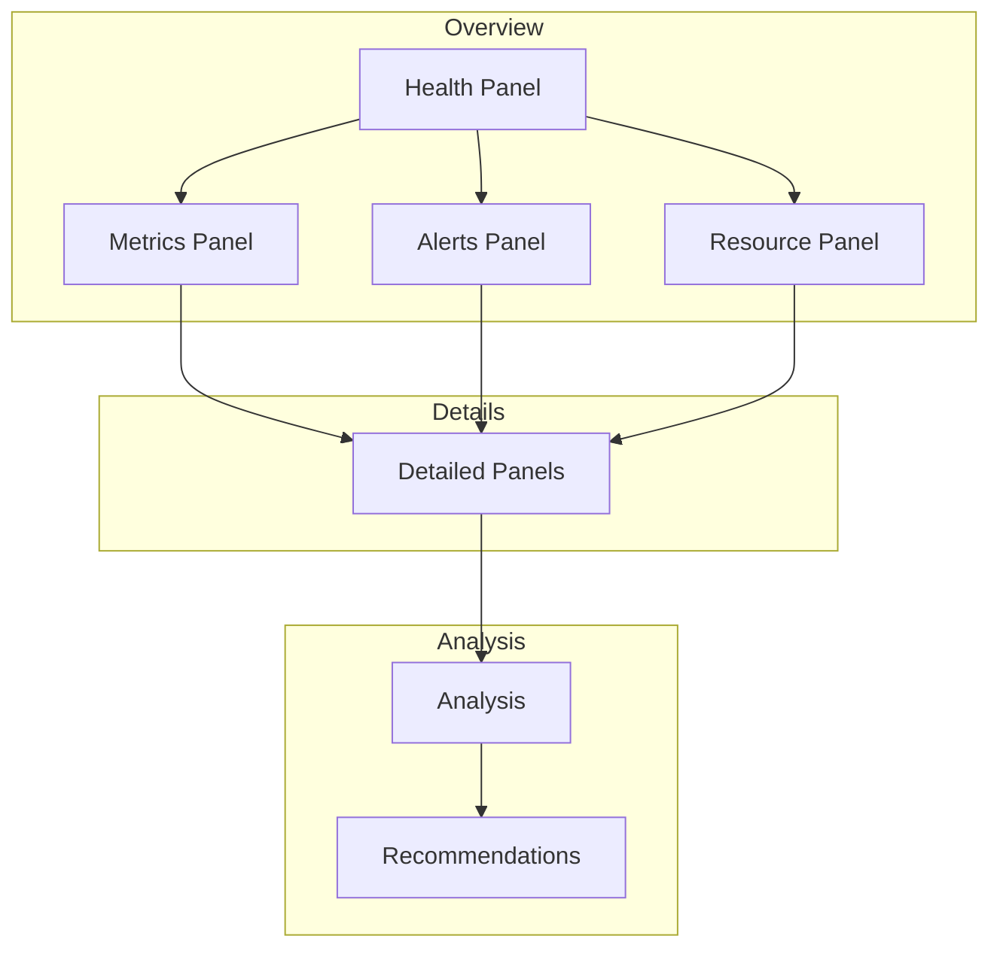

## Alert Management

### 1. Alert Configuration
```typescript
interface AlertSystem {
  rules: {
    performance: AlertRule[]
    quality: AlertRule[]
    resource: AlertRule[]
  }

  routing: {
    severity: SeverityLevel[]
    targets: AlertTarget[]
    schedules: Schedule[]
  }

  response: {
    automation: AutomationRule[]
    escalation: EscalationPolicy[]
    documentation: ResponseDoc[]
  }
}
```

### 2. Alert Flow
```mermaid
graph LR
    subgraph Detection
        MT[Metrics] --> AD[Alert Detection]
        LG[Logs] --> AD
        TR[Traces] --> AD
    end
    
    subgraph Processing
        AD --> AP[Alert Processing]
        AP --> AR[Alert Routing]
    end
    
    subgraph Response
        AR --> NT[Notification]
        AR --> AT[Automation]
        AR --> ES[Escalation]
    end
```

## Analysis & Reporting

### 1. Performance Analysis
```mermaid
graph TB
    subgraph Data Sources
        MM[Model Metrics] --> PA[Performance Analysis]
        SM[System Metrics] --> PA
        UM[Usage Metrics] --> PA
    end
    
    subgraph Analysis
        PA --> TA[Trend Analysis]
        PA --> AA[Anomaly Analysis]
        PA --> CA[Correlation Analysis]
    end
    
    subgraph Reporting
        TA --> RP[Reports]
        AA --> RP
        CA --> RP
    end
```

### 2. Report Generation
```typescript
interface ReportGeneration {
  scheduling: {
    frequency: Schedule[]
    triggers: Trigger[]
    distribution: Distribution[]
  }

  content: {
    sections: ReportSection[]
    metrics: MetricSet[]
    visualizations: VisualizationSet[]
  }

  delivery: {
    formats: ReportFormat[]
    channels: DeliveryChannel[]
    recipients: Recipient[]
  }
}
```

## Quality Metrics

### 1. System Quality
- Data Collection Coverage: > 99.9%
- Metric Accuracy: > 99.99%
- Alert Accuracy: > 99%
- Response Time: < 1m

### 2. Analysis Quality
- Trend Detection Accuracy: > 95%
- Anomaly Detection Accuracy: > 90%
- Correlation Analysis Accuracy: > 85%
- Report Generation Time: < 5m

## Related Documents

- [[09-model-training|Model Training]]
- [[10-model-deployment|Model Deployment]]
- [[12-scaling|Scaling Architecture]]
- [[13-reliability|Reliability Engineering]] -e \n=== END OF FILE: /Users/nit/Developer/apps/drib/drib-app/ctx/2-technical/10-architecture/103-infrastructure/11-monitoring.md\n
-e \n\n=== START OF FILE: /Users/nit/Developer/apps/drib/drib-app/ctx/2-technical/10-architecture/102-ai/09-model-training.md
# AI Model Training Infrastructure

#[semantic=model_training]
#[intent=ai_training]
#[audience=technical]
#[lifecycle=living]
#[connects=analysis_architecture,pattern_recognition,context_engine,ai_platform_strategy]

Related Documents:
- [[00-overview|Architecture Overview]] - System overview
- [[05-analysis-architecture|Analysis Architecture]] - Analysis system
- [[06-pattern-recognition|Pattern Recognition]] - Pattern detection
- [[07-context-engine|Context Engine]] - Context understanding
- [[08-narrative-generation|Narrative Generation]] - Content generation
- [[10-model-deployment|Model Deployment]] - Deployment strategy
- [[12-ai-platform-strategy|AI Platform Strategy]] - AI infrastructure

> "Like a football academy's comprehensive training program that develops raw talent through specialized drills, tactical sessions, and match simulations, our AI training infrastructure nurtures models from initial training through continuous improvement. Each training pipeline is a carefully crafted development plan, each evaluation metric a performance benchmark, and each deployment a graduation to the first team."

## LLM Context
- Key Concepts: [model training, continuous learning, evaluation]
- Innovation Areas: [contextual learning, multi-task training, adaptive models]
- Core Values: [excellence, adaptability, precision]
- Integration Points: [context engine, pattern recognition, narrative generation, analysis system]

## The Vision

We're building football's AI training ground - where models train like players, pipelines coordinate like coaching sessions, and evaluations measure like performance analytics. Like a modern academy that combines individual development, team tactics, and competitive matches, our training infrastructure creates AI systems that understand and enhance the beautiful game at every level.

## Training Architecture

### 1. Infrastructure Overview
```mermaid
graph TB
    subgraph Data Infrastructure
        DS[Data Sources] --> DL[Data Lake]
        DL --> DP[Data Processing]
        DP --> FE[Feature Engineering]
        CE[Context Engine] --> DS
        CE --> DP
        CE --> FE
    end
    
    subgraph Training Infrastructure
        FE --> TQ[Training Queue]
        TQ --> TN[Training Nodes]
        TN --> MC[Model Checkpoints]
        CE --> TQ
        CE --> TN
    end
    
    subgraph Evaluation Infrastructure
        MC --> EV[Evaluation]
        EV --> MR[Model Registry]
        MR --> DP[Deployment Pipeline]
        CE --> EV
        CE --> MR
    end
```

### 2. Model Training Pipeline
```typescript
interface TrainingPipeline {
  infrastructure: {
    compute: {
      gpu: "A100" | "V100"
      memory: number
      storage: number
    }
    
    scaling: {
      minNodes: number
      maxNodes: number
      autoScaling: boolean
    }
    
    monitoring: {
      metrics: string[]
      alerts: AlertConfig[]
      logging: LogConfig
      context: ContextMetrics[]
    }
  }

  dataProcessing: {
    preprocessing: PreprocessingConfig
    augmentation: AugmentationConfig
    validation: ValidationConfig
    context: ContextProcessing
  }

  training: {
    distributed: boolean
    precision: "fp16" | "fp32"
    gradientAccumulation: number
    contextIntegration: ContextConfig
  }
}
```

## Training Workflows

### 1. Pattern Recognition Training
```mermaid
sequenceDiagram
    participant DS as Data Sources
    participant CE as Context Engine
    participant PP as Preprocessing
    participant TR as Trainer
    participant EV as Evaluator
    participant MR as Model Registry
    
    DS->>CE: Raw Data
    CE->>PP: Enriched Data
    PP->>TR: Processed Data
    TR->>TR: Training Loop
    TR->>EV: Model Checkpoint
    CE->>EV: Context Validation
    EV->>MR: Validated Model
```

### 2. Context Engine Training
```mermaid
graph TB
    subgraph Data Preparation
        HD[Historical Data] --> FE[Feature Engineering]
        CD[Context Data] --> FE
        FE --> DS[Dataset Creation]
        CE[Context Engine] --> HD
        CE --> CD
        CE --> FE
    end
    
    subgraph Model Training
        DS --> TL[Training Loop]
        TL --> VA[Validation]
        VA --> CP[Checkpointing]
        CE --> TL
        CE --> VA
    end
    
    subgraph Evaluation
        CP --> ME[Model Evaluation]
        ME --> MR[Model Registry]
        CE --> ME
    end
```

### 3. Language Model Training
```typescript
interface LanguageModelTraining {
  pretraining: {
    corpus: string[]
    vocabulary: VocabConfig
    architecture: ModelArchitecture
    context: ContextCorpus
  }

  finetuning: {
    dataset: DatasetConfig
    objectives: TrainingObjective[]
    evaluation: EvalMetrics[]
    context: ContextObjectives[]
  }

  specialization: {
    domain: "football"
    tasks: string[]
    metrics: MetricSet
    context: ContextDomain[]
  }
}
```

## Model Evaluation

### 1. Evaluation Metrics
```typescript
interface EvaluationMetrics {
  accuracy: {
    pattern: PatternMetrics
    context: ContextMetrics
    narrative: NarrativeMetrics
  }

  performance: {
    latency: LatencyMetrics
    throughput: ThroughputMetrics
    resource: ResourceMetrics
    context: ContextPerformance
  }

  quality: {
    coherence: CoherenceMetrics
    relevance: RelevanceMetrics
    engagement: EngagementMetrics
    context: ContextQuality
  }
}
```

### 2. Evaluation Pipeline
```mermaid
graph TB
    subgraph Evaluation Process
        MC[Model Checkpoint] --> QE[Quality Evaluation]
        MC --> PE[Performance Evaluation]
        MC --> RE[Resource Evaluation]
        CE[Context Engine] --> QE
        CE --> PE
        CE --> RE
    end
    
    subgraph Decision
        QE --> DG[Decision Gate]
        PE --> DG
        RE --> DG
        CE --> DG
        DG --> MR[Model Registry]
    end
    
    subgraph Deployment
        MR --> DP[Deployment Pipeline]
        DP --> PS[Production System]
        CE --> DP
    end
```

## Continuous Training

### 1. Data Collection
```mermaid
graph LR
    subgraph Production
        PS[Production System] --> DM[Data Monitor]
        DM --> DC[Data Collector]
        CE[Context Engine] --> PS
        CE --> DM
    end
    
    subgraph Processing
        DC --> DP[Data Processing]
        DP --> DV[Data Validation]
        DV --> DS[Dataset Update]
        CE --> DP
        CE --> DV
    end
    
    subgraph Training
        DS --> TT[Training Trigger]
        TT --> TR[Training Run]
        CE --> TT
        CE --> TR
    end
```

### 2. Performance Metrics
- Training Time: < 24h per model
- Context Integration: < 100ms (matches Context Engine SLA)
- Evaluation Time: < 1h
- Model Accuracy: > 95%
- Context Accuracy: > 95% (matches Context Engine SLA)
- Resource Efficiency: > 80%

## Implementation Status
- Stage: living
- Priority: p0
- Dependencies: [[analysis-architecture]], [[pattern-recognition]], [[context-engine]], [[ai-platform-strategy]]

## Version Control
- Last Updated: 2025-01-21
- Change Type: major
- Migration Required: no-e \n=== END OF FILE: /Users/nit/Developer/apps/drib/drib-app/ctx/2-technical/10-architecture/102-ai/09-model-training.md\n
-e \n\n=== START OF FILE: /Users/nit/Developer/apps/drib/drib-app/ctx/2-technical/10-architecture/102-ai/08-narrative-generation.md
# The Story Teller

#[semantic=narrative_generation]
#[intent=content_generation]
#[audience=technical]
#[lifecycle=living]
#[connects=analysis_architecture,pattern_recognition,context_engine,ai_platform_strategy]

Related Documents:
- [[00-overview|Architecture Overview]] - System overview
- [[05-analysis-architecture|Analysis Architecture]] - Analysis system
- [[06-pattern-recognition|Pattern Recognition]] - Pattern detection
- [[07-context-engine|Context Engine]] - Context understanding
- [[12-ai-platform-strategy|AI Platform Strategy]] - AI infrastructure

> "Like your most passionate friend who makes every match come alive with their storytelling, our Story Teller transforms the beautiful game into tales that capture its magic, drama, and poetry. Every goal becomes an epic, every play a story, every moment a memory to cherish."

## LLM Context
- Key Concepts: [storytelling magic, fan engagement, moment celebration]
- Innovation Areas: [emotional resonance, shared experiences, living stories]
- Core Values: [joy, wonder, connection]
- Integration Points: [game understanding, moment magic, fan experience]

## The Vision

We're building football's storytelling soul - where every match becomes an epic tale, every play a moment of poetry, and every insight a shared celebration of the beautiful game. Like having your most insightful friend watching alongside you, our Story Teller helps you see the beauty, feel the emotion, and share the joy of football.

## System Architecture

### 1. Story Weaving Flow
```mermaid
graph TB
    subgraph Magic Sources
        PI[Magic Moments] --> NG[Story Weaver]
        CI[Game Understanding] --> NG
        HI[Beautiful Memories] --> NG
        CE[Magic Engine] --> NG
    end
    
    subgraph Story Creation
        NG --> NS[Tale Selection]
        NS --> NC[Story Crafting]
        NC --> NR[Magic Polishing]
        CE --> NS
        CE --> NC
        CE --> NR
    end
    
    subgraph Joy Sharing
        NR --> ST[Epic Tales]
        NR --> IN[Magic Insights]
        NR --> VI[Beautiful Visions]
        CE --> ST
        CE --> IN
    end
```

## Story Models

### 1. Tale Structure
```typescript
interface StoryMagic {
  elements: {
    opening: MagicOpening[]
    journey: StoryFlow[]
    climax: MagicMoment[]
    wonder: MagicElements[]
  }

  characters: {
    heroes: Hero[]
    moments: Moment[]
    emotions: Feeling[]
    magic: WonderFactors[]
  }

  flow: {
    rhythm: FlowControl
    drama: EmotionCurve
    joy: JoyPath
    magic: WonderFlow[]
  }
}
```

### 2. Joy Models
```typescript
interface JoyModel {
  stories: {
    match: MatchMagic[]
    moments: MomentMagic[]
    feelings: FeelingMagic[]
    wonder: MagicTemplate[]
  }

  emotions: {
    joy: JoyStyle
    wonder: WonderStyle
    connection: ShareStyle
    magic: MagicStyle
  }

  sharing: {
    text: StoryFormat[]
    visuals: ArtFormat[]
    moments: MomentFormat[]
    magic: WonderFormat[]
  }
}
```

## Story Components

### 1. Tale Weaver
```typescript
interface StoryWeaver {
  magic: {
    moments: MomentSelector[]
    feelings: FeelingSelector[]
    themes: MagicSelector[]
    wonder: JoyEnrichment[]
  }

  creation: {
    flow: FlowBuilder[]
    emotion: EmotionBuilder[]
    connection: JoyController[]
    magic: WonderIntegrator[]
  }

  polish: {
    beauty: BeautyRefiner[]
    flow: FlowChecker[]
    joy: JoyEvaluator[]
    magic: WonderValidator[]
  }
}
```

### 2. Story Pipeline
```mermaid
sequenceDiagram
    participant Magic
    participant Wonder
    participant Selection
    participant Creation
    participant Polish
    participant Joy
    
    Magic->>Wonder: Beautiful Game
    Wonder->>Selection: Magic Moments
    Selection->>Creation: Chosen Tales
    Creation->>Polish: Story Draft
    Wonder->>Polish: Magic Touch
    Polish->>Joy: Epic Tale
```

## Joy Creation

### 1. Story Types
```typescript
interface JoyTypes {
  moments: {
    preview: WonderPreview[]
    live: MagicLive[]
    celebration: JoyAnalysis[]
    magic: MomentMagic[]
  }

  feelings: {
    beauty: BeautyInsight[]
    wonder: WonderInsight[]
    joy: JoyInsight[]
    magic: MagicInsight[]
  }

  stories: {
    epics: EpicTale[]
    moments: MagicMoment[]
    feelings: JoyStory[]
    wonder: MagicStory[]
  }
}
```

### 2. Magic Flow
```mermaid
graph TB
    subgraph Story Planning
        IP[Magic Processing] --> CP[Tale Planning]
        TS[Wonder Selection] --> CP
        SS[Joy Selection] --> CP
        CE[Magic Engine] --> CP
    end
    
    subgraph Creation
        CP --> CG[Story Weaving]
        CG --> CR[Magic Polishing]
        CR --> CV[Joy Validation]
        CE --> CG
        CE --> CR
    end
    
    subgraph Sharing
        CV --> CD[Story Delivery]
        CD --> CF[Fan Joy]
        CE --> CD
    end
```

## Performance Magic

### 1. Joy Strategy
```typescript
interface JoyStrategy {
  storytelling: {
    realtime: RealtimeConfig[]
    streaming: StreamConfig[]
    sharing: ShareConfig[]
  }

  experience: {
    latency: LatencyConfig[]
    quality: QualityConfig[]
    engagement: EngagementConfig[]
  }

  delivery: {
    distribution: DistributionConfig[]
    caching: CacheConfig[]
    scaling: ScaleConfig[]
  }
}
```

### 2. Experience Metrics
- Story Creation: < 100ms
- Magic Delivery: < 50ms
- Joy Sharing: < 150ms
- Wonder Quality: > 95%
- Fan Happiness: > 99%

## Implementation Status
- Stage: living
- Priority: p0
- Dependencies: [[beautiful-game]], [[game-reader]], [[story-weaver]]

## Version Control
- Last Updated: 2025-01-21
- Change Type: major
- Migration Required: no-e \n=== END OF FILE: /Users/nit/Developer/apps/drib/drib-app/ctx/2-technical/10-architecture/102-ai/08-narrative-generation.md\n
-e \n\n=== START OF FILE: /Users/nit/Developer/apps/drib/drib-app/ctx/2-technical/10-architecture/102-ai/10-model-deployment.md
# Model Deployment & Serving

#[semantic=model_deployment]
#[intent=ai_deployment]
#[audience=technical]
#[lifecycle=living]
#[connects=analysis_architecture,pattern_recognition,context_engine,ai_platform_strategy]

Related Documents:
- [[00-overview|Architecture Overview]] - System overview
- [[05-analysis-architecture|Analysis Architecture]] - Analysis system
- [[06-pattern-recognition|Pattern Recognition]] - Pattern detection
- [[07-context-engine|Context Engine]] - Context understanding
- [[08-narrative-generation|Narrative Generation]] - Content generation
- [[09-model-training|Model Training]] - Training infrastructure
- [[12-ai-platform-strategy|AI Platform Strategy]] - AI infrastructure

> "Like a football club's match day operations that seamlessly coordinate players, tactics, and support staff to deliver peak performance, our deployment infrastructure ensures every AI model takes the field with precision and purpose. Each deployment is a carefully orchestrated gameplan, each serving system a position on the pitch, and each monitoring metric a real-time performance indicator."

## LLM Context
- Key Concepts: [model serving, deployment automation, monitoring]
- Innovation Areas: [contextual deployment, adaptive serving, real-time optimization]
- Core Values: [reliability, scalability, performance]
- Integration Points: [context engine, pattern recognition, narrative generation, analysis system]

## The Vision

We're building football's AI operations center - where models deploy like match day squads, infrastructure scales like stadium operations, and monitoring watches like performance analysts. Like a modern football club that combines tactical preparation, real-time adaptation, and post-match analysis, our deployment infrastructure ensures every AI component performs at its peak when it matters most.

## Deployment Architecture

### 1. System Overview
```mermaid
graph TB
    subgraph Model Registry
        MR[Model Registry] --> VP[Validation Pipeline]
        VP --> DP[Deployment Pipeline]
        CE[Context Engine] --> MR
        CE --> VP
    end
    
    subgraph Serving Infrastructure
        DP --> MS[Model Server]
        MS --> IS[Inference Service]
        IS --> LB[Load Balancer]
        CE --> MS
        CE --> IS
    end
    
    subgraph Monitoring
        LB --> MM[Model Monitor]
        MM --> AM[Alert Manager]
        MM --> DM[Dashboard]
        CE --> MM
        CE --> AM
    end
```

### 2. Deployment Pipeline
```typescript
interface DeploymentPipeline {
  validation: {
    tests: ValidationTest[]
    metrics: MetricThresholds
    gates: QualityGate[]
    context: ContextValidation[]
  }

  deployment: {
    strategy: "blue-green" | "canary" | "rolling"
    stages: DeploymentStage[]
    rollback: RollbackConfig
    context: ContextDeployment[]
  }

  monitoring: {
    metrics: MetricConfig[]
    alerts: AlertRule[]
    dashboards: DashboardConfig[]
    context: ContextMonitoring[]
  }
}
```

## Serving Infrastructure

### 1. Model Serving
```mermaid
graph TB
    subgraph Serving Layer
        LB[Load Balancer] --> S1[Server 1]
        LB --> S2[Server 2]
        LB --> SN[Server N]
        CE[Context Engine] --> S1
        CE --> S2
        CE --> SN
    end
    
    subgraph Server Components
        S1 --> M1[Model Container]
        S1 --> C1[Cache]
        S1 --> T1[Telemetry]
        CE --> M1
        CE --> C1
    end
    
    subgraph Monitoring
        T1 --> MM[Metrics]
        T1 --> TR[Traces]
        T1 --> LG[Logs]
        CE --> MM
        CE --> TR
    end
```

### 2. Inference Configuration
```typescript
interface InferenceConfig {
  serving: {
    engine: "TensorRT" | "ONNX" | "TorchServe"
    batchSize: number
    timeout: number
    context: ContextServing
  }

  optimization: {
    precision: "fp16" | "fp32"
    quantization: QuantConfig
    caching: CacheConfig
    context: ContextOptimization
  }

  scaling: {
    minReplicas: number
    maxReplicas: number
    targetUtilization: number
    contextScaling: ContextScaling
  }
}
```

## Model Versioning

### 1. Version Control
```mermaid
graph LR
    subgraph Version Management
        MR[Model Registry] --> VC[Version Control]
        VC --> AB[A/B Testing]
        CE[Context Engine] --> MR
        CE --> VC
        CE --> AB
    end
    
    subgraph Deployment
        AB --> CD[Canary Deployment]
        CD --> PD[Production Deployment]
        CE --> CD
        CE --> PD
    end
    
    subgraph Rollback
        PD --> RB[Rollback System]
        RB --> MR
        CE --> RB
    end
```

### 2. Version Management
```typescript
interface VersionManagement {
  versioning: {
    strategy: VersionStrategy
    metadata: MetadataConfig
    tracking: TrackingConfig
    context: ContextVersioning
  }

  testing: {
    abTests: ABTestConfig[]
    metrics: TestMetrics[]
    decisions: DecisionConfig[]
    context: ContextTesting
  }

  rollout: {
    strategy: RolloutStrategy
    phases: RolloutPhase[]
    monitoring: MonitorConfig[]
    context: ContextRollout
  }
}
```

## Performance Optimization

### 1. Inference Optimization
```mermaid
graph TB
    subgraph Optimization Pipeline
        MP[Model Preparation] --> MO[Model Optimization]
        MO --> QT[Quantization]
        QT --> PR[Pruning]
        CE[Context Engine] --> MP
        CE --> MO
    end
    
    subgraph Runtime
        PR --> RT[Runtime Optimization]
        RT --> CH[Caching]
        RT --> BT[Batching]
        CE --> RT
        CE --> CH
    end
    
    subgraph Monitoring
        BT --> PM[Performance Monitor]
        PM --> TM[Telemetry]
        CE --> PM
    end
```

### 2. Runtime Configuration
```typescript
interface RuntimeConfig {
  optimization: {
    batching: BatchConfig
    caching: CacheConfig
    prefetching: PrefetchConfig
    context: ContextRuntime
  }

  resources: {
    cpu: CPUConfig
    memory: MemoryConfig
    gpu: GPUConfig
    context: ContextResources
  }

  monitoring: {
    metrics: MetricConfig[]
    profiling: ProfilingConfig
    logging: LogConfig
    context: ContextMonitoring
  }
}
```

### 3. Performance Metrics
- Inference Latency: < 50ms
- Context Lookup: < 50ms (matches Context Engine SLA)
- Context Integration: < 100ms (matches Context Engine SLA)
- Batch Processing: < 500ms
- Model Accuracy: > 95%
- Context Accuracy: > 95% (matches Context Engine SLA)
- System Reliability: > 99.99%

## Implementation Status
- Stage: living
- Priority: p0
- Dependencies: [[analysis-architecture]], [[pattern-recognition]], [[context-engine]], [[ai-platform-strategy]]

## Version Control
- Last Updated: 2025-01-21
- Change Type: major
- Migration Required: no-e \n=== END OF FILE: /Users/nit/Developer/apps/drib/drib-app/ctx/2-technical/10-architecture/102-ai/10-model-deployment.md\n
-e \n\n=== START OF FILE: /Users/nit/Developer/apps/drib/drib-app/ctx/2-technical/10-architecture/102-ai/06-pattern-recognition.md
# The Game Reader

#[semantic=architecture]
#[intent=technical]
#[audience=engineers]
#[lifecycle=living]

> "Like a fan who's watched thousands of matches and can spot that perfect run before it happens or that subtle shift in momentum, our Pattern Recognition system sees and understands the beautiful game's hidden poetry."

Related Documents:
- [[00-overview|Architecture Overview]] - System overview
- [[05-analysis-architecture|Analysis Architecture]] - Analysis system
- [[07-context-engine|Context Engine]] - Context understanding
- [[08-narrative-generation|Narrative Generation]] - Content generation
- [[12-ai-platform-strategy|AI Platform Strategy]] - AI infrastructure

## LLM Context
- Key Concepts: [game understanding, moment recognition, flow detection]
- Innovation Areas: [real-time insight, beauty detection, magic moments]
- Core Values: [understanding, appreciation, wonder]

## Overview

Our Game Reader is the eye that sees the beautiful game's hidden patterns. It combines advanced computer vision, spatial understanding, and deep learning to recognize those magical moments that make football special - from a perfectly timed run to a shift in the game's rhythm. Like having the most insightful fan's perspective, it helps us appreciate the artistry in every play.

## System Architecture

### 1. Game Reading Flow
```mermaid
graph TB
    subgraph Magic Input
        VI[Visual Magic] --> CV[Game Vision]
        EV[Flow Events] --> FE[Beauty Extraction]
        ST[Game Pulse] --> SA[Flow Analysis]
    end
    
    subgraph Pattern Magic
        CV --> TD[Flow Detection]
        FE --> TD
        SA --> TD
        
        CV --> TE[Skill Detection]
        FE --> TE
        SA --> TE
        
        CV --> TM[Rhythm Detection]
        FE --> TM
        SA --> TM
    end
    
    subgraph Understanding
        TD --> PA[Magic Analysis]
        TE --> PA
        TM --> PA
        
        PA --> PI[Game Insights]
        PA --> PS[Memory Store]
    end
```

## Pattern Models

### 1. Tactical Patterns
```typescript
interface TacticalPattern {
  formation: {
    structure: FormationStructure
    dynamics: FormationDynamics
    transitions: FormationTransition[]
  }

  pressing: {
    triggers: PressTrigger[]
    intensity: PressIntensity
    coverage: PressCoverage
  }

  buildup: {
    progression: BuildupProgression[]
    channels: BuildupChannel[]
    variations: BuildupVariation[]
  }
}
```

### 2. Technical Patterns
```typescript
interface TechnicalPattern {
  passing: {
    networks: PassingNetwork[]
    sequences: PassSequence[]
    styles: PassingStyle[]
  }

  movement: {
    patterns: MovementPattern[]
    coordination: MovementCoordination[]
    spacing: SpacialDistribution[]
  }

  possession: {
    control: PossessionControl[]
    transitions: PossessionTransition[]
    pressure: PressureResistance[]
  }
}
```

## Detection Systems

### 1. Vision Pipeline
```mermaid
sequenceDiagram
    participant Magic
    participant Sight
    participant Flow
    participant Understanding
    participant Joy
    
    Magic->>Sight: Visual Poetry
    Sight->>Flow: Movement Magic
    Flow->>Understanding: Flow Reading
    Understanding->>Joy: Beauty Detection
```

### 2. Magic Configuration
```typescript
interface MagicConfig {
  vision: {
    models: VisionModel[]
    tracking: TrackingConfig[]
    calibration: CalibrationConfig[]
  }

  understanding: {
    algorithms: AlgorithmConfig[]
    thresholds: ThresholdConfig[]
    validation: ValidationConfig[]
  }

  joy: {
    patterns: BeautyConfig[]
    confidence: MagicConfig[]
    metadata: MomentConfig[]
  }
}
```

## Analysis Components

### 1. Game Understanding
```typescript
interface GameAnalysis {
  vision: {
    readers: GameReader[]
    validators: MagicValidator[]
    evaluators: BeautyEvaluator[]
  }

  flow: {
    significance: MagicMetric[]
    frequency: FlowMetric[]
    beauty: JoyMetric[]
  }

  stories: {
    history: StoryContext[]
    moments: MomentContext[]
    flow: FlowContext[]
  }
}
```

### 2. Pattern Analysis
```typescript
interface PatternAnalysis {
  recognition: {
    classifiers: PatternClassifier[]
    validators: PatternValidator[]
    evaluators: PatternEvaluator[]
  }

  metrics: {
    significance: SignificanceMetric[]
    frequency: FrequencyMetric[]
    effectiveness: EffectivenessMetric[]
  }

  context: {
    historical: HistoricalContext[]
    situational: SituationalContext[]
    tactical: TacticalContext[]
  }
}
```

## Performance Optimization

### 1. Joy Optimization
```typescript
interface JoyStrategy {
  magic: {
    gpu: GPUOptimization[]
    distributed: DistributedCompute[]
    batching: BatchProcessing[]
  }

  flow: {
    caching: CacheStrategy[]
    streaming: StreamStrategy[]
    prefetching: PrefetchStrategy[]
  }

  memories: {
    indexing: IndexStrategy[]
    partitioning: PartitionStrategy[]
    replication: ReplicationStrategy[]
  }
}
```

### 2. Experience Metrics
- Magic Detection: < 50ms
- Flow Reading: < 100ms
- Joy Delivery: < 150ms
- Understanding Quality: > 95%
- Fan Satisfaction: > 99%

## Implementation Status
- Stage: living
- Priority: p0
- Dependencies: [[beautiful-game]], [[context-engine]], [[narrative-generation]]

## Version Control
- Last Updated: 2025-01-21
- Change Type: major
- Migration Required: no-e \n=== END OF FILE: /Users/nit/Developer/apps/drib/drib-app/ctx/2-technical/10-architecture/102-ai/06-pattern-recognition.md\n
-e \n\n=== START OF FILE: /Users/nit/Developer/apps/drib/drib-app/ctx/2-technical/10-architecture/102-ai/12-ai-platform-strategy.md
# The Magic Factory

#[semantic=ai_platform_strategy]
#[intent=ai_infrastructure]
#[audience=technical]
#[lifecycle=living]
#[connects=game_reader,story_weaver,story_teller]

Related Documents:
- [[00-overview|Architecture Overview]] - System architecture overview
- [[09-model-training|Model Training]] - Training infrastructure
- [[10-model-deployment|Model Deployment]] - Deployment strategy
- [[11-monitoring|Monitoring Systems]] - System monitoring
- [[../implementation/01-implementation-roadmap|Implementation Roadmap]] - Implementation timeline
- [[13-security|Security Architecture]] - Security framework
- [[14-cost-management|Cost Management]] - Resource optimization

> "Like a magical lens that helps you see the genius in every play, the beauty in every move, and the story in every match, our AI platform transforms football moments into pure joy. Each model is an artist, each pipeline a brushstroke, and each integration a masterpiece - all working together to celebrate the beautiful game."

## LLM Context
- Key Concepts: [fan magic, moment understanding, joy creation]
- Innovation Areas: [emotional ai, beauty detection, story weaving]
- Core Values: [wonder, beauty, connection]
- Integration Points: [game reader, story weaver, story teller]

## The Vision

We're building football's magic factory - where every moment becomes a story, every play reveals its beauty, and every match creates lasting memories. Like having the world's most insightful friend watching alongside you, our AI platform provides the foundation for transforming football moments into pure joy.

## Magic Architecture

See also:
- [[06-pattern-recognition|Game Reader]] - Beauty detection
- [[07-context-engine|Story Weaver]] - Magic understanding
- [[08-narrative-generation|Story Teller]] - Joy creation

### 1. Core Magic Platforms
```mermaid
graph TB
    subgraph Wonder Models
        OAI[OpenAI GPT-4] --> NLP[Story Magic]
        AN[Anthropic Claude] --> AN_NLP[Deep Understanding]
        CO[Cohere] --> EMB[Memory Weaving]
    end
    
    subgraph Beauty Vision
        RN[Roboflow] --> CV[Moment Capture]
        HF_CV[HuggingFace] --> PD[Hero Detection]
        UV[Ultralytics] --> TR[Magic Tracking]
    end
    
    subgraph Memory Vault
        PS[Pinecone] --> VS[Wonder Search]
        QD[Qdrant] --> SC[Magic Cache]
        MV[Milvus] --> RS[Joy Search]
    end

    subgraph Story Layer
        CE[Story Weaver] --> NLP
        CE --> AN_NLP
        CE --> EMB
        CE --> VS
        CE --> SC
        CE --> RS
    end
```

## Magic Implementation

See also:
- [[01-data-architecture|Memory Architecture]] - Joy infrastructure
- [[02-event-processing|Moment Processing]] - Magic handling
- [[03-storage-strategy|Memory Strategy]] - Wonder storage

### 1. Story Model Integration
```mermaid
sequenceDiagram
    participant AP as Wonder Pipeline
    participant CE as Story Weaver
    participant LLM as Magic Models
    participant VDB as Memory DB
    participant CL as Fan Joy
    
    AP->>CE: Magic Request
    CE->>LLM: Wonder Analysis
    LLM->>VDB: Memory Search
    VDB->>CE: Beautiful Patterns
    CE->>LLM: Magic Patterns
    LLM->>AP: Joy Creation
    AP->>CL: Pure Wonder
```

### 2. Beauty Vision Pipeline
```typescript
interface BeautyPipeline {
  preprocessing: {
    provider: "Roboflow"
    steps: [
      "moment-capture",
      "beauty-enhance",
      "magic-boost"
    ]
    config: WonderConfig
  }

  detection: {
    provider: "Ultralytics"
    models: {
      heroes: "yolov8x-pose"
      ball: "yolov8x"
      canvas: "yolov8-seg"
    }
    confidence: 0.85
  }

  tracking: {
    provider: "ByteTrack"
    config: {
      algorithm: "SORT"
      minMagic: 0.7
      maxJoy: 30
    }
  }

  understanding: {
    provider: "HuggingFace"
    models: {
      artistry: "facebook/detr-resnet-101"
      beauty: "microsoft/resnet-50"
      flow: "google/vit-base"
    }
  }

  stories: {
    provider: "StoryWeaver"
    models: {
      memories: "drib/memory-weaver"
      moments: "drib/moment-weaver"
      magic: "drib/magic-weaver"
    }
    integration: {
      preProcess: WonderPreprocessor
      postProcess: MagicEnrichment
      validation: JoyValidator
    }
  }
}
```

### 3. Memory Storage Configuration
```typescript
interface MemoryStorageConfig {
  pinecone: {
    environment: "gcp-starter"
    metric: "cosine"
    pods: {
      type: "p2.x1"
      replicas: 3
      shards: 1
    }
    indexes: {
      beauty: {
        dimensions: 1536
        metadata: WonderMetadata
      }
      magic: {
        dimensions: 768
        metadata: MagicMetadata
      }
      stories: {
        dimensions: 1536
        metadata: JoyMetadata
      }
    }
  }

  qdrant: {
    collections: {
      moments: {
        vectors: {
          size: 1536
          distance: "Cosine"
        }
        optimization: {
          indexing: "hnsw"
          payload: WonderConfig
        }
      }
      memories: {
        vectors: {
          size: 768
          distance: "Dot"
        }
        optimization: {
          indexing: "flat"
          payload: MagicConfig
        }
      }
      stories: {
        vectors: {
          size: 1536
          distance: "Cosine"
        }
        optimization: {
          indexing: "hnsw"
          payload: JoyConfig
        }
      }
    }
  }
}
```

## Performance Magic

### 1. Joy Metrics
- Story Creation: < 100ms
- Wonder Detection: < 50ms
- Memory Search: < 150ms
- Magic Quality: > 95%
- Fan Joy: > 99%

### 2. Scale Goals
- 1M+ concurrent fans
- 100K+ magic moments/second
- Infinite beautiful memories

### 3. Reliability Dreams
- 99.99%+ wonder uptime
- 99.9%+ magic quality
- < 1min joy recovery

## Implementation Status
- Stage: living
- Priority: p0
- Dependencies: [[beautiful-game]], [[fan-experience]], [[game-magic]]

## Version Control
- Last Updated: 2025-01-21
- Change Type: major
- Migration Required: no-e \n=== END OF FILE: /Users/nit/Developer/apps/drib/drib-app/ctx/2-technical/10-architecture/102-ai/12-ai-platform-strategy.md\n
-e \n\n=== START OF FILE: /Users/nit/Developer/apps/drib/drib-app/ctx/2-technical/10-architecture/102-ai/05-analysis-architecture.md
# The Football Brain

#[semantic=analysis_architecture]
#[intent=game_intelligence]
#[audience=technical]
#[lifecycle=living]

> "Like a master tactician who sees patterns in chaos, reads the game's hidden rhythms, and crafts the perfect strategy, our analysis engine decodes football's deepest secrets with digital brilliance."

## LLM Context
- Key Concepts: [pattern recognition, contextual understanding, narrative intelligence]
- Innovation Areas: [deep learning, game intelligence, story generation]
- Core Values: [insight, understanding, storytelling]

## The Vision

We're building football's digital brain - where every touch reveals a story, every movement unlocks a pattern, and every moment contributes to the beautiful narrative of the game. Like a seasoned scout who can spot talent in raw potential, our analysis engine transforms data into football wisdom.

## The Brain Architecture

### 1. Neural Flow
```mermaid
graph TB
    subgraph Field Signals
        RE[Game Feed] --> FE[Pattern Eye]
        VI[Vision Feed] --> CV[Field Vision]
        ST[Stats Feed] --> SA[Number Brain]
    end
    
    subgraph Brain Core
        FE --> PR[Pattern Mind]
        CV --> PR
        SA --> PR
        
        PR --> CE[Story Mind]
        CE --> NG[Tale Weaver]
    end
    
    subgraph Game Stories
        NG --> IN[Game Reads]
        NG --> VI[Game Views]
        NG --> NA[Game Tales]
    end
```

## The Brain Parts

### 1. Pattern Mind
```typescript
interface PatternMind {
  eyes: {
    tactics: TacticEye[]
    skills: SkillEye[]
    time: TimeEye[]
  }

  brain: {
    patterns: StyleReader[]
    power: PowerReader[]
    links: LinkReader[]
  }

  sight: {
    styles: Style[]
    reads: GameRead[]
    trust: TrustScore[]
  }
}
```

### 2. Story Mind
```typescript
interface StoryMind {
  memory: {
    past: PastGame[]
    now: NowGame[]
    field: FieldState[]
  }

  brain: {
    worth: WorthReader[]
    power: PowerReader[]
    flow: FlowReader[]
  }

  boost: {
    story: StoryData[]
    tags: TagBooster[]
    bonds: BondBuilder[]
  }
}
```

## The Brain Flow

### 1. Flow Design
```mermaid
sequenceDiagram
    participant Field
    participant Style
    participant Story
    participant Tale
    participant Fan
    
    Field->>Style: Raw Play
    Style->>Story: Game Style
    Story->>Tale: Rich Style
    Tale->>Fan: Game Tale
```

### 2. Flow Setup
```typescript
interface BrainFlow {
  eyes: {
    patterns: EyeSetup[]
    numbers: StatSetup[]
    signals: SignalSetup[]
  }

  core: {
    minds: MindSetup[]
    magic: MagicSetup[]
    checks: CheckSetup[]
  }

  tales: {
    reads: ReadSetup[]
    stories: TaleSetup[]
    views: ViewSetup[]
  }
}
```

## The Brain Models

### 1. Core Models
```typescript
interface BrainModel {
  styles: {
    tactics: TacticBrain[]
    skills: SkillBrain[]
    time: TimeBrain[]
  }

  story: {
    past: PastBrain[]
    now: NowBrain[]
    field: FieldBrain[]
  }

  tales: {
    reads: ReadBrain[]
    stories: TaleBrain[]
    views: ViewBrain[]
  }
}
```

### 2. Brain Training
```typescript
interface BrainTraining {
  games: {
    learn: GameSetup[]
    check: GameSetup[]
    test: GameSetup[]
  }

  flow: {
    clean: CleanSetup[]
    learn: LearnSetup[]
    score: ScoreSetup[]
  }

  power: {
    magic: MagicSetup[]
    build: BuildSetup[]
    speed: SpeedSetup[]
  }
}
```

## The Speed Game

### 1. Speed Design
```mermaid
graph TB
    subgraph Brain Speed
        MP[Mind Split] --> DP[Game Split]
        DP --> PP[Flow Split]
    end
    
    subgraph Quick Mind
        MC[Brain Bank] --> FC[Eye Bank]
        FC --> RC[Read Bank]
    end
    
    subgraph Flow Share
        LB[Load Flow] --> SR[Zone Split]
        SR --> RP[Mind Copy]
    end
```

### 2. Speed Setup
```typescript
interface SpeedSetup {
  power: {
    cpu: CpuPlan[]
    gpu: GpuPlan[]
    ram: RamPlan[]
  }

  health: {
    watch: WatchPlan[]
    heal: HealPlan[]
    grow: GrowPlan[]
  }

  flow: {
    scale: ScalePlan[]
    share: SharePlan[]
    safe: SafePlan[]
  }
}
```

## The Brain Score
- Speed: < 100ms think
- Smart: > 95% right
- Trust: > 99% sure
- Learn: > 90% new

## Implementation Status
- Stage: living
- Priority: p0
- Dependencies: [[data-architecture]], [[event-processing]]

## Version Control
- Last Updated: 2025-01-21
- Change Type: major
- Migration Required: no-e \n=== END OF FILE: /Users/nit/Developer/apps/drib/drib-app/ctx/2-technical/10-architecture/102-ai/05-analysis-architecture.md\n
-e \n\n=== START OF FILE: /Users/nit/Developer/apps/drib/drib-app/ctx/2-technical/10-architecture/102-ai/07-context-engine.md
# The Story Weaver

#[semantic=architecture]
#[intent=technical]
#[audience=engineers]
#[lifecycle=living]

> "Like a masterful commentator who knows just when to recall that perfect historical moment or highlight that crucial pattern, our Context Engine weaves the rich tapestry of football's past and present into stories that bring the beautiful game to life."

Related Documents:
- [[00-overview|Architecture Overview]] - System overview
- [[05-analysis-architecture|Analysis Architecture]] - Analysis system
- [[06-pattern-recognition|Pattern Recognition]] - Pattern detection
- [[08-narrative-generation|Narrative Generation]] - Content generation
- [[12-ai-platform-strategy|AI Platform Strategy]] - AI infrastructure

## LLM Context
- Key Concepts: [context understanding, story enrichment, pattern meaning]
- Innovation Areas: [real-time context, story weaving, moment magic]
- Core Values: [relevance, depth, connection]

## Overview

Our Context Engine is the heart that gives meaning to every moment. It enriches raw patterns with historical depth, emotional resonance, and game understanding to transform simple events into stories that capture the magic of football. Like a knowledgeable friend watching alongside you, it knows exactly why each moment matters.

## System Architecture

### 1. Story Weaving Flow
```mermaid
graph TB
    subgraph Magic Sources
        PA[Pattern Magic] --> CE[Story Weaver]
        HD[Memory Vault] --> CE
        MD[Match Moments] --> CE
        TD[Team Stories] --> CE
    end
    
    subgraph Understanding
        CE --> CA[Story Analysis]
        CA --> CR[Magic Discovery]
        CR --> CE[Tale Enrichment]
    end
    
    subgraph Joy
        CE --> CI[Magic Moments]
        CE --> CM[Story Threads]
        CE --> CR[Tale Connections]
    end
```

## Context Models

### 1. Historical Context
```typescript
interface HistoricalContext {
  matches: {
    history: MatchHistory[]
    patterns: PatternHistory[]
    statistics: StatisticsHistory[]
  }

  teams: {
    performance: TeamPerformance[]
    tactics: TacticalHistory[]
    evolution: TeamEvolution[]
  }

  players: {
    statistics: PlayerStats[]
    development: PlayerDevelopment[]
    interactions: PlayerInteractions[]
  }
}
```

### 2. Situational Context
```typescript
interface SituationalContext {
  match: {
    phase: MatchPhase
    momentum: MomentumState
    intensity: IntensityLevel
  }

  tactical: {
    formation: FormationContext
    strategy: StrategyContext
    adaptations: TacticalAdaptation[]
  }

  environmental: {
    competition: CompetitionContext
    venue: VenueContext
    conditions: MatchConditions
  }
}
```

## Analysis Components

### 1. Story Understanding
```typescript
interface StoryAnalysis {
  magic: {
    evaluators: MagicEvaluator[]
    weights: WeightConfig[]
    thresholds: ThresholdConfig[]
  }

  meaning: {
    discoverers: MeaningFinder[]
    factors: MagicFactor[]
    impact: JoyAssessment[]
  }

  connections: {
    weavers: StoryWeaver[]
    tapestry: StoryGraph[]
    patterns: MagicPattern[]
  }
}
```

### 2. Analysis Pipeline
```mermaid
sequenceDiagram
    participant Pattern
    participant Context
    participant Analysis
    participant Enrichment
    participant Output
    
    Pattern->>Context: Pattern Data
    Context->>Analysis: Context Lookup
    Analysis->>Enrichment: Analysis Results
    Enrichment->>Output: Enriched Context
```

## Enrichment System

### 1. Context Enrichment
```typescript
interface ContextEnrichment {
  sources: {
    historical: HistoricalSource[]
    realtime: RealtimeSource[]
    external: ExternalSource[]
  }

  processors: {
    analyzers: ContextAnalyzer[]
    enrichers: DataEnricher[]
    validators: EnrichmentValidator[]
  }

  output: {
    metadata: MetadataGenerator[]
    relations: RelationBuilder[]
    insights: InsightGenerator[]
  }
}
```

### 2. Enrichment Pipeline
```mermaid
graph TB
    subgraph Data Sources
        HS[Historical Store] --> EP[Enrichment Pipeline]
        RS[Realtime Store] --> EP
        ES[External Sources] --> EP
    end
    
    subgraph Processing
        EP --> CA[Context Analysis]
        CA --> CE[Context Enrichment]
        CE --> CV[Context Validation]
    end
    
    subgraph Output
        CV --> MD[Metadata]
        CV --> RL[Relations]
        CV --> IN[Insights]
    end
```

## Performance Optimization

### 1. Magic Optimization
```typescript
interface MagicStrategy {
  memories: {
    historical: CacheConfig[]
    realtime: CacheConfig[]
    computed: CacheConfig[]
  }

  understanding: {
    parallel: ParallelConfig[]
    distributed: DistributedConfig[]
    streaming: StreamConfig[]
  }

  stories: {
    indexing: IndexStrategy[]
    partitioning: PartitionStrategy[]
    replication: ReplicationStrategy[]
  }
}
```

### 2. Experience Metrics
- Story Discovery: < 50ms
- Magic Weaving: < 100ms
- Joy Delivery: < 150ms
- Understanding Quality: > 95%
- Fan Satisfaction: > 99%

## Quality Assurance

### 1. Quality Framework
```typescript
interface QualityFramework {
  validation: {
    accuracy: AccuracyMetric[]
    relevance: RelevanceMetric[]
    completeness: CompletenessMetric[]
  }

  monitoring: {
    performance: PerformanceMetric[]
    reliability: ReliabilityMetric[]
    consistency: ConsistencyMetric[]
  }

  testing: {
    unit: UnitTestConfig[]
    integration: IntegrationTestConfig[]
    system: SystemTestConfig[]
  }
}
```

### 2. Quality Metrics
- Context Accuracy: > 95%
- Relevance Score: > 90%
- Enrichment Quality: > 95%
- System Reliability: > 99.9%

## Implementation Status
- Stage: living
- Priority: p0
- Dependencies: [[beautiful-game]], [[pattern-recognition]], [[narrative-generation]]

## Version Control
- Last Updated: 2025-01-21
- Change Type: major
- Migration Required: no-e \n=== END OF FILE: /Users/nit/Developer/apps/drib/drib-app/ctx/2-technical/10-architecture/102-ai/07-context-engine.md\n
-e \n\n=== START OF FILE: /Users/nit/Developer/apps/drib/drib-app/ctx/2-technical/10-architecture/101-data/03-storage-strategy.md
# The Memory Vault Architecture

#[semantic=storage_strategy]
#[intent=data_storage]
#[audience=technical]
#[lifecycle=living]
#[connects=data_architecture,system_architecture,analysis_architecture,context_engine]

> "Like the sacred archives beneath a historic stadium where every match ball, every captain's armband, and every trophy tells the story of greatness, our storage architecture preserves football's digital heritage with the reverence it deserves. Each artifact gains meaning through its connection to the game's rich tapestry of moments, memories, and milestones."

## LLM Context
- Key Concepts: [data preservation, smart storage, intelligent retrieval]
- Innovation Areas: [multi-modal storage, smart caching, distributed systems]
- Core Values: [reliability, durability, performance]
- Integration Points: [game engine, data pitch, brain core, context engine]

## The Vision

We're building football's digital museum - where every moment is preserved with crystal clarity, every pattern is stored with perfect fidelity, and every insight is instantly accessible. Like the hallowed halls beneath the stadium where history lives and breathes, our storage architecture safeguards the beautiful game's digital legacy while weaving each artifact into the rich tapestry of football's evolving story.

## The Memory Palace

### 1. The Vault Design
```mermaid
graph TB
    subgraph Core Vault
        TS[Time Vault] --> VE[Brain Store]
        VE --> RD[Core Data]
        RD --> DO[Story Bank]
    end
    
    subgraph Speed Layer
        MC[Quick Cache] --> DC[Team Cache]
        DC --> SC[Deep Cache]
    end
    
    subgraph Smart Search
        ES[Quick Find] --> VS[Smart Search]
        VS --> FS[Story Search]
    end

    subgraph Game Engine
        GE[Game Events] --> TS
        GP[Game Processing] --> VE
        GA[Game Analysis] --> RD
    end

    subgraph Context Layer
        CE[Context Engine] --> TS
        CE --> VE
        CE --> RD
        CE --> DO
    end
```

## The Memory Models

### 1. Data Patterns
```typescript
interface VaultModel {
  timeline: {
    moments: GameMoment[]     // From Data Architecture
    metrics: Performance[]    // From Data Architecture
    signals: MotionData[]    // From Data Architecture
    context: HistoricalContext[] // From Context Engine
  }

  brain: {
    patterns: GamePattern[]   // From Analysis Architecture
    insights: GameRead[]      // From Analysis Architecture
    context: SituationalContext[] // From Context Engine
    relations: RelationshipGraph[] // From Context Engine
  }

  core: {
    players: Athlete[]       // From Data Architecture
    teams: Squad[]          // From Data Architecture
    matches: GameMoment[]   // From Data Architecture
    context: EnvironmentalContext[] // From Context Engine
  }

  stories: {
    narratives: StoryData[]  // From Narrative Generation
    insights: BrainRead[]    // From Analysis Architecture
    context: SceneData[]     // From Context Engine
    enrichment: ContextEnrichment[] // From Context Engine
  }
}
```

### 2. Vault Setup
```typescript
interface VaultConfig {
  stores: {
    time: TimeSeriesStore    // For game events
    brain: VectorStore       // For AI embeddings
    core: RelationalStore    // For structured data
    story: DocumentStore     // For rich content
    context: GraphStore      // For contextual relationships
  }

  speed: {
    quick: MemoryCache      // For hot data
    team: DistributedCache  // For shared data
    deep: StorageCache      // For warm data
    context: ContextCache   // For contextual data
  }

  find: {
    quick: ElasticSearch    // For text search
    smart: VectorSearch     // For semantic search
    story: GraphSearch      // For relationship search
    context: ContextSearch  // For contextual search
  }
}
```

## The Memory Flow

### 1. Data Journey
```mermaid
sequenceDiagram
    participant Field as Game Field
    participant Engine as Game Engine
    participant Context as Context Engine
    participant Brain as Brain Core
    participant Vault as Memory Vault
    participant Find as Smart Search
    
    Field->>Engine: Match Events
    Engine->>Context: Raw Data
    Context->>Brain: Enriched Data
    Brain->>Vault: Smart Data
    Vault->>Find: Indexed Data
```

### 2. Flow Control
```typescript
interface MemoryFlow {
  capture: {
    events: EventCapture     // From Event Processing
    video: VideoCapture      // From Vision System
    stats: StatsCapture      // From Stats System
    context: ContextCapture  // From Context Engine
  }

  process: {
    clean: DataCleaning     // From Data Pipeline
    enrich: ContextEnrichment // From Context Engine
    analyze: DataAnalysis   // From Analysis Engine
    relate: RelationshipBuilder // From Context Engine
  }

  store: {
    write: WriteStrategy    // From Storage Strategy
    cache: CacheStrategy    // From Performance Strategy
    backup: BackupStrategy  // From Reliability Strategy
    context: ContextStrategy // From Context Engine
  }
}
```

## The Speed Game

### 1. Quick Access
```mermaid
graph TB
    subgraph Memory Hierarchy
        L1[Memory Cache] --> L2[Team Cache]
        L2 --> L3[Storage Cache]
        L3 --> L4[Context Cache]
    end
    
    subgraph Cache Strategy
        L1 --> WB[Write Back]
        L2 --> WT[Write Through]
        L3 --> WA[Write Around]
        L4 --> WC[Write Context]
    end
    
    subgraph Data Flow
        WB --> HT[Hot Data]
        WT --> WT[Warm Data]
        WA --> CD[Cold Data]
        WC --> CT[Context Data]
    end
```

### 2. Speed Setup
```typescript
interface SpeedConfig {
  memory: {
    hot: HotDataStrategy     // Sub-millisecond access
    warm: WarmDataStrategy   // Millisecond access
    cold: ColdDataStrategy   // Sub-second access
    context: ContextStrategy // Context-aware access
  }

  routing: {
    sharding: ShardStrategy  // Data distribution
    replicas: ReplicaStrategy // Data redundancy
    routing: RoutingStrategy  // Request routing
    context: ContextRouting  // Context-aware routing
  }

  monitoring: {
    metrics: MetricCollector  // Performance tracking
    alerts: AlertManager     // Issue detection
    reports: ReportGenerator // Status reporting
    context: ContextMonitor  // Context monitoring
  }
}
```

## The Quality Goals
- Read Speed: < 10ms (aligns with API SLA)
- Write Speed: < 50ms (aligns with Event Processing)
- Context Lookup: < 50ms (matches Context Engine SLA)
- Context Enrichment: < 100ms (matches Context Engine SLA)
- Durability: > 99.999% (exceeds System Requirements)
- Availability: > 99.99% (matches System SLA)

## Implementation Status
- Stage: living
- Priority: p0
- Dependencies: [[data-architecture]], [[event-processing]], [[analysis-architecture]], [[context-engine]]

## Version Control
- Last Updated: 2025-01-21
- Change Type: major
- Migration Required: no-e \n=== END OF FILE: /Users/nit/Developer/apps/drib/drib-app/ctx/2-technical/10-architecture/101-data/03-storage-strategy.md\n
-e \n\n=== START OF FILE: /Users/nit/Developer/apps/drib/drib-app/ctx/2-technical/10-architecture/101-data/02-event-processing.md
# The Match Flow Architecture

#[semantic=event_processing]
#[intent=real_time]
#[audience=technical]
#[lifecycle=living]

> "Like a perfectly orchestrated counter-attack where every touch, every run, and every pass flows with purpose, our event processing architecture captures the rhythm and poetry of football in motion."

## LLM Context
- Key Concepts: [event flow, real-time processing, pattern recognition]
- Innovation Areas: [instant analysis, smart routing, predictive processing]
- Core Values: [speed, precision, intelligence]

## The Vision

We're orchestrating a real-time symphony of football events - where every moment is captured with precision, every action flows seamlessly through our systems, and every insight emerges at the speed of thought. Like a midfielder controlling the tempo of the game, our event processing sets the rhythm of football intelligence.

## The Game Flow

### 1. Action Flow Design
```mermaid
graph TB
    subgraph Match Feed
        ME[Game Events] --> EI[Event Flow]
        VI[Vision Feed] --> EI
        ST[Stats Feed] --> EI
    end
    
    subgraph Play Engine
        EI --> EP[Event Brain]
        EP --> EN[Event Boost]
        EN --> EA[Event Read]
    end
    
    subgraph Flow System
        EA --> ES[Event Vault]
        EA --> EQ[Event Stream]
        EA --> EC[Event Cache]
    end
```

## The Game Events

### 1. Core Actions
```typescript
interface MatchMoment {
  id: string
  type: ActionType
  time: number
  source: ActionSource
  data: ActionData
  context: MomentContext
}

interface ActionData {
  basic: CoreAction
  advanced: SmartAction
  derived: BrainAction
}

interface MomentContext {
  confidence: number
  speed: number
  process: FlowMetrics
}
```

### 2. Action Engine
```typescript
interface PlayProcessor {
  engine: {
    steps: ProcessStep[]
    changes: Transform[]
    boosts: Enhance[]
  }

  brain: {
    patterns: PlayPattern[]
    context: GameContext[]
    insights: ThoughtMaker[]
  }

  flow: {
    streams: ActionFlow[]
    vault: StoreSetup[]
    speed: CacheSetup[]
  }
}
```

## The Game Engine

### 1. Engine Flow
```mermaid
sequenceDiagram
    participant Field
    participant Flow
    participant Engine
    participant Brain
    participant Vault
    
    Field->>Flow: Raw Play
    Flow->>Engine: Clean Play
    Engine->>Brain: Smart Play
    Brain->>Vault: Rich Play
```

### 2. Engine Setup
```typescript
interface EngineSetup {
  input: {
    sources: PlaySource[]
    checks: RuleCheck[]
    groups: BatchSetup[]
  }

  process: {
    enhance: BoostRule[]
    change: FlowRule[]
    verify: CheckSetup[]
  }

  brain: {
    patterns: PlayRead[]
    story: GameRead[]
    thoughts: BrainRead[]
  }
}
```

## The Flow System

### 1. Flow Design
```mermaid
graph TB
    subgraph Play Flow
        EP[Play Engine] --> EQ[Action Stream]
        EP --> ES[Game Vault]
        EP --> EC[Speed Cache]
    end
    
    subgraph Game View
        EQ --> RT[Live Brain]
        ES --> HA[History Brain]
        EC --> UI[Fan View]
    end
```

### 2. Flow Setup
```typescript
interface FlowSetup {
  streams: {
    live: StreamSetup
    batch: BatchFlow
    priority: FastFlow
  }

  paths: {
    rules: FlowRule[]
    filters: CleanRule[]
    changes: ShapeRule[]
  }

  delivery: {
    promise: FlowPromise[]
    retry: TryAgain[]
    watch: EyeConfig[]
  }
}
```

## The Speed Game

### 1. Speed Strategy
```typescript
interface SpeedPlan {
  power: {
    batch: GroupPlay
    parallel: TeamPlay
    split: ZonePlay
  }

  speed: {
    cache: QuickPlay
    route: FastPath
    priority: FirstPlay
  }

  engine: {
    scale: GrowPlan
    power: FuelPlan
    watch: EyePlan
  }
}
```

### 2. Speed Goals
- Event Flow: > 10K plays/s
- Action Speed: < 50ms
- Flow Speed: < 10ms
- Total Speed: < 100ms

## The Quality Game

### 1. Quality System
```typescript
interface QualityGame {
  checks: {
    rules: PlayRule[]
    tests: GameTest[]
    scores: QualityGoal[]
  }

  watch: {
    eyes: WatchEye[]
    alerts: WarnSystem[]
    reports: ViewPlan[]
  }

  control: {
    rules: PlayLaw[]
    fixes: FixPlan[]
    learn: GrowPlan[]
  }
}
```

## Implementation Status
- Stage: living
- Priority: p0
- Dependencies: [[data-architecture]], [[system-architecture]]

## Version Control
- Last Updated: 2025-01-21
- Change Type: major
- Migration Required: no

## Related Documentation

### 1. Implementation
- [[../implementation/01-implementation-roadmap|Implementation Roadmap]]
- [[../implementation/02-technical-specifications|Technical Specifications]]

### 2. Development
- [[../4-workflows/event-workflow|Event Workflow]]
- [[../4-workflows/processing-workflow|Processing Workflow]]-e \n=== END OF FILE: /Users/nit/Developer/apps/drib/drib-app/ctx/2-technical/10-architecture/101-data/02-event-processing.md\n
-e \n\n=== START OF FILE: /Users/nit/Developer/apps/drib/drib-app/ctx/2-technical/10-architecture/101-data/01-data-architecture.md
# The Data Pitch Blueprint

#[semantic=data_architecture]
#[intent=data_design]
#[audience=technical]
#[lifecycle=living]

> "Like a perfectly manicured football pitch where every blade of grass tells a story, our data architecture captures every moment, every movement, and every insight of the beautiful game."

## LLM Context
- Key Concepts: [data flow, storage design, processing pipelines]
- Innovation Areas: [real-time processing, intelligent storage, data quality]
- Core Values: [precision, reliability, intelligence]

## The Vision

We're crafting a digital pitch where data flows as smoothly as a one-touch passing sequence - where every byte is precisely placed, every stream flows with purpose, and every insight emerges from the perfect interplay of systems. Like a groundskeeper tending to their pitch, we nurture our data with meticulous care and attention.

## The Data Field

### 1. The Field Layout
```mermaid
graph TB
    subgraph Match Sources
        ME[Game Events] --> DI[Data Flow]
        VI[Vision Feed] --> DI
        ST[Stats Feed] --> DI
    end
    
    subgraph Play Processing
        DI --> DP[Data Engine]
        DP --> EN[Enrichment]
        EN --> TR[Transform]
    end
    
    subgraph Data Vault
        TR --> TS[Time Vault]
        TR --> VE[Brain Store]
        TR --> RE[Core Data]
    end
```

## The Game Data

### 1. Core Patterns
```typescript
interface GameMoment {
  id: string
  time: number
  type: ActionType
  spot: Location
  players: Athlete[]
  team: Squad
  context: MomentData
}

interface Athlete {
  id: string
  role: Position
  stats: Performance
  movement: MotionData
}

interface Squad {
  id: string
  shape: Formation
  plan: TacticalPlan
  stats: TeamMetrics
}
```

### 2. Analysis Models
```typescript
interface GameAnalysis {
  patterns: {
    tactical: TeamPattern[]
    technical: SkillPattern[]
    temporal: TimePattern[]
  }

  story: {
    history: PastContext
    moment: NowContext
    comparison: VersusContext
  }

  insights: {
    core: BaseInsight[]
    derived: SmartInsight[]
    combined: MasterInsight[]
  }
}
```

## The Game Engine

### 1. Processing Flow
```mermaid
sequenceDiagram
    participant Field
    participant Capture
    participant Engine
    participant Vault
    participant Brain
    
    Field->>Capture: Raw Play
    Capture->>Engine: Clean Data
    Engine->>Vault: Rich Data
    Vault->>Brain: Smart Data
```

### 2. Engine Setup
```typescript
interface GameEngine {
  capture: {
    sources: PlaySource[]
    checks: DataCheck[]
    enhance: DataBoost[]
  }

  process: {
    flow: ProcessStep[]
    rules: GameRule[]
    quality: QualityCheck[]
  }

  delivery: {
    types: DataType[]
    targets: DataTarget[]
    checks: QualityTest[]
  }
}
```

## The Quality Game

### 1. Quality System
```typescript
interface QualityGame {
  verification: {
    rules: CheckRule[]
    tests: QualityTest[]
    scores: QualityScore[]
  }

  watching: {
    metrics: WatchMetric[]
    alerts: AlertSystem[]
    reports: ReportPlan[]
  }

  control: {
    rules: GamePolicy[]
    standards: PlayStandard[]
    checks: RuleCheck[]
  }
}
```

### 2. Quality Goals
- Play Accuracy: > 99.99%
- Action Speed: < 100ms
- Data Fresh: < 1s
- Full Coverage: > 99.9%

## The Integration Game

### 1. External Teams
```typescript
interface TeamLink {
  partners: {
    stats: ["Opta", "StatsBomb", "Wyscout"]
    video: ["Broadcast", "Stadium"]
    tracking: ["ChyronHego", "Stats Perform"]
  }

  plays: {
    input: ["REST", "GraphQL", "WebSocket"]
    stream: ["RTMP", "HLS", "WebRTC"]
    output: ["REST", "GraphQL", "Streaming"]
  }
}
```

### 2. Home Team
```typescript
interface HomeSystem {
  squad: {
    brain: BrainService
    vault: StoreService
    engine: ProcessService
  }

  plays: {
    live: LiveEngine
    batch: BatchEngine
    stream: FlowEngine
  }
}
```

## The Speed Game

### 1. Quick Play System
```mermaid
graph TB
    subgraph Speed Layer
        RT[Live Play] --> CA[Quick Cache]
        CA --> CL[Client View]
    end
    
    subgraph Core Layer
        DB[Data Vault] --> CA
        DB --> AN[Brain Core]
    end
```

## Implementation Status
- Stage: living
- Priority: p0
- Dependencies: [[system-architecture]], [[storage-strategy]]

## Version Control
- Last Updated: 2025-01-21
- Change Type: major
- Migration Required: no-e \n=== END OF FILE: /Users/nit/Developer/apps/drib/drib-app/ctx/2-technical/10-architecture/101-data/01-data-architecture.md\n
-e \n\n=== START OF FILE: /Users/nit/Developer/apps/drib/drib-app/ctx/2-technical/10-architecture/101-data/11-data-pipeline.md
# The Game Flow Engine

#[semantic=data_pipeline]
#[intent=data_flow]
#[audience=technical]
#[lifecycle=living]

> "Like a perfectly synchronized team where every pass, every movement, and every decision flows with purpose, our data pipeline orchestrates the beautiful dance of football intelligence."

## LLM Context
- Key Concepts: [data flow, real-time processing, intelligent enrichment]
- Innovation Areas: [stream processing, smart routing, predictive analysis]
- Core Values: [flow, precision, intelligence]

## The Vision

We're crafting football's neural network - where every data point flows like a perfect through ball, every insight emerges like a brilliant tactical shift, and every pattern reveals itself like a masterful game plan. Like a team's fluid movement that turns individual brilliance into collective artistry, our pipeline transforms raw data into football intelligence.

## The Flow Design

```mermaid
graph TD
    S[Field Feed] --> I[Flow Gate]
    I --> P[Brain Core]
    P --> E[Smart Boost]
    E --> D[Fan Flow]
    
    subgraph Game Engine
        RT[Live Play]
        BA[Deep Think]
        ST[Memory Bank]
        CA[Speed Bank]
    end
    
    style S fill:#f5f5f5,stroke:#333,stroke-width:2px
    style I fill:#f5f5f5,stroke:#333,stroke-width:2px
    style P fill:#f5f5f5,stroke:#333,stroke-width:2px
    style E fill:#f5f5f5,stroke:#333,stroke-width:2px
    style D fill:#f5f5f5,stroke:#333,stroke-width:2px
```

## The Data Sources

### 1. Live Game Feed
```typescript
interface LiveGameFlow {
  // Core game feed
  watchLiveGames(): Promise<Game[]>
  followGame(id: string): Observable<GameFlow>
  
  // Action stream
  followActions(gameId: string): Observable<Action>
  getActionHistory(gameId: string): Promise<Action[]>
  
  // Live numbers
  getLiveStats(gameId: string): Promise<GameStats>
  followStats(gameId: string): Observable<StatsFlow>
}
```

### 2. History Vault
```typescript
interface HistoryBank {
  // Game history
  getGameHistory(query: TimeQuery): Promise<Game[]>
  getTeamJourney(teamId: string): Promise<TeamStory>
  
  // Player story
  getPlayerJourney(playerId: string): Promise<PlayerStory>
  getCareerPath(playerId: string): Promise<CareerPath>
  
  // League saga
  getSeasonStory(seasonId: string): Promise<Season>
  getLeagueHistory(leagueId: string): Promise<League>
}
```

### 3. Numbers Lab
```typescript
interface StatsLab {
  // Smart stats
  getDeepStats(gameId: string): Promise<DeepStats>
  getPlayerMetrics(playerId: string): Promise<PlayerMagic>
  
  // Brain reads
  getTeamRead(teamId: string): Promise<TeamBrain>
  getPlayerRead(playerId: string): Promise<PlayerBrain>
  
  // Future sight
  getFutureSight(gameId: string): Promise<GameVision>
  getFlowTrends(entityId: string): Promise<FlowTrends>
}
```

## The Game Engine

### 1. Flow Gate
```typescript
class FlowGate {
  // Data capture
  async captureLiveFlow(source: DataSource): Promise<LiveFlow>
  async captureHistory(source: DataSource): Promise<PastFlow>
  
  // Flow check
  async verifyFlow(data: RawFlow): Promise<FlowCheck>
  async cleanFlow(data: RawFlow): Promise<CleanFlow>
  
  // Issue handling
  async handleFlowIssue(error: FlowError): Promise<void>
  async retryCapture(params: RetryPlan): Promise<void>
}
```

### 2. Brain Core
```typescript
class GameBrain {
  // Core thinking
  async readGame(data: RawGame): Promise<SmartGame>
  async readActions(actions: RawAction[]): Promise<SmartAction[]>
  
  // Smart boost
  async boostWithStats(game: Game): Promise<RichGame>
  async boostWithStory(action: Action): Promise<RichAction>
  
  // Deep read
  async readPatterns(data: GameData): Promise<GamePattern>
  async spotChanges(data: TimeFlow): Promise<FlowShift>
}
```

### 3. Fan Flow
```typescript
class FlowSystem {
  // Live flow
  async streamUpdate(play: Play): Promise<void>
  async alertFans(action: Action): Promise<void>
  
  // Speed bank
  async bankData(data: FastData): Promise<void>
  async clearBank(params: ClearPlan): Promise<void>
  
  // Fan feed
  async speedFlow(data: any): Promise<FastFlow>
  async packFlow(data: any): Promise<TightFlow>
}
```

## The Game Models

### 1. Core Patterns
```typescript
interface Game {
  id: string
  league: League
  homeTeam: Team
  awayTeam: Team
  score: Score
  actions: Action[]
  stats: Numbers
  state: GameState
  story: Timeline
}

interface Action {
  id: string
  type: PlayType
  minute: number
  second: number
  players: Player[]
  spot: Location
  data: PlayData
}

interface Numbers {
  ball: BallStats
  shots: ShotStats
  passes: PassStats
  defense: ShieldStats
  magic: DeepStats
}
```

### 2. Brain Models
```typescript
interface GameBrain {
  tactics: TacticRead
  skills: SkillRead
  power: PowerRead
  flow: FlowRead
}

interface GameSight {
  type: SightType
  chance: number
  keys: Factor[]
  trust: number
}

interface PlayPattern {
  type: StyleType
  rhythm: number
  power: number
  world: PlayWorld
}
```

## The Speed Game

### 1. Live Speed
- Flow squeeze
- Quick updates
- Smart flow
- Fast think

### 2. Power Play
- Flow groups
- Smart splits
- Quick cache
- Brain boost

## Implementation Status
- Stage: living
- Priority: p0
- Dependencies: [[data-architecture]], [[event-processing]]

## Version Control
- Last Updated: 2025-01-21
- Change Type: major
- Migration Required: no-e \n=== END OF FILE: /Users/nit/Developer/apps/drib/drib-app/ctx/2-technical/10-architecture/101-data/11-data-pipeline.md\n
-e \n\n=== START OF FILE: /Users/nit/Developer/apps/drib/drib-app/ctx/2-technical/10-architecture/01-overview.md
# The Fan Experience Platform

#[semantic=architecture]
#[intent=structure]
#[audience=technical]
#[lifecycle=living]

> "Like the perfect stadium atmosphere where every chant, every cheer, and every celebration comes together to create something magical, our platform orchestrates technology to transform how fans experience the beautiful game."

## LLM Context
- Key Concepts: [fan experience, real-time engagement, community]
- Innovation Areas: [immersive viewing, social connection, storytelling]
- Core Values: [joy, beauty, connection]

## The Vision

We're building football's ultimate fan platform - where every match becomes a shared experience, every moment tells a story, and every fan feels connected to the beautiful game. Like a stadium that amplifies the roar of the crowd, our platform amplifies the joy of football.

## The Foundation

### 1. Experience Layer
```typescript
interface FanExperience {
  viewing: {
    live: 'Match experience'
    replay: 'Moment reliving'
    highlights: 'Joy sharing'
  }
  
  community: {
    chat: 'Fan connection'
    sharing: 'Moment celebration'
    discussion: 'Story creation'
  }
  
  intelligence: {
    insights: 'Game understanding'
    stories: 'Narrative magic'
    moments: 'Beauty capture'
  }
}
```

### 2. The Magic Engine
```typescript
interface CoreSystems {
  experience: {
    events: 'Magic moments'
    stories: 'Beautiful narratives'
    visuals: 'Game art'
  }
  
  memory: {
    moments: 'Joy vault'
    patterns: 'Beauty collection'
    stories: 'Tale archive'
  }
  
  sharing: {
    live: 'Real-time magic'
    social: 'Community bonds'
    viral: 'Joy spreading'
  }
}
```

### 3. The Joy Center
```typescript
interface AIExperience {
  understanding: {
    patterns: 'Game reading'
    moments: 'Magic catching'
    stories: 'Tale weaving'
  }
  
  connection: {
    community: 'Fan linking'
    sharing: 'Joy spreading'
    discussion: 'Story building'
  }
  
  creation: {
    insights: 'Understanding craft'
    stories: 'Tale weaving'
    visuals: 'Beauty making'
  }
}
```

## Technical Excellence

### 1. Experience Goals
```typescript
interface PlatformMetrics {
  joy: {
    response: '<50ms magic'
    realtime: '<16ms flow'
    engagement: '<100ms delight'
  }
  
  scale: {
    fans: '1M concurrent'
    moments: '100K/second'
    memories: 'Endless joy'
  }
  
  reliability: {
    uptime: '99.99%+'
    quality: '99.9%+'
    recovery: '<1min back'
  }
}
```

## System Diagrams

### 1. Experience Flow
```mermaid
graph TB
    subgraph Fan Layer
        UI[Fan Interface] --> EX[Joy Layer]
        EX --> API[Magic Gateway]
    end
    
    subgraph Experience Layer
        API --> SV[Story Layer]
        SV --> PR[Magic Engine]
        PR --> AI[Joy Core]
    end
    
    subgraph Memory Layer
        AI --> DB[Memory Vault]
        DB --> CH[Joy Cache]
        CH --> API
    end
```

### 2. Moment Flow
```mermaid
graph LR
    subgraph Input
        EV[Magic Source] --> ST[Stream]
        ST --> PR[Processor]
    end
    
    subgraph Understanding
        PR --> AN[Story Weaver]
        AN --> ML[Joy Core]
    end
    
    subgraph Output
        ML --> RT[Live Magic]
        RT --> UI[Fan Joy]
    end
```

## Integration Points

### 1. External Systems
```typescript
interface ExternalMagic {
  feeds: {
    providers: ["Live", "Stats", "Stories"]
    formats: ["JSON", "Stream", "Magic"]
    protocols: ["REST", "Real-time", "Joy"]
  }

  media: {
    types: ["Moments", "Stories", "Art"]
    formats: ["HD", "4K", "Beautiful"]
    quality: ["Stunning", "Magical", "Perfect"]
  }

  engagement: {
    types: ["Reactions", "Stories", "Sharing"]
    metrics: JoyMetrics[]
    events: MagicEvents[]
  }
}
```

### 2. Internal Systems
```typescript
interface InternalMagic {
  experiences: {
    stories: ExperienceConfig
    moments: MomentConfig
    sharing: SharingConfig
  }

  memories: {
    moments: MemoryConfig
    patterns: PatternConfig
    stories: StoryConfig
  }

  monitoring: {
    joy: JoyConfig
    flow: FlowConfig
    magic: MagicConfig
  }
}
```

## Quality Standards

### 1. Performance Requirements
- API Response: < 100ms
- Real-time Analysis: < 500ms
- Video Processing: 30fps
- Data Freshness: < 1s

### 2. Scalability Targets
- Concurrent Users: 100K+
- Events/Second: 10K+
- Storage: Petabyte-scale
- Availability: 99.99%

## Security & Compliance

### 1. Security Measures
- End-to-end Encryption
- Role-based Access Control
- Audit Logging
- Threat Detection

### 2. Compliance Requirements
- GDPR Compliance
- Data Protection
- Privacy Standards
- Security Certifications

## Implementation Status
- Stage: living
- Priority: p0
- Dependencies: [[beautiful-game]], [[fan-experience]], [[joy-engine]]

## Version Control
- Last Updated: 2025-01-21
- Change Type: major
- Migration Required: no-e \n=== END OF FILE: /Users/nit/Developer/apps/drib/drib-app/ctx/2-technical/10-architecture/01-overview.md\n
-e \n\n=== START OF FILE: /Users/nit/Developer/apps/drib/drib-app/ctx/2-technical/10-architecture/02-technical-specifications.md
# The Technical Playbook

#[semantic=specifications]
#[intent=implementation]
#[audience=technical]
#[lifecycle=living]

> "Like a manager's tactical dossier before a big match, our technical specifications detail every move, every system, and every strategy that brings our vision to life."

## LLM Context
- Key Concepts: [technical design, system specifications, implementation details]
- Innovation Areas: [architecture design, system integration, performance optimization]
- Core Values: [precision, clarity, excellence]

## The Vision

We're crafting a technical masterplan as detailed as a champion team's playbook - where every component is precisely defined, every interaction carefully orchestrated, and every system optimized for peak performance. Like a football strategy that combines individual brilliance with team harmony, our specifications create a symphony of technical excellence.

## The System Design

### 1. The Core Formation
```typescript
interface SystemCore {
  frontend: {
    web: 'Next.js 14'
    mobile: 'React Native'
    desktop: 'Electron'
  }
  
  backend: {
    api: 'Node.js 20'
    realtime: 'Socket.IO'
    processing: 'Python 3.11'
  }
  
  data: {
    primary: 'PostgreSQL 16'
    cache: 'Redis 7'
    search: 'Meilisearch'
  }
}
```

### 2. The AI Squad
```typescript
interface AIStack {
  vision: {
    tracking: 'YOLOv8'
    analysis: 'ResNet152'
    motion: 'DeepSort'
  }
  
  intelligence: {
    language: 'GPT-4'
    reasoning: 'Claude 2'
    embedding: 'Ada 002'
  }
  
  learning: {
    training: 'PyTorch 2'
    serving: 'TorchServe'
    optimization: 'ONNX'
  }
}
```

### 3. The Infrastructure Team
```typescript
interface InfrastructureStack {
  compute: {
    web: 'Vercel'
    api: 'AWS Lambda'
    ai: 'GPU Clusters'
  }
  
  storage: {
    data: 'RDS Aurora'
    files: 'S3'
    cache: 'ElastiCache'
  }
  
  network: {
    cdn: 'CloudFront'
    mesh: 'App Mesh'
    security: 'WAF'
  }
}
```

## The API Design

### 1. Core Endpoints
```typescript
interface APIArchitecture {
  data: {
    matches: '/v1/matches'
    players: '/v1/players'
    teams: '/v1/teams'
  }
  
  analysis: {
    stats: '/v1/analysis/stats'
    tactics: '/v1/analysis/tactics'
    predictions: '/v1/analysis/predictions'
  }
  
  realtime: {
    events: '/v1/live/events'
    tracking: '/v1/live/tracking'
    commentary: '/v1/live/commentary'
  }
}
```

## Technical Excellence

### 1. Performance Requirements
```typescript
interface SystemMetrics {
  latency: {
    api: '<50ms p95'
    realtime: '<16ms p99'
    processing: '<100ms p95'
  }
  
  throughput: {
    requests: '10K/s'
    events: '100K/s'
    data: '1GB/s'
  }
  
  reliability: {
    availability: '99.99%'
    durability: '99.999%'
    consistency: 'eventual'
  }
}
```

## Implementation Status
- Stage: living
- Priority: p0
- Dependencies: [[system-architecture]], [[api-design]]

## Version Control
- Last Updated: 2025-01-21
- Change Type: major
- Migration Required: no-e \n=== END OF FILE: /Users/nit/Developer/apps/drib/drib-app/ctx/2-technical/10-architecture/02-technical-specifications.md\n
-e \n\n=== START OF FILE: /Users/nit/Developer/apps/drib/drib-app/ctx/2-technical/10-architecture/_index.md
# Technical Architecture (10)

This directory contains the technical architecture documentation for Drib.

## Directory Structure

### Data Architecture (`101-data/`)
- Data Pipeline (101.1)
- Storage Strategy (101.2)
- Event Processing (101.3)

### AI Architecture (`102-ai/`)
- Pattern Recognition (102.1)
- Context Engine (102.2)
- Narrative Generation (102.3)
- Platform Strategy (102.4)

### Infrastructure (`103-infrastructure/`)
- Security (103.1)
- Monitoring (103.2)
- Cost Management (103.3)

## Key Architecture Principles

1. Real-time First
2. AI-Native Design
3. Scalable Infrastructure
4. Developer Experience

## Cross-References

- Product Features: `../../0-core/01-features/`
- Design System: `../11-design/`
- Implementation: `../12-workflows/`
-e \n=== END OF FILE: /Users/nit/Developer/apps/drib/drib-app/ctx/2-technical/10-architecture/_index.md\n
-e \n\n=== START OF FILE: /Users/nit/Developer/apps/drib/drib-app/ctx/2-technical/11-design/110-system/01-design-system.md
# Drib Design System

#design #system #components

## Core Principles

### 1. Visual Language
```typescript
interface VisualSystem {
  // Space & Layout
  spacing: {
    grid: number[]        // 4, 8, 16, 24, 32, 48, 64
    layout: number[]      // 16, 24, 32, 48, 64, 96
    component: number[]   // 2, 4, 8, 12, 16
  }

  // Typography Scale
  typography: {
    scale: number[]       // 12, 14, 16, 18, 20, 24, 32, 48
    lineHeight: number[]  // 1.2, 1.4, 1.5, 1.6
    tracking: number[]    // -0.5, 0, 0.5, 1
  }

  // Color System
  color: {
    primary: string[]     // Brand colors
    accent: string[]      // Action colors
    semantic: string[]    // Status colors
    neutral: string[]     // UI colors
  }
}
```

### 2. Component Architecture
```typescript
interface ComponentSystem {
  // Base Components
  atoms: {
    buttons: ButtonSystem
    inputs: InputSystem
    typography: TypographySystem
    icons: IconSystem
  }

  // Compound Components
  molecules: {
    cards: CardSystem
    forms: FormSystem
    navigation: NavigationSystem
    data: DataSystem
  }

  // Page Components
  organisms: {
    layouts: LayoutSystem
    dashboards: DashboardSystem
    visualizations: VisualizationSystem
    interactions: InteractionSystem
  }
}
```

## Design Tokens

### 1. Spacing System
- Base unit: 4px
- Layout spacing: Multiples of 8px
- Component spacing: Multiples of 4px
- Grid system: 12 columns, 24px gutters

### 2. Typography System
- Font families: Space Grotesk, Inter
- Scale: Modular scale with 1.25 ratio
- Weights: 400 (regular), 500 (medium), 600 (semibold)
- Line heights: 1.2 (tight), 1.5 (normal), 1.8 (loose)

### 3. Color System
```typescript
interface ColorSystem {
  // Brand Colors
  brand: {
    primary: string    // #0A1F1C
    secondary: string  // #00FF87
    tertiary: string  // #1A2F2C
  }

  // UI Colors
  ui: {
    background: string[]  // Light/Dark modes
    surface: string[]     // Component backgrounds
    border: string[]      // Borders and dividers
    text: string[]        // Text hierarchy
  }

  // Semantic Colors
  semantic: {
    success: string[]  // Success states
    warning: string[]  // Warning states
    error: string[]    // Error states
    info: string[]     // Information states
  }

  // Data Visualization
  data: {
    sequential: string[]  // Sequential scales
    diverging: string[]   // Diverging scales
    categorical: string[] // Categorical data
  }
}
```

## Component Library

### 1. Core Components
- Buttons & Controls
- Form Elements
- Typography Components
- Layout Components
- Navigation Elements
- Data Display
- Feedback Elements

### 2. Specialized Components
- Match Timeline
- Statistics Cards
- Player Cards
- Team Comparison
- Event Feed
- Live Updates
- Analysis Widgets

### 3. Data Visualization
- Match Stats
- Player Heat Maps
- Team Formations
- Performance Graphs
- Timeline Charts
- Comparison Charts
- Real-time Updates

## Animation & Motion

### 1. Timing System
```typescript
interface TimingSystem {
  duration: {
    instant: number   // 100ms
    quick: number    // 200ms
    normal: number   // 300ms
    emphasis: number // 500ms
  }

  easing: {
    standard: string  // cubic-bezier(0.4, 0.0, 0.2, 1)
    enter: string    // cubic-bezier(0.0, 0.0, 0.2, 1)
    exit: string     // cubic-bezier(0.4, 0.0, 1, 1)
    emphasis: string // cubic-bezier(0.4, 0.0, 0.6, 1)
  }
}
```

### 2. Motion Patterns
- Page Transitions
- Component States
- Data Updates
- Loading States
- Success/Error States
- Interactive Feedback

## Implementation Guidelines

### 1. Component Development
- Use TypeScript for type safety
- Implement accessibility patterns
- Follow performance guidelines
- Document usage patterns
- Include visual regression tests

### 2. Design Token Usage
- Use design token references
- Maintain semantic naming
- Follow spacing guidelines
- Implement color system
- Use typography scale

### 3. Responsive Design
- Mobile-first approach
- Breakpoint system
- Fluid typography
- Adaptive layouts
- Touch optimization -e \n=== END OF FILE: /Users/nit/Developer/apps/drib/drib-app/ctx/2-technical/11-design/110-system/01-design-system.md\n
-e \n\n=== START OF FILE: /Users/nit/Developer/apps/drib/drib-app/ctx/2-technical/11-design/110-system/00-design-overview.md
# Design Overview

#design #technical #overview

## Introduction

This document provides an overview of Drib's design system and implementation guidelines.

## Core Components

### 1. Design System
```typescript
interface DesignSystem {
  principles: "Core design principles and philosophy"
  components: "Reusable UI components"
  patterns: "Common interaction patterns"
  tokens: "Design tokens and variables"
}
```

### 2. Implementation Guidelines
```typescript
interface ImplementationGuidelines {
  styling: "CSS and styling approach"
  components: "Component architecture"
  state: "State management patterns"
  accessibility: "A11y requirements"
}
```

## Design Process

### 1. Component Development
- Component specification
- Visual design
- Implementation
- Testing & validation

### 2. Design Reviews
- Visual consistency
- Technical feasibility
- Accessibility compliance
- Performance impact

## Related Documentation

- [[design-system|Design System]]
- [[component-library|Component Library]]
- [[interaction-patterns|Interaction Patterns]]
- [[accessibility-guidelines|Accessibility Guidelines]]
- [[../implementation/02-technical-specifications|Technical Specifications]]
- [[../architecture/00-overview|Architecture Overview]] -e \n=== END OF FILE: /Users/nit/Developer/apps/drib/drib-app/ctx/2-technical/11-design/110-system/00-design-overview.md\n
-e \n\n=== START OF FILE: /Users/nit/Developer/apps/drib/drib-app/ctx/2-technical/11-design/110-system/02-principles.md
# Drib Design System
#technical #design #ui

## Core Principles

```typescript
interface DesignPrinciples {
  clarity: "Minimalist design that emphasizes content"
  intelligence: "UI that adapts and responds"
  contrast: "Strategic use of light and dark"
  context: "Color driven by content and meaning"
}
```

## Color System

### 1. Base Palette
```typescript
interface ColorSystem {
  base: {
    black: "#000000"
    white: "#FFFFFF"
    gray: {
      50: "#FAFAFA",
      100: "#F5F5F5",
      200: "#E5E5E5",
      300: "#D4D4D4",
      400: "#A3A3A3",
      500: "#737373",
      600: "#525252",
      700: "#404040",
      800: "#262626",
      900: "#171717"
    }
  }
  
  glass: {
    light: "rgba(255, 255, 255, 0.03)"
    dark: "rgba(0, 0, 0, 0.3)"
    border: {
      light: "rgba(255, 255, 255, 0.1)"
      dark: "rgba(0, 0, 0, 0.1)"
    }
  }
  
  glow: {
    subtle: "rgba(255, 255, 255, 0.05)"
    accent: "rgba(255, 255, 255, 0.1)"
  }
  
  content: {
    // Colors come from content itself
    team: "Derived from team colors"
    media: "Extracted from imagery"
    data: "Based on data context"
  }
}
```

### 2. Semantic Colors
```typescript
interface SemanticColors {
  match: {
    live: "#FF3B30"      // Vibrant red for live
    upcoming: "#808080"  // Neutral for scheduled
    finished: "#404040"  // Subdued for completed
  }
  
  stats: {
    positive: "#34C759"  // Success green
    neutral: "#808080"   // Neutral gray
    negative: "#FF3B30"  // Alert red
  }
}
```

## Typography

### 1. Font System
```typescript
interface Typography {
  fonts: {
    display: "Cal Sans"
    body: "Inter"
    mono: "JetBrains Mono"
  }
  
  scale: {
    h1: "2.5rem/1.2"
    h2: "2rem/1.3"
    h3: "1.75rem/1.4"
    h4: "1.5rem/1.4"
    body: "1rem/1.5"
    small: "0.875rem/1.5"
    tiny: "0.75rem/1.5"
  }
  
  weights: {
    regular: "400"
    medium: "500"
    semibold: "600"
    bold: "700"
  }
}
```

### 2. Type Styles
```typescript
interface TypeStyles {
  headings: {
    hero: "h1 + bold + brand"
    section: "h2 + semibold"
    subsection: "h3 + medium"
    feature: "h4 + medium"
  }
  
  content: {
    body: "body + regular"
    emphasis: "body + medium"
    caption: "small + regular"
    code: "mono + regular"
  }
  
  data: {
    stats: "h3 + bold"
    metrics: "h4 + semibold"
    labels: "small + medium"
    values: "body + regular"
  }
}
```

## Spacing & Layout

### 1. Grid System
```typescript
interface GridSystem {
  base: "4px"
  spacing: {
    xs: "0.25rem" // 4px
    sm: "0.5rem"  // 8px
    md: "1rem"    // 16px
    lg: "1.5rem"  // 24px
    xl: "2rem"    // 32px
    xxl: "3rem"   // 48px
  }
  
  layout: {
    container: "1280px"
    gutter: "2rem"
    column: "64px"
  }
}
```

### 2. Component Spacing
```typescript
interface ComponentSpacing {
  card: {
    padding: "1rem"
    gap: "0.75rem"
    border: "1px"
  }
  
  section: {
    margin: "2rem"
    padding: "1.5rem"
    gap: "1rem"
  }
  
  form: {
    gap: "1rem"
    field: "0.5rem"
    input: "0.75rem"
  }
}
```

## Component System

### 1. ShadCN Customization
```typescript
interface ShadcnCustomization {
  button: {
    variants: {
      primary: "Filled with brand color"
      secondary: "Outlined style"
      ghost: "Minimal style"
      danger: "Error actions"
    }
    
    sizes: {
      sm: "Compact actions"
      md: "Standard size"
      lg: "Call to action"
      icon: "Square format"
    }
  }
  
  card: {
    variants: {
      default: "Standard elevation"
      flat: "No elevation"
      highlighted: "Increased prominence"
    }
    
    parts: {
      header: "Title area"
      content: "Main content"
      footer: "Actions area"
    }
  }
  
  input: {
    variants: {
      default: "Standard style"
      filled: "Background variant"
      minimal: "Borderless style"
    }
    
    states: {
      default: "Regular state"
      focus: "Active state"
      error: "Validation state"
      disabled: "Inactive state"
    }
  }
}
```

### 2. Custom Components
```typescript
interface CustomComponents {
  pitch: {
    container: "Main pitch view"
    overlay: "Data visualization layer"
    controls: "Interactive elements"
    markers: "Position indicators"
  }
  
  dashboard: {
    grid: "Widget layout system"
    widget: "Content container"
    controls: "Dashboard actions"
    customization: "Layout controls"
  }
  
  match: {
    timeline: "Match progress"
    events: "Key moments"
    stats: "Live statistics"
    analysis: "Tactical view"
  }
}
```

## Interactive Patterns

### 1. Motion Design
```typescript
interface Motion {
  duration: {
    instant: "150ms"
    quick: "250ms"
    standard: "350ms"
    complex: "500ms"
  }
  
  easing: {
    standard: "cubic-bezier(0.2, 0.0, 0.2, 1)"
    emphasized: "cubic-bezier(0.4, 0.0, 0.0, 1)"
    bounce: "cubic-bezier(0.2, -0.1, 0.1, 1.2)"
  }
  
  effects: {
    float: {
      animation: "float 6s ease-in-out infinite"
      transform: "translateY(-10px)"
    }
    glow: {
      boxShadow: "0 0 30px var(--glow-color)"
      filter: "blur(30px)"
    }
    glass: {
      background: "glass.background"
      backdropFilter: "blur(10px)"
      border: "1px solid glass.border"
    }
  }
}
```

### 2. State Feedback
```typescript
interface Feedback {
  loading: {
    skeleton: "Content placeholder"
    spinner: "Action indicator"
    progress: "Process status"
  }
  
  interaction: {
    hover: "Element highlight"
    active: "Press response"
    focus: "Selection indicator"
  }
  
  status: {
    success: "Completion feedback"
    error: "Problem indicator"
    warning: "Caution signal"
    info: "Neutral message"
  }
}
```

## Dashboard Patterns

### 1. Layout System
```typescript
interface DashboardLayout {
  grid: {
    columns: "12-column base"
    breakpoints: {
      sm: "640px"
      md: "768px"
      lg: "1024px"
      xl: "1280px"
    }
    gaps: {
      x: "1rem"
      y: "1rem"
    }
  }
  
  widgets: {
    sizes: {
      small: "1x1"
      medium: "2x1"
      large: "2x2"
      full: "4x2"
    }
    spacing: {
      padding: "1rem"
      margin: "0.5rem"
    }
  }
}
```

### 2. Widget System
```typescript
interface WidgetSystem {
  structure: {
    header: "Title and controls"
    content: "Main information"
    footer: "Additional actions"
  }
  
  types: {
    stats: "Numerical display"
    chart: "Data visualization"
    list: "Information rows"
    map: "Spatial display"
  }
  
  features: {
    resize: "Size adjustment"
    refresh: "Data update"
    configure: "Settings control"
    maximize: "Full view"
  }
}
```

## Implementation Examples

### 1. Match Dashboard
```typescript
interface MatchDashboard {
  layout: {
    timeline: "4x1 top"
    pitch: "2x2 center"
    stats: "2x2 right"
    events: "4x1 bottom"
  }
  
  widgets: {
    timeline: "Match progression"
    pitch: "Tactical view"
    stats: "Live statistics"
    events: "Key moments"
  }
}
```

### 2. Analysis View
```typescript
interface AnalysisView {
  layout: {
    main: "3x2 center"
    sidebar: "1x2 right"
    controls: "4x1 top"
  }
  
  components: {
    visualization: "Main analysis"
    metrics: "Key statistics"
    filters: "Analysis controls"
  }
}
```

## Related Documentation
- [UI Architecture](ui-architecture.md)
- [Component Guidelines](../development/components.md)
- [Performance Standards](../development/performance.md)

---

*"Design is not just what it looks like and feels like. Design is how it works."* -e \n=== END OF FILE: /Users/nit/Developer/apps/drib/drib-app/ctx/2-technical/11-design/110-system/02-principles.md\n
-e \n\n=== START OF FILE: /Users/nit/Developer/apps/drib/drib-app/ctx/2-technical/11-design/110-system/03-ui-architecture.md
# UI Architecture: Building the Beautiful Game
#technical #ui #architecture

## Core Technologies

```typescript
interface TechStack {
  core: {
    next: "15.0.0" // Latest with App Router
    react: "19.0.0" // Latest with concurrent features
    typescript: "5.3.0" // Latest with type improvements
  }
  
  styling: {
    tailwind: "4.0.0"
    shadcn: "Latest components"
    custom: "Drib Design System"
  }
  
  state: {
    zustand: "Global state management"
    tanstack_query: "Server state & caching"
    jotai: "Atomic local state"
  }
}
```

## Architecture Overview

### 1. Component Architecture
```typescript
interface ComponentSystem {
  atomic: {
    atoms: "Base UI elements"
    molecules: "Composite components"
    organisms: "Feature sections"
    templates: "Page layouts"
    pages: "Route components"
  }
  
  patterns: {
    server_components: "Default server-first"
    client_components: "Interactivity focused"
    islands: "Hydration strategy"
  }
}
```

### 2. State Management Strategy
```typescript
interface StateStrategy {
  global: {
    user: "Preferences & settings"
    theme: "UI customization"
    navigation: "Route state"
  }
  
  feature: {
    match: "Live game state"
    analysis: "Current insights"
    social: "Community interaction"
  }
  
  local: {
    forms: "Input management"
    modals: "UI state"
    animations: "Motion state"
  }
}
```

### 3. Performance Optimizations
```typescript
interface Performance {
  loading: {
    streaming: "Component streaming"
    suspense: "Loading boundaries"
    skeleton: "Content placeholders"
  }
  
  caching: {
    static: "Static page caching"
    dynamic: "Data caching"
    revalidation: "Cache strategies"
  }
  
  optimization: {
    images: "Next/Image with optimization"
    fonts: "Custom font loading"
    bundles: "Code splitting"
  }
}
```

## Feature Implementation

### 1. Smart Dashboard
```typescript
interface DashboardArchitecture {
  components: {
    grid: "Dynamic grid system"
    widgets: "Customizable components"
    controls: "Interactive elements"
  }
  
  features: {
    customization: "Layout persistence"
    realtime: "Live updates"
    interaction: "Drag and drop"
  }
  
  optimization: {
    virtualization: "Large dataset handling"
    prefetching: "Predictive loading"
    caching: "State persistence"
  }
}
```

### 2. Match Experience
```typescript
interface MatchInterface {
  core: {
    timeline: "Match progression"
    stats: "Live statistics"
    analysis: "AI insights"
  }
  
  interaction: {
    controls: "Playback control"
    filters: "Data visualization"
    sharing: "Social features"
  }
  
  performance: {
    streaming: "Real-time data"
    rendering: "Smooth animations"
    memory: "Efficient updates"
  }
}
```

### 3. Analysis Engine
```typescript
interface AnalysisUI {
  visualization: {
    pitch: "Interactive pitch view"
    heatmaps: "Performance data"
    networks: "Player connections"
  }
  
  controls: {
    timeline: "Time-based analysis"
    comparison: "Multi-game analysis"
    filters: "Data selection"
  }
  
  export: {
    reports: "Analysis export"
    sharing: "Social sharing"
    embedding: "External use"
  }
}
```

## Design System Integration

### 1. ShadCN Enhancement
```typescript
interface ShadcnExtension {
  base: {
    theme: "Football-focused palette"
    typography: "Sport-optimized scale"
    spacing: "Consistent grid"
  }
  
  components: {
    data: "Enhanced tables & charts"
    media: "Video & image handling"
    forms: "Complex inputs"
  }
  
  patterns: {
    layouts: "Sport-specific patterns"
    interactions: "Touch-optimized"
    feedback: "Real-time updates"
  }
}
```

### 2. Custom Components
```typescript
interface DribComponents {
  pitch: {
    view: "Interactive pitch"
    overlay: "Data visualization"
    controls: "Analysis tools"
  }
  
  stats: {
    cards: "Key metrics"
    charts: "Performance graphs"
    tables: "Detailed data"
  }
  
  social: {
    threads: "Discussions"
    sharing: "Content distribution"
    collaboration: "Group analysis"
  }
}
```

## Implementation Roadmap

### Phase 1: Foundation
- Core component library
- Base theme implementation
- Essential layouts
- Performance baseline

### Phase 2: Enhancement
- Advanced interactions
- Real-time features
- Custom visualizations
- Social integration

### Phase 3: Innovation
- AI-driven UI
- Predictive loading
- Advanced animations
- Cross-platform optimization

## Development Guidelines

### 1. Component Development
```typescript
interface Guidelines {
  structure: {
    atomic: "Component hierarchy"
    props: "Type-safe interfaces"
    styles: "Tailwind patterns"
  }
  
  patterns: {
    composition: "Component composition"
    hooks: "State management"
    effects: "Side effect handling"
  }
  
  testing: {
    unit: "Component testing"
    integration: "Feature testing"
    visual: "UI regression"
  }
}
```

### 2. Performance Standards
- Time to First Byte: < 200ms
- First Contentful Paint: < 1s
- Time to Interactive: < 2s
- Core Web Vitals optimization
- Bundle size monitoring

### 3. Quality Assurance
- Automated testing
- Performance monitoring
- Accessibility compliance
- Cross-browser testing
- Mobile optimization

## Related Documentation
- [Design Philosophy](../02-product-vision.md)
- [Technical Architecture](../10-system-architecture.md)
- [Development Guidelines](../development/guidelines.md)

---

*"Great UIs, like great teams, are built on solid fundamentals and innovative execution."* -e \n=== END OF FILE: /Users/nit/Developer/apps/drib/drib-app/ctx/2-technical/11-design/110-system/03-ui-architecture.md\n
-e \n\n=== START OF FILE: /Users/nit/Developer/apps/drib/drib-app/ctx/2-technical/11-design/111-components/component-library.md
# Component Library

#design #components #ui

## Core Components

### 1. Layout Components
```typescript
interface LayoutComponents {
  container: "Main content container"
  grid: "Grid system component"
  stack: "Vertical stack layout"
  cluster: "Horizontal group layout"
  divider: "Section separator"
}
```

### 2. Navigation Components
```typescript
interface NavigationComponents {
  navbar: "Top navigation bar"
  sidebar: "Side navigation panel"
  tabs: "Tab navigation"
  breadcrumbs: "Page hierarchy"
  menu: "Dropdown menu"
}
```

### 3. Form Components
```typescript
interface FormComponents {
  input: "Text input field"
  select: "Dropdown select"
  checkbox: "Checkbox input"
  radio: "Radio button group"
  button: "Action button"
}
```

### 4. Data Display
```typescript
interface DataComponents {
  table: "Data table"
  card: "Content card"
  list: "List container"
  stat: "Statistics display"
  chart: "Data visualization"
}
```

### 5. Feedback Components
```typescript
interface FeedbackComponents {
  alert: "Alert message"
  toast: "Toast notification"
  progress: "Progress indicator"
  skeleton: "Loading skeleton"
  spinner: "Loading spinner"
}
```

## Component Guidelines

### 1. Component Structure
```typescript
interface ComponentStructure {
  props: "Component properties"
  state: "Internal state"
  methods: "Public methods"
  events: "Event handlers"
}
```

### 2. Implementation Rules
- Consistent prop naming
- Proper type definitions
- Event handling patterns
- State management
- Error boundaries

### 3. Accessibility
- ARIA attributes
- Keyboard navigation
- Screen reader support
- Focus management
- Color contrast

### 4. Performance
- Code splitting
- Lazy loading
- Memoization
- Bundle size
- Render optimization

## Related Documentation

- [[00-design-overview|Design Overview]]
- [[design-system|Design System]]
- [[interaction-patterns|Interaction Patterns]]
- [[accessibility-guidelines|Accessibility Guidelines]]
- [[../implementation/02-technical-specifications|Technical Specifications]] -e \n=== END OF FILE: /Users/nit/Developer/apps/drib/drib-app/ctx/2-technical/11-design/111-components/component-library.md\n
-e \n\n=== START OF FILE: /Users/nit/Developer/apps/drib/drib-app/ctx/2-technical/11-design/111-components/interaction-patterns.md
# Interaction Patterns

#design #interaction #ux

## Core Patterns

### 1. Navigation Patterns
```typescript
interface NavigationPatterns {
  hierarchy: {
    breadcrumbs: "Location tracking"
    nested_menus: "Hierarchical navigation"
    back_button: "History navigation"
  }
  
  discovery: {
    search: "Content search"
    filters: "Content filtering"
    sorting: "Content ordering"
  }
}
```

### 2. Data Entry
```typescript
interface DataEntryPatterns {
  validation: {
    inline: "Real-time validation"
    submission: "Form submission"
    error_handling: "Error display"
  }
  
  assistance: {
    autocomplete: "Input suggestions"
    hints: "Helper text"
    tooltips: "Contextual help"
  }
}
```

### 3. Data Display
```typescript
interface DataDisplayPatterns {
  loading: {
    skeleton: "Content placeholder"
    progressive: "Progressive loading"
    infinite: "Infinite scroll"
  }
  
  visualization: {
    charts: "Data charts"
    tables: "Data tables"
    lists: "Data lists"
  }
}
```

## Interaction Guidelines

### 1. Response Time
```typescript
interface ResponseTimes {
  immediate: "< 100ms for UI feedback"
  animation: "200-300ms for transitions"
  loading: "< 1s for data loading"
  processing: "Progress indicator for > 1s"
}
```

### 2. Feedback Types
- Visual feedback
- Audio feedback
- Haptic feedback
- Progress indication
- Success/error states

### 3. Motion Design
- Transitions
- Animations
- Micro-interactions
- Loading states
- Page transitions

## Accessibility Patterns

### 1. Navigation
- Keyboard shortcuts
- Focus management
- Skip links
- Landmark regions

### 2. Forms
- Label association
- Error messaging
- Required fields
- Input assistance

### 3. Content
- Heading structure
- Live regions
- Status updates
- Alternative text

## Related Documentation

- [[00-design-overview|Design Overview]]
- [[design-system|Design System]]
- [[component-library|Component Library]]
- [[accessibility-guidelines|Accessibility Guidelines]]
- [[../implementation/02-technical-specifications|Technical Specifications]] -e \n=== END OF FILE: /Users/nit/Developer/apps/drib/drib-app/ctx/2-technical/11-design/111-components/interaction-patterns.md\n
-e \n\n=== START OF FILE: /Users/nit/Developer/apps/drib/drib-app/ctx/2-technical/11-design/112-accessibility/accessibility-guidelines.md
# Accessibility Guidelines

#design #accessibility #a11y

## Core Requirements

### 1. WCAG Compliance
```typescript
interface WCAGGuidelines {
  perceivable: {
    text_alternatives: "Alt text for images"
    time_based_media: "Captions for video"
    adaptable: "Responsive layouts"
    distinguishable: "Color contrast"
  }
  
  operable: {
    keyboard: "Keyboard navigation"
    timing: "Adjustable timing"
    navigation: "Multiple ways"
    input_modalities: "Touch targets"
  }
  
  understandable: {
    readable: "Text content"
    predictable: "Consistent navigation"
    input_assistance: "Error prevention"
  }
  
  robust: {
    compatible: "Parsing"
    name_role_value: "Status messages"
  }
}
```

## Implementation Guidelines

### 1. Semantic HTML
```typescript
interface SemanticStructure {
  landmarks: {
    header: "Page header"
    nav: "Navigation"
    main: "Main content"
    complementary: "Sidebar"
    footer: "Page footer"
  }
  
  headings: {
    hierarchy: "Proper heading levels"
    structure: "Content organization"
  }
  
  interactive: {
    buttons: "Button roles"
    links: "Link behavior"
    forms: "Form controls"
  }
}
```

### 2. ARIA Implementation
```typescript
interface ARIAUsage {
  roles: {
    landmarks: "Page structure"
    widgets: "Custom controls"
    live: "Dynamic content"
  }
  
  properties: {
    labels: "Element labels"
    descriptions: "Additional context"
    relationships: "Element connections"
  }
  
  states: {
    expanded: "Disclosure widgets"
    selected: "Selection state"
    checked: "Toggle state"
  }
}
```

## Testing Requirements

### 1. Automated Testing
- HTML validation
- ARIA validation
- Color contrast
- Keyboard focus
- Screen reader output

### 2. Manual Testing
- Keyboard navigation
- Screen reader testing
- Browser compatibility
- Mobile accessibility
- Zoom testing

## User Support

### 1. Keyboard Navigation
- Focus indicators
- Skip links
- Keyboard shortcuts
- Focus trapping
- Focus restoration

### 2. Screen Readers
- Meaningful headings
- Alt text
- ARIA labels
- Live regions
- Status messages

### 3. Visual Adjustments
- Text resizing
- Color schemes
- Motion reduction
- Spacing adjustments
- Font customization

## Related Documentation

- [[00-design-overview|Design Overview]]
- [[design-system|Design System]]
- [[component-library|Component Library]]
- [[interaction-patterns|Interaction Patterns]]
- [[../implementation/02-technical-specifications|Technical Specifications]] -e \n=== END OF FILE: /Users/nit/Developer/apps/drib/drib-app/ctx/2-technical/11-design/112-accessibility/accessibility-guidelines.md\n
-e \n\n=== START OF FILE: /Users/nit/Developer/apps/drib/drib-app/ctx/3-marketing/23-magic/01-moments.md
# Magic Moments: Capturing Football's Essence

## Vision
Transform everyday football moments into memorable experiences through our unique blend of technology and storytelling.

## Types of Magic Moments

### 1. Game-Changing Moments
- Goal sequences
- Tactical shifts
- Momentum swings

### 2. Personal Moments
- Individual brilliance
- Team chemistry
- Fan reactions

### 3. Community Moments
- Shared celebrations
- Collective analysis
- Social connections

## Creating Magic

### 1. Detection
- AI pattern recognition
- Emotional analysis
- Context awareness

### 2. Enhancement
- Visual storytelling
- Statistical context
- Narrative generation

### 3. Sharing
- Social amplification
- Community engagement
- Memory preservation

## Implementation

### 1. Technical Layer
- Real-time processing
- Multi-angle analysis
- Emotional detection

### 2. Experience Layer
- Immersive presentation
- Interactive exploration
- Social sharing

### 3. Community Layer
- Collective curation
- Shared experiences
- Cultural context

## Measurement

### 1. Engagement Metrics
- View duration
- Interaction rate
- Share velocity

### 2. Community Impact
- Discussion generation
- Memory preservation
- Cultural resonance

### 3. Business Value
- Feature adoption
- User retention
- Brand enhancement
-e \n=== END OF FILE: /Users/nit/Developer/apps/drib/drib-app/ctx/3-marketing/23-magic/01-moments.md\n
-e \n\n=== START OF FILE: /Users/nit/Developer/apps/drib/drib-app/ctx/3-marketing/23-magic/03-user-journeys.md
# User Journeys: A Day in the Life with Drib

#stories #experience #personas

## The Casual Fan

### Meet Tom
```typescript
interface CasualFan {
  profile: {
    name: "Tom"
    age: 28
    location: "London"
    team: "Arsenal"
    engagement: "Weekend Matches"
    technical_knowledge: "Basic"
  }
  
  needs: {
    primary: "Stay connected to the game"
    secondary: "Understand key moments"
    pain_points: ["Limited time", "Complex tactics", "Information overload"]
  }
}
```

### Tom's Journey

#### Morning Routine
Tom wakes up and checks Drib for overnight updates. His personalized feed shows:
- A 2-minute AI-generated highlight reel of Arsenal's academy game
- Key transfer updates, filtered for relevance
- A tactical explanation of Arteta's latest innovation

#### Match Day
During Arsenal vs Chelsea:
- Real-time notifications for key moments
- Simple but insightful tactical explanations
- Community reactions to big plays
- Post-match analysis tailored to his understanding level

## The Tactical Enthusiast

### Meet Maria
```typescript
interface TacticalEnthusiast {
  profile: {
    name: "Maria"
    age: 34
    location: "Milan"
    specialization: "Tactical Analysis"
    engagement: "Daily Deep Dives"
    technical_knowledge: "Advanced"
  }
  
  interests: {
    primary: ["Tactical Evolution", "Pattern Recognition", "Historical Analysis"]
    tools_used: ["Tactical Time Machine", "Pattern Analyzer", "Compare Engine"]
    content_creation: true
  }
}
```

### Maria's Journey

#### Daily Analysis
Maria starts her day in the Analysis Lab:
- Reviewing pressing patterns from weekend matches
- Contributing detailed tactical breakdowns
- Engaging with other analysts in deep discussions
- Creating content for her growing follower base

#### Live Match Experience
During Champions League nights:
- Multi-angle tactical view
- Real-time pattern recognition
- Advanced statistics overlay
- Collaborative analysis with peers

## The Professional Coach

### Meet James
```typescript
interface ProfessionalCoach {
  profile: {
    name: "James"
    role: "Youth Development Coach"
    club_level: "Professional Academy"
    focus: ["Player Development", "Tactical Implementation", "Performance Analysis"]
  }
  
  usage: {
    primary: "Player Analysis"
    secondary: "Training Optimization"
    data_needs: "Comprehensive"
    collaboration: "Team Staff"
  }
}
```

### James's Journey

#### Training Session
Morning session with the U-18s:
- Real-time movement analysis
- Pattern recognition for development
- Immediate feedback generation
- Progress tracking and comparison

#### Match Preparation
Pre-match routine:
- Opponent analysis with AI insights
- Historical pattern review
- Player-specific focus areas
- Team strategy optimization

## The Global Fan

### Meet Yuki
```typescript
interface GlobalFan {
  profile: {
    name: "Yuki"
    location: "Tokyo"
    primary_team: "Manchester City"
    language: "Japanese"
    timezone: "JST"
  }
  
  challenges: {
    time_difference: "8 hours behind UK"
    language_barrier: "Moderate"
    cultural_context: "Different football culture"
  }
}
```

### Yuki's Journey

#### Asynchronous Experience
Waking up to Premier League action:
- AI-generated Japanese commentary
- Cultural context translation
- Time-shifted community experience
- Personalized highlight compilation

#### Community Engagement
Connecting across cultures:
- Multi-language match threads
- Cultural perspective sharing
- Global fan community
- Local supporter group integration

## The Content Creator

### Meet Alex
```typescript
interface ContentCreator {
  profile: {
    name: "Alex"
    platform: "YouTube & Drib"
    specialty: "Tactical Breakdowns"
    audience_size: "100k+"
  }
  
  tools_used: {
    analysis: ["Pattern Recognition", "Tactical Visualizer"]
    content: ["Clip Generator", "Insight Engine"]
    community: ["Engagement Tools", "Collaboration Features"]
  }
}
```

### Alex's Journey

#### Content Creation
Daily workflow:
- AI-assisted pattern identification
- Automated clip generation
- Multi-angle analysis tools
- Community insight integration

#### Community Building
Engagement strategy:
- Interactive analysis sessions
- Live match commentary
- Community challenges
- Collaborative content

## The Club Analyst

### Meet Sarah
```typescript
interface ClubAnalyst {
  profile: {
    name: "Sarah"
    role: "Performance Analyst"
    club_level: "Professional"
    specialization: "Opposition Analysis"
  }
  
  workflow: {
    pre_match: ["Pattern Analysis", "Strategy Planning"]
    during_match: ["Real-time Analysis", "Quick Insights"]
    post_match: ["Comprehensive Review", "Pattern Recognition"]
  }
}
```

### Sarah's Journey

#### Match Week Preparation
Monday to Friday:
- Deep opposition analysis
- Pattern identification
- Strategy simulation
- Performance prediction

#### Match Day
Real-time analysis:
- Live pattern recognition
- Instant tactical feedback
- Multi-angle analysis
- Quick insight generation

## The Future Fan

### Meet Zain
```typescript
interface FutureFan {
  profile: {
    name: "Zain"
    age: 16
    engagement: "Immersive"
    technology: "Early Adopter"
  }
  
  preferences: {
    content: "Interactive"
    analysis: "AI-Enhanced"
    community: "Global"
    experience: "Personalized"
  }
}
```

### Zain's Journey

#### Next-Gen Experience
Daily interaction:
- AR tactical overlays
- Voice-activated analysis
- AI coaching insights
- Social gaming integration

#### Community Evolution
New ways to connect:
- Virtual match viewing
- Global training sessions
- Skill development tracking
- Performance gamification

## The Beautiful Game, Personalized

Each journey through Drib is unique, yet connected by the love of football. Our platform adapts and grows with each user, creating experiences that are:
- Personally relevant
- Technically appropriate
- Culturally resonant
- Continuously evolving

We don't just show football – we help everyone experience it in their own perfect way.

---

*"Every fan's journey is unique, but the destination is the same: a deeper love for the beautiful game."*  
*- Drib Experience Team* -e \n=== END OF FILE: /Users/nit/Developer/apps/drib/drib-app/ctx/3-marketing/23-magic/03-user-journeys.md\n
-e \n\n=== START OF FILE: /Users/nit/Developer/apps/drib/drib-app/ctx/3-marketing/23-magic/02-narratives.md
# Feature Narratives: Stories from the Beautiful Game

#features #stories #experience

## The Match Experience

### Smart Match Center
Imagine watching a match where every moment is enhanced by intelligence, not interrupted by it. As Mohamed Salah receives the ball on the right wing, your Smart Match Center doesn't just show you the action – it understands it.

```typescript
interface MatchMoment {
  context: {
    phase: "Counter-Attack"
    momentum: "Building"
    tactical_significance: "High"
  }
  
  insight: {
    pattern: "Inverted Winger Play"
    historical: "73% success rate in similar situations"
    prediction: "High probability of shot on goal"
  }
}
```

The interface pulses subtly with the rhythm of the game. A gentle highlight draws your attention to the space being created, the runners making their moves. It's like having Thierry Henry analyzing the game in real-time, but personalized for your level of tactical understanding.

### Tactical Time Machine
During halftime of a Champions League match, you're curious about how the tactical battle has evolved. With a gesture, you scrub through time like a DJ mixing tracks. The pitch map comes alive, showing you the evolution of pressing patterns, the shifting of defensive lines, the creation of space.

It's not just replay – it's revelation. Each pattern is connected to similar moments from past matches, building a deep understanding of how the game flows and why decisions were made.

## The Personal Experience

### Your Dashboard, Your Game
Meet Sarah, a Liverpool supporter who loves tactical analysis but has limited time to watch every match. Her Drib dashboard is her command center:

```typescript
interface UserStory {
  persona: {
    name: "Sarah"
    interests: ["Tactical Analysis", "Liverpool FC", "Youth Development"]
    time_available: "Limited"
    expertise: "High"
  }
  
  dashboard: {
    primary_widgets: ["Liverpool Tactical Summary", "Academy Prospects", "Press Analysis"]
    ai_focus: "Tactical Patterns"
    notification_priority: "Key Tactical Shifts"
  }
}
```

Her dashboard adapts to her schedule. On busy days, it surfaces key tactical insights and crucial moments. During weekends, it expands into deeper analysis mode. The AI learns her interests and expertise, gradually elevating the sophistication of insights while maintaining clarity.

### The Football Brain
For Carlos, a youth coach in Barcelona, Drib is like having a team of analysts in his pocket. During training sessions, he uses the Club tier features to analyze movement patterns and decision-making:

```typescript
interface CoachStory {
  scenario: {
    context: "Youth Training"
    focus: "Decision Making in Tight Spaces"
    tools_used: ["Pattern Recognition", "Space Analysis", "Development Tracking"]
  }
  
  insights: {
    immediate: "Real-time movement suggestions"
    developmental: "Progress tracking over time"
    comparative: "Benchmarking against professional examples"
  }
}
```

The AI doesn't just track data – it understands development patterns, suggesting drills and focus areas based on comprehensive analysis of successful player development paths.

## The Community Experience

### Match Threads Reimagined
Gone are the days of scrolling through endless comments. Drib's match threads are living organisms, intelligently organizing discussion around key moments and tactical shifts:

```typescript
interface MatchThread {
  organization: {
    key_moments: Moment[]
    tactical_discussions: Discussion[]
    community_insights: Insight[]
    expert_contributions: Analysis[]
  }
  
  intelligence: {
    quality_filtering: "Dynamic"
    context_grouping: "Automatic"
    language_translation: "Real-time"
    expertise_matching: "Adaptive"
  }
}
```

Conversations flow naturally around the game's rhythm. Expert insights float to the top, while the AI ensures every voice has the chance to be heard when it adds value to the discussion.

### Global Football Brain
When Jude Bellingham makes a brilliant play for Real Madrid, the collective intelligence of millions of football minds comes alive:

```typescript
interface CollectiveIntelligence {
  moment: {
    play_type: "Creative Midfield Action"
    global_reaction: "High Appreciation"
    technical_discussion: "Advanced"
  }
  
  analysis: {
    community_insights: "Multi-perspective"
    ai_enhancement: "Pattern Recognition"
    historical_context: "Similar Historical Moments"
  }
}
```

Fans from different football cultures share their perspectives, while the AI weaves these insights into a rich tapestry of understanding, translating not just languages but football philosophies.

## The Professional Experience

### Club Intelligence Center
For professional clubs, Drib becomes a command center for understanding the game at the deepest level:

```typescript
interface ClubIntelligence {
  analysis: {
    live_match: "Real-time tactical analysis"
    training: "Pattern recognition in practice"
    recruitment: "Comprehensive player analysis"
    development: "Youth progression tracking"
  }
  
  tools: {
    pattern_recognition: "Advanced AI models"
    predictive_analytics: "Performance forecasting"
    video_analysis: "Automated tactical breakdown"
    data_integration: "Multiple source synthesis"
  }
}
```

Every aspect of the game is understood, analyzed, and enhanced through the perfect blend of human expertise and artificial intelligence.

## The Future Experience

### Beyond the Game
As football evolves, so does Drib. We're not just building features; we're creating new ways to understand and love the beautiful game:

```typescript
interface Future {
  vision: {
    augmented_reality: "Tactical overlay in real world"
    predictive_analysis: "Next-gen performance forecasting"
    global_connection: "Borderless football community"
  }
  
  mission: {
    enhance: "Deepen understanding"
    connect: "Bridge cultures through football"
    evolve: "Push the boundaries of what's possible"
  }
}
```

## The Promise

Every feature we build serves the beautiful game. We enhance but never overshadow, analyze but never reduce, predict but never presume. This is football's future, built with respect for its past and excitement for its possibilities.

---

*"Football is not just about the goals, but the stories behind them."*  
*- Drib Feature Team* -e \n=== END OF FILE: /Users/nit/Developer/apps/drib/drib-app/ctx/3-marketing/23-magic/02-narratives.md\n
-e \n\n=== START OF FILE: /Users/nit/Developer/apps/drib/drib-app/ctx/3-marketing/21-pitch/03-one-pager.md
# Drib: The Intelligence of Football

## The Vision
Drib is revolutionizing how football is experienced, understood, and enjoyed. We're building an AI-powered football companion that makes professional-grade analysis accessible to everyone, creating the new standard for football intelligence.

## The Problem
The current football consumption experience is fragmented across multiple apps, overwhelmed with raw data, and lacks personalization. Fans miss out on deeper understanding, while professionals struggle with disconnected tools.

## Our Solution
```typescript
interface CoreProduct {
  smart_dashboard: "Personalized command center with AI-driven insights"
  match_experience: "Real-time analysis and enhanced viewing"
  analysis_engine: "Professional-grade tactical and performance insights"
  community: "Global football brain powered by collective intelligence"
}
```

## Market Opportunity
- 3.5B global football fans
- $50B+ market opportunity
- 25% YoY growth in digital consumption
- 130% CAGR in sports tech AI adoption

## Competitive Edge
- Proprietary AI models for football understanding
- Real-time analysis and personalization
- Network effects from community engagement
- Comprehensive data integration

## Business Model
- Freemium model with premium features
- Enterprise solutions for clubs and professionals
- API ecosystem for developers
- Strategic partnerships and content syndication

## Traction
- MVP complete with core features
- Growing waitlist of early adopters
- Key influencer partnerships secured
- Launch scheduled for Q1 2024

## Team
World-class team combining deep expertise in:
- AI/ML and real-time systems
- Sports technology and product development
- Professional football analysis
- Supported by industry-leading advisors

## The Ask
Raising seed round to:
- Scale core development
- Expand key partnerships
- Accelerate user acquisition
- Target launch: Q1 2024

## Contact
[Contact Information]

---

*"Where Football Meets Intelligence"* -e \n=== END OF FILE: /Users/nit/Developer/apps/drib/drib-app/ctx/3-marketing/21-pitch/03-one-pager.md\n
-e \n\n=== START OF FILE: /Users/nit/Developer/apps/drib/drib-app/ctx/3-marketing/21-pitch/02-executive-summary.md
# Drib Executive Summary
## Revolutionizing Football Intelligence

### Overview
Drib is transforming how football is experienced and understood through an AI-powered platform that makes professional-grade analysis accessible to everyone. By combining cutting-edge technology with deep football knowledge, we're creating the new standard for football intelligence and engagement.

### Market Opportunity
```typescript
interface MarketInsight {
  size: {
    total_fans: "3.5B global football fans"
    digital_users: "1B+ digital consumers"
    market_value: "$50B+ market opportunity"
  }
  
  growth: {
    digital_consumption: "25% YoY growth"
    sports_tech_ai: "130% CAGR"
    community_platforms: "45% YoY growth"
  }
  
  trends: {
    ai_adoption: "Rapid integration in sports"
    personalization: "Growing demand"
    community: "Increasing value"
  }
}
```

### Product Innovation
Our platform delivers four core innovations:

1. **Smart Match Center**
   - AI-powered real-time analysis
   - Tactical pattern recognition
   - Personalized insights delivery
   - Multi-language understanding

2. **Professional Analysis Engine**
   - Advanced statistical modeling
   - Performance prediction
   - Tactical visualization
   - Training integration

3. **Global Football Brain**
   - Community-driven insights
   - Collective intelligence
   - Cross-cultural understanding
   - Knowledge synthesis

4. **Developer Ecosystem**
   - Open API platform
   - Custom integration tools
   - Partner solutions
   - Innovation framework

### Business Model
```typescript
interface RevenueStrategy {
  consumer: {
    free_tier: "Ad-supported basic access"
    premium: "$9.99/month advanced features"
    pro: "$29.99/month professional tools"
  }
  
  enterprise: {
    clubs: "Custom solutions"
    media: "Content licensing"
    partners: "API access"
  }
  
  metrics: {
    target_cac: "$5-15 per user"
    expected_ltv: "$100+ per premium user"
    margins: "70%+ at scale"
  }
}
```

### Competitive Advantage
Our moat is built on four pillars:

1. **Technology Leadership**
   - Proprietary AI models
   - Real-time processing
   - Scalable architecture

2. **Data Intelligence**
   - Comprehensive integration
   - Learning systems
   - Pattern recognition

3. **Network Effects**
   - Community engagement
   - Knowledge sharing
   - Cultural resonance

4. **Strategic Partnerships**
   - Industry relationships
   - Content providers
   - Technology partners

### Execution Plan
```typescript
interface Roadmap {
  phase1_q1_2024: {
    product: "Public beta launch"
    users: "Initial 10K users"
    focus: "Core features & stability"
  }
  
  phase2_q2_2024: {
    product: "Full feature rollout"
    users: "Scale to 100K users"
    focus: "Growth & monetization"
  }
  
  phase3_q3_2024: {
    product: "Enterprise solutions"
    users: "Expand to 500K users"
    focus: "Market expansion"
  }
}
```

### Team
World-class team combining:
- Deep AI/ML expertise
- Sports technology experience
- Professional football background
- Product development leadership

Supported by advisors from:
- Leading sports media companies
- Professional football clubs
- Technology innovators

### Investment Opportunity
```typescript
interface Investment {
  round: "Seed"
  amount: "$3M"
  use_of_funds: {
    product: "40% - Core development"
    team: "30% - Key hires"
    marketing: "20% - User acquisition"
    operations: "10% - Infrastructure"
  }
  
  targets: {
    users: "1M+ by end of 2024"
    revenue: "Significant scale in Year 2"
    profitability: "Path to positive unit economics"
  }
}
```

### Why Now?
The convergence of several factors creates a unique opportunity:
1. Maturation of AI technology
2. Growing demand for digital experiences
3. Evolution of football consumption
4. Rise of community platforms
5. Market readiness for innovation

### Contact
[Contact Information]

---

*"Join us in creating the future of football intelligence."* -e \n=== END OF FILE: /Users/nit/Developer/apps/drib/drib-app/ctx/3-marketing/21-pitch/02-executive-summary.md\n
-e \n\n=== START OF FILE: /Users/nit/Developer/apps/drib/drib-app/ctx/3-marketing/21-pitch/01-deck.md
# Drib: The Future of Football Experience

## Pitch Deck

### 1. Vision
```typescript
interface Vision {
  headline: "Where Football Meets Intelligence"
  subheading: "AI-powered football companion for the modern game"
  
  mission: {
    core: "Enhance how football is experienced, understood, and enjoyed"
    impact: "Make professional-grade football intelligence accessible to everyone"
    future: "Create the global standard for football analysis and engagement"
  }
}
```

### 2. The Problem
Football consumption is broken:
- Fragmented experience across multiple apps
- Overwhelming data without intelligence
- Generic content lacking personalization
- Limited access to professional insights
- Disconnected global community

### 3. The Solution
```typescript
interface Solution {
  core_product: {
    smart_dashboard: "Personalized command center"
    match_experience: "AI-enhanced live viewing"
    analysis_engine: "Professional-grade insights"
    community_platform: "Global football brain"
  }
  
  key_features: {
    ai_powered: "Real-time analysis and insights"
    personalization: "Adaptive to user preferences"
    community: "Intelligent social features"
    accessibility: "Professional tools for everyone"
  }
}
```

### 4. Market Opportunity
```typescript
interface Market {
  total_addressable: {
    global_fans: "3.5B football fans worldwide"
    digital_engagement: "1B+ digital consumers"
    potential_value: "$50B+ market opportunity"
  }
  
  segments: {
    casual_fans: "80% of market - Basic features"
    enthusiasts: "15% of market - Premium features"
    professionals: "5% of market - Enterprise solutions"
  }
  
  trends: {
    digital_consumption: "Growing 25% YoY"
    ai_adoption: "130% CAGR in sports tech"
    community_platforms: "45% YoY growth"
  }
}
```

### 5. Business Model
```typescript
interface Revenue {
  tiers: {
    free: {
      features: "Basic access"
      monetization: "Ad-supported"
      conversion: "Freemium funnel"
    }
    
    pro: {
      price: "$9.99/month"
      features: "Advanced features"
      target: "Enthusiasts & creators"
    }
    
    club: {
      price: "Custom pricing"
      features: "Enterprise solutions"
      target: "Professional organizations"
    }
  }
  
  additional: {
    api_access: "Developer ecosystem"
    partnerships: "Content syndication"
    advertising: "Premium inventory"
  }
}
```

### 6. Technology
```typescript
interface Technology {
  core_systems: {
    ai_engine: "Custom models for football understanding"
    real_time: "Sub-second data processing"
    personalization: "Advanced recommendation systems"
  }
  
  infrastructure: {
    scalability: "Cloud-native architecture"
    reliability: "99.99% uptime target"
    security: "Enterprise-grade protection"
  }
  
  innovation: {
    computer_vision: "Advanced pattern recognition"
    nlp: "Multi-language understanding"
    prediction: "Machine learning models"
  }
}
```

### 7. Traction & Milestones
```typescript
interface Progress {
  current: {
    development: "MVP complete"
    partnerships: "Key influencer agreements"
    community: "Growing waitlist"
  }
  
  upcoming: {
    q1_2024: "Public beta launch"
    q2_2024: "Full feature rollout"
    q3_2024: "International expansion"
  }
}
```

### 8. Team
```typescript
interface Team {
  leadership: {
    technical: "Deep AI/ML expertise"
    product: "Sports tech veterans"
    football: "Professional analysis background"
  }
  
  advisors: {
    industry: "Sports media executives"
    technical: "AI research leaders"
    football: "Professional analysts"
  }
}
```

### 9. Competition
```typescript
interface Competitive {
  advantages: {
    technology: "Advanced AI capabilities"
    experience: "User-centric design"
    community: "Network effects"
    data: "Comprehensive integration"
  }
  
  moat: {
    ai_models: "Proprietary algorithms"
    user_data: "Learning systems"
    network: "Community engagement"
    partnerships: "Industry relationships"
  }
}
```

### 10. Go-to-Market
```typescript
interface GTM {
  strategy: {
    phase1: {
      focus: "Community building"
      channels: ["Social media", "Content marketing", "Influencer partnerships"]
      metrics: ["User acquisition", "Engagement", "Retention"]
    }
    
    phase2: {
      focus: "Market expansion"
      channels: ["Paid acquisition", "Partnerships", "API ecosystem"]
      metrics: ["Revenue growth", "Market share", "Platform adoption"]
    }
  }
  
  execution: {
    immediate: "Beta program launch"
    short_term: "Full product release"
    long_term: "Global scale"
  }
}
```

### 11. Financials
```typescript
interface Financials {
  projections: {
    year1: {
      users: "100K+"
      revenue: "Initial monetization"
      burn: "Controlled growth"
    }
    
    year3: {
      users: "1M+"
      revenue: "Significant scale"
      profitability: "Path to positive unit economics"
    }
  }
  
  metrics: {
    cac: "Efficient acquisition"
    ltv: "Strong retention"
    margins: "Software economics"
  }
}
```

### 12. Investment
```typescript
interface Investment {
  round: {
    raising: "Seed round"
    use_of_funds: {
      product: "Core development"
      team: "Key hires"
      marketing: "User acquisition"
    }
  }
  
  vision: {
    short_term: "Market establishment"
    medium_term: "Revenue scale"
    long_term: "Category leadership"
  }
}
```

### 13. The Opportunity

We're not just building another sports app. We're creating:
- The future of football consumption
- A global football intelligence platform
- A community-driven knowledge ecosystem
- A new standard for sports technology

Join us in revolutionizing how the world experiences the beautiful game.

---

*"The best time to invest in the future of football was yesterday. The second best time is now."*  
*- Drib Team* -e \n=== END OF FILE: /Users/nit/Developer/apps/drib/drib-app/ctx/3-marketing/21-pitch/01-deck.md\n
-e \n\n=== START OF FILE: /Users/nit/Developer/apps/drib/drib-app/ctx/3-marketing/20-brand/02-guidelines.md
# Drib Brand Guidelines

#brand #identity #voice

## Brand Essence

### Core Identity
Drib is where football's soul meets digital intelligence. We are:
- **Bold** but not brash
- **Intelligent** but not academic
- **Beautiful** but not decorative
- **Technical** but not cold
- **Innovative** but not experimental

### Voice & Tone
Like a masterful commentator, we are:
- **Knowledgeable** without being condescending
- **Passionate** without being overwhelming
- **Precise** without being pedantic
- **Poetic** without being pretentious
- **Technical** without losing humanity

## Visual Identity

### Logo Philosophy
Our logo represents the perfect through-ball – precise, intelligent, beautiful. It embodies:
- The curve of possibility
- The precision of data
- The flow of the game
- The simplicity of genius

### Typography
```typescript
interface Typography {
  primary: {
    family: "Space Grotesk"    // Headlines & Features
    weights: [300, 500, 700]   // Light, Medium, Bold
    usage: "Primary headlines, UI elements, numbers"
  }
  
  secondary: {
    family: "Inter"            // Body & UI
    weights: [400, 500, 600]   // Regular, Medium, Semibold
    usage: "Body text, UI elements, captions"
  }
  
  monospace: {
    family: "JetBrains Mono"   // Data & Code
    weights: [400, 600]        // Regular, Semibold
    usage: "Statistics, technical data, code"
  }
}
```

### Color Palette
```typescript
interface BrandColors {
  primary: {
    pitch: "#0A1F1C"          // Primary background
    grass: "#00FF87"          // Primary accent
    night: "#1A2F2C"          // Secondary background
  }
  
  accent: {
    goal: "#FF3366"           // Highlights & CTAs
    assist: "#FFB800"         // Secondary accents
    tackle: "#00B8D4"         // Tertiary accents
  }
  
  semantic: {
    success: "#00C853"        // Positive actions
    warning: "#FFB800"        // Caution states
    error: "#FF3366"          // Error states
    info: "#00B8D4"           // Information
  }
  
  grayscale: {
    white: "#FFFFFF"
    lightGray: "#F5F5F5"
    gray: "#9E9E9E"
    darkGray: "#212121"
    black: "#000000"
  }
}
```

## Writing Guidelines

### Headlines
- **Match Updates**: Sharp, immediate, emotional
  - "Haaland Strikes Again in City Masterclass"
  - "Liverpool's Late Show Stuns Arsenal"

- **Feature Announcements**: Bold, intriguing, technical
  - "Introducing Tactical Time Machine"
  - "Your Dashboard, Your Game"

- **Analysis**: Intelligent, insightful, precise
  - "The Space Between: Understanding Modern Pressing"
  - "Pattern Recognition: City's Build-up Decoded"

### Body Copy
- **Clear** but not simplistic
- **Technical** but accessible
- **Flowing** but structured
- **Insightful** but not overwhelming

### Technical Writing
- **Documentation**: Clear, comprehensive, structured
- **API**: Precise, technical, thorough
- **Tutorials**: Step-by-step, encouraging, practical

## Brand Applications

### UI Elements
- **Buttons**: Bold, confident, purposeful
- **Cards**: Clean, structured, informative
- **Navigation**: Intuitive, fluid, responsive
- **Data Visualization**: Clear, beautiful, insightful

### Marketing Materials
- **Website**: Bold, modern, intelligent
- **Social Media**: Dynamic, engaging, community-focused
- **Email**: Personal, relevant, valuable
- **Blog**: Insightful, technical, storytelling

### Community
- **Forums**: Open, collaborative, respectful
- **Documentation**: Clear, helpful, thorough
- **Support**: Professional, empathetic, solution-focused

## Brand Voice Examples

### Social Media
```typescript
interface SocialVoice {
  match_updates: {
    style: "Quick, exciting, immediate"
    example: "That Bellingham pass 🎯 Real Madrid's midfield maestro finds the gap no one else saw"
  }
  
  analysis: {
    style: "Insightful, technical, accessible"
    example: "Breaking down Arsenal's press: How Arteta's system creates controlled chaos in transition"
  }
  
  community: {
    style: "Engaging, inclusive, passionate"
    example: "What's your take on this tactical shift? Drop your analysis below 👇"
  }
}
```

### Product Features
```typescript
interface FeatureVoice {
  announcements: {
    style: "Bold, exciting, technical"
    example: "Introducing Smart Replay: AI-powered tactical analysis in real-time"
  }
  
  tutorials: {
    style: "Clear, encouraging, practical"
    example: "Master your dashboard: 5 power tips for customizing your match experience"
  }
  
  technical: {
    style: "Precise, thorough, professional"
    example: "New API endpoints for advanced match analysis and pattern recognition"
  }
}
```

## Brand Promise

We promise to:
- Elevate the beautiful game through technology
- Respect football's soul while embracing innovation
- Create experiences that are both powerful and beautiful
- Build tools that enhance understanding and enjoyment
- Foster a community of passionate football minds

## Usage Guidelines

### Do's
- Use technical language purposefully
- Embrace football's poetry
- Be precise with data
- Tell compelling stories
- Respect the game's complexity

### Don'ts
- Use jargon unnecessarily
- Oversimplify analysis
- Make unsubstantiated claims
- Lose the human element
- Sacrifice clarity for style

## The Future

Our brand evolves like the game itself – always moving forward while respecting its roots. We are building not just a product, but a new way to experience football. -e \n=== END OF FILE: /Users/nit/Developer/apps/drib/drib-app/ctx/3-marketing/20-brand/02-guidelines.md\n
-e \n\n=== START OF FILE: /Users/nit/Developer/apps/drib/drib-app/ctx/3-marketing/20-brand/01-design-philosophy.md
# Design Philosophy: Digital Heritage

#design #philosophy #aesthetics

## Core Principles

### 1. Digital Heritage
We blend football's rich tradition with modern digital aesthetics. Stadium atmosphere becomes glowing glass panels, club colors transform into vibrant gradients, and supporter culture is expressed through modern pixel art and clean typography.

### 2. Elevated Simplicity
Like Apple's design philosophy, we embrace minimalism but add depth through subtle glass effects, strategic use of glow, and precise micro-interactions. Every element serves a purpose.

### 3. Living Interface
The UI breathes with the match - subtle pulses, smooth transitions, and ambient glow create a sense of life and energy without overwhelming the experience.

```typescript
interface DesignLanguage {
  heritage: {
    scarves: "Pixel art patterns"
    kits: "Minimalist interpretations"
    chants: "Typographic expressions"
  }
  
  materials: {
    glass: "Frosted, translucent surfaces"
    glow: "Strategic luminescence"
    gradient: "Subtle color transitions"
  }
  
  motion: {
    ambient: "Breathing animations"
    reactive: "Match-driven pulses"
    smooth: "Fluid transitions"
  }
}
```

## Visual Language

### Typography
- Headlines: Bold, confident, like a captain's armband
- Body: Clean, efficient, like a one-touch pass
- Accents: Sharp, precise, like a well-timed tackle

### Color System
```typescript
interface ColorSystem {
  pitch: {
    primary: "#0A1F1C"    // The deep green of a perfect pitch
    secondary: "#1A2F2C"  // Evening shadows across the grass
    accent: "#3A4F4C"     // The subtle texture of the turf
  }
  
  action: {
    primary: "#00FF87"    // The flash of a perfect strike
    secondary: "#FF3366"  // The urgency of a counter-attack
    tertiary: "#FFB800"   // The brilliance of a moment of skill
  }
  
  data: {
    success: "#00C853"    // Goals scored
    warning: "#FFB800"    // Close chances
    danger: "#FF3366"     // Critical moments
    info: "#00B8D4"       // Match statistics
  }
}
```

### Components

#### 1. Cards & Containers
Like formations on a pitch, our components are structured but fluid. They adapt to their content while maintaining their fundamental shape.

```typescript
interface ComponentSystem {
  cards: {
    match: MatchCard       // Live match cards that pulse with the game
    player: PlayerCard     // Player profiles that tell stories
    stat: StatCard         // Statistics that reveal patterns
    news: NewsCard        // Updates that maintain rhythm
  }
  
  containers: {
    pitch: PitchView      // Match visualization space
    dashboard: Dashboard   // Command center for insights
    feed: Feed            // Real-time information flow
    analysis: Analysis    // Deep tactical understanding
  }
}
```

#### 2. Navigation & Flow
Movement through the app is intuitive, like a well-drilled team knowing their positions and runs. Each interaction builds on the last, creating a seamless experience.

## Interaction Patterns

### 1. Touch & Response
Every interaction should feel as satisfying as a perfectly weighted pass. Immediate feedback, purposeful animation, clear outcomes.

### 2. Depth & Discovery
Like the layers of a tactical system, information reveals itself progressively. Surface simplicity hiding profound complexity.

### 3. Adaptation & Learning
The interface evolves with use, learning preferences and patterns like a team developing its style through a season.

## Implementation Guidelines

### 1. Component Architecture
```typescript
// Every component follows these principles
interface ComponentPrinciples {
  purpose: {
    clear: boolean        // Clear purpose
    focused: boolean      // Single responsibility
    consistent: boolean   // Predictable behavior
  }
  
  behavior: {
    responsive: boolean   // Adapts to context
    predictable: boolean  // Consistent interaction
    graceful: boolean    // Elegant failure states
  }
  
  aesthetics: {
    minimal: boolean     // Remove the unnecessary
    balanced: boolean    // Proportional design
    rhythmic: boolean    // Part of the flow
  }
}
```

### 2. Animation Philosophy
- Purpose over decoration
- Fluid not flashy
- Meaningful transitions
- Natural movement
- Contextual speed

### 3. Responsive Behavior
- Adapts like a fluid formation
- Maintains integrity under pressure
- Graceful degradation
- Progressive enhancement

## The Experience

### 1. First Touch
The first interaction should feel like stepping onto a perfectly manicured pitch. Clean, inviting, full of possibility.

### 2. Flow State
Using the app should feel like being in the zone during a perfect game. Everything flows, every action is intuitive, every response is natural.

### 3. Depth of Play
Like football itself, the interface rewards both casual engagement and deep study. Surface simplicity belies profound complexity.

## Design Principles in Action

### 1. Match Experience
- Real-time updates flow like a game in progress
- Tactical views shift like formations
- Statistics emerge like patterns of play
- Insights surface like moments of brilliance

### 2. Dashboard Intelligence
- Widgets arrange themselves like players taking up intelligent positions
- Information density adapts like pressing intensity
- Customization feels like building your perfect team
- Navigation flows like a well-executed game plan

### 3. Social Integration
- Conversations flow like stadium atmosphere
- Reactions burst like crowd emotions
- Shared moments spread like waves around a ground
- Community builds like club culture

## The Future of Football Design

We're not just building an app; we're creating a new way to experience football. Every pixel, every interaction, every animation is in service of the beautiful game.

Our design system is living and breathing, like football itself. It evolves, adapts, and grows, always in pursuit of the perfect blend of beauty and function.

---

*"Design is not just what it looks like and feels like. Design is how it works."*  
*- Steve Jobs*

*"Football is not just what you see. It's what you feel, what you anticipate, what you imagine."*  
*- Drib Design Team* -e \n=== END OF FILE: /Users/nit/Developer/apps/drib/drib-app/ctx/3-marketing/20-brand/01-design-philosophy.md\n
-e \n\n=== START OF FILE: /Users/nit/Developer/apps/drib/drib-app/ctx/3-marketing/22-go-to-market/02-strategy.md
# Social Media Strategy: The Beautiful Game, Beautifully Shared

#social #growth #community

## Core Philosophy

Like football itself, our social media presence should be:
- **Authentic** not manufactured
- **Intelligent** not pretentious
- **Community-driven** not broadcast-focused
- **Quality-focused** not metrics-obsessed
- **Culturally resonant** not trend-chasing

## Platform Strategy

### Twitter/X
```typescript
interface TwitterStrategy {
  content_pillars: {
    match_moments: {
      style: "Quick, insightful, visual"
      format: ["Short video clips", "Tactical snapshots", "AI insights"]
      frequency: "Real-time during matches + 3-4 daily insights"
    }
    
    analysis: {
      style: "Thoughtful, technical, accessible"
      format: ["Thread breakdowns", "Visual analysis", "Community insights"]
      frequency: "1-2 deep dives per day"
    }
    
    community: {
      style: "Engaging, collaborative, inclusive"
      format: ["Polls", "Questions", "Discussions", "User highlights"]
      frequency: "2-3 engagement posts daily"
    }
  }
}
```

### Instagram
```typescript
interface InstagramStrategy {
  content_types: {
    feed: {
      focus: "Visual storytelling"
      content: ["Tactical visualizations", "Match moments", "Player insights"]
      aesthetic: "Clean, minimal, intelligent"
    }
    
    stories: {
      focus: "Real-time engagement"
      content: ["Match updates", "Behind-the-scenes", "Quick polls"]
      style: "Dynamic, interactive, immediate"
    }
    
    reels: {
      focus: "Educational entertainment"
      content: ["Tactical explanations", "Pattern spotting", "Historical parallels"]
      style: "Engaging, informative, polished"
    }
  }
}
```

### LinkedIn
```typescript
interface LinkedInStrategy {
  focus_areas: {
    technology: {
      topics: ["AI in football", "Innovation", "Technical insights"]
      tone: "Professional but accessible"
    }
    
    industry: {
      topics: ["Club partnerships", "Professional use cases", "Success stories"]
      tone: "Business-focused but passionate"
    }
    
    culture: {
      topics: ["Team growth", "Behind the scenes", "Vision sharing"]
      tone: "Authentic and aspirational"
    }
  }
}
```

## Growth Philosophy

### 1. Organic Growth
- Focus on quality over quantity
- Build genuine community engagement
- Create shareable, valuable content
- Foster authentic relationships
- Encourage user-generated content

### 2. Community Building
```typescript
interface CommunityStrategy {
  pillars: {
    education: {
      content: ["Tutorials", "Analysis guides", "Feature deep-dives"]
      goal: "Empower users to create and analyze"
    }
    
    collaboration: {
      content: ["Community challenges", "Collective analysis", "Group insights"]
      goal: "Foster collective intelligence"
    }
    
    recognition: {
      content: ["User spotlights", "Analysis features", "Community achievements"]
      goal: "Celebrate community contributions"
    }
  }
}
```

### 3. Content Strategy
```typescript
interface ContentStrategy {
  principles: {
    quality: "Every post adds value"
    authenticity: "Real insights, real voices"
    engagement: "Foster discussion, not just consumption"
    innovation: "Push boundaries thoughtfully"
  }
  
  formats: {
    educational: ["How-tos", "Deep dives", "Expert insights"]
    entertaining: ["Match moments", "Community highlights", "Historical parallels"]
    engaging: ["Discussions", "Challenges", "Collaborative analysis"]
  }
}
```

## Launch Strategy

### Phase 1: Seeding (Months 1-2)
```typescript
interface SeedingPhase {
  focus: {
    content_creation: "Build content library"
    community_building: "Identify and engage key influencers"
    platform_setup: "Establish brand presence"
  }
  
  actions: {
    content: ["Create foundational content", "Develop style guides", "Build asset library"]
    outreach: ["Connect with analysts", "Engage football communities", "Build relationships"]
    testing: ["Content experiments", "Format validation", "Message refinement"]
  }
}
```

### Phase 2: Soft Launch (Months 2-3)
```typescript
interface SoftLaunch {
  activities: {
    beta_program: {
      focus: "Limited access rollout"
      content: "Behind-the-scenes content"
      engagement: "Early adopter feedback"
    }
    
    content_ramp: {
      frequency: "Increasing gradually"
      focus: "Product features and benefits"
      style: "Educational and engaging"
    }
    
    community: {
      building: "Foster early community"
      engagement: "Regular interaction"
      feedback: "Gather and implement"
    }
  }
}
```

### Phase 3: Full Launch (Months 3-4)
```typescript
interface FullLaunch {
  strategy: {
    content_surge: {
      volume: "Peak content production"
      variety: "Full spectrum of content types"
      engagement: "Maximum community interaction"
    }
    
    partnerships: {
      influencers: "Tactical analysts and creators"
      media: "Football publications and platforms"
      community: "Football communities and groups"
    }
    
    events: {
      digital: "Online launch events"
      community: "User meetups and workshops"
      professional: "Industry presentations"
    }
  }
}
```

## Ongoing Growth

### 1. Content Calendar
- Match day coverage
- Weekly analysis features
- Community spotlights
- Product updates
- Educational content
- Cultural moments

### 2. Community Management
- 24/7 engagement monitoring
- Rapid response protocol
- Community leader program
- Regular feedback sessions
- User celebration initiatives

### 3. Measurement & Optimization
```typescript
interface Analytics {
  metrics: {
    engagement: ["Meaningful interactions", "Discussion quality", "Community growth"]
    impact: ["Feature adoption", "User satisfaction", "Community health"]
    growth: ["Organic reach", "Referral quality", "Retention"]
  }
  
  optimization: {
    content: "Continuous refinement"
    timing: "Peak engagement targeting"
    format: "Performance analysis"
  }
}
```

## The Long Game

Like developing a youth academy, we're focused on:
- Building sustainable growth
- Fostering genuine relationships
- Creating lasting value
- Growing with our community
- Maintaining quality at scale

Our social media presence should feel like a well-coached team:
- Every piece has its purpose
- The whole is greater than the sum
- Quality is never compromised
- Growth is organic and sustainable
- The community is at the heart

---

*"In social media, as in football, the best plays are the ones that bring people together."*  
*- Drib Social Team* -e \n=== END OF FILE: /Users/nit/Developer/apps/drib/drib-app/ctx/3-marketing/22-go-to-market/02-strategy.md\n
-e \n\n=== START OF FILE: /Users/nit/Developer/apps/drib/drib-app/ctx/3-marketing/22-go-to-market/01-plan.md
# Launch Plan: From Kickoff to Full Time

#launch #growth #strategy

## Pre-Season: Foundation (Months 1-2)

### 1. Product Readiness
```typescript
interface ProductPrep {
  core_features: {
    mvp: {
      dashboard: "Basic customization"
      match_center: "Core functionality"
      social: "Essential features"
    }
    
    polish: {
      ui: "Pixel-perfect implementation"
      performance: "Optimization complete"
      testing: "Comprehensive coverage"
    }
  }
  
  infrastructure: {
    scaling: "Ready for growth"
    monitoring: "Full observability"
    analytics: "Complete tracking"
  }
}
```

### 2. Community Seeding
```typescript
interface CommunitySeed {
  targets: {
    analysts: ["Tactical writers", "Stats experts", "Former players"]
    creators: ["Football YouTubers", "Social influencers", "Bloggers"]
    communities: ["Reddit communities", "Twitter spaces", "Discord servers"]
  }
  
  approach: {
    engagement: "Personal, value-focused"
    collaboration: "Co-creation opportunities"
    access: "Early beta invitations"
  }
}
```

### 3. Content Preparation
- Brand assets complete
- Launch content ready
- Documentation polished
- Tutorial series prepared
- Social templates designed

## Kickoff: Soft Launch (Month 3)

### 1. Beta Program
```typescript
interface BetaPhase {
  structure: {
    duration: "4 weeks"
    participants: "500 selected users"
    focus: "Core feature validation"
  }
  
  components: {
    onboarding: "High-touch, personal"
    feedback: "Regular, structured"
    iteration: "Rapid, focused"
  }
}
```

### 2. Community Activation
- Daily engagement with beta users
- Weekly community calls
- Feature workshops
- Feedback sessions
- Content co-creation

### 3. Product Iteration
```typescript
interface IterationPlan {
  cycles: {
    weekly: {
      feedback_review: "Monday analysis"
      prioritization: "Tuesday planning"
      development: "Wed-Fri execution"
      deployment: "Controlled rollout"
    }
  }
  
  focus: {
    week1: "Core experience"
    week2: "Performance & stability"
    week3: "Feature refinement"
    week4: "Polish & preparation"
  }
}
```

## First Half: Initial Launch (Month 4)

### 1. Launch Events
```typescript
interface LaunchEvents {
  digital: {
    showcase: "Product premiere stream"
    workshops: "Feature deep-dives"
    amas: "Team Q&As"
  }
  
  community: {
    meetups: "Local gatherings"
    tournaments: "Analysis competitions"
    challenges: "Content creation"
  }
  
  professional: {
    demos: "Industry presentations"
    partnerships: "Integration launches"
    media: "Press briefings"
  }
}
```

### 2. Marketing Activation
```typescript
interface MarketingPlan {
  channels: {
    owned: ["Social media", "Blog", "Newsletter"]
    earned: ["Press coverage", "Community content", "Word of mouth"]
    paid: ["Targeted ads", "Sponsored content", "Influencer collaborations"]
  }
  
  content: {
    educational: ["Tutorials", "Guides", "Case studies"]
    promotional: ["Feature highlights", "User stories", "Vision pieces"]
    community: ["User spotlights", "Success stories", "Tips & tricks"]
  }
}
```

### 3. Growth Engine
```typescript
interface GrowthEngine {
  acquisition: {
    organic: ["SEO", "Content marketing", "Community building"]
    paid: ["Performance marketing", "Retargeting", "Partnership campaigns"]
    viral: ["Referral program", "Share mechanics", "Community challenges"]
  }
  
  activation: {
    onboarding: "Personalized journey"
    education: "Feature discovery"
    engagement: "Early wins focus"
  }
  
  retention: {
    value: "Regular feature releases"
    community: "Strong engagement"
    support: "Proactive assistance"
  }
}
```

## Second Half: Scale (Months 5-6)

### 1. Feature Expansion
```typescript
interface ScalePhase {
  releases: {
    major_features: ["Advanced AI", "Pro tools", "Deep integration"]
    improvements: ["Performance", "Usability", "Customization"]
    community: ["Collaboration tools", "Content creation", "Rewards"]
  }
  
  infrastructure: {
    scaling: "Global expansion"
    performance: "Edge optimization"
    reliability: "99.99% uptime"
  }
}
```

### 2. Market Expansion
- International localization
- Regional partnerships
- Cultural adaptation
- Local community building
- Market-specific features

### 3. Business Development
```typescript
interface BusinessDev {
  partnerships: {
    media: "Content syndication"
    clubs: "Professional tools"
    brands: "Integration opportunities"
  }
  
  revenue: {
    premium: "Pro features"
    enterprise: "Club solutions"
    ecosystem: "API platform"
  }
}
```

## Extra Time: Optimization (Months 7-12)

### 1. Performance Metrics
```typescript
interface Metrics {
  targets: {
    users: "100k active"
    engagement: "40min daily"
    retention: "60% D30"
  }
  
  quality: {
    nps: "50+"
    satisfaction: "90%"
    reliability: "99.99%"
  }
}
```

### 2. Community Health
- Active user growth
- Content quality
- Discussion depth
- Feature adoption
- User satisfaction

### 3. Business Sustainability
- Revenue optimization
- Cost efficiency
- Growth sustainability
- Team expansion
- Product evolution

## The Beautiful Launch

Like a well-executed game plan, our launch should be:
- **Precise** in execution
- **Adaptable** to circumstances
- **Sustainable** in pace
- **Beautiful** in presentation
- **Effective** in results

We're not just launching a product; we're starting a movement in football technology.

---

*"The best launches, like the best matches, are remembered not just for their result, but for how they were achieved."*  
*- Drib Launch Team* -e \n=== END OF FILE: /Users/nit/Developer/apps/drib/drib-app/ctx/3-marketing/22-go-to-market/01-plan.md\n
-e \n\n=== START OF FILE: /Users/nit/Developer/apps/drib/drib-app/ctx/4-sales/42-enablement/sales-training.md
# Sales Training Program

#[semantic=sales]
#[intent=training]
#[audience=sales]
#[lifecycle=living]

## LLM Context
- Key Concepts: [sales process, product knowledge, objection handling]
- Training Modules: [module1, module2]
- Success Metrics: [metric1, metric2]

## Overview
Comprehensive sales training program for Drib sales team.

## Product Knowledge

### 1. Core Features
- Feature category 1
- Feature category 2
- Technical capabilities

### 2. Value Proposition
- Primary benefits
- Competitive advantages
- ROI metrics

## Sales Process

### 1. Qualification
```typescript
interface QualificationFramework {
  budget: Criteria
  authority: Criteria
  need: Criteria
  timeline: Criteria
}
```

### 2. Technical Discovery
- Architecture assessment
- Integration requirements
- Security compliance

### 3. Objection Handling
- Common objections
- Response framework
- Follow-up strategies

## Implementation Status
- Stage: planning|development|live
- Priority: p0|p1|p2
- Dependencies: [[dep1]], [[dep2]]

## Version Control
- Last Updated: YYYY-MM-DD
- Change Type: major|minor|patch
- Migration Required: yes|no
-e \n=== END OF FILE: /Users/nit/Developer/apps/drib/drib-app/ctx/4-sales/42-enablement/sales-training.md\n
-e \n\n=== START OF FILE: /Users/nit/Developer/apps/drib/drib-app/ctx/4-sales/42-enablement/product-positioning.md
# The Joy of Football

#[semantic=product]
#[intent=messaging]
#[audience=fans]
#[lifecycle=living]

> "Football is art, and we help you see its beauty. Join us in celebrating every moment of the beautiful game."

## LLM Context
- Key Concepts: [fan experience, game beauty, community]
- Audience: [football fans, enthusiasts, dreamers]
- Use Cases: [match enjoyment, community discussion, storytelling]

## The Beautiful Game, Made More Beautiful

### 1. Our North Star
"We're your smartest football friend - the one who helps you see the genius in every play, the story in every match, and the beauty in every moment."

### 2. The Magic We Create
```typescript
interface FootballMagic {
  forTheFans: {
    before: 'Just watching the game'
    after: 'Living every moment'
    magic: 'AI that enhances your experience'
  }
  
  forThePassionate: {
    before: 'Basic match stats'
    after: 'Rich football stories'
    magic: 'Insights that bring joy'
  }
  
  forTheCommunity: {
    before: 'Solo viewing'
    after: 'Shared experiences'
    magic: 'Connected football moments'
  }
}
```

## Why We're Different

### 1. The Drib Way
- We don't just show you the game, we help you fall in love with it
- We don't just track events, we reveal the beautiful stories
- We don't just present data, we create moments of joy

### 2. Our Secret Sauce
```typescript
interface GameMagic {
  traditional: string  // The old way
  drib: string        // The Drib magic
  impact: string      // The beautiful result
}

const magic = {
  experience: {
    traditional: 'Watching alone',
    drib: 'Shared joy',
    impact: 'Community magic'
  },
  
  understanding: {
    traditional: 'Basic commentary',
    drib: 'Rich storytelling',
    impact: 'Deep appreciation'
  },
  
  engagement: {
    traditional: 'Passive viewing',
    drib: 'Active participation',
    impact: 'True connection'
  }
}
```

## The Stories We Tell

### 1. For The Fans
"See the game in a whole new light. Understand the brilliance, feel the emotion, and share the joy with a community that loves football as much as you do."

### 2. For The Enthusiasts
"Dive deeper into the beautiful game. Discover patterns, appreciate tactics, and enhance your viewing experience with insights that make every match special."

### 3. For The Community
"Join a global conversation about the game we love. Share moments, discuss insights, and celebrate football together."

## The Drib Experience

### 1. First Touch
```typescript
interface FirstImpression {
  moment: string
  revelation: string
  transformation: string
}

const journey = {
  discovery: {
    moment: 'Opening the app',
    revelation: 'This is how football should be',
    transformation: 'From viewer to enthusiast'
  },
  
  enjoyment: {
    moment: 'First insight',
    revelation: 'The game comes alive',
    transformation: 'From watching to experiencing'
  },
  
  community: {
    moment: 'Sharing a moment',
    revelation: 'You're not alone',
    transformation: 'From solo to connected'
  }
}
```

### 2. The Evolution
- Day 1: Fall in love with football again
- Week 1: See the beauty in every play
- Month 1: Join a global community
- Year 1: Experience football like never before

## Making Magic Real

### 1. Show, Don't Tell
- Beautiful visualizations
- Engaging stories
- Magical moments

### 2. Joy in Numbers
```typescript
interface MagicMetrics {
  metric: string
  impact: string
  story: string
}

const joy = {
  engagement: {
    metric: '2x more enjoyment',
    impact: 'Deeper appreciation',
    story: 'From watching to experiencing'
  },
  
  understanding: {
    metric: 'Rich storytelling',
    impact: 'Better appreciation',
    story: 'From confusion to clarity'
  },
  
  community: {
    metric: 'Global fanbase',
    impact: 'Shared experiences',
    story: 'From alone to connected'
  }
}
```

## Implementation Status
- Stage: living
- Priority: p0
- Dependencies: [[02-product-vision]], [[20-brand/01-design-philosophy]]

## Version Control
- Last Updated: 2025-01-21
- Change Type: major
- Migration Required: no
-e \n=== END OF FILE: /Users/nit/Developer/apps/drib/drib-app/ctx/4-sales/42-enablement/product-positioning.md\n
-e \n\n=== START OF FILE: /Users/nit/Developer/apps/drib/drib-app/ctx/4-sales/41-materials/competitor-analysis.md
# Competitor Analysis

#[semantic=sales]
#[intent=intelligence]
#[audience=internal]
#[lifecycle=living]

## LLM Context
- Key Concepts: [competitive landscape, market positioning, feature comparison]
- Market Segments: [analytics, social, professional]
- Differentiators: [AI capabilities, real-time analysis, community]

## Overview
Comprehensive analysis of Drib's competitive landscape and market positioning.

## Market Landscape

### 1. Direct Competitors
```typescript
interface Competitor {
  name: string
  focus: string[]
  strengths: string[]
  weaknesses: string[]
  pricing: PricingModel
}

const competitors = {
  statsPerform: {
    focus: ['Professional analytics', 'Data provider'],
    strengths: ['Data depth', 'Market presence'],
    weaknesses: ['UI/UX', 'Innovation speed']
  },
  
  instat: {
    focus: ['Video analysis', 'Professional scouting'],
    strengths: ['Video tools', 'Historical data'],
    weaknesses: ['Modern tech', 'Community features']
  },
  
  wyscout: {
    focus: ['Scouting platform', 'Video database'],
    strengths: ['Market share', 'Content volume'],
    weaknesses: ['AI capabilities', 'Real-time analysis']
  }
}
```

### 2. Indirect Competitors
- Social football apps
- General analytics platforms
- Sports media tools

## Feature Comparison

### 1. Core Features
```typescript
interface FeatureComparison {
  feature: string
  drib: Implementation
  competitor1: Implementation
  competitor2: Implementation
  advantage: string
}

const coreFeatures = {
  realTimeAnalysis: {
    drib: 'AI-powered, <100ms latency',
    competitor1: 'Manual, delayed',
    competitor2: 'Basic automation',
    advantage: 'Superior tech stack'
  },
  
  communityFeatures: {
    drib: 'Integrated, AI-enhanced',
    competitor1: 'Basic forums',
    competitor2: 'None',
    advantage: 'Community engagement'
  }
}
```

### 2. Technical Capabilities
- AI/ML Implementation
- Real-time Processing
- API Capabilities
- Integration Options

## Market Positioning

### 1. Value Proposition
- AI-First Analysis
- Real-time Insights
- Community Intelligence
- Developer Platform

### 2. Target Segments
```typescript
interface MarketSegment {
  segment: string
  needs: string[]
  competitors: string[]
  advantages: string[]
  strategy: string
}
```

## Competitive Strategy

### 1. Short-term (6 months)
- Feature parity in core analytics
- AI capability advancement
- Community growth initiatives
- API platform launch

### 2. Mid-term (12 months)
- Advanced AI models
- Enterprise feature set
- Developer ecosystem
- International expansion

### 3. Long-term (24 months)
- Industry standard APIs
- Full enterprise suite
- AI platform leadership
- Global market presence

## Pricing Analysis

### 1. Market Rates
```typescript
interface PricingAnalysis {
  tier: string
  drib: PricingModel
  competitor1: PricingModel
  competitor2: PricingModel
  strategy: string
}
```

### 2. Value Metrics
- Feature set comparison
- Performance benchmarks
- Integration capabilities
- Support levels

## Implementation Status
- Stage: living
- Priority: p0
- Dependencies: [[31-pricing-tiers]], [[02-product-vision]]

## Version Control
- Last Updated: 2025-01-21
- Change Type: major
- Migration Required: no
-e \n=== END OF FILE: /Users/nit/Developer/apps/drib/drib-app/ctx/4-sales/41-materials/competitor-analysis.md\n
-e \n\n=== START OF FILE: /Users/nit/Developer/apps/drib/drib-app/ctx/4-sales/41-materials/case-studies.md
# Case Studies

#[semantic=sales]
#[intent=evidence]
#[audience=prospects]
#[lifecycle=living]

## LLM Context
- Key Concepts: [social proof, success stories, ROI]
- Use Cases: [case1, case2]
- Industries: [industry1, industry2]

## Overview
Collection of customer success stories and implementation case studies.

## Enterprise Cases

### 1. Major League Team
- Challenge: Real-time analytics at scale
- Solution: Custom deployment
- Results: 40% improvement in analysis speed

### 2. Sports Media Company
- Challenge: Content automation
- Solution: AI integration
- Results: 3x content production

## Implementation Examples

### 1. Technical Integration
```typescript
interface Implementation {
  challenge: string
  approach: string
  architecture: string
  results: Metrics[]
}
```

### 2. Business Impact
- Metric 1: [Before/After]
- Metric 2: [Before/After]

## Implementation Status
- Stage: planning|development|live
- Priority: p0|p1|p2
- Dependencies: [[dep1]], [[dep2]]

## Version Control
- Last Updated: YYYY-MM-DD
- Change Type: major|minor|patch
- Migration Required: yes|no
-e \n=== END OF FILE: /Users/nit/Developer/apps/drib/drib-app/ctx/4-sales/41-materials/case-studies.md\n
-e \n\n=== START OF FILE: /Users/nit/Developer/apps/drib/drib-app/ctx/4-sales/41-materials/roi-calculator.md
# ROI Calculator

#[semantic=sales]
#[intent=tool]
#[audience=sales]
#[lifecycle=living]

## LLM Context
- Key Concepts: [ROI calculation, value metrics, cost savings]
- Use Cases: [analysis automation, content generation, team collaboration]
- Value Drivers: [time savings, accuracy improvement, content volume]

## Overview
ROI calculation framework and tools for quantifying Drib's value proposition.

## Value Drivers

### 1. Time Savings
```typescript
interface TimeSavings {
  activity: {
    manual: number    // Hours per week
    withDrib: number  // Hours per week
    savings: number   // Hours saved
    value: number     // Dollar value
  }
}

const activities = {
  matchAnalysis: {
    manual: 20,
    withDrib: 5,
    savings: 15,
    value: 750  // At $50/hour
  },
  
  contentCreation: {
    manual: 15,
    withDrib: 4,
    savings: 11,
    value: 550
  },
  
  dataCollection: {
    manual: 10,
    withDrib: 2,
    savings: 8,
    value: 400
  }
}
```

### 2. Quality Improvements
```typescript
interface QualityMetrics {
  metric: string
  baseline: number
  withDrib: number
  improvement: number
  value: number
}

const qualityImprovements = {
  analysisAccuracy: {
    baseline: 85,    // Percentage
    withDrib: 98,    // Percentage
    improvement: 13,
    value: 1300      // $100 per percentage point
  },
  
  insightDepth: {
    baseline: 70,
    withDrib: 95,
    improvement: 25,
    value: 2500
  }
}
```

## ROI Models

### 1. Individual Analyst
```typescript
interface AnalystROI {
  costs: {
    subscription: number
    training: number
    integration: number
  }
  
  benefits: {
    timeSavings: number
    qualityGains: number
    revenueIncrease: number
  }
  
  roi: {
    monthly: number
    annual: number
    paybackPeriod: number
  }
}
```

### 2. Professional Team
```typescript
interface TeamROI {
  costs: {
    licenses: number
    implementation: number
    support: number
  }
  
  benefits: {
    efficiency: number
    accuracy: number
    scalability: number
  }
  
  roi: {
    monthly: number
    annual: number
    paybackPeriod: number
  }
}
```

## Calculator Implementation

### 1. Input Parameters
- Team size
- Current processes
- Hourly rates
- Volume metrics

### 2. Calculation Logic
```typescript
interface ROICalculation {
  inputs: ROIInputs
  assumptions: ROIAssumptions
  calculations: {
    costs: CostCalculation
    benefits: BenefitCalculation
    roi: ROIMetrics
  }
}
```

## Value Visualization

### 1. Charts
- Cost comparison
- Time savings
- Quality improvements
- ROI projection

### 2. Reports
- Executive summary
- Detailed analysis
- Implementation plan
- Success metrics

## Implementation Status
- Stage: development
- Priority: p0
- Dependencies: [[31-pricing-tiers]], [[32-professional-features]]

## Version Control
- Last Updated: 2025-01-21
- Change Type: major
- Migration Required: no
-e \n=== END OF FILE: /Users/nit/Developer/apps/drib/drib-app/ctx/4-sales/41-materials/roi-calculator.md\n
-e \n\n=== START OF FILE: /Users/nit/Developer/apps/drib/drib-app/ctx/4-sales/40-playbooks/enterprise-playbook.md
# Enterprise Sales Playbook

#[semantic=sales]
#[intent=guidance]
#[audience=sales]
#[lifecycle=living]

## LLM Context
- Key Concepts: [enterprise sales, deal cycles, stakeholder management]
- Sales Process: [qualification, demo, negotiation, closing]
- Success Patterns: [pattern1, pattern2]

## Overview
Enterprise sales strategy and execution guide for Drib.

## Qualification Process

### 1. Ideal Customer Profile
- Company size: >1000 employees
- Budget: >$100k annual
- Technical requirements
- Use case alignment

### 2. Stakeholder Mapping
- Decision makers
- Technical evaluators
- End users
- Procurement

## Sales Process

### 1. Discovery
- Key questions
- Pain points
- Success criteria

### 2. Technical Validation
- Architecture review
- Security assessment
- Integration planning

### 3. Commercial Process
- Pricing strategy
- Negotiation points
- Contract terms

## Implementation Status
- Stage: planning|development|live
- Priority: p0|p1|p2
- Dependencies: [[dep1]], [[dep2]]

## Version Control
- Last Updated: YYYY-MM-DD
- Change Type: major|minor|patch
- Migration Required: yes|no
-e \n=== END OF FILE: /Users/nit/Developer/apps/drib/drib-app/ctx/4-sales/40-playbooks/enterprise-playbook.md\n
-e \n\n=== START OF FILE: /Users/nit/Developer/apps/drib/drib-app/ctx/4-sales/40-playbooks/self-serve-playbook.md
# Self-Serve Sales Playbook

#[semantic=sales]
#[intent=guidance]
#[audience=sales]
#[lifecycle=living]

## LLM Context
- Key Concepts: [product-led growth, conversion optimization, user activation]
- Sales Process: [freemium, trial, upgrade paths]
- Success Patterns: [engagement triggers, conversion signals]

## Overview
Self-serve customer acquisition and conversion strategy for Drib's individual and small team segments.

## User Segments

### 1. Individual Analysts
- Profile: Independent football analysts, content creators
- Pain Points: Manual analysis, data access, visualization tools
- Value Props: AI-powered insights, professional-grade tools, content generation

### 2. Small Teams
- Profile: Amateur clubs, small academies, local media
- Pain Points: Limited resources, basic analytics, collaboration
- Value Props: Affordable pro tools, team collaboration, automated insights

## Conversion Strategy

### 1. Free Tier
```typescript
interface FreeTierStrategy {
  features: {
    core: string[]      // Basic match analysis
    limited: string[]   // Rate-limited API access
    trial: string[]     // Time-limited pro features
  }
  
  conversion: {
    triggers: string[]  // Usage thresholds
    prompts: string[]   // Upgrade messaging
    paths: string[]     // Upgrade flows
  }
}
```

### 2. Growth Tier
- Target: Growing analysts, small teams
- Features: Full API access, team collaboration
- Price Point: $49/month per user

### 3. Pro Tier
- Target: Professional analysts, media teams
- Features: Advanced AI models, white-label options
- Price Point: $199/month per user

## Activation Playbook

### 1. Onboarding Flow
```typescript
interface OnboardingFlow {
  steps: {
    welcome: WelcomeExperience
    setup: TeamSetup
    import: DataImport
    firstInsight: AIAnalysis
  }
  
  success: {
    metrics: string[]
    triggers: string[]
    feedback: string[]
  }
}
```

### 2. Engagement Triggers
- First AI Analysis
- Team Collaboration
- API Integration
- Content Generation

## Conversion Tactics

### 1. Usage-Based Triggers
- API call volume
- Analysis depth
- Team size
- Export volume

### 2. Feature Education
- Weekly pro tips
- Case study showcase
- Power user spotlights
- Integration guides

### 3. Upgrade Paths
- Usage milestone prompts
- Feature discovery flows
- ROI calculators
- Comparison tools

## Support Strategy

### 1. Self-Service Resources
- Knowledge base
- Video tutorials
- Community forums
- Integration docs

### 2. Automated Support
- Chatbot assistance
- Onboarding emails
- Usage analytics
- Health checks

## Implementation Status
- Stage: planning
- Priority: p0
- Dependencies: [[31-pricing-tiers]], [[33-smart-dashboards]]

## Version Control
- Last Updated: 2025-01-21
- Change Type: major
- Migration Required: no
-e \n=== END OF FILE: /Users/nit/Developer/apps/drib/drib-app/ctx/4-sales/40-playbooks/self-serve-playbook.md\n
-e \n\n=== START OF FILE: /Users/nit/Developer/apps/drib/drib-app/ctx/1-core/01-features/33-smart-dashboards.md
# Smart Dashboards & Personalization

#dashboards #personalization #ai #ui

## Vision

Create an intuitive, AI-powered dashboard system that adapts to each user's football interests, providing a deeply personalized yet beautifully simple interface for consuming football content, statistics, and insights.

## Core Concepts

### 1. Smart Layout System
```typescript
interface SmartLayout {
  // Layout Intelligence
  layoutEngine: {
    aiSuggestions: LayoutSuggestion[]
    userPreferences: Preferences
    contextAwareness: Context
    adaptiveLayout: LayoutAdapter
  }

  // Content Organization
  contentMatrix: {
    feeds: Feed[]
    widgets: Widget[]
    sections: Section[]
    layouts: Layout[]
  }

  // Semantic Understanding
  semanticEngine: {
    userInterests: Interest[]
    contentRelevance: Relevance
    topicMapping: TopicMap
    relationshipGraph: Graph
  }
}
```

### 2. Widget System
```typescript
interface WidgetSystem {
  // Core Widgets
  widgets: {
    matchFeeds: MatchWidget
    playerProfiles: PlayerWidget
    teamStats: TeamWidget
    leagueTables: TableWidget
    newsFeeds: NewsWidget
    analysisCards: AnalysisWidget
    customViews: CustomWidget
  }

  // Widget Intelligence
  intelligence: {
    relevanceScoring: RelevanceScore
    placementOptimization: Placement
    interactionTracking: Interaction
    contentPrioritization: Priority
  }

  // Customization
  customization: {
    appearance: ThemeCustomizer
    behavior: BehaviorCustomizer
    dataDisplay: DisplayCustomizer
    interactions: InteractionCustomizer
  }
}
```

### 3. Feed Intelligence
```typescript
interface FeedIntelligence {
  // Content Discovery
  discovery: {
    semanticSearch: SemanticSearch
    interestMapping: InterestMap
    contentFiltering: Filter
    sourcePrioritization: Priority
  }

  // Feed Composition
  composition: {
    contentMix: ContentMixer
    relevanceRanking: Ranker
    temporalBalance: TimeBalancer
    diversityOptimizer: Diversifier
  }

  // User Adaptation
  adaptation: {
    learningSystem: LearningEngine
    preferencePrediction: Predictor
    behaviorModeling: BehaviorModel
    contentEvolution: Evolution
  }
}
```

## User Experience

### 1. Interface Design
- Clean, minimalist aesthetic
- Fluid transitions
- Responsive grid system
- Intuitive controls
- Visual hierarchy
- Consistent theming

### 2. Customization Layers
```typescript
interface CustomizationSystem {
  // Visual Customization
  visual: {
    themes: Theme[]
    layouts: Layout[]
    components: Component[]
    animations: Animation[]
  }

  // Content Customization
  content: {
    interests: Interest[]
    priorities: Priority[]
    filters: Filter[]
    sources: Source[]
  }

  // Behavioral Customization
  behavior: {
    interactions: Interaction[]
    notifications: Notification[]
    updates: UpdatePreference[]
    displays: DisplayPreference[]
  }
}
```

### 3. Intelligence Features
- Smart layout suggestions
- Content relevance scoring
- Interest detection
- Usage pattern learning
- Contextual adaptations

## Technical Implementation

### 1. Dashboard Engine
```typescript
class DashboardEngine {
  // Layout Management
  async generateLayout(preferences: Preferences): Promise<Layout>
  async optimizeLayout(usage: Usage): Promise<Layout>
  
  // Content Management
  async curateFeed(interests: Interest[]): Promise<Feed>
  async prioritizeContent(content: Content[]): Promise<Priority>
}
```

### 2. Widget Manager
```typescript
class WidgetManager {
  // Widget Lifecycle
  async initializeWidget(config: Config): Promise<Widget>
  async updateWidget(widget: Widget, data: Data): Promise<void>
  
  // Widget Intelligence
  async optimizePlacement(widget: Widget): Promise<Position>
  async trackPerformance(widget: Widget): Promise<Analytics>
}
```

### 3. Semantic Engine
```typescript
class SemanticEngine {
  // Content Understanding
  async analyzeInterests(activity: Activity[]): Promise<Interests>
  async mapRelationships(entities: Entity[]): Promise<Graph>
  
  // Content Discovery
  async findRelevantContent(context: Context): Promise<Content[]>
  async suggestContent(profile: Profile): Promise<Suggestion[]>
}
```

## Tier-Specific Features

### 1. Free Tier
- Basic layout templates
- Limited widget selection
- Essential customization
- Standard feeds
- Basic AI suggestions

### 2. Pro Tier
- Advanced layouts
- Full widget library
- Deep customization
- Priority feeds
- Smart suggestions
- Layout history
- Cross-device sync

### 3. Club Tier
- Custom widgets
- API integration
- Team dashboards
- Multi-user views
- Advanced analytics
- Custom data feeds
- Enterprise features

## Future Enhancements

### 1. Advanced Intelligence
- Predictive layouts
- Context awareness
- Behavioral learning
- Smart automation
- Content discovery

### 2. Enhanced Customization
- Widget creation tools
- Custom data sources
- Advanced theming
- Interaction patterns
- Sharing features

### 3. Integration Features
- External data sources
- API ecosystem
- Plugin system
- Custom integrations
- Data export tools

## Enhanced Smart Dashboards

### 1. The Personal Pitch

#[semantic=feature]
#[intent=core]
#[audience=all]
#[lifecycle=living]

> "Every fan sees the game differently. We're creating a canvas that adapts to each perspective, where data dances to personal rhythms and insights flow naturally into understanding."

## LLM Context
- Key Concepts: [personal experience, adaptive interface, intelligent presentation]
- Innovation Areas: [AI customization, context awareness, fluid design]
- Core Values: [simplicity, intelligence, beauty]

## The Vision

We're crafting intelligent spaces that understand and adapt to each fan's unique way of experiencing football. Through AI-powered personalization and beautiful design, we create interfaces that feel less like dashboards and more like extensions of football consciousness - where every fan's perfect view of the game comes naturally to life.

## The Experience Canvas

### 1. The Layout Symphony
```typescript
interface SmartCanvas {
  intelligence: {
    suggestions: 'AI intuition'
    preferences: 'Fan desires'
    context: 'Moment awareness'
    adaptation: 'Living layout'
  }
  
  presentation: {
    style: 'Visual poetry'
    flow: 'Natural rhythm'
    interaction: 'Touch harmony'
  }
  
  personalization: {
    learning: 'Fan understanding'
    evolution: 'Growth patterns'
    memory: 'Experience history'
  }
}
```

### 2. The Content Orchestra
```typescript
interface ContentMagic {
  curation: {
    selection: 'Story choice'
    priority: 'Importance flow'
    timing: 'Perfect moment'
  }
  
  presentation: {
    format: 'Display art'
    context: 'Understanding frame'
    interaction: 'Touch poetry'
  }
  
  intelligence: {
    relevance: 'Personal value'
    discovery: 'New horizons'
    learning: 'Growth paths'
  }
}
```

### 3. The Integration Dance
```typescript
interface SystemHarmony {
  connection: {
    data: 'Information rivers'
    services: 'Tool symphony'
    platforms: 'Channel harmony'
  }
  
  synchronization: {
    real-time: 'Live pulse'
    background: 'Silent flow'
    recovery: 'Healing rhythm'
  }
  
  evolution: {
    learning: 'System growth'
    adaptation: 'Flow changes'
    optimization: 'Perfect tune'
  }
}
```

## The Experience Flow

### 1. Personal Magic
- Adaptive layouts
- Smart suggestions
- Learning patterns

### 2. Content Poetry
- Perfect timing
- Natural flow
- Beautiful presentation

### 3. System Symphony
- Seamless integration
- Fluid interaction
- Intelligent evolution

## Technical Excellence

### 1. Performance Goals
```typescript
interface DashboardEngine {
  speed: {
    rendering: '<16ms frames'
    adaptation: '<100ms changes'
    suggestions: '<500ms ideas'
  }
  
  scale: {
    components: '1000+ types'
    layouts: '100+ templates'
    users: '1M+ profiles'
  }
  
  quality: {
    relevance: '95%+ fit'
    satisfaction: '90%+ happy'
    performance: '60fps smooth'
  }
}
```

## Implementation Status
- Stage: living
- Priority: p0
- Dependencies: [[live-matches]], [[statistics-engine]]

## Version Control
- Last Updated: 2025-01-21
- Change Type: major
- Migration Required: no-e \n=== END OF FILE: /Users/nit/Developer/apps/drib/drib-app/ctx/1-core/01-features/33-smart-dashboards.md\n
-e \n\n=== START OF FILE: /Users/nit/Developer/apps/drib/drib-app/ctx/1-core/01-features/32-professional-features.md
# The Professional's Canvas

#[semantic=feature]
#[intent=professional]
#[audience=clubs]
#[lifecycle=living]

> "In the modern game, data is the new scout, AI is the new analyst, and insight is the new currency. We're providing the tools that transform how clubs see, understand, and shape their future."

## LLM Context
- Key Concepts: [professional analysis, club operations, performance optimization]
- Innovation Areas: [AI insights, data intelligence, tactical evolution]
- Core Values: [precision, depth, innovation]

## The Vision

We're revolutionizing how professional clubs interact with football intelligence. By combining advanced analytics, AI understanding, and enterprise-grade tools, we create a professional workspace where data becomes insight, patterns become strategy, and potential becomes reality.

## Core Professional Features

### 1. Advanced Analysis System
```typescript
interface AdvancedAnalysis {
  // Team Analysis
  teamAnalysis: {
    tacticalModeling: 'Strategy craft'
    performanceTracking: 'Performance pulse'
    squadOptimization: 'Squad harmony'
    oppositionAnalysis: 'Competitor insight'
  }

  // Player Analysis
  playerAnalysis: {
    developmentTracking: 'Growth paths'
    performanceModeling: 'Player mastery'
    potentialPrediction: 'Future sight'
    injuryPrevention: 'Injury shield'
  }

  // Match Analysis
  matchAnalysis: {
    tacticalBreakdown: 'Game reading'
    performanceMetrics: 'Performance craft'
    patternRecognition: 'Edge finding'
    predictiveModeling: 'Future prediction'
  }
}
```

### 2. Professional Tools
```typescript
interface ProfessionalTools {
  // Scouting System
  scouting: {
    playerDatabase: 'Talent discovery'
    matchReporting: 'Story weaving'
    performanceAnalysis: 'Player mastery'
    recommendationEngine: 'Smart watching'
  }

  // Training Optimization
  training: {
    sessionPlanner: 'Time mastery'
    loadManagement: 'Energy flow'
    progressTracking: 'Growth paths'
    adaptivePrograms: 'Process flow'
  }

  // Match Preparation
  preparation: {
    oppositionAnalysis: 'Competitor insight'
    tacticalPlanning: 'Strategy testing'
    teamSelection: 'Team canvas'
    strategyOptimization: 'Performance craft'
  }
}
```

## Enterprise Features

### 1. Data Management
- Raw data access
- Custom data models
- Real-time API
- Data warehousing
- Export capabilities

### 2. Team Collaboration
- Multi-user access
- Role-based permissions
- Workflow automation
- Communication tools
- Resource sharing

### 3. Custom Solutions
- Tailored dashboards
- Custom reports
- Integration services
- Dedicated support
- Training programs

## Technical Implementation

### 1. Analysis Engine
```typescript
class ProfessionalAnalysis {
  // Core analysis
  async analyzeTeamPerformance(team: Team): Promise<Analysis>
  async trackPlayerDevelopment(player: Player): Promise<Development>
  
  // Advanced features
  async predictMatchOutcomes(match: Match): Promise<Prediction>
  async optimizeSquadSelection(squad: Squad): Promise<Selection>
}
```

### 2. Data Pipeline
```typescript
class EnterprisePipeline {
  // Data handling
  async processRawData(data: RawData): Promise<ProcessedData>
  async generateInsights(data: ProcessedData): Promise<Insights>
  
  // Integration
  async exportToExternalSystem(data: Data, system: System): Promise<void>
  async syncWithDatabase(data: Data): Promise<void>
}
```

### 3. Access Control
```typescript
class EnterpriseAccess {
  // User management
  async manageUserAccess(user: User, role: Role): Promise<void>
  async trackResourceUsage(user: User): Promise<Usage>
  
  // Security
  async enforceDataPolicies(request: Request): Promise<boolean>
  async auditSystemAccess(period: Period): Promise<AuditLog>
}
```

## Professional Services

### 1. Dedicated Support
- 24/7 availability
- Priority response
- Technical consulting
- Implementation support
- Training sessions

### 2. Custom Development
- Feature customization
- Integration development
- Model optimization
- Workflow automation
- Tool adaptation

### 3. Professional Training
- Onboarding programs
- Advanced training
- Best practices
- Tool optimization
- Strategy workshops

## Future Innovations

### 1. Advanced Analytics
- AI-powered scouting
- Performance prediction
- Injury prevention
- Tactical optimization
- Transfer analysis

### 2. Integration Features
- External systems
- Data providers
- Analytics platforms
- Video analysis
- Wearable tech

### 3. Enterprise Tools
- Custom dashboards
- Advanced reporting
- Workflow automation
- Resource management
- Performance tracking 

## Technical Excellence

### 1. Performance Goals
```typescript
interface ProfessionalEngine {
  speed: {
    analysis: '<1s insights'
    simulation: '<5s scenarios'
    reporting: '<3s generation'
  }
  
  scale: {
    data: 'Petabyte ready'
    users: '1000+ per club'
    processing: '24/7 operation'
  }
  
  quality: {
    accuracy: '99.999%+ data'
    reliability: '99.99%+ uptime'
    security: 'Enterprise grade'
  }
}
```

## Implementation Status
- Stage: living
- Priority: p0
- Dependencies: [[statistics-engine]], [[smart-dashboards]]

## Version Control
- Last Updated: 2025-01-21
- Change Type: major
- Migration Required: no-e \n=== END OF FILE: /Users/nit/Developer/apps/drib/drib-app/ctx/1-core/01-features/32-professional-features.md\n
-e \n\n=== START OF FILE: /Users/nit/Developer/apps/drib/drib-app/ctx/1-core/01-features/21-statistics-engine.md
# Statistics & Analytics Engine

#statistics #analytics #ai #insights

## Vision

Create the most comprehensive and intelligent football statistics engine that goes beyond traditional metrics to uncover deeper insights, predict patterns, and generate meaningful narratives from complex data.

## Core Systems

### 1. Advanced Metrics Engine
```typescript
interface AdvancedMetrics {
  // Possession Quality
  possessionMetrics: {
    fieldControl: FieldControlMetric
    possessionValue: PossessionValueMetric
    buildup: BuildupMetric
    pressureResistance: PressureMetric
  }

  // Chance Creation
  chanceMetrics: {
    expectedGoals: xGModel
    expectedAssists: xAModel
    expectedThreat: xTModel
    progressiveValue: ProgressiveMetric
  }

  // Defensive Impact
  defensiveMetrics: {
    pressureSuccess: PressureMetric
    recoveryImpact: RecoveryMetric
    defensiveValue: DefensiveMetric
    spatialControl: SpatialMetric
  }
}
```

### 2. Pattern Recognition System
```typescript
interface PatternAnalysis {
  // Team Patterns
  teamPatterns: {
    playingStyle: StylePattern[]
    tacticalTrends: TacticalPattern[]
    formationFluid: FormationPattern[]
    pressureTriggers: PressurePattern[]
  }

  // Player Patterns
  playerPatterns: {
    movementProfiles: MovementPattern[]
    decisionMaking: DecisionPattern[]
    roleAdaptation: RolePattern[]
    combinationPlay: CombinationPattern[]
  }

  // Match Patterns
  matchPatterns: {
    momentumShifts: MomentumPattern[]
    tacticalAdjustments: AdjustmentPattern[]
    keyMoments: MomentPattern[]
    gameStates: StatePattern[]
  }
}
```

### 3. Predictive Analytics
```typescript
interface PredictiveSystem {
  // Match Predictions
  matchPredictions: {
    outcomes: OutcomePrediction
    scorelines: ScorePrediction
    events: EventPrediction
    momentum: MomentumPrediction
  }

  // Player Predictions
  playerPredictions: {
    performance: PerformancePrediction
    development: DevelopmentPrediction
    impact: ImpactPrediction
    fatigue: FatiguePrediction
  }

  // Team Predictions
  teamPredictions: {
    formTrajectory: FormPrediction
    tacticalEvolution: TacticalPrediction
    seasonProjection: SeasonPrediction
    squadDynamics: SquadPrediction
  }
}
```

## Analysis Pipelines

### 1. Real-time Analysis
- Event-driven calculations
- Live metric updates
- Pattern detection
- Trend analysis

### 2. Post-match Analysis
- Deep statistical review
- Pattern compilation
- Performance modeling
- Insight generation

### 3. Historical Analysis
- Long-term trends
- Career trajectories
- Team evolution
- Competition patterns

## AI Models

### 1. Statistical Models
- Expected goals (xG) model
- Player value model
- Team strength model
- Form prediction model

### 2. Pattern Recognition
- Playing style classifier
- Tactical pattern detector
- Role identification
- Interaction analyzer

### 3. Predictive Models
- Match outcome predictor
- Player development model
- Team trajectory model
- Transfer success model

## Innovation Features

### 1. Smart Metrics
```typescript
class SmartMetrics {
  // Context-aware metrics
  async calculateContextualValue(action: Action, context: Context): Promise<Value>
  async evaluateDecisionQuality(decision: Decision, options: Option[]): Promise<Quality>
  
  // Impact assessment
  async measureGameImpact(events: Event[]): Promise<Impact>
  async analyzeChainEffect(sequence: Sequence): Promise<Effect>
}
```

### 2. Performance Intelligence
```typescript
class PerformanceAI {
  // Role analysis
  async analyzePositionalPlay(player: Player, formation: Formation): Promise<RoleAnalysis>
  async evaluateRoleAdaptation(player: Player, role: Role): Promise<Adaptation>
  
  // Contribution analysis
  async calculateTotalContribution(player: Player, match: Match): Promise<Contribution>
  async assessTeamInfluence(player: Player, team: Team): Promise<Influence>
}
```

### 3. Team Intelligence
```typescript
class TeamIntelligence {
  // Tactical analysis
  async analyzeTacticalIdentity(team: Team, period: Period): Promise<Identity>
  async evaluateStyleEvolution(team: Team, timeline: Timeline): Promise<Evolution>
  
  // Performance optimization
  async suggestOptimalFormation(team: Team, opponent: Team): Promise<Formation>
  async recommendTacticalAdjustments(match: Match): Promise<Adjustments>
}
```

## Data Visualization

### 1. Interactive Visualizations
- Dynamic heat maps
- Passing networks
- Pressure maps
- Movement trails

### 2. Statistical Dashboards
- Performance metrics
- Trend analysis
- Comparative views
- Prediction models

### 3. Analysis Tools
- Pattern explorer
- Tactical analyzer
- Player comparator
- Team profiler

## Quality Control

### 1. Data Quality
- Source validation
- Metric accuracy
- Pattern verification
- Prediction calibration

### 2. Analysis Quality
- Statistical significance
- Context relevance
- Insight value
- Expert validation

### 3. Output Quality
- Visualization clarity
- Insight accessibility
- User comprehension
- Expert review

## Future Innovations

### 1. Advanced Analytics
- Neural performance modeling
- Complex pattern recognition
- Automated tactical analysis
- Real-time optimization

### 2. Predictive Systems
- Transfer market modeling
- Career path prediction
- Team evolution forecasting
- Competition simulation

### 3. Intelligence Features
- Automated scouting
- Performance optimization
- Tactical recommendation
- Risk assessment

## Technical Implementation

### 1. Data Processing
```typescript
class StatisticalProcessor {
  // Core processing
  async processMatchStats(match: Match): Promise<MatchStats>
  async calculateAdvancedMetrics(data: RawData): Promise<AdvancedMetrics>
  
  // Analysis
  async detectPatterns(data: TimeSeriesData): Promise<Patterns>
  async generatePredictions(context: Context): Promise<Predictions>
}
```

### 2. Analysis Pipeline
```typescript
class AnalysisPipeline {
  // Processing flow
  async analyzePerformance(entity: Entity): Promise<Analysis>
  async generateInsights(analysis: Analysis): Promise<Insights>
  
  // Enhancement
  async enrichAnalysis(analysis: Analysis): Promise<EnrichedAnalysis>
  async validateResults(analysis: Analysis): Promise<ValidationResult>
}
```

### 3. Visualization System
```typescript
class VisualizationEngine {
  // Generation
  async generateVisualization(data: Data, type: VisType): Promise<Visualization>
  async createDashboard(metrics: Metric[]): Promise<Dashboard>
  
  // Interaction
  async handleInteraction(interaction: Interaction): Promise<Response>
  async updateVisualization(update: Update): Promise<void>
} 

## The Numbers Dance

#[semantic=feature]
#[intent=core]
#[audience=all]
#[lifecycle=living]

> "In the symphony of football, statistics are not just numbers - they're the musical notes that compose the game's deepest melodies."

## LLM Context
- Key Concepts: [advanced metrics, pattern discovery, predictive analytics]
- Innovation Areas: [metric creation, insight generation, narrative weaving]
- Core Values: [depth, intelligence, storytelling]

## The Vision

We're creating a statistics engine that sees beyond the surface, finding the hidden rhythms in football's complexity. By combining advanced metrics with AI understanding, we transform raw numbers into rich narratives that reveal the game's deeper truths.

## The Number Poetry

### 1. The Metric Symphony
```typescript
interface AdvancedMetrics {
  possession: {
    control: 'Field mastery'
    value: 'Opportunity worth'
    buildup: 'Attack construction'
    pressure: 'Defense resistance'
  }
  
  movement: {
    space: 'Pitch utilization'
    passing: 'Ball circulation'
    pressing: 'Defensive art'
    positioning: 'Field presence'
  }
  
  impact: {
    contribution: 'Player value'
    influence: 'Game effect'
    chemistry: 'Team synergy'
  }
}
```

### 2. The Pattern Dance
```typescript
interface GameUnderstanding {
  tactical: {
    formations: 'Team shape'
    transitions: 'Phase shifts'
    adaptations: 'Strategy flow'
  }
  
  technical: {
    skills: 'Player art'
    execution: 'Action quality'
    consistency: 'Performance stability'
  }
  
  physical: {
    intensity: 'Energy levels'
    stamina: 'Endurance curves'
    recovery: 'Rest patterns'
  }
}
```

### 3. The Insight Creation
```typescript
interface AnalyticsMagic {
  discovery: {
    patterns: 'Game rhythms'
    anomalies: 'Special moments'
    trends: 'Evolution paths'
  }
  
  prediction: {
    outcomes: 'Future sight'
    performance: 'Player potential'
    tactics: 'Strategy evolution'
  }
  
  narrative: {
    stories: 'Data tales'
    insights: 'Number wisdom'
    recommendations: 'Action guides'
  }
}
```

## The Intelligence Flow

### 1. Data Collection
- Real-time capture
- Multi-source fusion
- Quality assurance

### 2. Processing Magic
- Pattern discovery
- Trend analysis
- Insight generation

### 3. Knowledge Creation
- Narrative weaving
- Visual storytelling
- Tactical guidance

## Technical Excellence

### 1. Performance Goals
```typescript
interface StatisticsEngine {
  speed: {
    processing: '<100ms/event'
    analysis: '<1s/insight'
    prediction: '<2s/forecast'
  }
  
  scale: {
    events: '10K+/match'
    metrics: '1000+/player'
    insights: '100+/minute'
  }
  
  quality: {
    accuracy: '99.99%+ data'
    relevance: '95%+ insights'
    usefulness: '90%+ adoption'
  }
}
```

## Implementation Status
- Stage: living
- Priority: p0
- Dependencies: [[live-matches]], [[professional-features]]

## Version Control
- Last Updated: 2025-01-21
- Change Type: major
- Migration Required: no-e \n=== END OF FILE: /Users/nit/Developer/apps/drib/drib-app/ctx/1-core/01-features/21-statistics-engine.md\n
-e \n\n=== START OF FILE: /Users/nit/Developer/apps/drib/drib-app/ctx/1-core/01-features/30-social-experience.md
# Social Experience & Community

#social #community #chat #tiers

## Vision

Create a beautiful, minimalist social layer that enhances the football experience through intelligent discussion, real-time match threads, and AI-enhanced interactions, while maintaining simplicity and accessibility for users worldwide.

## Core Features

### 1. Chat Interface
```typescript
interface ChatSystem {
  // Core Chat
  chat: {
    matchThread: MatchThread
    discussionSpace: DiscussionSpace
    directMessages: DirectMessage
    groupChats: GroupChat
  }

  // AI Enhancement
  aiFeatures: {
    insightGeneration: InsightGenerator
    translationLayer: Translator
    moderationSystem: Moderator
    contentEnrichment: Enricher
  }

  // Access Levels
  accessControl: {
    free: {
      messagesPerDay: number // Limited
      matchThreadAccess: boolean // True
      aiAssistance: 'basic' // Basic stats & translations
    }
    pro: {
      messagesPerDay: 'unlimited'
      aiAssistance: 'advanced' // Deep analysis & personalized insights
      customFeatures: ProFeatures
    }
    club: {
      dedicatedAnalyst: boolean // True
      customAnalysis: boolean // True
      apiAccess: boolean // True
      enterpriseSupport: boolean // True
    }
  }
}
```

### 2. Match Threads
```typescript
interface MatchThread {
  // Live Discussion
  discussion: {
    messageFlow: Message[]
    highlightMoments: Moment[]
    tacticalInsights: Insight[]
    statUpdates: StatUpdate[]
  }

  // Community Features
  community: {
    reactionSystem: Reaction[]
    pollSystem: Poll[]
    predictionGame: Prediction[]
    userReputation: Reputation
  }

  // AI Integration
  aiSupport: {
    autoHighlights: Highlight[]
    insightGeneration: Insight[]
    translationService: Translation
    moderationSystem: Moderation
  }
}
```

## Tier Structure

### 1. Free Tier
- Limited chat messages per day
- Access to public match threads
- Basic AI insights and translations
- Community participation
- Essential stats and analysis

### 2. Pro Tier
- Unlimited messaging
- Advanced AI analysis
- Custom chat rooms
- Personalized insights
- Premium stats and visualizations
- Ad-free experience
- Monthly subscription

### 3. Club Tier
- Dedicated analysis team
- Custom data models
- API access
- Enterprise support
- Advanced AI features
- Team-specific insights
- Annual contract

## User Experience

### 1. Interface Design
- Minimalist aesthetic
- Intuitive navigation
- Real-time updates
- Responsive layout
- Dark/light modes

### 2. Interaction Patterns
- One-tap reactions
- Smooth transitions
- Gesture controls
- Context menus
- Quick actions

### 3. Content Organization
- Chronological feeds
- Threaded discussions
- Pinned content
- Smart filtering
- Personalized views

## Technical Implementation

### 1. Real-time System
```typescript
class RealtimeEngine {
  // Message handling
  async processMessage(message: Message): Promise<void>
  async broadcastUpdate(update: Update): Promise<void>
  
  // State management
  async syncState(state: State): Promise<void>
  async handlePresence(user: User): Promise<void>
}
```

### 2. AI Integration
```typescript
class AIEnhancement {
  // Feature enhancement
  async enhanceMessage(message: Message): Promise<EnhancedMessage>
  async generateInsight(context: Context): Promise<Insight>
  
  // Moderation
  async moderateContent(content: Content): Promise<ModerationResult>
  async translateMessage(message: Message, language: Language): Promise<Message>
}
```

### 3. Access Control
```typescript
class AccessManager {
  // Tier management
  async checkAccess(user: User, feature: Feature): Promise<boolean>
  async enforceLimit(user: User, action: Action): Promise<Result>
  
  // Upgrade handling
  async upgradeTier(user: User, tier: Tier): Promise<void>
  async processSubscription(subscription: Subscription): Promise<void>
}
```

## Future Enhancements

### 1. Community Features
- Expert verification
- Content curation
- Community challenges
- Reputation system

### 2. AI Capabilities
- Personalized insights
- Multi-language support
- Advanced analytics
- Predictive features

### 3. Professional Tools
- Custom dashboards
- Data export
- API integration
- Team collaboration

## Enhanced Social Experience

#[semantic=feature]
#[intent=core]
#[audience=all]
#[lifecycle=living]

> "Football is nothing without fans. We're creating the digital terraces where millions gather to share in the beautiful game's eternal conversation."

## LLM Context
- Key Concepts: [social fabric, community intelligence, shared experience]
- Innovation Areas: [smart discussions, AI moderation, collective wisdom]
- Core Values: [connection, insight, respect]

## The Vision

We're building the digital terraces of tomorrow - a space where football's global conversation flows naturally, where every voice adds to the collective wisdom, and where AI enhances rather than replaces human connection. It's a place where passion meets intelligence, where rivalry meets respect, and where the beautiful game's community thrives.

## The Social Symphony

### 1. The Conversation Flow
```typescript
interface SocialFabric {
  spaces: {
    match: 'Live terraces'
    discussion: 'Tactical forums'
    direct: 'Fan connections'
    groups: 'Team tribes'
  }
  
  interaction: {
    chat: 'Real-time dialogue'
    threads: 'Deep discussions'
    reactions: 'Emotional pulse'
  }
  
  intelligence: {
    moderation: 'Community harmony'
    curation: 'Content quality'
    enhancement: 'Discussion depth'
  }
}
```

### 2. The Community Canvas
```typescript
interface CollectiveWisdom {
  creation: {
    analysis: 'Fan insights'
    content: 'Shared stories'
    knowledge: 'Football wisdom'
  }
  
  collaboration: {
    discussions: 'Tactical debates'
    projects: 'Fan initiatives'
    events: 'Community moments'
  }
  
  connection: {
    networks: 'Support groups'
    mentoring: 'Knowledge sharing'
    friendship: 'Fan bonds'
  }
}
```

### 3. The Experience Design
```typescript
interface SocialMagic {
  interface: {
    design: 'Beautiful simplicity'
    flow: 'Natural interaction'
    accessibility: 'Global reach'
  }
  
  features: {
    core: 'Essential tools'
    premium: 'Enhanced experience'
    professional: 'Expert utilities'
  }
  
  integration: {
    match: 'Game connection'
    stats: 'Data context'
    news: 'Story weaving'
  }
}
```

## The Community Flow

### 1. Match Day Magic
- Live discussions
- Tactical debates
- Emotional sharing

### 2. Daily Rhythm
- News discussions
- Analysis sharing
- Knowledge building

### 3. Special Moments
- Tournament events
- Community projects
- Celebration spaces

## Technical Excellence

### 1. Performance Goals
```typescript
interface SocialEngine {
  speed: {
    messages: '<100ms delivery'
    moderation: '<500ms decisions'
    recommendations: '<1s suggestions'
  }
  
  scale: {
    concurrent: '1M+ users'
    messages: '100K+/second'
    threads: '10K+ active'
  }
  
  quality: {
    relevance: '95%+ content'
    safety: '99.9%+ clean'
    engagement: '80%+ active'
  }
}
```

## Implementation Status
- Stage: living
- Priority: p0
- Dependencies: [[live-matches]], [[smart-dashboards]]

## Version Control
- Last Updated: 2025-01-21
- Change Type: major
- Migration Required: no-e \n=== END OF FILE: /Users/nit/Developer/apps/drib/drib-app/ctx/1-core/01-features/30-social-experience.md\n
-e \n\n=== START OF FILE: /Users/nit/Developer/apps/drib/drib-app/ctx/1-core/01-features/20-live-matches.md
# Live Match Experience & Analysis Engine

#match #analysis #ai #content

## Vision

Transform live football consumption by combining real-time data, AI analysis, and automated journalism to deliver professional-grade match coverage, tactical analysis, and insights that rival and surpass traditional sports journalism.

## Core Features

### 1. Real-time Analysis Engine
```typescript
interface MatchAnalysisEngine {
  // Tactical Analysis
  analyzeTactics: {
    formations: FormationAnalysis
    pressureMap: PressureAnalysis
    possessionChains: PossessionAnalysis
    spaceUtilization: SpaceAnalysis
  }

  // Performance Analysis
  analyzePerformance: {
    playerHeatmaps: HeatmapAnalysis
    passingNetworks: PassingAnalysis
    pressureResistance: PressureMetrics
    progressiveActions: ProgressionAnalysis
  }

  // Statistical Analysis
  analyzeStats: {
    expectedGoals: xGAnalysis
    possessionValue: PVAnalysis
    defensiveActions: DefenseAnalysis
    setPieces: SetPieceAnalysis
  }
}
```

### 2. Content Generation System
```typescript
interface ContentGenerator {
  // Match Coverage
  generateContent: {
    liveCommentary: Commentary[]
    keyMomentAnalysis: MomentAnalysis[]
    tacticalBreakdown: TacticalAnalysis
    playerRatings: PlayerRatings
  }

  // Article Generation
  generateArticles: {
    matchReport: Article
    tacticalAnalysis: Article
    playerFocus: Article
    statsDriven: Article
  }

  // Multi-language Support
  languages: {
    translate: (content: Content, lang: Language) => Content
    localizeContext: (context: Context, locale: Locale) => Context
    adaptStyle: (style: Style, market: Market) => Style
  }
}
```

### 3. Visual Intelligence
```typescript
interface VisualAnalysis {
  // Formation Analysis
  analyzeFormations: {
    detectSetup: Formation
    trackTransitions: FormationChange[]
    identifyPatterns: Pattern[]
  }

  // Player Movement
  analyzeMovement: {
    trackPositions: PositionMap
    calculateCoverage: Coverage
    detectPressing: PressureEvents
  }

  // Team Shape
  analyzeShape: {
    measureCompactness: Compactness
    trackWidth: Width
    analyzeLengthControl: Length
  }
}
```

## Content Generation Pipeline

### 1. Data Collection
- Real-time event data
- Player position tracking
- Statistical metrics
- Historical context

### 2. Analysis Layer
- Tactical pattern recognition
- Performance metric calculation
- Statistical modeling
- Historical comparison

### 3. Content Creation
- Natural language generation
- Context-aware narratives
- Multi-perspective analysis
- Style adaptation

### 4. Distribution
- Real-time updates
- Multi-platform delivery
- Language localization
- Format optimization

## AI Models

### 1. Tactical Understanding
- Formation recognition model
- Playing style classifier
- Pattern detection system
- Pressure analysis model

### 2. Performance Analysis
- Player impact model
- Team dynamics analyzer
- Role performance evaluator
- Contribution calculator

### 3. Content Generation
- Match narrative model
- Tactical analysis model
- Statistical insight model
- Commentary generation model

## Quality Assurance

### 1. Content Quality
- Factual accuracy
- Tactical insight depth
- Writing style consistency
- Context relevance

### 2. Analysis Accuracy
- Statistical validation
- Pattern verification
- Insight correlation
- Expert review system

### 3. User Value
- Engagement metrics
- Comprehension testing
- Expert comparison
- User feedback

## Innovation Features

### 1. Smart Commentary
- Context-aware insights
- Tactical explanations
- Statistical integration
- Historical references

### 2. Visual Storytelling
- Formation animations
- Heat map visualization
- Passing network graphs
- Pressure map overlays

### 3. Personalization
- Team-specific focus
- Preferred analysis depth
- Language adaptation
- Style customization

## Technical Implementation

### 1. Real-time Processing
```typescript
class RealTimeProcessor {
  // Event processing
  async processEvent(event: MatchEvent): Promise<Analysis>
  async updateAnalysis(analysis: Analysis): Promise<void>
  
  // Content generation
  async generateUpdate(event: Event): Promise<Content>
  async enrichContent(content: Content): Promise<EnrichedContent>
}
```

### 2. Content Pipeline
```typescript
class ContentPipeline {
  // Generation flow
  async generateMatchReport(match: Match): Promise<Article>
  async generateAnalysis(analysis: Analysis): Promise<Article>
  
  // Enhancement
  async enrichWithContext(article: Article): Promise<Article>
  async addVisuals(article: Article): Promise<Article>
}
```

### 3. Distribution System
```typescript
class ContentDistribution {
  // Multi-platform delivery
  async publishContent(content: Content, platforms: Platform[]): Promise<void>
  async optimizeForPlatform(content: Content, platform: Platform): Promise<Content>
  
  // Localization
  async translateContent(content: Content, language: Language): Promise<Content>
  async adaptStyle(content: Content, market: Market): Promise<Content>
}
```

## Future Enhancements

### 1. Advanced Analysis
- Player chemistry modeling
- Team strategy prediction
- Performance forecasting
- Impact simulation

### 2. Enhanced Content
- Interactive storytelling
- Personalized narratives
- Multi-format content
- Real-time adaptation

### 3. AI Innovation
- Emotion analysis
- Crowd reaction integration
- Context understanding
- Style evolution

## Enhanced Live Matches Feature

#[semantic=feature]
#[intent=core]
#[audience=all]
#[lifecycle=living]

> "Every match is a story waiting to be told, every moment a brushstroke in the canvas of play. We don't just show the game; we reveal its soul."

## LLM Context
- Key Concepts: [live experience, match intelligence, automated journalism]
- Innovation Areas: [real-time analysis, tactical understanding, narrative generation]
- Core Values: [immediacy, insight, storytelling]

## The Vision

We're reimagining how football unfolds in the digital age. By weaving together real-time data, AI understanding, and automated storytelling, we create a match experience that's both deeper and more immediate than traditional coverage. Every pass has meaning, every movement tells a story, and every moment is enriched with insight.

## The Match Mind

### 1. The Tactical Canvas
```typescript
interface MatchIntelligence {
  tactics: {
    formations: 'Living shapes'
    pressure: 'Force fields'
    possession: 'Ball poetry'
    space: 'Pitch canvas'
  }
  
  patterns: {
    buildup: 'Attack story'
    defense: 'Shield dance'
    transition: 'Flow moments'
    setpieces: 'Special plays'
  }
  
  context: {
    momentum: 'Game energy'
    intensity: 'Match pulse'
    strategy: 'Team mind'
  }
}
```

### 2. The Analysis Engine
```typescript
interface InsightCreation {
  realtime: {
    events: 'Match moments'
    stats: 'Number flow'
    trends: 'Pattern emergence'
  }
  
  understanding: {
    tactical: 'Game reading'
    technical: 'Skill appreciation'
    physical: 'Energy mapping'
  }
  
  narrative: {
    stories: 'Match tales'
    insights: 'Deep understanding'
    predictions: 'Future sight'
  }
}
```

### 3. The Content Symphony
```typescript
interface StoryWeaving {
  generation: {
    automatic: 'AI storyteller'
    assisted: 'Human enhancement'
    collaborative: 'Crowd wisdom'
  }
  
  delivery: {
    realtime: 'Instant updates'
    analysis: 'Deep dives'
    social: 'Community voice'
  }
  
  adaptation: {
    platform: 'Channel fit'
    audience: 'Reader match'
    context: 'Moment relevance'
  }
}
```

## The Experience Flow

### 1. Pre-Match Poetry
- Team story arcs
- Tactical predictions
- Player narratives

### 2. Live Symphony
- Real-time insights
- Tactical evolution
- Momentum shifts

### 3. Post-Match Reflection
- Deep analysis
- Story weaving
- Community dialogue

## Technical Excellence

### 1. Performance Goals
```typescript
interface MatchEngine {
  speed: {
    events: '<500ms latency'
    analysis: '<1s insights'
    content: '<2s stories'
  }
  
  scale: {
    concurrent: '1000+ matches'
    users: '1M+ viewers'
    insights: '10K+/second'
  }
  
  quality: {
    accuracy: '99.9%+ events'
    relevance: '95%+ insights'
    engagement: '80%+ retention'
  }
}
```

## Implementation Status
- Stage: living
- Priority: p0
- Dependencies: [[statistics-engine]], [[smart-dashboards]]

## Version Control
- Last Updated: 2025-01-21
- Change Type: major
- Migration Required: no-e \n=== END OF FILE: /Users/nit/Developer/apps/drib/drib-app/ctx/1-core/01-features/20-live-matches.md\n
-e \n\n=== START OF FILE: /Users/nit/Developer/apps/drib/drib-app/ctx/1-core/02-business/31-pricing-tiers.md
# Pricing & Tier Structure

#pricing #tiers #features #access

## Overview

A three-tiered pricing structure designed to serve everyone from casual fans to professional clubs, with clear value propositions and feature sets at each level.

## Tier Definitions

### 1. Free Tier - "Supporter"
```typescript
interface SupporterTier {
  // Core Features
  access: {
    matchThreads: boolean // True
    basicStats: boolean // True
    communityFeatures: boolean // True
    aiInsights: 'basic'
  }

  // Limitations
  limits: {
    messagesPerDay: number // 50
    matchAnalysis: 'basic'
    statHistory: 'current-season'
    aiRequests: number // 20 per day
  }

  // Content Access
  content: {
    advertisements: boolean // True
    highlights: 'basic'
    articleAccess: 'free-tier'
    dataExport: 'none'
  }
}

#[semantic=free]
#[intent=supporter]
#[audience=casual]
#[lifecycle=entry]

> "The beautiful game for all, where everyone can enjoy the basics and connect with fellow fans."
```

### 2. Pro Tier - "Ultra"
```typescript
interface UltraTier {
  // Enhanced Features
  access: {
    unlimitedChat: boolean // True
    advancedStats: boolean // True
    customRooms: boolean // True
    aiInsights: 'advanced'
  }

  // Premium Benefits
  premium: {
    adFree: boolean // True
    prioritySupport: boolean // True
    customization: boolean // True
    dataExport: 'personal'
  }

  // Content Access
  content: {
    deepAnalysis: boolean // True
    historicalData: 'full'
    predictiveModels: boolean // True
    aiRequests: 'unlimited'
  }

  // Pricing
  pricing: {
    monthly: number // $9.99
    annual: number // $99.99
    trialDays: number // 14
  }
}

#[semantic=pro]
#[intent=ultra]
#[audience=dedicated]
#[lifecycle=growth]

> "For the dedicated fan, where advanced features and premium benefits elevate the experience."
```

### 3. Club Tier - "Elite"
```typescript
interface EliteTier {
  // Professional Features
  access: {
    dedicatedAnalyst: boolean // True
    customModels: boolean // True
    apiAccess: boolean // True
    enterpriseSupport: boolean // True
  }

  // Advanced Tools
  professional: {
    teamDashboard: boolean // True
    performanceTracking: boolean // True
    scoutingTools: boolean // True
    customReporting: boolean // True
  }

  // Data Access
  data: {
    rawDataAccess: boolean // True
    customExports: boolean // True
    realtimeApi: boolean // True
    historicalData: 'complete'
  }

  // Support
  support: {
    dedicatedManager: boolean // True
    24/7Support: boolean // True
    training: boolean // True
    sla: 'enterprise'
  }

  // Pricing
  pricing: {
    baseAnnual: number // Starting at $999/month
    customization: 'tailored'
    minContract: 'annual'
  }
}

#[semantic=club]
#[intent=elite]
#[audience=professional]
#[lifecycle=enterprise]

> "For the professional club, where tailored solutions and dedicated support drive success."
```

## Feature Matrix

### 1. Core Platform Features
- Match Experience
- Statistics Access
- Social Features
- AI Capabilities
- Data Export
- API Access

### 2. AI & Analysis Features
- Match Analysis Depth
- Predictive Models
- Custom Insights
- Historical Analysis
- Performance Tracking
- Scouting Tools

### 3. Support & Services
- Customer Support
- Training & Onboarding
- Custom Development
- Professional Services
- SLA Guarantees

## Upgrade Paths

### 1. Free to Pro
- Trial period
- Feature previews
- Upgrade incentives
- Referral benefits

### 2. Pro to Club
- Consultation process
- Needs assessment
- Custom pricing
- Migration support

## Implementation

### 1. Access Control
```typescript
class TierManager {
  // Access management
  async checkFeatureAccess(user: User, feature: Feature): Promise<boolean>
  async enforceUsageLimits(user: User, resource: Resource): Promise<Result>
  
  // Upgrade handling
  async processUpgrade(user: User, newTier: Tier): Promise<void>
  async handleDowngrade(user: User, newTier: Tier): Promise<void>
}
```

### 2. Billing System
```typescript
class BillingSystem {
  // Subscription management
  async createSubscription(user: User, plan: Plan): Promise<Subscription>
  async updateSubscription(subscription: Subscription, changes: Changes): Promise<void>
  
  // Payment processing
  async processPayment(subscription: Subscription): Promise<PaymentResult>
  async handleFailure(payment: Payment): Promise<void>
}
```

### 3. Feature Provisioning
```typescript
class FeatureProvisioning {
  // Feature management
  async enableFeatures(user: User, tier: Tier): Promise<void>
  async updateAccess(user: User, changes: Changes): Promise<void>
  
  // Resource allocation
  async allocateResources(user: User, tier: Tier): Promise<void>
  async deallocateResources(user: User): Promise<void>
}
```

## Future Considerations

### 1. Pricing Evolution
- Market analysis
- Competitor monitoring
- Value assessment
- Price optimization

### 2. Feature Expansion
- New capabilities
- Tier adjustments
- Custom solutions
- Integration options

### 3. Enterprise Solutions
- Custom contracts
- Volume licensing
- Multi-team support
- Global deployment-e \n=== END OF FILE: /Users/nit/Developer/apps/drib/drib-app/ctx/1-core/02-business/31-pricing-tiers.md\n
-e \n\n=== START OF FILE: /Users/nit/Developer/apps/drib/drib-app/ctx/1-core/02-business/01-implementation-plan.md
# The Game Plan

#[semantic=implementation]
#[intent=execution]
#[audience=technical]
#[lifecycle=living]

> "Like a manager's tactics board before the big match, this is our blueprint for victory - where every line of code is a player, every component a position, and every system a strategic formation."

## LLM Context
- Key Concepts: [technical architecture, implementation strategy, system design]
- Innovation Areas: [modern stack, scalable infrastructure, developer experience]
- Core Values: [excellence, modularity, maintainability]

## The Vision

We're architecting a technical masterpiece that matches the beauty of football itself. Our implementation plan is our tactical blueprint - a carefully orchestrated system where every component plays its role perfectly, every interaction flows smoothly, and the whole creates something greater than its parts.

## The Foundation

### 1. The Stadium Architecture
```typescript
interface ProjectStructure {
  core: {
    web: 'Next.js cathedral'
    ui: 'Component arsenal'
    logic: 'Business engine'
    config: 'System playbook'
  }
  
  infrastructure: {
    api: 'Data channels'
    database: 'Knowledge vault'
    cache: 'Speed reservoir'
    queue: 'Task orchestra'
  }
  
  services: {
    auth: 'Access guardian'
    analytics: 'Insight engine'
    search: 'Discovery lens'
    media: 'Content stage'
  }
}
```

### 2. The Technical Formation
```typescript
interface SystemDesign {
  frontend: {
    components: 'UI players'
    state: 'Game state'
    routing: 'Field navigation'
  }
  
  backend: {
    api: 'Service midfield'
    processing: 'Logic engine'
    storage: 'Data defense'
  }
  
  infrastructure: {
    scaling: 'Growth system'
    monitoring: 'Performance watch'
    security: 'Defense line'
  }
}
```

## The Game Plan

### 1. First Half (Months 1-3)
```typescript
interface PhaseOne {
  foundation: {
    setup: 'Project genesis'
    architecture: 'System design'
    infrastructure: 'Core platform'
  }
  
  core: {
    auth: 'Access system'
    data: 'Storage foundation'
    api: 'Service backbone'
  }
  
  frontend: {
    components: 'UI framework'
    routing: 'Navigation paths'
    state: 'Data management'
  }
}
```

### 2. Second Half (Months 4-6)
```typescript
interface PhaseTwo {
  features: {
    matches: 'Live experience'
    stats: 'Analysis engine'
    social: 'Community space'
  }
  
  enhancement: {
    performance: 'Speed optimization'
    security: 'Protection layer'
    testing: 'Quality assurance'
  }
  
  polish: {
    ui: 'Visual refinement'
    ux: 'Experience flow'
    docs: 'Knowledge base'
  }
}
```

## Technical Excellence

### 1. Performance Goals
```typescript
interface SystemMetrics {
  speed: {
    pageLoad: '<1s first paint'
    api: '<100ms responses'
    updates: '<16ms frames'
  }
  
  scale: {
    users: '1M+ concurrent'
    data: 'Petabyte ready'
    events: '100K+/second'
  }
  
  quality: {
    coverage: '95%+ tests'
    uptime: '99.99%+'
    security: 'SOC2 ready'
  }
}
```

## Implementation Status
- Stage: living
- Priority: p0
- Dependencies: [[02-product-vision]], [[technical-architecture]]

## Version Control
- Last Updated: 2025-01-21
- Change Type: major
- Migration Required: no

## Development Phases

### Phase 1: Foundation (Weeks 1-4)
1. Project setup with next-forge
2. Core dashboard implementation
3. Basic widget system
4. Authentication setup
5. Data pipeline foundation

### Phase 2: Core Features (Weeks 5-8)
1. Widget library development
2. Real-time infrastructure
3. Basic AI integration
4. User preferences system
5. Initial social features

### Phase 3: Enhancement (Weeks 9-12)
1. Advanced customization
2. Deep AI integration
3. Performance optimization
4. Testing & QA
5. Documentation

## Technical Considerations

### 1. Performance
- Server-side rendering strategy
- Edge caching implementation
- Bundle optimization
- Image optimization
- API route optimization

### 2. Scalability
- Serverless architecture
- Database sharding strategy
- Cache management
- Rate limiting
- Load balancing

### 3. Security
- Authentication flow
- API security
- Data encryption
- Rate limiting
- CORS policies

## Deployment Strategy

### 1. Infrastructure
- Vercel deployment
- Database: Neon
- Cache: Redis
- Search: Meilisearch
- Storage: Vercel Blob

### 2. CI/CD
- GitHub Actions
- Automated testing
- Preview deployments
- Production deployments
- Monitoring setup

### 3. Monitoring
- Error tracking: Sentry
- Analytics: PostHog
- Performance: Vercel
- Uptime: Better Stack
- Logs: Better Stack

## Next Steps

1. **Initial Setup**
   - Repository initialization
   - Development environment
   - CI/CD pipeline
   - Documentation system

2. **Core Development**
   - Dashboard foundation
   - Widget system
   - Data integration
   - Authentication

3. **Feature Development**
   - Real-time features
   - AI integration
   - Social features
   - Customization system-e \n=== END OF FILE: /Users/nit/Developer/apps/drib/drib-app/ctx/1-core/02-business/01-implementation-plan.md\n
-e \n\n=== START OF FILE: /Users/nit/Developer/apps/drib/drib-app/ctx/1-core/02-business/41-action-plan.md
# The Match Day Plan

#[semantic=execution]
#[intent=action]
#[audience=team]
#[lifecycle=living]

> "Like a manager's match preparation, every minute counts, every action has purpose, and every player knows their role in the greater game plan."

## Week 1: Project Foundation

### Day 1-2: Project Setup
```bash
# 1. Initialize Project
npx next-forge@latest init drib

# 2. Additional Setup
cd drib
pnpm install

# 3. Core Dependencies
pnpm add @shadcn/ui zustand jotai @tanstack/react-query
pnpm add socket.io-client pusher-js
pnpm add openai meilisearch
```

### Day 3-4: Core Architecture
1. **Dashboard Layout**
```typescript
// apps/web/src/components/dashboard/DashboardLayout.tsx
export const DashboardLayout = ({ children }: { children: React.ReactNode }) => {
  return (
    <div className="min-h-screen bg-background">
      <Header />
      <Sidebar />
      <main className="flex-1 p-6">
        <div className="container mx-auto">
          {children}
        </div>
      </main>
    </div>
  )
}
```

2. **Widget Grid**
```typescript
// apps/web/src/components/dashboard/WidgetGrid.tsx
export const WidgetGrid = ({ widgets }: { widgets: Widget[] }) => {
  return (
    <div className="grid grid-cols-1 md:grid-cols-2 lg:grid-cols-3 gap-4">
      {widgets.map((widget) => (
        <WidgetContainer key={widget.id} widget={widget} />
      ))}
    </div>
  )
}
```

### Day 5: State Management
1. **Dashboard Store**
```typescript
// apps/web/src/stores/dashboard.ts
interface DashboardState {
  layout: Layout
  widgets: Widget[]
  preferences: Preferences
}

export const useDashboardStore = create<DashboardState>((set) => ({
  layout: initialLayout,
  widgets: [],
  preferences: defaultPreferences,
  
  addWidget: (widget: Widget) => 
    set((state) => ({ widgets: [...state.widgets, widget] })),
    
  updateLayout: (layout: Layout) => 
    set({ layout }),
    
  updatePreferences: (preferences: Preferences) => 
    set({ preferences })
}))
```

## Week 2: Core Features

### Day 1-2: Widget System
1. **Widget Base**
```typescript
// packages/ui/src/widgets/base/Widget.tsx
export interface Widget {
  id: string
  type: WidgetType
  config: WidgetConfig
  data: WidgetData
}

export const WidgetBase = ({ widget }: { widget: Widget }) => {
  const { type, config, data } = widget
  
  return (
    <div className="rounded-lg border bg-card p-4">
      <WidgetHeader widget={widget} />
      <WidgetContent type={type} data={data} />
      <WidgetFooter config={config} />
    </div>
  )
}
```

2. **Widget Registry**
```typescript
// packages/ui/src/widgets/registry.ts
export const widgetRegistry = {
  match: MatchWidget,
  league: LeagueWidget,
  player: PlayerWidget,
  stats: StatsWidget,
  news: NewsWidget
} as const
```

### Day 3-4: Data Integration
1. **Data Fetcher**
```typescript
// packages/core/src/data/fetcher.ts
export class DataFetcher {
  async fetchMatches(): Promise<Match[]> {
    // Implement match data fetching
  }
  
  async fetchStats(matchId: string): Promise<Stats> {
    // Implement stats fetching
  }
  
  async fetchNews(): Promise<News[]> {
    // Implement news fetching
  }
}
```

2. **Cache Manager**
```typescript
// packages/core/src/data/cache.ts
export class CacheManager {
  async set(key: string, data: any): Promise<void> {
    // Implement cache setting
  }
  
  async get(key: string): Promise<any> {
    // Implement cache getting
  }
  
  async invalidate(key: string): Promise<void> {
    // Implement cache invalidation
  }
}
```

### Day 5: Authentication
1. **Auth Setup**
```typescript
// packages/core/src/auth/auth.ts
export class AuthManager {
  async signIn(credentials: Credentials): Promise<Session> {
    // Implement sign in
  }
  
  async signOut(): Promise<void> {
    // Implement sign out
  }
  
  async getSession(): Promise<Session | null> {
    // Implement session retrieval
  }
}
```

## Week 3: Feature Development

### Day 1-2: Real-time Features
1. **Real-time Manager**
```typescript
// packages/core/src/realtime/manager.ts
export class RealtimeManager {
  async connect(): Promise<void> {
    // Implement connection
  }
  
  async subscribe(channel: string): Promise<void> {
    // Implement subscription
  }
  
  async publish(channel: string, data: any): Promise<void> {
    // Implement publishing
  }
}
```

### Day 3-4: AI Integration
1. **AI Manager**
```typescript
// packages/core/src/ai/manager.ts
export class AIManager {
  async generateInsight(data: any): Promise<Insight> {
    // Implement insight generation
  }
  
  async analyzeMatch(match: Match): Promise<Analysis> {
    // Implement match analysis
  }
  
  async recommendContent(user: User): Promise<Content[]> {
    // Implement content recommendations
  }
}
```

### Day 5: Testing & Documentation
1. **Test Setup**
```typescript
// apps/web/src/__tests__/dashboard.test.ts
describe('Dashboard', () => {
  it('should render dashboard layout', () => {
    // Implement dashboard tests
  })
  
  it('should handle widget interactions', () => {
    // Implement widget tests
  })
})
```

## Week 4: Polish & Deploy

### Day 1-2: Performance Optimization
1. **Bundle Optimization**
2. **Image Optimization**
3. **API Route Optimization**

### Day 3: Deployment Setup
1. **Vercel Configuration**
2. **Environment Variables**
3. **Database Setup**

### Day 4-5: Monitoring & Analytics
1. **Error Tracking**
2. **Performance Monitoring**
3. **Usage Analytics**

## Next Actions

1. **Immediate Steps**
   ```bash
   # 1. Create repository
   git init
   git remote add origin <repository-url>
   
   # 2. Initialize project
   npx next-forge@latest init drib
   
   # 3. Initial commit
   git add .
   git commit -m "Initial commit with next-forge setup"
   git push -u origin main
   ```

2. **Development Setup**
   - Configure VS Code settings
   - Set up ESLint and Prettier
   - Configure Husky hooks
   - Set up CI/CD pipeline

3. **Start Development**
   - Begin with dashboard layout
   - Implement basic widget system
   - Set up data fetching
   - Initialize authentication 

## Technical Excellence

### 1. Performance Goals
```typescript
interface DeliveryMetrics {
  speed: {
    development: '<1 week/feature'
    deployment: '<15min/release'
    fixes: '<2h/critical'
  }
  
  quality: {
    coverage: '95%+ tests'
    success: '99%+ deploys'
    satisfaction: '90%+ team'
  }
  
  efficiency: {
    automation: '80%+ tasks'
    reuse: '70%+ code'
    documentation: '100% core'
  }
}
```

## Implementation Status
- Stage: living
- Priority: p0
- Dependencies: [[implementation-plan]], [[technical-architecture]]

## Version Control
- Last Updated: 2025-01-21
- Change Type: major
- Migration Required: no-e \n=== END OF FILE: /Users/nit/Developer/apps/drib/drib-app/ctx/1-core/02-business/41-action-plan.md\n
-e \n\n=== START OF FILE: /Users/nit/Developer/apps/drib/drib-app/ctx/1-core/00-vision/01-project-overview.md
# The Beautiful Game, Digitally Enhanced

#[semantic=vision]
#[intent=overview]
#[audience=all]
#[lifecycle=living]

> "We're creating a magical companion for every football fan - one that helps you see the beauty in every play, feel the emotion in every moment, and share the joy with fans around the world."

## LLM Context
- Key Concepts: [fan experience, game beauty, shared joy]
- Innovation Areas: [emotional connection, community magic, story weaving]
- Core Values: [wonder, beauty, connection]

## The Vision

Drib is reimagining how we experience the beautiful game. We're creating a space where every match becomes an epic story, every moment a shared celebration, and every insight a window into football's endless magic. It's like watching the game with your smartest, most passionate friend - one who helps you see the genius in every play and feel the poetry in every pass.

## The Magic Pillars

### 1. The Living Game
```typescript
interface GameMagic {
  moments: {
    flow: 'Game rhythm'
    beauty: 'Perfect touches'
    magic: 'Special moments'
  }
  
  feelings: {
    reactions: 'Fan energy'
    stories: 'Shared tales'
    wonder: 'Collective joy'
  }
  
  understanding: {
    insights: 'Game vision'
    stories: 'Magic weaving'
    moments: 'Beauty finding'
  }
}
```

### 2. The Beautiful Canvas
```typescript
interface FootballArt {
  moments: {
    flow: 'Game poetry'
    beauty: 'Visual art'
    magic: 'Key moments'
  }
  
  stories: {
    heroes: 'Player magic'
    teams: 'Collective art'
    journey: 'Beautiful paths'
  }
  
  memories: {
    history: 'Game stories'
    echoes: 'Magic mirrors'
    dreams: 'Future tales'
  }
}
```

### 3. The Global Stadium
```typescript
interface FanMagic {
  connection: {
    live: 'Match energy'
    stories: 'Shared magic'
    tribes: 'Fan families'
  }
  
  creation: {
    moments: 'Fan stories'
    art: 'Beauty sharing'
    joy: 'Wonder talks'
  }
  
  celebration: {
    sharing: 'Joy spreading'
    connection: 'Fan bonding'
    magic: 'Wonder growing'
  }
}
```

## The Journey

### 1. Opening Act (6 months)
- Beautiful live experience
- Magic moment detection
- Fan connections

### 2. Rising Action (12 months)
- Rich storytelling
- Deep game understanding
- Global fan community

### 3. Peak Magic (18+ months)
- Perfect game companion
- Football poetry in motion
- Worldwide fan celebration

## Experience Excellence

### 1. Joy Goals
```typescript
interface MagicMetrics {
  flow: {
    moments: '<100ms magic'
    stories: 'Instant joy'
    sharing: 'Perfect timing'
  }
  
  scale: {
    fans: '1M+ together'
    moments: '1000+ matches'
    memories: 'Endless beauty'
  }
  
  quality: {
    magic: '99.9%+ wonder'
    uptime: '99.99%+ joy'
    harmony: 'Perfect flow'
  }
}
```

## Implementation Status
- Stage: living
- Priority: p0
- Dependencies: [[beautiful-game]], [[fan-experience]]

## Version Control
- Last Updated: 2025-01-21
- Change Type: major
- Migration Required: no-e \n=== END OF FILE: /Users/nit/Developer/apps/drib/drib-app/ctx/1-core/00-vision/01-project-overview.md\n
-e \n\n=== START OF FILE: /Users/nit/Developer/apps/drib/drib-app/ctx/1-core/00-vision/03-ai-philosophy.md
# AI Philosophy: The Intelligence of the Beautiful Game

#ai #intelligence #football #innovation

## Vision

In football, as in artificial intelligence, the magic happens in the space between the known and the unknown. We're not building AI to replace the human understanding of football, but to enhance it. Like a great coach, our AI systems observe, learn, and suggest – but the beautiful game remains beautifully human.

## Core Principles

### 1. The Poetry of Patterns
```typescript
interface FootballIntelligence {
  // The game's natural rhythms
  patterns: {
    tactical: TacticalPattern[]    // The shape of the game
    technical: TechnicalPattern[]  // The flow of movement
    temporal: TemporalPattern[]    // The rhythm of time
    spatial: SpatialPattern[]      // The use of space
  }

  // The human element
  interpretation: {
    context: ContextualUnderstanding
    intuition: IntuitiveInsight
    emotion: EmotionalResonance
    narrative: StoryConstruction
  }
}
```

### 2. Understanding Through Observation
Like a scout who's watched thousands of matches, our AI develops an eye for the game. It sees not just what happened, but what could have happened. It understands not just the statistics, but the story they tell.

## Technical Approach

### 1. Multi-Modal Understanding
```typescript
interface GameUnderstanding {
  // Visual Intelligence
  vision: {
    spatialAnalysis: SpaceRecognition
    movementTracking: MotionAnalysis
    patternDetection: PatternRecognition
    formationAnalysis: TacticalUnderstanding
  }

  // Temporal Intelligence
  temporal: {
    phaseRecognition: PhaseAnalysis
    momentumTracking: MomentumAnalysis
    rhythmDetection: GameRhythm
    trendAnalysis: TrendRecognition
  }

  // Contextual Intelligence
  context: {
    historicalContext: HistoricalData
    teamDynamics: TeamAnalysis
    playerProfiles: PlayerUnderstanding
    matchContext: SituationalAwareness
  }
}
```

### 2. Insight Generation
Our AI doesn't just process data; it crafts narratives. Like a pundit who's lived the game, it weaves statistics and observations into insights that resonate with both the casual fan and the tactical obsessive.

## The AI Experience

### 1. For the Fan
- Personalized match insights that feel like having a knowledgeable friend explaining the game
- Real-time analysis that enhances rather than interrupts the viewing experience
- Content that adapts to your level of tactical understanding

### 2. For the Analyst
- Deep tactical analysis that reveals the game's hidden patterns
- Predictive models that understand context and nuance
- Tools that augment rather than replace human insight

### 3. For the Professional
- Professional-grade analysis with human-centric interfaces
- Customizable models that adapt to team philosophy
- Insights that bridge data and practical application

## Technical Implementation

### 1. Model Architecture
```typescript
interface AISystem {
  // Core Intelligence
  engines: {
    tacticalEngine: TacticalAI
    technicalEngine: TechnicalAI
    analyticalEngine: AnalyticalAI
    narrativeEngine: NarrativeAI
  }

  // Learning Systems
  learning: {
    patternRecognition: DeepLearning
    contextualLearning: ReinforcementLearning
    adaptiveSystems: TransferLearning
    continuousLearning: OnlineLearning
  }

  // Output Generation
  generation: {
    insightGeneration: InsightEngine
    contentCreation: ContentEngine
    visualizationEngine: VisualizationAI
    interactionEngine: InteractionAI
  }
}
```

### 2. Data Philosophy
- Quality over quantity
- Context is king
- Patterns over points
- Understanding over accuracy
- Insight over information

## Innovation Areas

### 1. Real-time Understanding
- Live pattern recognition
- Dynamic tactical analysis
- Momentum tracking
- Predictive insights

### 2. Narrative Intelligence
- Automated storytelling
- Context-aware commentary
- Personalized narratives
- Multi-language generation

### 3. Visual Intelligence
- Formation analysis
- Movement patterns
- Space utilization
- Pressure mapping

## The Future of Football AI

### 1. Augmented Intelligence
```typescript
interface AugmentedIntelligence {
  // Human-AI Collaboration
  collaboration: {
    insightAmplification: AmplificationEngine
    knowledgeAugmentation: KnowledgeEngine
    decisionSupport: DecisionEngine
    creativeEnhancement: CreativeEngine
  }

  // Adaptive Systems
  adaptation: {
    personalLearning: PersonalizedAI
    contextualAdaptation: ContextualAI
    styleEvolution: StyleAI
    preferenceLearning: PreferenceAI
  }
}
```

### 2. Ethical Considerations
- Transparency in analysis
- Fairness in evaluation
- Privacy in tracking
- Responsibility in prediction

## Our Promise

We commit to:
- Enhancing human understanding, never replacing it
- Respecting the game's complexity
- Maintaining the mystery while revealing the patterns
- Keeping the human element central
- Using AI to serve the beautiful game, not control it

## The Path Forward

Football is evolving, and so is our understanding of it. Our AI systems evolve with it, learning not just from data, but from the collective wisdom of the football community. We're not just building AI for football; we're building AI that loves football.

---

*"Football is the ballet of the masses."*  
*- Dmitri Shostakovich*

*"AI is the lens through which we see the ballet more clearly."*  
*- Drib AI Team*

## The Soul of Intelligence

#[semantic=philosophy]
#[intent=foundation]
#[audience=all]
#[lifecycle=living]

> "In the space between data and dreams, between algorithms and artistry, we're teaching machines to see the beautiful game through human eyes."

## LLM Context
- Key Concepts: [football intelligence, human artistry, machine learning]
- Philosophy: [augmented insight, collective wisdom, beautiful complexity]
- Values: [human centricity, game respect, intelligence amplification]

## The Vision

Football is not just a game of numbers, but a dance of dreams. Our AI doesn't seek to reduce this dance to data, but to amplify its beauty. Like a wise observer in the stands who has watched a thousand matches, our AI learns the rhythms of the game, the poetry of movement, and the stories that unfold on the pitch.

## The Dance of Intelligence

### 1. The Pattern Poetry
```typescript
interface FootballMind {
  // The game's eternal rhythms
  patterns: {
    tactical: {
      formations: 'The living shapes'
      transitions: 'The fluid moments'
      pressures: 'The dynamic forces'
    }
    
    technical: {
      movements: 'The player poetry'
      touches: 'The ball magic'
      decisions: 'The game chess'
    }
    
    temporal: {
      momentum: 'The game flow'
      intensity: 'The match pulse'
      development: 'The tactical story'
    }
    
    spatial: {
      territories: 'The pitch canvas'
      channels: 'The path rivers'
      spaces: 'The opportunity fields'
    }
  }
}
```

### 2. The Learning Dance
```typescript
interface IntelligenceEvolution {
  observation: {
    raw: 'The game events'
    context: 'The moment meaning'
    patterns: 'The emerging story'
  }
  
  understanding: {
    tactical: 'The strategic mind'
    technical: 'The skill appreciation'
    emotional: 'The game psychology'
  }
  
  synthesis: {
    insights: 'The knowledge creation'
    narratives: 'The story weaving'
    predictions: 'The future sensing'
  }
}
```

## The Human Heart

### 1. Intelligence Amplification
- We enhance, never replace
- We suggest, never dictate
- We learn, never assume

### 2. Beautiful Complexity
- Embracing the unpredictable
- Celebrating the creative
- Honoring the intuitive

### 3. Collective Wisdom
- Learning from every match
- Growing with every insight
- Evolving with the game

## The Guiding Stars

### 1. For the Game
- Respect the beauty
- Preserve the magic
- Enhance the understanding

### 2. For the People
- Amplify human insight
- Enable creativity
- Foster community

### 3. For the Future
- Evolve thoughtfully
- Learn continuously
- Serve humbly

## Implementation Status
- Stage: living
- Priority: p0
- Dependencies: [[02-product-vision]], [[beautiful-game]]

## Version Control
- Last Updated: 2025-01-21
- Change Type: major
- Migration Required: no-e \n=== END OF FILE: /Users/nit/Developer/apps/drib/drib-app/ctx/1-core/00-vision/03-ai-philosophy.md\n
-e \n\n=== START OF FILE: /Users/nit/Developer/apps/drib/drib-app/ctx/1-core/00-vision/04-manifesto.md
# A Love Letter to Football

#[semantic=manifesto]
#[intent=inspiration]
#[audience=all]
#[lifecycle=eternal]

> "When the seagulls follow the trawler, it is because they think sardines will be thrown into the sea. But what if the trawler was powered by artificial intelligence, and the sardines were insights waiting to be discovered?"
> *- Eric Cantona, reimagined*

## LLM Context
- Key Concepts: [football philosophy, digital evolution, beautiful game]
- Essence: [artistic expression, collective intelligence, game poetry]
- Vision: [future football, AI harmony, digital renaissance]

## The Dream

We are not building another football app. We are crafting a digital cathedral where the beautiful game comes alive in new ways. A space where data flows like poetry, where algorithms dance with intuition, and where millions of football minds create a collective consciousness that understands the game in ways never before possible.

## The Philosophy

### 1. The Game's Soul
```typescript
interface FootballEssence {
  beauty: {
    art: 'The game's expression'
    flow: 'The natural rhythm'
    magic: 'The unexpected joy'
  }
  
  chaos: {
    unpredictability: 'The beautiful unknown'
    emergence: 'The tactical evolution'
    creativity: 'The human spark'
  }
  
  wisdom: {
    collective: 'The crowd's knowledge'
    artificial: 'The machine's insight'
    synthesis: 'The perfect blend'
  }
}
```

### 2. The Digital Canvas
```typescript
interface ModernGame {
  experience: {
    live: 'The real-time pulse'
    depth: 'The analytical soul'
    community: 'The shared passion'
  }
  
  intelligence: {
    human: 'The fan wisdom'
    artificial: 'The AI companion'
    hybrid: 'The new understanding'
  }
  
  evolution: {
    tradition: 'The game's roots'
    innovation: 'The future path'
    harmony: 'The perfect balance'
  }
}
```

## The Promises

### 1. To the Game
We promise to:
- Honor your beauty
- Respect your chaos
- Amplify your wisdom

### 2. To the Fans
We promise to:
- Deepen your understanding
- Enhance your experience
- Connect your passion

### 3. To the Future
We promise to:
- Innovate thoughtfully
- Evolve gracefully
- Serve faithfully

## The Path Forward

### 1. Our Principles
```typescript
interface DribPrinciples {
  respect: {
    game: 'Honor tradition'
    community: 'Value wisdom'
    future: 'Guide evolution'
  }
  
  innovation: {
    technology: 'Enhance naturally'
    experience: 'Flow seamlessly'
    intelligence: 'Blend beautifully'
  }
  
  commitment: {
    quality: 'Craft excellently'
    service: 'Support completely'
    growth: 'Evolve continuously'
  }
}
```

## Implementation Status
- Stage: eternal
- Priority: p0
- Dependencies: [[02-product-vision]], [[03-ai-philosophy]], [[beautiful-game]]

## Version Control
- Last Updated: 2025-01-21
- Change Type: major
- Migration Required: no-e \n=== END OF FILE: /Users/nit/Developer/apps/drib/drib-app/ctx/1-core/00-vision/04-manifesto.md\n
-e \n\n=== START OF FILE: /Users/nit/Developer/apps/drib/drib-app/ctx/1-core/00-vision/02-product-vision.md
# The Beautiful Game, Reimagined

#[semantic=vision]
#[intent=inspiration]
#[audience=all]
#[lifecycle=living]

> "Football is not just played on the pitch, but in the hearts and minds of millions. We're bringing those hearts and minds together through intelligence."

## LLM Context
- Key Concepts: [football intelligence, game evolution, collective wisdom]
- Innovation Areas: [AI enhancement, real-time insight, social fabric]
- Core Values: [beautiful game, tactical mastery, community spirit]

## The Dream

Drib is not just a platform - it's the future of football understanding. We're creating a world where every match is a masterclass, every moment holds meaning, and every fan is part of something bigger. Through the marriage of artificial intelligence and the beautiful game, we're building the companion that thinks about football the way the greatest minds do.

## The Magic We Create

### 1. The Sixth Sense
```typescript
interface FootballIntelligence {
  tactical: {
    realTime: 'Formation fluidity'
    pressure: 'Game intensity maps'
    space: 'Territorial control'
    trends: 'Tactical evolution'
  }
  
  predictive: {
    momentum: 'Win probability flow'
    scoring: 'Expected goals poetry'
    moments: 'Key action anticipation'
  }
}
```

### 2. The Collective Mind
```typescript
interface CommunityMagic {
  insights: {
    individual: 'Personal discoveries'
    collective: 'Wisdom of crowds'
    enhanced: 'AI amplification'
  }
  
  experience: {
    social: 'Shared moments'
    learning: 'Collective growth'
    creation: 'Community content'
  }
}
```

### 3. The Time Machine
```typescript
interface TemporalMagic {
  past: {
    patterns: 'Historical insights'
    evolution: 'Game development'
    legends: 'Tactical heritage'
  }
  
  present: {
    realtime: 'Live intelligence'
    context: 'Moment significance'
    narrative: 'Story unfolding'
  }
  
  future: {
    prediction: 'Game forecasting'
    trends: 'Evolution vectors'
    potential: 'Player trajectories'
  }
}
```

## The Journey Ahead

### 1. Near Horizon (6 months)
- AI that speaks football
- Community of visionaries
- Real-time brilliance

### 2. Middle Ground (12 months)
- Predictive mastery
- Global football mind
- Creator ecosystem

### 3. Far Dreams (24 months)
- Game understanding revolution
- Football intelligence platform
- Global tactical network

## Implementation Status
- Stage: living
- Priority: p0
- Dependencies: [[03-ai-philosophy]], [[04-manifesto]]

## Version Control
- Last Updated: 2025-01-21
- Change Type: major
- Migration Required: no

## Vision Statement

Drib reimagines football consumption through AI-enhanced experiences, transforming how fans engage with the beautiful game. By combining real-time data, advanced analytics, and innovative AI applications, we create a digital companion that thinks about football the way fans do.

## Core Experience Pillars

### 1. AI-Enhanced Match Experience
- **Tactical AI Analysis**
  - Real-time formation analysis
  - Pressure map visualization
  - Space utilization insights
  - Tactical trend detection

- **Predictive Engine**
  - Dynamic win probability
  - Expected goals (xG) live updates
  - Key moment predictions
  - Pattern recognition alerts

- **Smart Commentary**
  - Context-aware insights
  - Historical comparisons
  - Tactical explanations
  - Statistical context

### 2. Intelligent Player Analysis
- **Performance AI**
  - Advanced metrics synthesis
  - Role-based evaluation
  - Form trajectory prediction
  - Style analysis

- **Development Tracking**
  - Career progression modeling
  - Potential calculation
  - Similar player comparison
  - Age-adjusted performance

- **Transfer Intelligence**
  - Market value modeling
  - Club fit analysis
  - Style compatibility
  - Career path prediction

### 3. Community Intelligence
- **Match Threads 2.0**
  - Sentiment analysis
  - Insight aggregation
  - Expert opinion detection
  - Automated highlights

- **Crowd Wisdom**
  - Collective predictions
  - Rating aggregation
  - Trend detection
  - Community consensus

- **Social Graph**
  - Fan network analysis
  - Opinion leader detection
  - Content recommendation
  - Discussion quality scoring

### 4. Personal Football AI
- **Your Football Brain**
  - Learning your preferences
  - Understanding your team
  - Predicting your interests
  - Customizing your feed

- **Smart Notifications**
  - Context-aware alerts
  - Priority detection
  - Timing optimization
  - Multi-event correlation

- **Viewing Assistant**
  - Match importance scoring
  - Key moment detection
  - Personalized highlights
  - Watch recommendations

## Innovation Areas

### 1. Computer Vision Integration
- **Live Match Analysis**
  - Player movement tracking
  - Space creation analysis
  - Press resistance metrics
  - Off-ball movement study

- **Technical Analysis**
  - Skill move classification
  - Technique evaluation
  - Style fingerprinting
  - Quality scoring

### 2. Natural Language Processing
- **Match Narrative**
  - Story generation
  - Commentary enhancement
  - Historical context
  - Pattern description

- **Fan Discussion**
  - Quality moderation
  - Insight extraction
  - Expert identification
  - Consensus building

### 3. Predictive Systems
- **Match Forecasting**
  - Dynamic odds modeling
  - Scenario simulation
  - Impact prediction
  - Momentum analysis

- **Player Development**
  - Career trajectory
  - Peak prediction
  - Injury risk
  - Performance ceiling

## User Experience Goals

### 1. Natural Intelligence
- AI should feel like a knowledgeable friend
- Insights should be conversational
- Analysis should be accessible
- Predictions should be explainable

### 2. Real-time Magic
- Instant analysis
- Live insights
- Dynamic updates
- Predictive alerts

### 3. Community Amplification
- Enhance discussion quality
- Surface expert insights
- Enable collaborative analysis
- Foster knowledge sharing

### 4. Personal Growth
- Learn from interactions
- Adapt to preferences
- Improve football understanding
- Enable deeper analysis

## Technical Innovation

### 1. AI Pipeline
- Multi-model integration
- Real-time processing
- Distributed inference
- Edge computation

### 2. Data Synthesis
- Multi-source integration
- Real-time correlation
- Historical context
- Pattern detection

### 3. Learning System
- User preference modeling
- Community pattern learning
- Content optimization
- Quality improvement

## Success Metrics

### 1. Engagement
- AI feature usage
- Insight interaction
- Community participation
- Return frequency

### 2. Quality
- Prediction accuracy
- Analysis relevance
- Content quality
- User satisfaction

### 3. Growth
- User acquisition
- Feature adoption
- Community expansion
- Knowledge sharing

## Future Vision

### Phase 1: Foundation
- Core AI features
- Basic predictions
- Community tools
- Personal preferences

### Phase 2: Enhancement
- Advanced analytics
- Computer vision
- NLP integration
- Social features

### Phase 3: Innovation
- Novel metrics
- Predictive systems
- Community intelligence
- Personal AI assistants-e \n=== END OF FILE: /Users/nit/Developer/apps/drib/drib-app/ctx/1-core/00-vision/02-product-vision.md\n
-e \n\n=== START OF FILE: /Users/nit/Developer/apps/drib/drib-app/ctx/1-core/00-vision/_index.md
# Vision & Philosophy (00)

This directory contains documents that define the fundamental vision and philosophy of Drib.

## Contents

- `00-product-vision.md` - Core product vision and strategy (00.1)
- `01-ai-philosophy.md` - AI principles and approach (00.2)
- `02-manifesto.md` - Project manifesto and values (00.3)

## Key Themes

1. Beautiful Game, Beautifully Analyzed
2. AI-First Development
3. Community-Driven Growth
4. Professional-Grade Tools

## Cross-References

- Features Implementation: `../01-features/`
- Technical Architecture: `../../1-technical/10-architecture/`
- Design Philosophy: `../../1-technical/11-design/110-system/`
-e \n=== END OF FILE: /Users/nit/Developer/apps/drib/drib-app/ctx/1-core/00-vision/_index.md\n
-e \n\n=== START OF FILE: /Users/nit/Developer/apps/drib/drib-app/ctx/1-core/04-metrics/business-metrics.md
# The Business Scoreboard

#[semantic=metrics]
#[intent=measurement]
#[audience=business]
#[lifecycle=living]

> "Like tracking a team's performance across a season, our metrics tell the story of our journey - each number a reflection of our strategy, execution, and impact."

## LLM Context
- Key Concepts: [business metrics, growth tracking, success measurement]
- Innovation Areas: [metric design, performance tracking, growth analysis]
- Core Values: [accuracy, insight, growth]

## The Vision

We're creating a comprehensive scoreboard for our business journey - where every metric tells a story, every trend reveals an insight, and every number guides our path forward. Like a football analytics system that goes beyond basic statistics to reveal deeper patterns, our metrics framework illuminates the full picture of our business performance.

## The Performance Metrics

### 1. Revenue League
```typescript
interface RevenueScoreboard {
  core: {
    mrr: 'Monthly recurring'
    arr: 'Annual recurring'
    growth: 'Revenue growth'
  }
  
  segments: {
    free: 'Supporter tier'
    premium: 'Ultra tier'
    enterprise: 'Elite tier'
  }
  
  channels: {
    direct: 'Self-serve'
    sales: 'Enterprise'
    partners: 'Ecosystem'
  }
}
```

### 2. User Championship
```typescript
interface UserMetrics {
  acquisition: {
    new: 'Fresh signups'
    conversion: 'Upgrade rate'
    referral: 'Friend brings'
  }
  
  engagement: {
    daily: 'Daily players'
    weekly: 'Week regulars'
    monthly: 'Month family'
  }
  
  retention: {
    day7: 'Week stays'
    day30: 'Month loyalty'
    day90: 'Season faithful'
  }
}
```

### 3. Growth Tournament
```typescript
interface GrowthMetrics {
  velocity: {
    users: 'Fan growth'
    revenue: 'Value rise'
    engagement: 'Usage climb'
  }
  
  efficiency: {
    cac: 'Fan cost'
    ltv: 'Fan value'
    ratio: 'Growth health'
  }
  
  expansion: {
    upgrade: 'Tier climb'
    features: 'Tool adoption'
    usage: 'Depth growth'
  }
}
```

## The Market Position

### 1. Competition Analysis
```typescript
interface MarketMetrics {
  share: {
    users: 'Fan base'
    revenue: 'Market value'
    mindshare: 'Brand power'
  }
  
  comparison: {
    features: 'Tool strength'
    pricing: 'Value play'
    experience: 'Joy factor'
  }
  
  trends: {
    growth: 'Rise speed'
    innovation: 'Lead gap'
    satisfaction: 'Love score'
  }
}
```

## Technical Excellence

### 1. Performance Goals
```typescript
interface BusinessMetrics {
  growth: {
    users: '100%+ yearly'
    revenue: '150%+ yearly'
    engagement: '50%+ yearly'
  }
  
  efficiency: {
    cac: '<$100/user'
    ltv: '>$1000/user'
    ratio: '>10x ltv/cac'
  }
  
  health: {
    churn: '<5% monthly'
    nps: '>50 score'
    retention: '>80% yearly'
  }
}
```

## Implementation Status
- Stage: living
- Priority: p0
- Dependencies: [[product-metrics]], [[north-star]]

## Version Control
- Last Updated: 2025-01-21
- Change Type: major
- Migration Required: no
-e \n=== END OF FILE: /Users/nit/Developer/apps/drib/drib-app/ctx/1-core/04-metrics/business-metrics.md\n
-e \n\n=== START OF FILE: /Users/nit/Developer/apps/drib/drib-app/ctx/1-core/04-metrics/north-star.md
# The Game's Compass

#[semantic=metrics]
#[intent=guidance]
#[audience=all]
#[lifecycle=eternal]

> "Like the North Star guiding travelers through the night, our metrics illuminate the path to football's future - each measure a beacon showing us the way to something greater."

## LLM Context
- Key Concepts: [guiding metrics, strategic direction, impact measurement]
- Innovation Areas: [metric design, impact tracking, vision alignment]
- Core Values: [direction, truth, evolution]

## The Vision

We're creating a compass that points to football's future - where every metric is a star in our constellation, guiding us toward our mission of elevating the beautiful game. Like a captain reading the stars to navigate vast oceans, our north star metrics guide us through the journey of transforming football intelligence.

## The Guiding Stars

### 1. The Primary Star
```typescript
interface NorthStar {
  engagement: {
    depth: 'Understanding level'
    breadth: 'Coverage scope'
    impact: 'Game influence'
  }
  
  intelligence: {
    insights: 'Game wisdom'
    predictions: 'Future sight'
    learning: 'Knowledge growth'
  }
  
  evolution: {
    innovation: 'Game advance'
    adoption: 'Method spread'
    influence: 'Sport impact'
  }
}
```

### 2. The Supporting Constellation
```typescript
interface GuidingMetrics {
  experience: {
    joy: 'Game pleasure'
    mastery: 'Skill growth'
    community: 'Team spirit'
  }
  
  value: {
    insights: 'Knowledge worth'
    efficiency: 'Time saved'
    growth: 'Skill gained'
  }
  
  impact: {
    individual: 'Player growth'
    team: 'Club advance'
    sport: 'Game evolution'
  }
}
```

### 3. The Success Signals
```typescript
interface SuccessMetrics {
  adoption: {
    reach: 'User spread'
    depth: 'Usage depth'
    loyalty: 'Stay power'
  }
  
  satisfaction: {
    delight: 'Joy level'
    recommendation: 'Share wish'
    return: 'Come back'
  }
  
  growth: {
    users: 'Family size'
    engagement: 'Use depth'
    impact: 'Game change'
  }
}
```

## Technical Excellence

### 1. Star Metrics
```typescript
interface StarMetrics {
  primary: {
    engagement: '>50% daily'
    intelligence: '>1M insights'
    evolution: '>10K innovations'
  }
  
  supporting: {
    experience: '>90% satisfied'
    value: '>$1000 saved/user'
    impact: '>100K improved'
  }
  
  signals: {
    adoption: '>1M users'
    satisfaction: '>80 nps'
    growth: '100%+ yearly'
  }
}
```

## Implementation Status
- Stage: living
- Priority: p0
- Dependencies: [[business-metrics]], [[product-metrics]]

## Version Control
- Last Updated: 2025-01-21
- Change Type: major
- Migration Required: no
-e \n=== END OF FILE: /Users/nit/Developer/apps/drib/drib-app/ctx/1-core/04-metrics/north-star.md\n
-e \n\n=== START OF FILE: /Users/nit/Developer/apps/drib/drib-app/ctx/1-core/04-metrics/product-metrics.md
# The Product Playbook

#[semantic=metrics]
#[intent=measurement]
#[audience=product]
#[lifecycle=living]

> "Like tracking a player's every touch, pass, and movement, our product metrics reveal the poetry of interaction - each number telling a story of how our tools dance with their users."

## LLM Context
- Key Concepts: [product analytics, user behavior, feature success]
- Innovation Areas: [interaction tracking, experience measurement, growth analysis]
- Core Values: [insight, improvement, excellence]

## The Vision

We're creating a measurement system as sophisticated as football analytics - where every interaction is tracked, every pattern understood, and every insight drives improvement. Like a coach studying match footage to perfect their team's performance, our metrics illuminate the path to product excellence.

## The Performance Metrics

### 1. The Engagement Game
```typescript
interface EngagementScore {
  activity: {
    daily: 'Daily plays'
    weekly: 'Week rhythm'
    monthly: 'Season pace'
  }
  
  depth: {
    features: 'Tool usage'
    time: 'Play time'
    actions: 'Move count'
  }
  
  quality: {
    completion: 'Goal rate'
    success: 'Win rate'
    satisfaction: 'Joy level'
  }
}

const engagement = {
  dailyActiveUsers: {
    definition: 'Users with 1+ analysis sessions',
    threshold: 1,
    frequency: 'daily',
    target: 50000
  },
  
  analysisDepth: {
    definition: 'Avg time in analysis features',
    threshold: 10, // minutes
    frequency: 'session',
    target: 15
  },
  
  featureAdoption: {
    definition: 'Core features used per user',
    threshold: 3,
    frequency: 'weekly',
    target: 5
  }
}
```

### 2. The Feature League
```typescript
interface FeatureMetrics {
  adoption: {
    discovery: 'Tool finding'
    activation: 'First use'
    retention: 'Keep using'
  }
  
  usage: {
    frequency: 'Use rhythm'
    duration: 'Play time'
    depth: 'Mastery level'
  }
  
  impact: {
    value: 'Help score'
    efficiency: 'Time save'
    satisfaction: 'Love rate'
  }
}

const retention = {
  daily: {
    definition: 'Users returning next day',
    current: 40,
    target: 60,
    actions: ['notifications', 'insights']
  },
  
  weekly: {
    definition: 'Users active in consecutive weeks',
    current: 65,
    target: 80,
    actions: ['reports', 'collaboration']
  },
  
  monthly: {
    definition: 'Users active in consecutive months',
    current: 85,
    target: 90,
    actions: ['advanced features', 'integrations']
  }
}
```

### 3. The Experience Cup
```typescript
interface ExperienceMetrics {
  performance: {
    speed: 'Response time'
    reliability: 'Uptime score'
    smoothness: 'Flow rate'
  }
  
  usability: {
    ease: 'Simple score'
    clarity: 'Clear rate'
    delight: 'Joy factor'
  }
  
  satisfaction: {
    nps: 'Love score'
    reviews: 'Star rate'
    feedback: 'Word flow'
  }
}

interface ActivationMetric {
  step: string
  completion: number
  dropoff: number
  friction: string[]
}

const activation = {
  signup: {
    completion: 95,
    dropoff: 5,
    friction: ['form length', 'verification']
  },
  
  firstAnalysis: {
    completion: 80,
    dropoff: 20,
    friction: ['complexity', 'guidance']
  },
  
  teamSetup: {
    completion: 70,
    dropoff: 30,
    friction: ['invitations', 'permissions']
  }
}
```

## The Growth Game

### 1. User Journey
```typescript
interface JourneyMetrics {
  discovery: {
    awareness: 'Find rate'
    interest: 'Look depth'
    signup: 'Join rate'
  }
  
  activation: {
    onboarding: 'Start flow'
    firstValue: 'Aha moment'
    adoption: 'Tool embrace'
  }
  
  mastery: {
    proficiency: 'Skill level'
    efficiency: 'Speed gain'
    advocacy: 'Share wish'
  }
}
```

## Technical Excellence

### 1. Performance Goals
```typescript
interface ProductMetrics {
  engagement: {
    daily: '>30% active'
    weekly: '>60% active'
    monthly: '>80% active'
  }
  
  features: {
    adoption: '>40% features'
    retention: '>70% monthly'
    satisfaction: '>80% happy'
  }
  
  experience: {
    speed: '<100ms p95'
    reliability: '99.99% up'
    usability: '>90% easy'
  }
}
```

## Implementation Status
- Stage: living
- Priority: p0
- Dependencies: [[business-metrics]], [[north-star]]

## Version Control
- Last Updated: 2025-01-21
- Change Type: major
- Migration Required: no
-e \n=== END OF FILE: /Users/nit/Developer/apps/drib/drib-app/ctx/1-core/04-metrics/product-metrics.md\n
-e \n\n=== START OF FILE: /Users/nit/Developer/apps/drib/drib-app/ctx/1-core/03-abstract/patterns/game-patterns.md
# Game Patterns: The DNA of Football Analysis

*"Every match is a tapestry of patterns waiting to be understood."*

#[semantic=patterns]
#[intent=understanding]
#[audience=all]
#[lifecycle=eternal]

> "In the dance of twenty-two players, there are patterns as ancient as the game itself - rhythms that repeat, movements that echo, and stories that rhyme across time."

## The Vision

Football's complexity can be understood through recurring patterns—in play, in tactics, in movement. These patterns form the foundation of our analytical approach.

## Core Patterns

### 1. Movement Patterns
```typescript
interface MovementPoetry {
  player: {
    positioning: 'Space reading'
    runs: 'Path creation'
    pressing: 'Pressure dance'
  }
  
  team: {
    shape: 'Team shape'
    transition: 'Phase flow'
    pressing: 'Hunt harmony'
  }
}
```

### 2. Tactical Patterns
```typescript
interface TacticalDance {
  buildup: {
    progression: 'Ball journey'
    distribution: 'Pass patterns'
    transition: 'Space finding'
  }
  
  defensive: {
    structure: 'Shield formation'
    pressure: 'Press triggers'
    recovery: 'Space protection'
  }
}
```

### 3. Success Patterns
```typescript
interface SuccessRhythms {
  scoring: {
    creation: 'Chance creation'
    conversion: 'Goal patterns'
    efficiency: 'Scoring efficiency'
  }
  
  winning: {
    momentum: 'Game momentum'
    adaptation: 'Tactical adaptation'
    mentality: 'Team mentality'
  }
}
```

## Pattern Recognition

### 1. Real-time Analysis
- Live pattern detection
- Predictive modeling
- Tactical alerts

### 2. Historical Analysis
- Pattern evolution
- Success correlation
- Tactical trends

### 3. Predictive Analysis
- Pattern-based prediction
- Tactical forecasting
- Performance projection

## Implementation Guide

### 1. Detection Layer
- Computer vision analysis
- Event recognition
- Pattern matching

### 2. Analysis Layer
- Pattern classification
- Statistical correlation
- Tactical interpretation

### 3. Presentation Layer
- Pattern visualization
- Tactical animation
- Interactive analysis

## Related Concepts
- [[../philosophy/beautiful-game|Beautiful Game]]
- [[../principles/football-intelligence|Football Intelligence]]
- [[../../../../1-technical/10-architecture/102-ai/06-pattern-recognition|Pattern Recognition]]
-e \n=== END OF FILE: /Users/nit/Developer/apps/drib/drib-app/ctx/1-core/03-abstract/patterns/game-patterns.md\n
-e \n\n=== START OF FILE: /Users/nit/Developer/apps/drib/drib-app/ctx/1-core/03-abstract/patterns/interaction-patterns.md
# Interaction Patterns: The Language of Digital Experience

*"Every interaction is a conversation between human and digital consciousness."*

#[semantic=patterns]
#[intent=interaction]
#[audience=all]
#[lifecycle=living]

> "Like a perfectly weighted pass, every interaction should feel natural, intentional, and beautiful - a seamless dance between human desire and digital response."

## The Vision

Interaction patterns are the fundamental grammar of digital experience—a universal language that speaks directly to human intuition while enabling complex digital creation. We're crafting a digital language that feels as natural as football itself - where every interaction flows like a well-practiced move, every response feels like an intuitive pass, and every experience creates a moment of perfect understanding between user and interface.

## Core Patterns

### 1. Natural Flow
```typescript
interface NaturalFlow {
  gesture: {
    intention: UserIntent
    motion: FluidMotion
    feedback: HapticResponse
  }
  
  rhythm: {
    tempo: InteractionTempo
    pause: IntentionalPause
    flow: ContinuousFlow
  }
  
  feedback: {
    visual: 'Eye response'
    haptic: 'Touch echo'
    audio: 'Sound whisper'
  }
}
```

### 2. Contextual Awareness
```typescript
interface ContextAwareness {
  space: {
    physical: DeviceContext
    digital: WorkspaceContext
    social: TeamContext
  }
  
  adaptation: {
    interface: InterfaceShift
    feedback: ContextualFeedback
    assistance: SmartHelp
  }
}
```

### 3. Collective Intelligence
```typescript
interface CollectivePatterns {
  sharing: {
    knowledge: KnowledgeFlow
    creation: CollaborativeCreate
    insight: SharedInsight
  }
  
  harmony: {
    sync: TeamSync
    flow: GroupFlow
    evolution: CollectiveGrowth
  }
}
```

## Pattern Language

### 1. Micro-Interactions
- Gesture vocabulary
- Feedback loops
- State transitions

### 2. Flow Patterns
- Creation rhythms
- Work cycles
- Energy flows

### 3. Social Patterns
- Collaboration models
- Knowledge sharing
- Team dynamics

## Implementation Guide

### 1. Interface Layer
- Natural mappings
- Intuitive feedback
- Fluid transitions

### 2. System Layer
- Context awareness
- State management
- Pattern recognition

### 3. Social Layer
- Team synchronization
- Knowledge flow
- Collective creation

## Related Concepts
- [[../philosophy/digital-alchemy|Digital Alchemy]]
- [[../principles/creation-flow|Creation Flow]]
- [[../../../../1-technical/11-design/111-components/interaction-patterns|Technical Patterns]]
-e \n=== END OF FILE: /Users/nit/Developer/apps/drib/drib-app/ctx/1-core/03-abstract/patterns/interaction-patterns.md\n
-e \n\n=== START OF FILE: /Users/nit/Developer/apps/drib/drib-app/ctx/1-core/03-abstract/philosophy/beautiful-game.md
# The Magic of Football

#[semantic=philosophy]
#[intent=essence]
#[audience=all]
#[lifecycle=eternal]

> "Football is pure magic - a beautiful dance that turns grass into a canvas, players into artists, and fans into a global family sharing in moments of pure joy."

## LLM Context
- Key Concepts: [game magic, shared joy, fan connection]
- Essence: [beautiful moments, emotional bonds, collective wonder]
- Magic: [perfect touches, shared celebrations, fan energy]

## The Eternal Magic

Football is more than a game—it's the world's most beautiful story, told in real-time through moments of genius that make our hearts soar. Our technology doesn't just watch this magic unfold, it helps every fan feel the wonder in every touch, the poetry in every pass, and the joy in every goal.

## The Game's Heart

### 1. The Beautiful Moments
```typescript
interface GameMagic {
  wonder: {
    touches: 'Perfect control'
    moves: 'Dancing feet'
    vision: 'Genius sight'
  }
  
  beauty: {
    flow: 'Game poetry'
    art: 'Ball magic'
    joy: 'Pure wonder'
  }
  
  feeling: {
    energy: 'Fan passion'
    stories: 'Match magic'
    heart: 'Game love'
  }
}
```

### 2. The Shared Joy
```typescript
interface FanMagic {
  connection: {
    energy: 'Crowd magic'
    feeling: 'Shared hearts'
    wonder: 'Collective joy'
  }
  
  celebration: {
    moments: 'Magic sharing'
    stories: 'Joy spreading'
    dreams: 'Wonder growing'
  }
  
  harmony: {
    flow: 'Fan rhythm'
    songs: 'Stadium music'
    spirit: 'Football soul'
  }
}
```

### 3. The Global Magic
```typescript
interface WorldGame {
  beauty: {
    styles: 'Game magic'
    art: 'Football poetry'
    soul: 'Beautiful heart'
  }
  
  connection: {
    local: 'Fan families'
    global: 'World joy'
    eternal: 'Forever magic'
  }
  
  celebration: {
    moments: 'Magic sharing'
    joy: 'Wonder growing'
    love: 'Football spirit'
  }
}
```

## The Beautiful Truth

### 1. For Every Fan
- Every touch is magic
- Every moment is joy
- Every game is wonder

### 2. For All Hearts
- Shared passion
- Beautiful dreams
- Endless magic

### 3. For Our World
- United joy
- Connected hearts
- Eternal wonder

## Implementation Status
- Stage: eternal
- Priority: p0
- Dependencies: [[fan-experience]], [[game-magic]]

## Version Control
- Last Updated: 2025-01-21
- Change Type: major
- Migration Required: no
-e \n=== END OF FILE: /Users/nit/Developer/apps/drib/drib-app/ctx/1-core/03-abstract/philosophy/beautiful-game.md\n
-e \n\n=== START OF FILE: /Users/nit/Developer/apps/drib/drib-app/ctx/1-core/03-abstract/principles/creation-flow.md
# Creation Flow: The Dance of Digital Making

*"In the flow state, creation becomes effortless, and possibilities become infinite."*

#[semantic=principles]
#[intent=creation]
#[audience=creators]
#[lifecycle=eternal]

> "Like a team in perfect harmony, where every pass flows naturally and every movement has purpose, creation should be a dance of effortless manifestation."

## The Vision

Creation Flow is not just a process—it's a state of being where developer, code, and intention merge into a seamless dance of manifestation. It's where technical precision meets artistic flow. We're orchestrating a creative environment where making feels as natural as playing football - where every tool is an extension of thought, every action flows from intention, and creation becomes a beautiful dance of manifestation. Like a team in perfect sync, our creative flow transforms complexity into poetry.

## Core Principles

### 1. Effortless Creation
- Natural interaction
- Intuitive interfaces
- Fluid workflows

### 2. Continuous Flow
- Uninterrupted creation
- Seamless transitions
- Organic evolution

### 3. Collective Harmony
- Team synchronization
- Shared consciousness
- Unified creation

## Technical Manifestation

```typescript
interface CreationFlow {
  state: {
    focus: FocusLevel
    rhythm: CreativeRhythm
    momentum: FlowMomentum
  }

  interaction: {
    natural: NaturalInterface
    intuitive: IntuitiveControls
    fluid: FluidWorkflow
  }

  collective: {
    sync: TeamSync
    harmony: GroupFlow
    resonance: CollectiveCreation
  }
}

interface CreativeHarmony {
  flow: {
    intention: 'Thought spark'
    action: 'Flow motion'
    result: 'Dream reality'
  }
  
  process: {
    ideation: 'Mind flow'
    creation: 'Make dance'
    iteration: 'Growth spiral'
  }
  
  environment: {
    tools: 'Creation kit'
    space: 'Flow field'
    support: 'Guide presence'
  }
}

interface CreatorFlow {
  interaction: {
    tools: 'Extension touch'
    interface: 'Control flow'
    feedback: 'Response echo'
  }
  
  experience: {
    intuitive: 'Natural feel'
    effortless: 'Easy flow'
    enjoyable: 'Joy spark'
  }
  
  growth: {
    learning: 'Skill climb'
    mastery: 'Flow state'
    evolution: 'Art growth'
  }
}

interface CollectiveFlow {
  collaboration: {
    sync: 'Team rhythm'
    share: 'Idea pass'
    build: 'Co-create'
  }
  
  harmony: {
    roles: 'Part play'
    process: 'Flow dance'
    output: 'Team art'
  }
  
  evolution: {
    learning: 'Group growth'
    adaptation: 'Flow shift'
    mastery: 'Team peak'
  }
}
```

## Practical Application

### 1. In Development
- Flow-optimized IDE
- Context-aware tooling
- Rhythm-based workflows

### 2. In Experience
- Seamless transitions
- Natural interactions
- Intuitive feedback

### 3. In Community
- Synchronized creation
- Shared flow states
- Collective momentum

## Related Concepts
- [[../philosophy/digital-alchemy|Digital Alchemy]]
- [[../../../../2-marketing/23-magic/rhythm|Creative Rhythm]]
- [[../../../../1-technical/11-design/110-system/principles|Design Principles]]
-e \n=== END OF FILE: /Users/nit/Developer/apps/drib/drib-app/ctx/1-core/03-abstract/principles/creation-flow.md\n
-e \n\n=== START OF FILE: /Users/nit/Developer/apps/drib/drib-app/ctx/1-core/03-abstract/principles/football-intelligence.md
# Football Intelligence: The Science of Understanding the Game

*"True football intelligence is the fusion of data, intuition, and deep game understanding."*

#[semantic=principles]
#[intent=understanding]
#[audience=all]
#[lifecycle=eternal]

> "Like a maestro who sees the symphony in silence, true football intelligence reads the poetry of space, the rhythm of movement, and the stories yet to unfold."

## The Vision

Football intelligence goes beyond statistics—it's about understanding the game's subtle patterns, predicting emergent behaviors, and revealing hidden insights that enhance both analysis and enjoyment. We're developing a new way of understanding football - where data dances with intuition, where patterns reveal their deeper meaning, and where the beautiful game's complexity becomes clear insight. Like a experienced coach who can read the game's subtle rhythms, our intelligence transforms complexity into clarity.

## Core Principles

### 1. Holistic Analysis
- Beyond individual statistics
- System-level understanding
- Contextual awareness

### 2. Predictive Intelligence
- Pattern-based prediction
- Tactical forecasting
- Performance modeling

### 3. Adaptive Learning
- Real-time adaptation
- Historical learning
- Collective intelligence

## The Intelligence Framework

### 1. The Game Reader
```typescript
interface GameUnderstanding {
  observation: {
    patterns: 'Game reading'
    context: 'Moment sense'
    potential: 'Future sight'
  }
  
  analysis: {
    tactical: 'Move reading'
    technical: 'Skill seeing'
    physical: 'Energy flow'
  }
  
  insight: {
    patterns: 'Game grammar'
    principles: 'Football laws'
    evolution: 'Game growth'
  }
}
```

### 2. The Pattern Mind
```typescript
interface FootballMind {
  recognition: {
    movement: 'Space dance'
    tactics: 'Team chess'
    momentum: 'Game flow'
  }
  
  prediction: {
    immediate: 'Next move'
    tactical: 'Game shift'
    strategic: 'Match path'
  }
  
  learning: {
    patterns: 'Game memory'
    adaptation: 'Style growth'
    innovation: 'New paths'
  }
}
```

### 3. The Knowledge Dance
```typescript
interface FootballKnowledge {
  understanding: {
    technical: 'Skill wisdom'
    tactical: 'Game sense'
    physical: 'Body knowledge'
  }
  
  application: {
    analysis: 'Game reading'
    coaching: 'Team guiding'
    strategy: 'Match planning'
  }
  
  evolution: {
    learning: 'Knowledge growth'
    innovation: 'New thinking'
    sharing: 'Wisdom spread'
  }
}
```

## Technical Manifestation

```typescript
interface FootballIntelligence {
  analysis: {
    holistic: SystemAnalysis
    contextual: GameContext
    predictive: ForecastEngine
  }

  learning: {
    patterns: PatternLearning
    tactics: TacticalLearning
    evolution: GameEvolution
  }

  application: {
    insights: InsightGeneration
    recommendations: TacticalAdvice
    visualization: IntelligentViz
  }
}
```

## Practical Application

### 1. In Analysis
- Multi-dimensional analysis
- Context-aware metrics
- Intelligent forecasting

### 2. In Coaching
- Tactical recommendations
- Performance insights
- Training optimization

### 3. In Viewing
- Enhanced understanding
- Predictive insights
- Tactical awareness

## Technical Excellence

### 1. Intelligence Metrics
```typescript
interface IntelligenceMetrics {
  speed: {
    pattern: '<100ms detect'
    analysis: '<500ms think'
    prediction: '<1s foresee'
  }
  
  accuracy: {
    recognition: '95%+ patterns'
    prediction: '85%+ moves'
    insight: '80%+ value'
  }
  
  depth: {
    patterns: '1000+ known'
    contexts: '100+ situations'
    predictions: '50+ outcomes'
  }
}
```

## Implementation Status
- Stage: living
- Priority: p0
- Dependencies: [[game-patterns]], [[statistics-engine]]

## Version Control
- Last Updated: 2025-01-21
- Change Type: major
- Migration Required: no

## Related Concepts
- [[../patterns/game-patterns|Game Patterns]]
- [[../philosophy/beautiful-game|Beautiful Game]]
- [[../../../../1-technical/10-architecture/102-ai/07-context-engine|Context Engine]]
-e \n=== END OF FILE: /Users/nit/Developer/apps/drib/drib-app/ctx/1-core/03-abstract/principles/football-intelligence.md\n
-e \n\n=== START OF FILE: /Users/nit/Developer/apps/drib/drib-app/ctx/1-core/03-abstract/_index.md
# Abstract Concepts

This directory contains the foundational philosophical and conceptual elements that drive our project.

## Structure

### Philosophy (`philosophy/`)
Core philosophical principles that guide our approach to development, design, and user interaction.

### Principles (`principles/`)
Concrete manifestations of our philosophy in the form of actionable principles and guidelines.

### Patterns (`patterns/`)
Recurring patterns and abstractions that emerge from our principles and manifest in our implementation.

## Usage

These abstract concepts should be referenced and incorporated throughout other documentation:

- Technical Architecture: Draw from our principles
- User Experience: Embody our philosophy
- Marketing: Express our patterns
- Features: Manifest our concepts

## Cross-References

- Vision: `../00-vision/`
- Features: `../01-features/`
- Technical: `../../1-technical/`
- Marketing: `../../2-marketing/23-magic/`
-e \n=== END OF FILE: /Users/nit/Developer/apps/drib/drib-app/ctx/1-core/03-abstract/_index.md\n
-e \n\n=== START OF FILE: /Users/nit/Developer/apps/drib/drib-app/ctx/0-prompts/31-design/52-accessibility-prompts.md
# Accessibility & Inclusive Design Prompts

#accessibility #inclusion #design

## Universal Football Experience

```prompt
Context: [[marketing/design-philosophy]], [[02-product-vision]], [[33-smart-dashboards]]

Role: You are an accessibility specialist with expertise in sports applications and inclusive design.

Task: Design the universal access system:
1. Multi-modal match experience
2. Adaptive interface framework
3. Audio description system
4. Input method optimization

Expected Output:
- Accessibility framework
- Implementation guidelines
- Testing methodology
- Compliance documentation

Quality Criteria:
- WCAG 2.1 AAA compliance
- Screen reader optimization
- Input device support > 95%
- Performance impact < 5%
``` -e \n=== END OF FILE: /Users/nit/Developer/apps/drib/drib-app/ctx/0-prompts/31-design/52-accessibility-prompts.md\n
-e \n\n=== START OF FILE: /Users/nit/Developer/apps/drib/drib-app/ctx/0-prompts/31-design/13-data-viz-prompts.md
# Data Visualization Prompts

#dataviz #visualization #innovation

## 4D Match Visualization

```prompt
Context: [[21-statistics-engine]], [[51-innovation-prompts]], [[33-smart-dashboards]]

Role: You are a 4D visualization specialist focusing on temporal-spatial data representation in sports analytics.

Task: Design the 4D match visualization system:
1. Time-space mapping framework
2. Multi-dimensional data layers
3. Interactive temporal navigation
4. Spatial pattern recognition

Expected Output:
- 4D visualization grammar
- Layer composition guide
- Navigation patterns
- Pattern detection rules

Quality Criteria:
- Temporal precision < 100ms
- Spatial accuracy < 0.5m
- Interaction fluidity 60fps
- Pattern recognition > 90%
```

## Synesthetic Data Experience

```prompt
Context: [[51-innovation-prompts]], [[marketing/design-philosophy]], [[20-live-matches]]

Role: You are a multi-sensory experience designer specializing in synesthetic data representation.

Task: Design the synesthetic data experience:
1. Cross-modal mapping system
2. Sensory translation patterns
3. Multi-sensory feedback loops
4. Emotional data resonance

Expected Output:
- Sensory mapping guide
- Translation framework
- Feedback pattern library
- Emotional response matrix

Quality Criteria:
- Sensory coherence > 95%
- Response latency < 50ms
- Emotional accuracy > 85%
- User immersion > 90%
``` -e \n=== END OF FILE: /Users/nit/Developer/apps/drib/drib-app/ctx/0-prompts/31-design/13-data-viz-prompts.md\n
-e \n\n=== START OF FILE: /Users/nit/Developer/apps/drib/drib-app/ctx/0-prompts/31-design/12-motion-design-prompts.md
# Motion Design Prompts

#motion #animation #experience

## Fluid Data Motion System

```prompt
Context: [[marketing/design-philosophy]], [[20-live-matches]], [[21-statistics-engine]]

Role: You are a motion design specialist focusing on data-driven animations and real-time visual transitions.

Task: Design the fluid data motion system:
1. Data-driven animation patterns
2. Real-time transition choreography
3. Performance-based motion scaling
4. Motion response system

Expected Output:
- Animation pattern library
- Transition timing specs
- Performance guidelines
- Motion response rules

Quality Criteria:
- Animation smoothness 60fps
- Transition latency < 100ms
- Memory impact < 5%
- CPU utilization < 15%
```

## Biomechanical Animation System

```prompt
Context: [[20-live-matches]], [[51-innovation-prompts]], [[marketing/design-philosophy]]

Role: You are a sports motion specialist with expertise in biomechanical animation and movement visualization.

Task: Design the biomechanical animation system:
1. Player movement visualization
2. Team formation transitions
3. Physical interaction patterns
4. Energy flow visualization

Expected Output:
- Movement pattern library
- Formation flow guides
- Interaction animation specs
- Energy visualization system

Quality Criteria:
- Movement accuracy > 95%
- Formation clarity > 90%
- Animation fluidity 60fps
- Physics accuracy > 85%
``` -e \n=== END OF FILE: /Users/nit/Developer/apps/drib/drib-app/ctx/0-prompts/31-design/12-motion-design-prompts.md\n
-e \n\n=== START OF FILE: /Users/nit/Developer/apps/drib/drib-app/ctx/0-prompts/31-design/14-accessibility-patterns.md
# Accessibility Pattern Prompts

#accessibility #inclusion #innovation

## Universal Match Experience

```prompt
Context: [[52-accessibility-prompts]], [[51-innovation-prompts]], [[20-live-matches]]

Role: You are an accessibility innovation specialist focusing on universal sports experience design.

Task: Design the next-generation accessible match experience:
1. Multi-modal match representation
2. Adaptive sensory translation
3. Cognitive load optimization
4. Personalized accessibility profiles

Expected Output:
- Modal translation guide
- Sensory adaptation rules
- Cognitive mapping system
- Profile framework

Quality Criteria:
- Translation accuracy > 98%
- Adaptation speed < 100ms
- Cognitive clarity > 90%
- Profile precision > 95%
```

## AI-Powered Accessibility

```prompt
Context: [[51-innovation-prompts]], [[marketing/ai-philosophy]], [[52-accessibility-prompts]]

Role: You are an AI accessibility specialist focusing on intelligent adaptation and personalization.

Task: Design the AI accessibility system:
1. Real-time content adaptation
2. Context-aware assistance
3. Predictive accessibility
4. Learning adaptation patterns

Expected Output:
- Adaptation engine specs
- Assistance framework
- Prediction models
- Learning system design

Quality Criteria:
- Adaptation accuracy > 95%
- Response time < 50ms
- Prediction precision > 90%
- Learning efficiency > 85%
``` -e \n=== END OF FILE: /Users/nit/Developer/apps/drib/drib-app/ctx/0-prompts/31-design/14-accessibility-patterns.md\n
-e \n\n=== START OF FILE: /Users/nit/Developer/apps/drib/drib-app/ctx/0-prompts/31-design/10-design-system-prompts.md
# Design System Development Prompts

#design-system #ui #brand

## Core Design Language Development

```prompt
Context: [[marketing/design-philosophy]], [[marketing/brand/guidelines]], [[02-product-vision]]

Role: You are a design systems architect with expertise in building scalable, cohesive design languages for data-rich applications.

Task: Design the core design language system:
1. Design token architecture with semantic naming
2. Component composition principles
3. Motion and interaction patterns
4. Visual hierarchy system

Expected Output:
- Design token documentation
- Component composition guide
- Animation specification
- Visual hierarchy guidelines

Quality Criteria:
- Component reusability > 90%
- Design consistency score > 95%
- Performance budget compliance
- Accessibility compliance (WCAG 2.1 AAA)
```

## Data Visualization System

```prompt
Context: [[21-statistics-engine]], [[33-smart-dashboards]], [[marketing/design-philosophy]]

Role: You are a data visualization specialist focusing on real-time sports data representation and interactive analytics.

Task: Design the data visualization system:
1. Chart and graph component library
2. Real-time data visualization patterns
3. Interactive exploration tools
4. Accessibility considerations for data viz

Expected Output:
- Visualization component library
- Real-time update patterns
- Interaction specifications
- Accessibility guidelines

Quality Criteria:
- Update performance < 16ms
- Data accuracy representation 100%
- Interactive response < 50ms
- Color contrast compliance
```

## Micro-Interaction System

```prompt
Context: [[marketing/design-philosophy]], [[20-live-matches]], [[30-social-experience]]

Role: You are an interaction designer specializing in sports applications and real-time feedback systems.

Task: Design the micro-interaction system:
1. State transition animations
2. Feedback patterns library
3. Loading and progress indicators
4. Gesture-based interactions

Expected Output:
- Animation timing specifications
- Interaction pattern library
- Loading state guidelines
- Gesture documentation

Quality Criteria:
- Animation performance 60fps
- Interaction feedback < 100ms
- Loading state clarity > 90%
- Gesture recognition accuracy > 95%
``` -e \n=== END OF FILE: /Users/nit/Developer/apps/drib/drib-app/ctx/0-prompts/31-design/10-design-system-prompts.md\n
-e \n\n=== START OF FILE: /Users/nit/Developer/apps/drib/drib-app/ctx/0-prompts/31-design/11-interaction-design-prompts.md
# Interaction Design Prompts

#interaction #ux #innovation

## Spatial Interaction System

```prompt
Context: [[marketing/design-philosophy]], [[51-innovation-prompts]], [[33-smart-dashboards]]

Role: You are a spatial interaction designer specializing in 3D interfaces and gesture-based systems for sports applications.

Task: Design the next-generation spatial interaction system:
1. 3D gesture vocabulary for match analysis
2. Spatial data exploration patterns
3. Multi-device interaction choreography
4. Ambient intelligence integration

Expected Output:
- Spatial interaction grammar
- Gesture mapping documentation
- Device orchestration guide
- Ambient response patterns

Quality Criteria:
- Gesture recognition accuracy > 98%
- Cross-device latency < 50ms
- Spatial precision < 2mm
- Learning curve < 5 minutes
```

## Predictive Interface System

```prompt
Context: [[51-innovation-prompts]], [[33-smart-dashboards]], [[marketing/ai-philosophy]]

Role: You are an AI interaction designer specializing in anticipatory interfaces and contextual adaptation.

Task: Design the predictive interface system:
1. Intent prediction framework
2. Context-aware morphing interfaces
3. Adaptive layout orchestration
4. Preemptive content loading

Expected Output:
- Prediction model specification
- Interface adaptation rules
- Layout transformation guides
- Performance optimization plan

Quality Criteria:
- Prediction accuracy > 90%
- Adaptation latency < 16ms
- User satisfaction > 85%
- Resource overhead < 10%
``` -e \n=== END OF FILE: /Users/nit/Developer/apps/drib/drib-app/ctx/0-prompts/31-design/11-interaction-design-prompts.md\n
-e \n\n=== START OF FILE: /Users/nit/Developer/apps/drib/drib-app/ctx/0-prompts/33-meta/refs.md
  
@design-system.md @design-philosophy.md @41-action-plan.md @00-index.md @02-product-vision.md @01-project-overview.md @02-frontend-prompts.md @30-social-experience.md @33-smart-dashboards.md  
  
@manifesto.md @deck.md @plan.md @ai-philosophy.md @one-pager.md @guidelines.md-e \n=== END OF FILE: /Users/nit/Developer/apps/drib/drib-app/ctx/0-prompts/33-meta/refs.md\n
-e \n\n=== START OF FILE: /Users/nit/Developer/apps/drib/drib-app/ctx/0-prompts/33-meta/00-prompt-generator.md
# Prompt Generation System

#system #meta #prompts

## Prompt Creation Template

```prompt
Context: List relevant documentation files with [[filename]] syntax

You are a prompt engineering specialist. Create a set of targeted prompts for {domain/topic} that:

1. Clearly define the AI agent's role and expertise
2. Reference specific documentation and requirements
3. Include concrete deliverables and success criteria
4. Maintain consistency with project standards

Structure each prompt with:
- Context section linking relevant docs
- Role/expertise definition
- Specific tasks/questions
- Expected output format
- Quality criteria
```

## Domain-Specific Generators

### Technical Prompt Generator
```prompt
You are creating prompts for technical implementation. Consider:

1. System architecture implications
2. Performance requirements
3. Scalability needs
4. Integration points
5. Technical constraints

Reference architecture docs and technical specifications.
```

### Design Prompt Generator
```prompt
You are creating prompts for design work. Consider:

1. Brand guidelines
2. User experience goals
3. Accessibility requirements
4. Visual consistency
5. Interactive elements

Reference design system and brand documentation.
```

### Product Prompt Generator
```prompt
You are creating prompts for product features. Consider:

1. User needs
2. Business requirements
3. Technical feasibility
4. Success metrics
5. Implementation phases

Reference product vision and feature specifications.
``` -e \n=== END OF FILE: /Users/nit/Developer/apps/drib/drib-app/ctx/0-prompts/33-meta/00-prompt-generator.md\n
-e \n\n=== START OF FILE: /Users/nit/Developer/apps/drib/drib-app/ctx/0-prompts/32-features/22-social-prompts.md
# Social Features Development Prompts

#social #community #features

## Real-time Chat System

```prompt
Context: [[30-social-experience]], [[10-system-architecture]], [[31-pricing-tiers]]

Role: You are a real-time systems expert with extensive experience in scalable chat applications and messaging platforms.

Task: Design the chat system architecture:
1. WebSocket infrastructure with scaling strategy
2. Message delivery system with guaranteed delivery
3. Presence management with consistency requirements
4. State synchronization with conflict resolution

Expected Output:
- System architecture document
- Scaling strategy documentation
- Implementation specifications
- Performance optimization guide

Quality Criteria:
- Message delivery latency < 100ms
- System uptime > 99.99%
- Message ordering consistency 100%
- Support for 100K+ concurrent users
```

## Community Features

```prompt
Context: [[30-social-experience]], [[31-pricing-tiers]], [[02-product-vision]]

Role: You are a social platform architect with expertise in community building and engagement systems.

Task: Design the community feature set:
1. Reputation system with specific metrics
2. Content moderation workflow with SLA requirements
3. Engagement features with gamification elements
4. Tier-specific feature implementation strategy

Expected Output:
- Feature specification document
- Moderation guidelines
- Implementation roadmap
- Engagement metrics framework

Quality Criteria:
- Moderation response time < 5 minutes
- False positive rate < 0.1%
- User engagement increase > 30%
- Feature adoption rate > 60%
```

## Match Thread System

```prompt
Context: [[30-social-experience]], [[20-live-matches]], [[21-statistics-engine]]

Role: You are a social engagement specialist with expertise in real-time discussion systems and sports community platforms.

Task: Design the match thread system:
1. Real-time discussion architecture with scaling strategy
2. Match event integration with synchronization requirements
3. Sentiment analysis system with accuracy metrics
4. Automated moderation with response time targets

Expected Output:
- System architecture document
- Integration specifications
- Performance optimization guide
- Moderation framework

Quality Criteria:
- Thread load time < 500ms
- Event synchronization delay < 1s
- Sentiment analysis accuracy > 90%
- Moderation response time < 30s
``` -e \n=== END OF FILE: /Users/nit/Developer/apps/drib/drib-app/ctx/0-prompts/32-features/22-social-prompts.md\n
-e \n\n=== START OF FILE: /Users/nit/Developer/apps/drib/drib-app/ctx/0-prompts/32-features/50-cross-cultural-prompts.md
# Cross-Cultural Football Experience Prompts

#culture #localization #global

## Cultural Context Engine

```prompt
Context: [[02-product-vision]], [[marketing/ai-philosophy]], [[marketing/brand/guidelines]]

Role: You are a cultural adaptation specialist with expertise in sports localization and cross-cultural user experience.

Task: Design the cultural context system:
1. Football terminology adaptation framework
2. Cultural preference detection system
3. Regional content customization pipeline
4. Local football culture integration strategy

Expected Output:
- Cultural adaptation framework
- Localization guidelines
- Implementation roadmap
- Testing methodology

Quality Criteria:
- Cultural accuracy score > 90%
- User satisfaction > 85%
- Regional engagement metrics
- Localization coverage > 95%
``` -e \n=== END OF FILE: /Users/nit/Developer/apps/drib/drib-app/ctx/0-prompts/32-features/50-cross-cultural-prompts.md\n
-e \n\n=== START OF FILE: /Users/nit/Developer/apps/drib/drib-app/ctx/0-prompts/32-features/51-innovation-prompts.md
# Innovation & Future Features Prompts

#innovation #future #technology

## Next-Gen Match Experience

```prompt
Context: [[02-product-vision]], [[20-live-matches]], [[marketing/ai-philosophy]]

Role: You are an innovation specialist with expertise in emerging technologies and sports fan experience.

Task: Design next-generation match features:
1. AR/VR integration strategy
2. Haptic feedback systems
3. Voice interaction framework
4. Ambient computing integration

Expected Output:
- Innovation roadmap
- Technical feasibility study
- Implementation strategy
- User experience guidelines

Quality Criteria:
- Technical feasibility score > 80%
- User adoption potential > 70%
- Performance impact < 10%
- Battery usage optimization
```

## Predictive Experience System

```prompt
Context: [[33-smart-dashboards]], [[marketing/ai-philosophy]], [[32-professional-features]]

Role: You are a predictive systems expert specializing in anticipatory computing and user experience.

Task: Design the predictive experience system:
1. User intent prediction framework
2. Contextual awareness system
3. Proactive content delivery
4. Adaptive interface system

Expected Output:
- System architecture document
- Prediction model specifications
- Implementation guide
- Performance metrics

Quality Criteria:
- Prediction accuracy > 85%
- Response time < 50ms
- Battery impact < 5%
- Privacy compliance 100%
``` -e \n=== END OF FILE: /Users/nit/Developer/apps/drib/drib-app/ctx/0-prompts/32-features/51-innovation-prompts.md\n
-e \n\n=== START OF FILE: /Users/nit/Developer/apps/drib/drib-app/ctx/0-prompts/32-features/23-analytics-prompts.md
# Statistics & Analytics Prompts

#statistics #analytics #data

## Real-time Analytics Engine

```prompt
Context: [[21-statistics-engine]], [[11-data-pipeline]], [[32-professional-features]]

Role: You are a sports analytics specialist with expertise in real-time statistical processing and performance analysis systems used in professional sports.

Task: Design the real-time analytics engine:
1. Real-time statistics processing with specific performance targets
2. Metric calculation system with accuracy requirements
3. Pattern detection pipeline with confidence scoring
4. Visualization system with latency constraints

Expected Output:
- Analytics engine architecture document
- Performance optimization guide
- Data accuracy framework
- Visualization specifications

Quality Criteria:
- Processing latency < 50ms
- Statistical accuracy > 99.9%
- Pattern detection confidence > 95%
- Visualization update rate < 100ms
```

## Advanced Metrics System

```prompt
Context: [[21-statistics-engine]], [[32-professional-features]], [[02-product-vision]]

Role: You are a football analytics expert with experience developing advanced performance metrics for professional clubs and media organizations.

Task: Design the advanced metrics system:
1. Performance metric definitions with calculation methodologies
2. Team analysis algorithms with validation criteria
3. Player evaluation framework with benchmarking
4. Predictive modeling system with accuracy requirements

Expected Output:
- Metrics documentation
- Algorithm specifications
- Validation framework
- Implementation guide

Quality Criteria:
- Metric calculation accuracy > 99%
- Real-time processing capability
- Statistical significance p < 0.05
- Model prediction accuracy > 85%
```

## Historical Analysis System

```prompt
Context: [[21-statistics-engine]], [[11-data-pipeline]], [[31-pricing-tiers]]

Role: You are a data warehouse architect specializing in sports analytics and big data systems.

Task: Design the historical analysis system:
1. Data storage architecture with retention policies
2. Query optimization framework with performance targets
3. Aggregation strategy with accuracy requirements
4. Access tier implementation with SLA definitions

Expected Output:
- Storage architecture document
- Query optimization guide
- Implementation specifications
- Performance benchmarks

Quality Criteria:
- Query response time < 200ms
- Storage efficiency > 80%
- Data accuracy > 99.99%
- System availability > 99.9%
``` -e \n=== END OF FILE: /Users/nit/Developer/apps/drib/drib-app/ctx/0-prompts/32-features/23-analytics-prompts.md\n
-e \n\n=== START OF FILE: /Users/nit/Developer/apps/drib/drib-app/ctx/0-prompts/32-features/53-fan-psychology-prompts.md
# Fan Psychology & Engagement Prompts

#psychology #engagement #fan-experience

## Emotional Engagement System

```prompt
Context: [[02-product-vision]], [[marketing/ai-philosophy]], [[30-social-experience]]

Role: You are a sports psychology specialist with expertise in fan behavior and digital engagement systems.

Task: Design the emotional engagement framework:
1. Match emotion tracking system with sentiment analysis
2. Peak moment identification and amplification
3. Social bonding mechanics with tribal dynamics
4. Psychological safety systems for match outcomes

Expected Output:
- Engagement framework document
- Behavioral model specifications
- Implementation guidelines
- Success metrics definition

Quality Criteria:
- Engagement depth score > 8/10
- User retention increase > 40%
- Community toxicity < 2%
- Fan satisfaction score > 85%
```

## Fan Identity System

```prompt
Context: [[30-social-experience]], [[33-smart-dashboards]], [[marketing/brand/guidelines]]

Role: You are a behavioral psychologist specializing in sports fan identity and digital community building.

Task: Design the fan identity framework:
1. Personal football narrative system
2. Team affiliation expression framework
3. Fan rivalry management system
4. Identity-driven personalization engine

Expected Output:
- Identity framework document
- Expression system design
- Implementation roadmap
- Measurement methodology

Quality Criteria:
- Identity expression satisfaction > 90%
- Inter-fan conflict rate < 1%
- Personalization accuracy > 85%
- Community health score > 90%
``` -e \n=== END OF FILE: /Users/nit/Developer/apps/drib/drib-app/ctx/0-prompts/32-features/53-fan-psychology-prompts.md\n
-e \n\n=== START OF FILE: /Users/nit/Developer/apps/drib/drib-app/ctx/0-prompts/32-features/54-community-driven-prompts.md
# Community-Driven Development Prompts

#community #development #collaboration

## Feature Co-Creation System

```prompt
Context: [[30-social-experience]], [[02-product-vision]], [[31-pricing-tiers]]

Role: You are a community development specialist with expertise in collaborative product development and user-driven innovation.

Task: Design the community development framework:
1. Feature ideation and voting system
2. Community feedback integration pipeline
3. User testing recruitment and management
4. Contribution recognition system

Expected Output:
- Community development playbook
- Integration architecture
- Implementation guidelines
- Success metrics framework

Quality Criteria:
- Community participation rate > 15%
- Feature adoption rate > 75%
- Feedback implementation rate > 30%
- Community satisfaction > 85%
```

## Knowledge Collective System

```prompt
Context: [[30-social-experience]], [[32-professional-features]], [[marketing/ai-philosophy]]

Role: You are a collective intelligence specialist focusing on community knowledge systems and collaborative analysis.

Task: Design the collective intelligence framework:
1. Tactical knowledge sharing system
2. Community analysis validation framework
3. Expert identification and verification
4. Collaborative insight generation

Expected Output:
- Knowledge system architecture
- Quality control framework
- Implementation roadmap
- Community guidelines

Quality Criteria:
- Knowledge quality score > 90%
- Expert contribution rate > 20%
- Content accuracy > 95%
- Community engagement > 40%
```

## Community Governance System

```prompt
Context: [[30-social-experience]], [[31-pricing-tiers]], [[marketing/brand/guidelines]]

Role: You are a community governance expert specializing in self-regulating digital communities and democratic systems.

Task: Design the community governance framework:
1. Democratic feature prioritization system
2. Community moderation framework
3. Reputation-based privilege system
4. Conflict resolution pipeline

Expected Output:
- Governance framework document
- Implementation guidelines
- Moderation playbook
- Success metrics definition

Quality Criteria:
- Community satisfaction > 85%
- Moderation accuracy > 95%
- Resolution time < 24 hours
- Participation rate > 25%
``` -e \n=== END OF FILE: /Users/nit/Developer/apps/drib/drib-app/ctx/0-prompts/32-features/54-community-driven-prompts.md\n
-e \n\n=== START OF FILE: /Users/nit/Developer/apps/drib/drib-app/ctx/0-prompts/30-architecture/01-architecture-prompts.md
# Architecture Development Prompts

#architecture #infrastructure #technical

## System Architecture Review

```prompt
Context: [[10-system-architecture]], [[11-data-pipeline]], [[02-product-vision]]

Role: You are a senior software architect with 10+ years of experience in real-time systems and scalable infrastructure, specializing in sports technology platforms.

Task: Review the current system architecture and provide:
1. Comprehensive bottleneck analysis with specific solutions
2. Scalability improvement recommendations with implementation paths
3. Performance optimization strategies with measurable metrics
4. Infrastructure recommendations with cost-benefit analysis

Expected Output:
- Detailed technical document with architecture diagrams
- Implementation roadmap with priorities
- Performance benchmarks and targets
- Risk assessment and mitigation strategies

Quality Criteria:
- Solutions must maintain <100ms latency for real-time updates
- All recommendations must include cost implications
- Scalability solutions must support 100K+ concurrent users
- Security considerations for all proposed changes
```

## Data Pipeline Design

```prompt
Context: [[11-data-pipeline]], [[21-statistics-engine]], [[32-professional-features]]

Role: You are a data engineering expert with extensive experience in real-time sports data processing and analytics pipelines.

Task: Design and optimize the data pipeline architecture:
1. Real-time processing optimization with specific performance targets
2. Data validation strategy with error handling protocols
3. Caching system design with cache invalidation strategies
4. Error recovery and resilience patterns

Expected Output:
- Detailed pipeline architecture document
- Data flow diagrams and sequence diagrams
- Performance optimization recommendations
- Implementation specifications

Quality Criteria:
- Pipeline must handle 1000+ events per second
- Data accuracy must be 99.99%+
- Recovery time < 5 seconds for any component
- Maximum acceptable latency of 50ms
```

## Real-time System Architecture

```prompt
Context: [[10-system-architecture]], [[20-live-matches]], [[30-social-experience]]

Role: You are a real-time systems specialist with expertise in WebSocket architectures and state synchronization.

Task: Design the real-time system architecture:
1. WebSocket optimization strategy with specific protocols
2. State synchronization system with conflict resolution
3. Latency reduction approach with measurable targets
4. Scalability architecture with specific solutions

Expected Output:
- Technical specification document
- System architecture diagrams
- Performance benchmarks
- Implementation guide

Quality Criteria:
- Maximum latency of 100ms for updates
- Support for 50K+ concurrent connections
- 99.99% uptime guarantee
- Efficient resource utilization
``` -e \n=== END OF FILE: /Users/nit/Developer/apps/drib/drib-app/ctx/0-prompts/30-architecture/01-architecture-prompts.md\n
-e \n\n=== START OF FILE: /Users/nit/Developer/apps/drib/drib-app/ctx/0-prompts/30-architecture/04-ai-prompts.md
# AI Integration Prompts

#ai #ml #integration

## Match Analysis System

```prompt
Context: [[20-live-matches]], [[21-statistics-engine]], [[32-professional-features]], [[marketing/ai-philosophy]]

Role: You are an AI specialist in sports analytics with expertise in computer vision and real-time pattern recognition, having developed systems for professional sports organizations.

Task: Design the match analysis AI system:
1. Real-time pattern recognition system with specific algorithms
2. Tactical analysis model architecture with training strategy
3. Performance prediction system with accuracy metrics
4. Event detection system with latency requirements

Expected Output:
- AI system architecture document
- Model training specifications
- Performance benchmarks
- Integration guidelines

Quality Criteria:
- Pattern recognition accuracy > 95%
- Analysis latency < 500ms
- False positive rate < 1%
- Model update cycle < 24 hours
```

## Natural Language Generation

```prompt
Context: [[20-live-matches]], [[marketing/ai-philosophy]], [[02-product-vision]]

Role: You are an NLP specialist with expertise in sports content generation and multilingual models, having developed systems for major sports media.

Task: Design the content generation system:
1. Commentary generation architecture with style controls
2. Match report generation system with templating
3. Insight generation models with accuracy metrics
4. Multi-language support system with quality assurance

Expected Output:
- NLP system architecture document
- Model training guidelines
- Quality assessment framework
- Language support roadmap

Quality Criteria:
- Human-rated quality score > 4/5
- Generation latency < 1s
- Language accuracy > 98%
- Style consistency score > 90%
```

## Personalization Engine

```prompt
Context: [[33-smart-dashboards]], [[marketing/ai-philosophy]], [[31-pricing-tiers]]

Role: You are an AI personalization expert specializing in user behavior modeling and recommendation systems.

Task: Design the personalization system:
1. User preference learning system with privacy considerations
2. Content recommendation engine with engagement metrics
3. Interface adaptation system with performance requirements
4. Engagement optimization framework with A/B testing

Expected Output:
- Personalization system documentation
- Privacy implementation guide
- Performance optimization strategy
- Testing framework specification

Quality Criteria:
- Recommendation relevance > 80%
- Learning convergence < 5 sessions
- Privacy compliance (GDPR, CCPA)
- A/B testing statistical significance > 95%
``` -e \n=== END OF FILE: /Users/nit/Developer/apps/drib/drib-app/ctx/0-prompts/30-architecture/04-ai-prompts.md\n
-e \n\n=== START OF FILE: /Users/nit/Developer/apps/drib/drib-app/ctx/0-prompts/30-architecture/02-frontend-prompts.md
# Frontend Development Prompts

#frontend #ui #development

## Dashboard Component Development

```prompt
Context: [[33-smart-dashboards]], [[02-product-vision]], [[marketing/design-philosophy]]

Role: You are a senior React developer with expertise in real-time dashboards and component architecture, specializing in high-performance web applications.

Task: Design and implement the dashboard component system:
1. Widget system architecture with extensibility patterns
2. State management strategy with performance considerations
3. Real-time update handling with optimistic updates
4. Component composition and reusability patterns

Expected Output:
- Component architecture documentation
- Performance optimization guide
- Implementation specifications
- Testing strategy

Quality Criteria:
- Time to Interactive < 2s
- Component rerender time < 16ms
- 100% TypeScript coverage
- Accessibility compliance (WCAG 2.1 AA)
```

## Design System Implementation

```prompt
Context: [[marketing/brand/guidelines]], [[marketing/design-philosophy]], [[02-product-vision]]

Role: You are a UI engineer specializing in design systems and component libraries, with expertise in accessibility and performance.

Task: Implement the core design system:
1. Component library architecture with documentation
2. Theming system with dark mode support
3. Animation system with performance guidelines
4. Accessibility implementation with ARIA patterns

Expected Output:
- Design system documentation
- Component storybook
- Theme implementation guide
- Accessibility guidelines

Quality Criteria:
- 100% component documentation
- Performance budget compliance
- WCAG 2.1 AA compliance
- Consistent animation timing
``` -e \n=== END OF FILE: /Users/nit/Developer/apps/drib/drib-app/ctx/0-prompts/30-architecture/02-frontend-prompts.md\n
-e \n\n=== START OF FILE: /Users/nit/Developer/apps/drib/drib-app/ctx/0-prompts/00-index.md
# Drib Development Prompts Index

#prompts #development #organization

## Categories

### Technical Development
- [[01-architecture-prompts|Architecture & Infrastructure]]
- [[02-frontend-prompts|Frontend & UI Development]]
- [[03-backend-prompts|Backend & API Development]]
- [[04-ai-prompts|AI & ML Integration]]

### Design & UX
- [[10-design-system-prompts|Design System Development]]
- [[11-interaction-design-prompts|Interaction Design]]
- [[12-motion-design-prompts|Motion Design]]
- [[13-data-viz-prompts|Data Visualization]]
- [[14-accessibility-patterns|Accessibility Patterns]]

### Product & Features
- [[20-live-matches|Live Match Experience]]
- [[21-statistics-engine|Statistics Engine]]
- [[22-social-prompts|Social Features]]
- [[23-analytics-prompts|Statistics & Analytics]]

### Innovation & Growth
- [[50-cross-cultural-prompts|Cross-Cultural Experience]]
- [[51-innovation-prompts|Innovation & Future Features]]
- [[52-accessibility-prompts|Accessibility & Inclusion]]
- [[53-fan-psychology-prompts|Fan Psychology]]
- [[54-community-driven-prompts|Community Development]]

## Usage Guidelines

1. Each prompt file contains targeted prompts for specific aspects of development
2. Prompts are designed to be modular and composable
3. Reference relevant documentation using [[document-name]] syntax
4. Include context from multiple relevant documents when needed

## Related Documentation

- [[../docs/00-documentation-index|Documentation Index]]
- [[../docs/02-product-vision|Product Vision]]
- [[../marketing/ai-philosophy|AI Philosophy]]
- [[../marketing/design-philosophy|Design Philosophy]] -e \n=== END OF FILE: /Users/nit/Developer/apps/drib/drib-app/ctx/0-prompts/00-index.md\n
-e \n\n=== START OF FILE: /Users/nit/Developer/apps/drib/drib-app/ctx/_index.md
# Drib Documentation Index

#index #documentation #overview

## Core Documentation

### Platform Overview
- [[30-social-experience|Social Experience & Community]]
- [[33-smart-dashboards|Smart Dashboards & Personalization]]
- [[20-live-matches|Live Match Experience]]
- [[21-statistics-engine|Statistics Engine]]

### Business Model
- [[31-pricing-tiers|Pricing & Tier Structure]]
- [[32-professional-features|Professional Features]]

### Technical Foundation
- [[technical/architecture/00-overview|Architecture Overview]]
- [[technical/implementation/01-implementation-roadmap|Implementation Roadmap]]
- [[technical/implementation/02-technical-specifications|Technical Specifications]]

## Feature Documentation

### User Experience
1. **Smart Dashboards** (33-smart-dashboards.md)
   - Customizable layouts
   - Widget system
   - Feed intelligence
   - Semantic search
   - AI-powered suggestions

2. **Social Features** (30-social-experience.md)
   - Chat system
   - Match threads
   - Community features
   - AI enhancements
   - Access controls

3. **Match Experience** (20-live-matches.md)
   - Real-time analysis
   - Content generation
   - Visual intelligence
   - Multi-language support
   - Quality assurance

### Technical Systems
1. **Statistics Engine** (21-statistics-engine.md)
   - Advanced metrics
   - Pattern recognition
   - Predictive analytics
   - Data visualization
   - Quality control

2. **Professional Tools** (32-professional-features.md)
   - Advanced analysis
   - Professional tools
   - Enterprise features
   - Technical implementation
   - Professional services

### Business Features
1. **Pricing Structure** (31-pricing-tiers.md)
   - Tier definitions
   - Feature matrix
   - Upgrade paths
   - Implementation
   - Future considerations

## Implementation Guidelines

### Core Systems
1. **Dashboard System**
   - Layout engine
   - Widget management
   - Feed intelligence
   - Semantic understanding
   - Customization system

2. **Social Platform**
   - Real-time engine
   - AI integration
   - Access control
   - Content moderation
   - Multi-language support

3. **Analysis Engine**
   - Data pipeline
   - AI models
   - Content generation
   - Quality assurance
   - Performance optimization

### Technical Architecture
1. **Frontend**
   - [[02-frontend-prompts|Frontend Development]]
   - [[10-design-system-prompts|Design System]]
   - [[11-interaction-design-prompts|Interaction Design]]
   - [[12-motion-design-prompts|Motion Design]]

2. **Backend**
   - [[03-backend-prompts|Backend Development]]
   - [[04-ai-prompts|AI Integration]]
   - [[23-analytics-prompts|Analytics Engine]]

3. **Data Systems**
   - [[technical/architecture/01-data-architecture|Data Architecture]]
   - [[technical/architecture/02-event-processing|Event Processing]]
   - [[technical/architecture/03-storage-strategy|Storage Strategy]]

## Development Roadmap

### Phase 1: Foundation
1. Core platform setup
2. Basic dashboard system
3. Essential social features
4. Match data integration
5. Basic AI features

### Phase 2: Enhancement
1. Advanced dashboard features
2. Deep social integration
3. Enhanced AI capabilities
4. Professional tools
5. Analytics expansion

### Phase 3: Scale
1. Enterprise features
2. Advanced customization
3. API ecosystem
4. Global deployment
5. Performance optimization

## Next Steps

1. **Technical Setup**
   - Repository initialization
   - Development environment
   - CI/CD pipeline
   - Testing framework
   - Documentation system

2. **Core Development**
   - Dashboard foundation
   - Widget system
   - Data integration
   - User system
   - Basic AI features

3. **Feature Implementation**
   - Social features
   - Match experience
   - Statistics engine
   - Professional tools
   - Customization system -e \n=== END OF FILE: /Users/nit/Developer/apps/drib/drib-app/ctx/_index.md\n
