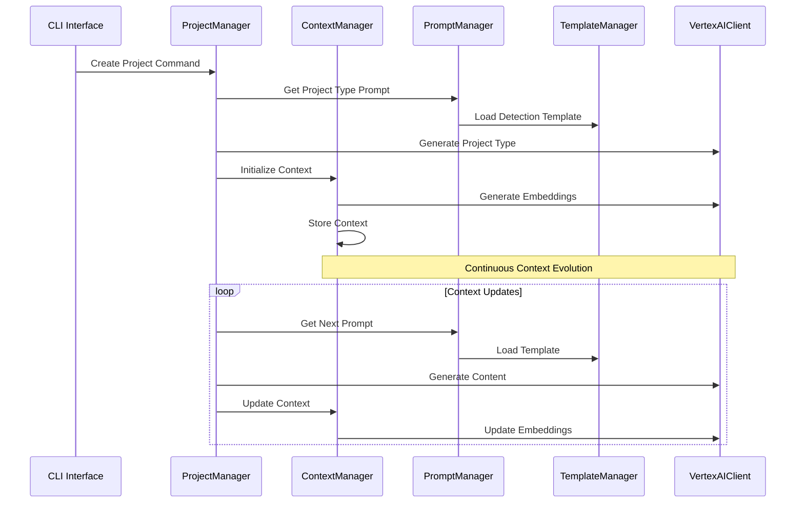

# Current System State Overview

## Core Components and Their Interactions

### 1. Entry Point (`cli/index.ts`)
- Main CLI interface
- Handles command routing and initial setup
- Creates instances of core managers:
  - ProjectManager
  - ContextManager
  - PromptManager
  - VertexAIClient

### 2. Project Management (`project-manager.ts`)
- Handles project-specific operations
- Responsibilities:
  - Project type detection
  - Project initialization
  - Vision analysis
  - Technology suggestions
- Delegates context storage to ContextManager
- Uses VertexAIClient for AI operations

### 3. Context System (`context/context-manager.ts`)
- Central state management system
- Manages:
  - Project contexts
  - Embeddings generation and comparison
  - Context persistence and retrieval
  - Relationship tracking between contexts
- Key Features:
  ```typescript
  interface ContextCapabilities {
    - Multi-dimensional embeddings (vision, technical, workflow)
    - Context comparison and similarity scoring
    - Insight tracking and analysis
    - Project type classification
    - Relationship graph management
  }
  ```

### 4. Prompt System
#### PromptManager (`prompts/prompt-manager.ts`)
- Orchestrates prompt generation and handling
- Manages different prompt types:
  - Project detection
  - Vision analysis
  - Documentation generation
  - Follow-up questions

#### TemplateManager (`prompts/templates/template-manager.ts`)
- Handles template loading and rendering
- Supports multiple template types:
  - Project type detection
  - Documentation
  - Insights
  - Vision analysis
- Provides template customization based on context

### 5. AI Integration (`client/vertex-ai.ts`)
- Provides AI capabilities through Vertex AI
- Core functionalities:
  ```typescript
  class VertexAIClient {
    - Content generation
    - Embedding generation
    - Structured output parsing
    - Temperature control
    - Context-aware responses
  }
  ```

## Data Flow and Integration



## Key Interactions

1. **Project Creation Flow**
   ```
   CLI → ProjectManager
     ↓
   PromptManager (templates) → VertexAI
     ↓
   ContextManager (storage + embeddings)
   ```

2. **Context Evolution**
   ```
   ProjectManager
     ↓
   ContextManager → VertexAI (embeddings)
     ↓
   Relationship Graph + Insights
   ```

3. **AI Integration Points**
   - Project type detection
   - Vision analysis
   - Embedding generation
   - Content generation
   - Context comparison

## Current State Summary

The system operates as a layered architecture where:

1. **ProjectManager** acts as the high-level orchestrator
   - Handles business logic and project lifecycle
   - Delegates to specialized managers

2. **ContextManager** serves as the state and persistence layer
   - Maintains project context and relationships
   - Handles embedding-based comparisons
   - Manages context evolution

3. **PromptManager + TemplateManager** form the interaction layer
   - Generate context-aware prompts
   - Handle template customization
   - Manage prompt sequencing

4. **VertexAIClient** provides the AI capabilities
   - Generates embeddings for context comparison
   - Handles structured content generation
   - Enables context-aware responses

The system is designed to maintain context throughout the project lifecycle while enabling:
- Project type classification
- Context-aware content generation
- Project similarity comparison
- Relationship tracking
- Insight generation and analysis
