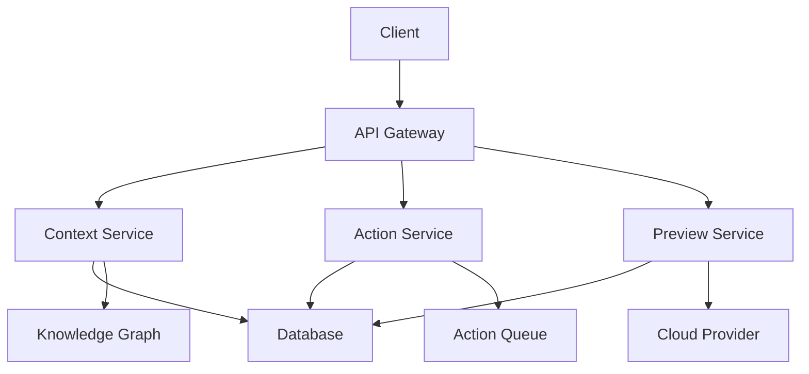

# Architecture Overview

This guide provides a comprehensive overview of Top's system architecture.

## System Components

### Core Services

1. **Context Service**
   - Manages context creation and lifecycle
   - Handles context state and persistence
   - Integrates with knowledge graph

2. **Action Service**
   - Executes user actions and commands
   - Manages action queues and state
   - Handles action results and errors

3. **Preview Service**
   - Manages preview environments
   - Handles deployment and routing
   - Integrates with cloud providers

### Supporting Services

1. **Authentication Service**
   - User authentication and authorization
   - Session management
   - OAuth integration

2. **Real-time Service**
   - WebSocket connections
   - Event broadcasting
   - Presence tracking

3. **Analytics Service**
   - Usage tracking
   - Performance monitoring
   - Error reporting

## Data Flow

## Technology Stack

- **Frontend**: Next.js, React, TailwindCSS
- **Backend**: Node.js, TypeScript
- **Database**: PostgreSQL, Redis
- **Infrastructure**: Kubernetes, Docker
- **Cloud**: Multi-cloud support (AWS, GCP, Azure)

## Security Architecture

1. **Authentication**
   - JWT-based authentication
   - Role-based access control
   - Multi-factor authentication

2. **Data Security**
   - End-to-end encryption
   - At-rest encryption
   - Secure key management

3. **Network Security**
   - TLS everywhere
   - API rate limiting
   - DDoS protection

## Scalability

1. **Horizontal Scaling**
   - Microservices architecture
   - Container orchestration
   - Load balancing

2. **Data Scaling**
   - Database sharding
   - Caching strategies
   - Read replicas

3. **Resource Management**
   - Auto-scaling
   - Resource quotas
   - Usage monitoring

## Next Steps

- Learn about our [Development Setup](/development/setup)
- Review our [Contributing Guidelines](/development/contributing)
- Understand our [Security Practices](/development/security) 