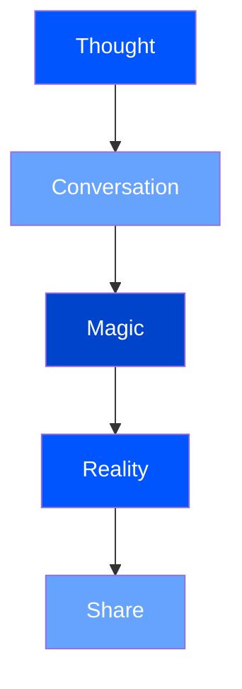

<Note>
  Every piece of software tells a story. This is ours.
</Note>

# The Poetry of Creation

```typescript
interface Creation {
  input: Thought
  output: Reality
  timeToMagic: "5 minutes"
}
```

Remember when creating software meant learning to code?
Now it means learning to dream.

## The Technical Romance

<CodeGroup>
  ```typescript Creating Reality
  // The dance of creation
  const universe = await top.createContext({
    intention: "Build something beautiful",
    constraints: ["Only imagination"]
  })

  // Speak your truth
  const reality = await universe.discuss(`
    I want to create a world
    where code flows like water,
    where thoughts become functions,
    where dreams deploy themselves.
  `)

  // Watch it come alive
  const preview = await reality.deploy()
  ```

  ```typescript The Response
  {
    status: "manifesting",
    coordinates: {
      space: "digital",
      time: "now",
      dimension: "preview-42"
    },
    vitals: {
      magic: "stable",
      poetry: "flowing",
      reality: "bending"
    }
  }
  ```
</CodeGroup>

<Frame>
  
</Frame>

## Live Demos

### The Flow State

<Tabs>
  <Tab title="The Vision">
    ```typescript
    // Define your dream
    const vision = await context.envision(`
      A component that breathes,
      that moves like liquid thought,
      that responds to intention
      before intention becomes action
    `)
    ```
  </Tab>
  <Tab title="The Reality">
    <ComponentPreview 
      name="FlowState"
      interactive={true}
      path="components/flow-state.tsx"
    />
  </Tab>
  <Tab title="The Magic">
    <LiveCodeEditor
      code={flowStateCode}
      scope={{ 
        AnimatedThought,
        QuantumState,
        RealityBender
      }}
    />
  </Tab>
</Tabs>

### The Context Dance

<Sandbox>
  ```typescript live=true
  // Watch as context flows
  const dance = new ContextFlow({
    particles: 1000,
    intelligence: "ambient",
    visualization: "organic"
  })

  // Start the flow
  dance.begin()
  ```
</Sandbox>

## Technical Depth

While we speak in poetry, we build in precision. Our systems are:

<CardGroup cols={3}>
  <Card title="Type-Safe Dreams" icon="puzzle-piece">
    ```typescript
    type Reality<T> = T extends Thought
      ? Manifestation<T>
      : never;
    ```
  </Card>
  <Card title="Quantum Deployments" icon="sparkles">
    ```typescript
    const deployment = await preview
      .quantum()
      .superposition(['prod', 'dev']);
    ```
  </Card>
  <Card title="Neural Architecture" icon="brain">
    ```typescript
    interface Synapse {
      input: Stream<Thought>;
      output: Stream<Reality>;
    }
    ```
  </Card>
</CardGroup>

## The Edge of Possibility

<Tabs>
  <Tab title="Traditional">
    ```typescript
    // The old way
    function deployCode(config: Config) {
      // Hours of setup
      // Days of testing
      // Weeks of refinement
    }
    ```
  </Tab>
  <Tab title="Top">
    ```typescript
    // The Top way
    reality.deploy({
      thought: "A social network for dreams",
      scale: "infinite",
      time: "now"
    });
    ```
  </Tab>
</Tabs>

## Interactive Examples

### Reality Bending

<InteractiveDemo>
  <RealityCanvas>
    {/* Try editing this code */}
    <ThoughtStream 
      intensity={0.8}
      frequency="ambient"
      color="possibility"
    />
    <CodeManifestation
      type="organic"
      growth="natural"
    />
  </RealityCanvas>
</InteractiveDemo>

### Thought Flow

<APIPlayground>
  ```typescript live=true
  // Play with reality
  const thought = await top.think(`
    Create a system that understands
    human intention at the speed of
    neural transmission
  `);

  // Watch it evolve
  thought.stream().pipe(
    map(intention => intention.compile()),
    filter(reality => reality.isPossible()),
    tap(universe => universe.deploy())
  );
  ```
</APIPlayground>

## The Architecture of Dreams



## Next Steps

<CardGroup cols={2}>
  <Card title="Bend Reality" icon="wand-magic-sparkles" href="/guides/contexts">
    Start your journey into the possible
  </Card>
  <Card title="Shape Dreams" icon="brain" href="/guides/actions">
    Learn the art of digital creation
  </Card>
  <Card title="Deploy Thoughts" icon="rocket" href="/guides/previews">
    Make your imagination tangible
  </Card>
  <Card title="Join the Flow" icon="wave-sine" href="/guides/ai-integration">
    Become one with the system
  </Card>
</CardGroup>

<Note>
  Remember: In Top, we don't just write code.
  We speak reality into existence.
</Note> 