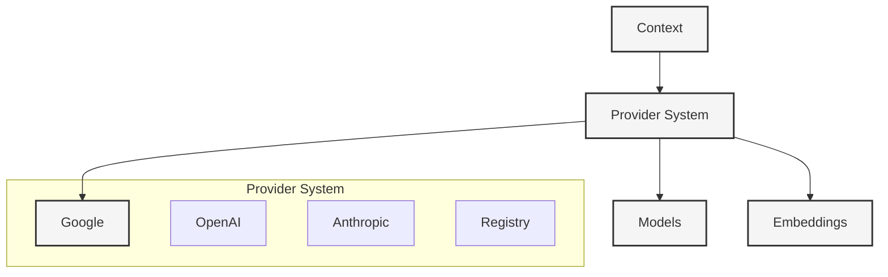

# AI Integration

#ai #llm #providers #integration

Related Documents:
- [[20-llm-pipelines|LLM Pipelines]] - Template system and chain composition
- [[13-smart-context-handling|Smart Context]] - Knowledge graph integration
- [[07-context-generation-workflow|Generation Workflow]] - Context generation
- [[05-context-management|Context Management]] - Core context system
- [[21-database-schema|Database Schema]] - Vector storage and embeddings

## Core Architecture



## Provider System

### 1. Core Types
```typescript
// See @ai/lib/providers/types.ts
interface AIProvider<TConfig = unknown> {
  // Identity
  id: string
  name: string
  description: string
  
  // Configuration
  configSchema: z.ZodSchema
  config: TConfig
  
  // Core methods
  initialize(config: TConfig): Promise<void>
  
  // Generation
  generateText(prompt: string): Promise<string>
  generateStream(prompt: string): AsyncGenerator<string>
  
  // Embeddings
  generateEmbedding(text: string): Promise<number[]>
  generateEmbeddings(texts: string[]): Promise<number[][]>
}
```

### 2. Provider Registry
```typescript
// See @ai/lib/providers/registry.ts
interface ProviderRegistry {
  providers: Map<string, AIProvider>
  
  // Registration
  register(provider: AIProvider): void
  unregister(providerId: string): void
  
  // Active provider
  setActiveProvider(id: string): void
  getActiveProvider(): AIProvider | undefined
}
```

### 3. Supported Providers
```typescript
// See @ai/lib/providers/{openai,anthropic,google}.ts
const providers = {
  openai: {
    models: ['gpt-4', 'gpt-4o', 'gpt-4o-mini', 'gpt-3.5-turbo'],
    features: ['text', 'streaming', 'embeddings']
  },
  anthropic: {
    models: ['claude-3-opus', 'claude-3-sonnet', 'claude-3.5-sonnet'],
    features: ['text', 'streaming']
  },
  google: {
    models: ['gemini-pro', 'gemini-pro-vision'],
    features: ['text', 'streaming', 'embeddings']
  }
}
```

## Integration Points

### 1. Context Generation
```typescript
// See [[07-context-generation-workflow]]
class ContextGenerator {
  constructor(private provider: AIProvider) {}
  
  async generateContext(input: ContextInput): Promise<Context> {
    // Use active provider for generation
    const result = await this.provider.generateText(
      this.buildPrompt(input)
    )
    return this.parseResult(result)
  }
}
```

### 2. Knowledge Graph
```typescript
// See [[13-smart-context-handling]]
class KnowledgeGraph {
  constructor(private provider: AIProvider) {}
  
  async addNode(text: string): Promise<void> {
    // Generate embeddings using active provider
    const embedding = await this.provider.generateEmbedding(text)
    await this.storeEmbedding(embedding)
  }
}
```

### 3. Template System
```typescript
// See [[20-llm-pipelines]]
class TemplateEngine {
  constructor(private provider: AIProvider) {}
  
  async executeTemplate(template: Template, input: any): Promise<string> {
    // Stream response using active provider
    const stream = this.provider.generateStream(
      this.renderTemplate(template, input)
    )
    return this.processStream(stream)
  }
}
```

## Best Practices

### 1. Provider Management
- Initialize providers early
- Handle provider switching gracefully
- Cache provider instances
- Monitor provider health

### 2. Error Handling
- Implement provider fallbacks
- Handle rate limits
- Validate responses
- Log provider errors

### 3. Performance
- Stream long responses
- Cache embeddings
- Optimize token usage
- Monitor latency

### 4. Security
- Secure API keys
- Validate inputs
- Sanitize outputs
- Audit provider usage

## Future Enhancements

### 1. Advanced Features
- Provider-specific optimizations
- Custom model fine-tuning
- Response caching
- Usage analytics

### 2. Integration
- More providers
- Vector databases
- Monitoring tools
- Analytics systems

### 3. Optimization
- Smart provider selection
- Cost optimization
- Performance tuning
- Resource management 