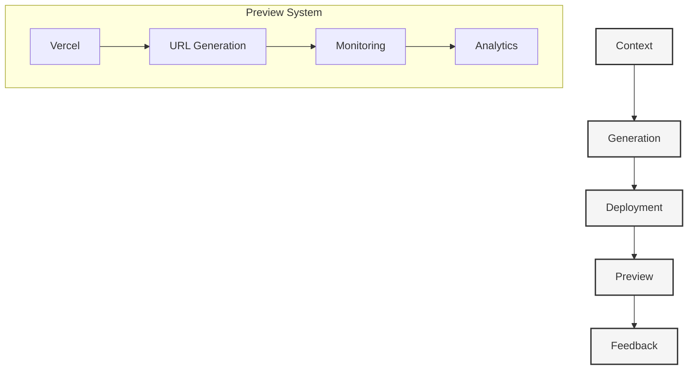

# Context Preview Workflow

#preview #workflow #deployment

Related Documents:
- [[05-context-management|Context Management]] - Core context system
- [[07-context-generation-workflow|Generation Workflow]] - Generation pipeline
- [[20-llm-pipelines|LLM Pipelines]] - Template generation
- [[11-preview-deployments|Preview Deployments]] - Deployment system

## Core Architecture



## Preview System

### 1. Core Types
```typescript
interface Preview {
  // Identity
  id: string
  contextId: string
  deploymentId: string
  
  // Status
  status: PreviewStatus
  url?: string
  logs: string[]
  
  // Analytics
  metrics: {
    deployTime: number
    loadTime: number
    performance: Record<string, number>
  }
}

type PreviewStatus = 
  | 'queued'
  | 'deploying'
  | 'live'
  | 'error'
  | 'expired'

interface PreviewConfig {
  // Configuration
  framework: string
  buildCommand: string
  startCommand: string
  environment: Record<string, string>
  
  // Resources
  cpu: number
  memory: number
  timeout: number
}
```

### 2. Preview Manager
```typescript
class PreviewManager {
  // Lifecycle
  async createPreview(context: Context): Promise<Preview>
  async updatePreview(preview: Preview): Promise<void>
  async deletePreview(previewId: string): Promise<void>
  
  // Status
  async getStatus(previewId: string): Promise<PreviewStatus>
  async getLogs(previewId: string): Promise<string[]>
  
  // URLs
  async getUrl(previewId: string): Promise<string>
  async validateUrl(url: string): Promise<boolean>
}
```

### 3. Deployment Engine
```typescript
class DeploymentEngine {
  // Deployment
  async deploy(preview: Preview): Promise<Deployment>
  async redeploy(deployment: Deployment): Promise<Deployment>
  async rollback(deployment: Deployment): Promise<void>
  
  // Monitoring
  async monitor(deployment: Deployment): Promise<void>
  async scale(deployment: Deployment, resources: Resources): Promise<void>
  async cleanup(deployment: Deployment): Promise<void>
}
```

## Implementation Details

### 1. Vercel Integration
```typescript
class VercelIntegration {
  // Deployment
  async createDeployment(preview: Preview): Promise<{
    id: string
    url: string
    readyState: string
  }>
  
  // Configuration
  async setEnv(deployment: Deployment, env: Record<string, string>): Promise<void>
  async setDomain(deployment: Deployment, domain: string): Promise<void>
  
  // Monitoring
  async getDeployment(deploymentId: string): Promise<Deployment>
  async getLogs(deploymentId: string): Promise<Log[]>
}
```

### 2. Resource Management
```typescript
class ResourceManager {
  // Allocation
  async allocate(preview: Preview): Promise<Resources>
  async deallocate(resources: Resources): Promise<void>
  
  // Monitoring
  async monitor(resources: Resources): Promise<Usage>
  async optimize(usage: Usage): Promise<void>
  
  // Scaling
  async scale(resources: Resources, factor: number): Promise<Resources>
  async predict(preview: Preview): Promise<Prediction>
}
```

### 3. Analytics System
```typescript
class AnalyticsSystem {
  // Tracking
  async track(preview: Preview): Promise<void>
  async measure(metric: string, value: number): Promise<void>
  
  // Analysis
  async analyze(previewId: string): Promise<Analysis>
  async report(timeframe: TimeFrame): Promise<Report>
  
  // Alerts
  async alert(condition: Condition): Promise<void>
  async notify(alert: Alert): Promise<void>
}
```

## Best Practices

### 1. Deployment Strategy
- Use immutable deployments
- Enable instant rollbacks
- Implement blue-green deployments
- Monitor resource usage

### 2. Performance
- Optimize build times
- Enable caching
- Use edge deployments
- Monitor metrics

### 3. Resource Management
- Implement auto-scaling
- Use resource pooling
- Enable resource prediction
- Optimize costs

## Future Considerations

### 1. Advanced Features
- Multi-region deployments
- Custom domains
- A/B testing
- Performance profiling

### 2. Integration
- CI/CD pipelines
- Git providers
- Monitoring tools
- Analytics platforms

### 3. Optimization
- Build caching
- Resource prediction
- Cost optimization
- Performance tuning 