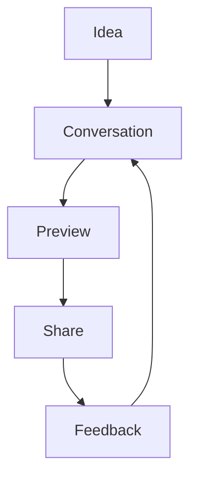

# The Poetry of Code Creation

## Core Philosophy

We're not building a development tool. We're creating a canvas for digital expression. Think of it as the Teenage Engineering OP-1 of code generation - beautifully constrained, deeply powerful, and inherently playful.

## The Experience

```
User opens app
│
├─> Clean, minimal interface
│   └─> Just a conversation waiting to happen
│
├─> "I want to build something"
│   └─> No technical barriers
│      └─> Pure creative flow
│
└─> AI becomes your technical co-founder
    └─> Handles all the complexity
        └─> You focus on vision
```

## First Principles Approach

### 1. Instinctive Creation
- No IDE required
- Mobile-first thinking
- Chat as your natural workspace
- Everything is a conversation

### 2. Immediate Gratification
```typescript
interface CreativeFlow {
  input: Vision        // "I want to build a recipe sharing app"
  output: Reality      // Full repo + live preview in minutes
  friction: Minimal    // No technical setup required
}
```

### 3. Living Previews
- Every conversation generates a live deployment
- See your ideas come to life in real-time
- Share instantly with anyone
- Iterate through chat

## The Magic Moment

When someone who's never coded before says:
"Wait, I just created a real web app by having a conversation?"

That's our north star.

## Technical Philosophy

### 1. Context as Conversation
```typescript
interface ContextFlow {
  // Natural language becomes technical reality
  vision: string           // "I want users to share recipes"
  understanding: Context   // AI understands full technical implications
  execution: Deployment    // Generates and deploys complete solution
}
```

### 2. Preview as Truth
- Every context change creates a new preview
- Live URLs for every iteration
- Share progress naturally
- Feedback becomes conversation

### 3. GitHub as Memory
- Each conversation can be a repo
- Each iteration a branch
- Each deployment a milestone
- Version control becomes natural

## User Personas

### 1. The Creator
- Has ideas but no technical background
- Wants to build real things
- Needs technical co-founder
- We become their technical team

### 2. The Developer
- Wants to focus on creation
- Tired of boilerplate
- Needs quick prototypes
- We become their accelerator

### 3. The Team
- Needs to share progress
- Wants to iterate quickly
- Requires real deployments
- We become their platform

## The Flow



## Key Differentiators

### 1. No Technical Debt
- Start with conversation
- End with production code
- Everything in between is handled

### 2. Instant Gratification
- No waiting for setup
- No configuration
- No deployment hassle
- Just pure creation

### 3. Natural Iteration
- Chat-driven development
- Real-time previews
- Instant sharing
- Continuous deployment

## Future Vision

### 1. Creation as Communication
- Code becomes conversation
- Technical becomes natural
- Complex becomes simple

### 2. Universal Access
- Anyone can create
- Everyone can deploy
- All through chat

### 3. Living Software
- Every project is alive
- Every change is visible
- Every iteration is shared

## Implementation Focus

### Phase 1: The Core Experience
```typescript
interface CoreExperience {
  // The essential magic
  chat: {
    natural: true,      // Pure conversation
    technical: false    // No code required
  },
  preview: {
    instant: true,      // Immediate feedback
    shareable: true     // Universal access
  }
}
```

### Phase 2: Enhanced Creation
- Template marketplace
- Component library
- Visual customization
- Team collaboration

### Phase 3: Ecosystem
- Plugin system
- Custom workflows
- Enterprise features
- Advanced tooling

## The Promise

"Have a conversation.
Create something real.
Share it with the world.
All from your phone."

That's not just a feature set.
That's a revolution in software creation. 