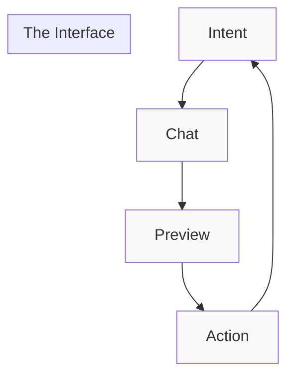

# The Poetry of Mobile Creation

## Core Interface Philosophy



## Interface Components

### 1. Chat Canvas
```typescript
interface ChatCanvas {
  // The creative space
  readonly canvas: {
    // Core chat
    chat: {
      input: TextField
      messages: Message[]
      context: ContextPanel
    }
    
    // Preview integration
    preview: {
      card: PreviewCard
      actions: ActionBar
      sharing: ShareOptions
    }
    
    // Transitions
    transitions: {
      slideIn: Animation
      expand: Animation
      float: Animation
    }
  }
}
```

### 2. Preview Cards
```typescript
interface PreviewCard {
  // Visual representation
  readonly card: {
    // Preview iframe
    frame: {
      url: string
      scale: number
      interaction: InteractionMode
    }
    
    // Meta information
    meta: {
      title: string
      status: PreviewStatus
      metrics: PreviewMetrics
    }
    
    // Actions
    actions: {
      share: () => void
      edit: () => void
      deploy: () => void
    }
  }
}
```

### 3. Context Panel
```typescript
interface ContextPanel {
  // Sliding panel
  readonly panel: {
    // Current context
    context: {
      files: File[]
      dependencies: Dependency[]
      settings: Setting[]
    }
    
    // Visual states
    states: {
      collapsed: State
      expanded: State
      floating: State
    }
    
    // Gestures
    gestures: {
      swipe: SwipeHandler
      pinch: PinchHandler
      tap: TapHandler
    }
  }
}
```

## Implementation Details

### 1. Responsive Chat
```typescript
// The chat experience
class ChatExperience {
  private readonly gestures: GestureSystem;
  private readonly haptics: HapticEngine;
  
  async handleInput(input: string): Promise<void> {
    // Haptic feedback
    await this.haptics.tap();
    
    // Process input
    const response = await this.processInput(input);
    
    // Animate response
    await this.animateResponse(response);
    
    // Show preview if needed
    if (response.hasPreview) {
      await this.showPreview(response.preview);
    }
  }
  
  private async animateResponse(response: Response) {
    return this.animator.sequence([
      this.animations.messageIn,
      this.animations.previewExpand,
      this.animations.actionsFade
    ]);
  }
}
```

### 2. Preview Integration
```typescript
// The preview experience
class PreviewExperience {
  private readonly viewport: Viewport;
  private readonly gestures: GestureSystem;
  
  async showPreview(preview: Preview): Promise<void> {
    // Calculate optimal size
    const size = this.viewport.getOptimalSize(preview);
    
    // Prepare frame
    const frame = await this.prepareFrame(preview, size);
    
    // Add interactions
    this.addInteractions(frame);
    
    // Show with animation
    await this.animator.show(frame, {
      duration: 300,
      easing: 'spring'
    });
  }
  
  private addInteractions(frame: Frame) {
    // Pinch to zoom
    this.gestures.pinch(frame, {
      onScale: scale => this.updateScale(frame, scale)
    });
    
    // Swipe to dismiss
    this.gestures.swipe(frame, {
      onDismiss: () => this.hidePreview(frame)
    });
  }
}
```

### 3. Context Management
```typescript
// The context experience
class ContextExperience {
  private readonly panel: Panel;
  private readonly transitions: Transitions;
  
  async showContext(context: Context): Promise<void> {
    // Prepare panel
    const panel = await this.preparePanel(context);
    
    // Add gestures
    this.addGestures(panel);
    
    // Show with animation
    await this.transitions.show(panel, {
      from: 'bottom',
      duration: 250
    });
  }
  
  private addGestures(panel: Panel) {
    // Swipe to expand
    this.gestures.swipe(panel, {
      onExpand: () => this.expandPanel(panel),
      onCollapse: () => this.collapsePanel(panel)
    });
    
    // Tap to focus
    this.gestures.tap(panel, {
      onFocus: () => this.focusPanel(panel)
    });
  }
}
```

## Animation Choreography

### 1. Chat Animations
```typescript
interface ChatAnimations {
  // Message animations
  readonly messages: {
    appear: Animation
    typing: Animation
    complete: Animation
  }
  
  // Preview transitions
  readonly previews: {
    expand: Animation
    collapse: Animation
    float: Animation
  }
  
  // Context transitions
  readonly context: {
    slide: Animation
    fade: Animation
    scale: Animation
  }
}
```

### 2. Gesture System
```typescript
interface GestureSystem {
  // Core gestures
  readonly gestures: {
    swipe: SwipeConfig
    pinch: PinchConfig
    tap: TapConfig
  }
  
  // Feedback
  readonly feedback: {
    haptic: HapticConfig
    visual: VisualConfig
    audio: AudioConfig
  }
}
```

## The Experience Flow

1. **Initial Contact**
   ```typescript
   app.on('launch', async () => {
     // Show welcome
     await welcome.show();
     
     // Initialize chat
     const chat = await chat.initialize();
     
     // Prepare context
     await context.prepare();
     
     // Enable interactions
     await interactions.enable();
   });
   ```

2. **Creation Flow**
   ```typescript
   chat.on('create', async (intent: Intent) => {
     // Start creation
     const creation = await creator.start(intent);
     
     // Show live preview
     await preview.show(creation);
     
     // Enable editing
     await editor.enable(creation);
     
     // Add sharing
     await sharing.setup(creation);
   });
   ```

3. **Interaction Loop**
   ```typescript
   interface InteractionLoop {
     // Handle all interactions
     readonly handler: {
       chat: () => void
       preview: () => void
       context: () => void
       sharing: () => void
     }
   }
   ```

The result? An interface that feels as natural as having a conversation, but with the power to create real software. Every gesture has meaning, every animation has purpose, and every interaction brings you closer to your creation.

Would you like me to detail the "magic moment" user journey next, or dive deeper into any of these components? 