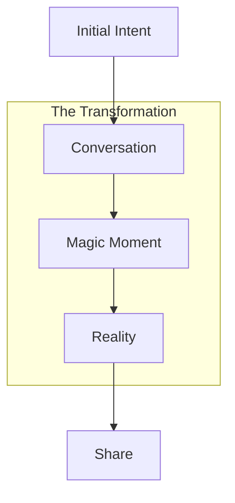

# The Magic Moment: When Software Creates Itself

## The Journey



## The Sequence

### 1. The Opening
```typescript
interface Opening {
  // The first touch
  readonly moment: {
    // User input
    input: "I want to build a recipe sharing app"
    
    // System response
    response: {
      tone: 'conversational'
      approach: 'curious'
      engagement: 'immediate'
    }
    
    // Initial questions
    questions: [
      "What's your vision for sharing recipes?",
      "Any specific features you're dreaming of?",
      "Who are you building this for?"
    ]
  }
}
```

### 2. The Conversation
```typescript
interface Conversation {
  // The exploration
  readonly dialogue: {
    // Understanding
    understanding: {
      vision: string
      requirements: string[]
      constraints: string[]
    }
    
    // Clarification
    clarification: {
      questions: Question[]
      suggestions: Suggestion[]
      refinements: Refinement[]
    }
    
    // Progress
    progress: {
      status: Status
      nextSteps: Step[]
      preview: Preview
    }
  }
}
```

### 3. The Magic
```typescript
interface MagicMoment {
  // The revelation
  readonly revelation: {
    // The build
    build: {
      start: Timestamp
      progress: number
      preview: PreviewURL
    }
    
    // The experience
    experience: {
      loading: LoadingState
      preview: PreviewState
      sharing: SharingState
    }
    
    // The reaction
    reaction: {
      surprise: boolean
      delight: boolean
      understanding: boolean
    }
  }
}
```

## The Implementation

### 1. Progressive Revelation
```typescript
// The build sequence
class BuildSequence {
  private readonly animator: Animator;
  private readonly preview: Preview;
  
  async reveal(): Promise<void> {
    // Start with conversation
    await this.animator.typeMessage(
      "I understand what you want to build. Let me create that for you..."
    );
    
    // Show progress
    await this.animator.showProgress({
      steps: [
        "Creating structure...",
        "Adding features...",
        "Styling interface...",
        "Preparing preview..."
      ]
    });
    
    // Reveal preview
    await this.revealPreview();
  }
  
  private async revealPreview() {
    await this.animator.sequence([
      this.animations.fadeIn,
      this.animations.expand,
      this.animations.activate
    ]);
  }
}
```

### 2. Emotional Design
```typescript
// The emotional journey
class EmotionalJourney {
  private readonly feedback: FeedbackSystem;
  private readonly timing: TimingEngine;
  
  async orchestrate(): Promise<void> {
    // Build anticipation
    await this.timing.pause(500);
    
    // Show progress with personality
    await this.showProgress({
      message: "Almost there... this is looking good!",
      tone: "excited"
    });
    
    // Reveal with impact
    await this.revealWithImpact();
  }
  
  private async revealWithImpact() {
    // Haptic feedback
    await this.feedback.haptic.impact();
    
    // Visual flourish
    await this.feedback.visual.celebrate();
    
    // Sound effect
    await this.feedback.audio.play('success');
  }
}
```

### 3. Interaction Design
```typescript
// The interaction flow
class InteractionFlow {
  private readonly gestures: GestureSystem;
  private readonly preview: PreviewSystem;
  
  async enable(): Promise<void> {
    // Enable preview interaction
    await this.enablePreview();
    
    // Add sharing gestures
    await this.addSharing();
    
    // Enable editing
    await this.enableEditing();
  }
  
  private async enablePreview() {
    // Make preview interactive
    this.preview.makeInteractive({
      scroll: true,
      zoom: true,
      rotate: true
    });
    
    // Add gestures
    this.gestures.add({
      swipe: this.handleSwipe,
      pinch: this.handlePinch,
      tap: this.handleTap
    });
  }
}
```

## The Choreography

### 1. Timing
```typescript
interface TimingSystem {
  // Perfect timing
  readonly timing: {
    // Key moments
    moments: {
      typing: number    // 1.5s
      thinking: number  // 2s
      revealing: number // 1s
      celebrating: number // 0.5s
    }
    
    // Sequences
    sequences: {
      build: Sequence
      reveal: Sequence
      interact: Sequence
    }
  }
}
```

### 2. Feedback
```typescript
interface FeedbackSystem {
  // Rich feedback
  readonly feedback: {
    // Visual
    visual: {
      progress: Progress
      celebration: Celebration
      transitions: Transition[]
    }
    
    // Haptic
    haptic: {
      tap: HapticPattern
      success: HapticPattern
      error: HapticPattern
    }
    
    // Audio
    audio: {
      typing: Sound
      complete: Sound
      celebrate: Sound
    }
  }
}
```

## The Result

When someone says:
```typescript
"I want to build a recipe sharing app"
```

And within minutes, they're looking at:
```typescript
interface Reality {
  preview: {
    url: string        // A live, working preview
    interaction: true  // They can actually use it
    sharing: true      // They can share it instantly
  }
}
```

That's when the magic happens. That's when they realize:
1. They just created real software
2. Through a conversation
3. On their phone
4. In minutes

And that's when they say:
"Wait... this is real? I just... created this?"

That's our magic moment. That's when we've won.

Would you like me to:
1. Detail the technical implementation of any component?
2. Explore the emotional design aspects further?
3. Dive into the feedback systems? 