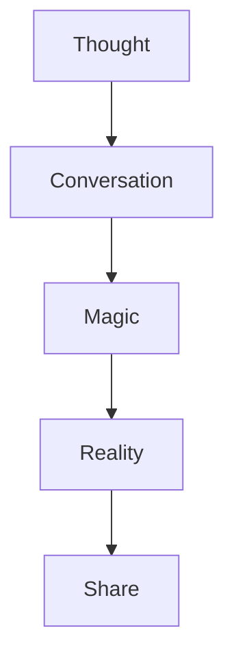

# The Poetry of Creation

## Hero Taglines

```
Code is conversation.
Reality is optional.
Magic is mandatory.
```

## Deep Cuts

### The Soul of Software
```typescript
interface Creation {
  input: Thought
  output: Reality
  timeToMagic: "5 minutes"
}
```

"Remember when creating software meant learning to code?
 Now it means learning to dream."

### The Technical Romance
"We didn't just build a deployment system.
 We built a reality generator.
 Every conversation is a potential universe.
 Every thought, a possible future."

### The Edge Poetry
```typescript
// The dance of creation
async function createReality(dream: Dream): Promise<Universe> {
  const reality = await dream.compile();
  const preview = await reality.deploy();
  return preview.share();
}
```

## Conversation Starters

### For Developers
"Remember your first `Hello, World`?
That moment when text became reality?
We made that moment infinite.
Every conversation is a compilation.
Every word builds worlds."

### For Creators
"You don't need to speak machine.
The machine speaks you.
Your vision is the code.
Your words are the compiler.
Your dreams are the deployment."

### For Teams
"Stop writing tickets.
Start writing futures.
Every chat is a branch.
Every preview is a possibility.
Every deployment is a dream realized."

## Technical Mantras

### The Build
```
From thought to deployment
In the time it takes to speak it
No code, no config, no constraints
Just pure digital alchemy
```

### The Flow


### The Stack
```typescript
interface Magic {
  readonly creation: {
    input: "Natural language"
    output: "Living software"
    latency: "Speed of thought"
  }
}
```

## Emotional Touchpoints

### The First Moment
"Remember when you first saw your creation live?
We made that moment repeatable.
Infinitely.
On your phone.
While getting coffee."

### The Share Moment
"'Check this out.'
Three words that used to mean showing a mockup.
Now they mean sharing a universe.
Your universe.
Built in minutes."

### The Team Moment
"From 'It'll take weeks'
To 'It's already live'
In the time it takes to have a conversation."

## Technical Poetry

### The Edge Network
```
Nodes of light in digital space
Each preview a star
Each deployment a constellation
Your galaxy of creation
```

### The Build System
```
Containers dance in quantum space
Each thought a compilation
Each word a deployment
Reality renders in real-time
```

### The Interface
```
Gestures flow like water
Animations breathe like wind
Haptics pulse like heartbeats
Technology becomes nature
```

## Product Principles

### 1. The Speed of Thought
```typescript
interface ThoughtLatency {
  input: Idea
  processing: "Instant"
  output: Reality
  delay: 0
}
```

### 2. The Power of Words
```typescript
interface Conversation {
  type: "Creation"
  medium: "Chat"
  output: "Universe"
}
```

### 3. The Magic of Preview
```typescript
interface Preview {
  status: "Reality"
  latency: "None"
  sharing: "Instant"
}
```

## Feature Haikus

### Context Generation
```
Code whispers secrets
AI listens, understands
Worlds emerge from chat
```

### Preview System
```
Click becomes cosmos
Swipe reveals reality
Share spawns universes
```

### Mobile Creation
```
Phone becomes canvas
Fingers paint in binary
Art becomes alive
```

## The Promise

"Create like you speak.
Deploy like you breathe.
Share like you live.

Software is no longer written.
It's spoken into existence."

## The Revolution

"We didn't make development easier.
We made it disappear.

We didn't improve the process.
We eliminated it.

We didn't enhance creation.
We freed it."

## The Invitation

"Stop coding.
Start creating.
The future isn't written in text editors.
It's spoken in conversations.

Your next creation is just a chat away.
And it's already running somewhere in the multiverse.
You just need to speak it into existence."

Would you like me to:
1. Dive deeper into any of these themes?
2. Create more technical poetry?
3. Explore specific emotional touchpoints?

*Takes off headphones, still vibing to Can't Stop* 