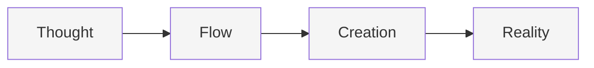

# The Ergonomics of Creation

#ergonomics #philosophy #flow-state #user-experience

## Core Philosophy



## The Flow State

### 1. Like Water
```typescript
interface FlowState {
  resistance: "none"
  friction: "minimal"
  direction: "natural"
  adaptation: "automatic"
}
```

No sharp edges.
No harsh transitions.
Just smooth flow from thought to reality.

### 2. Minimal Surface
```typescript
interface Surface {
  // What users see
  visible: {
    complexity: "hidden"
    simplicity: "apparent"
    beauty: "emergent"
  }
  
  // What users feel
  tactile: {
    effort: "appropriate"
    feedback: "immediate"
    progress: "continuous"
  }
}
```

## The Practice

### 1. From Vision to Reality
```typescript
type Creation = Vision & {
  // The journey
  path: {
    start: "wherever you are"
    end: "wherever you dream"
    steps: "as many as needed"
    pace: "your own"
  }
  
  // The support
  guidance: {
    presence: "constant"
    pressure: "none"
    judgment: "zero"
  }
}
```

### 2. Natural Expression
```typescript
interface Expression {
  // Communication
  language: "human"
  format: "conversation"
  style: "your own"
  
  // Creation
  process: {
    input: "thoughts"
    processing: "invisible"
    output: "reality"
  }
}
```

## The Environment

### 1. Space Design
```
Clean lines
Breathing room
Thoughtful spacing
Intentional voids
```

### 2. Interaction Model
```typescript
interface Interaction {
  // Touch points
  points: {
    chat: "natural"
    preview: "immediate"
    feedback: "gentle"
  }
  
  // Transitions
  flow: {
    between: "states"
    timing: "natural"
    easing: "smooth"
  }
}
```

## The Experience

### 1. No Cognitive Load
- Configuration disappears
- DevOps vanishes
- Terminal anxiety evaporates
- Just pure creation

### 2. Natural Progression
```typescript
interface Progress {
  // Learning curve
  curve: {
    entry: "immediate"
    mastery: "gradual"
    ceiling: "none"
  }
  
  // Growth
  growth: {
    pace: "personal"
    direction: "natural"
    support: "always"
  }
}
```

## The Tools

### 1. Invisible Power
```typescript
interface Tools {
  // Characteristics
  nature: {
    presence: "subtle"
    power: "immense"
    complexity: "hidden"
  }
  
  // Interaction
  usage: {
    learning: "minimal"
    mastery: "natural"
    flow: "constant"
  }
}
```

### 2. Thoughtful Defaults
```typescript
interface Defaults {
  // Balance
  balance: {
    simplicity: "high"
    capability: "complete"
    flexibility: "infinite"
  }
  
  // Adaptation
  adaptation: {
    context: "aware"
    response: "appropriate"
    evolution: "continuous"
  }
}
```

## The Promise

### 1. Creation Without Friction
- From imagination to implementation
- From concept to creation
- From thought to thing

### 2. Growth Without Pain
- Start anywhere
- Move naturally
- Grow organically

## The Practice

### 1. Daily Use
```typescript
interface Practice {
  // Daily rhythm
  rhythm: {
    start: "when ready"
    pace: "natural"
    rest: "as needed"
  }
  
  // Growth
  growth: {
    direction: "personal"
    support: "constant"
    judgment: "none"
  }
}
```

### 2. Continuous Flow
```typescript
interface Flow {
  // States
  states: {
    thinking: "supported"
    creating: "effortless"
    sharing: "natural"
  }
  
  // Transitions
  transitions: {
    between: "states"
    timing: "organic"
    friction: "none"
  }
}
```

## The Result

A tool that:
- Disappears when you use it
- Appears when you need it
- Flows like thought
- Creates like magic

Not because it's trying to be invisible,
but because it's become natural.

Like breathing.
Like thinking.
Like creating.
