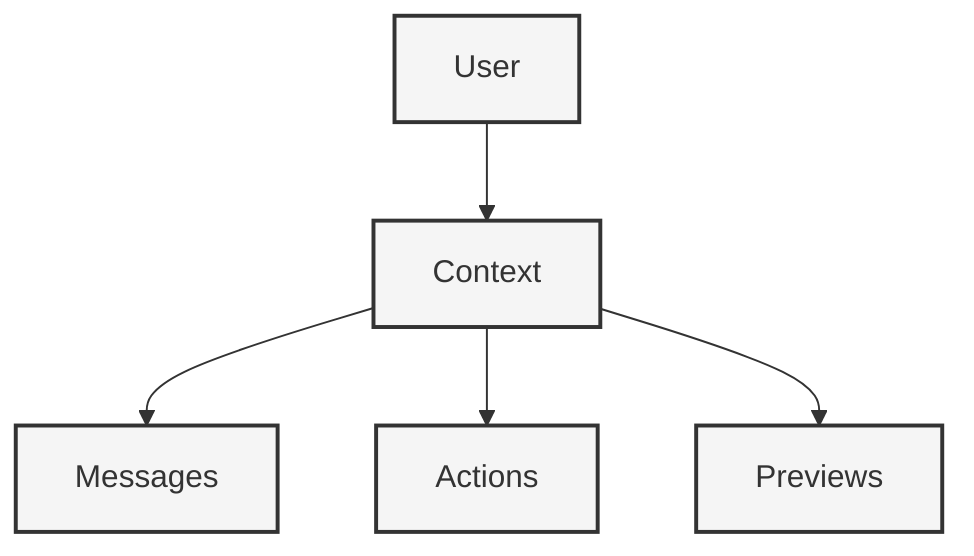

# Database Schema

#database #schema #context #storage

Related Documents:
- [[20-llm-pipelines|LLM Pipelines]] - Pipeline data structures and storage
- [[22-action-execution|Action Execution]] - Action and execution data models
- [[19-ergonomics|Ergonomics]] - Core philosophy guiding the data design

## Core Philosophy



## Schema Definition

### Core Models
```prisma
model User {
  id            String    @id @default(cuid())
  email         String    @unique
  name          String?
  contexts      Context[]
  preferences   Json?
  createdAt     DateTime  @default(now())
  updatedAt     DateTime  @updatedAt
}

model Context {
  id            String    @id @default(cuid())
  userId        String
  status        String    // setup, active, completed
  flow          Json      // resistance, friction, direction
  config        Json      // template, tooling, features, customizations
  metadata      Json?     // additional context data
  messages      Message[]
  actions       Action[]
  previews      Preview[]
  createdAt     DateTime  @default(now())
  updatedAt     DateTime  @updatedAt
  user          User      @relation(fields: [userId], references: [id])

  @@index([userId])
}

model Message {
  id            String    @id @default(cuid())
  contextId     String
  role          String    // user, assistant, system
  content       String    @db.Text
  metadata      Json?     // additional message data
  createdAt     DateTime  @default(now())
  context       Context   @relation(fields: [contextId], references: [id])

  @@index([contextId])
}

model Action {
  id            String    @id @default(cuid())
  contextId     String
  type          String    // clone_template, configure_tooling, modify_files, deploy
  payload       Json      // action-specific data
  status        String    // pending, running, completed, failed
  result        Json?     // action result data
  createdAt     DateTime  @default(now())
  updatedAt     DateTime  @updatedAt
  context       Context   @relation(fields: [contextId], references: [id])

  @@index([contextId])
}

model Preview {
  id            String    @id @default(cuid())
  contextId     String
  url           String?
  deploymentId  String?
  status        String    // generating, live, error
  metadata      Json?     // additional preview data
  createdAt     DateTime  @default(now())
  updatedAt     DateTime  @updatedAt
  context       Context   @relation(fields: [contextId], references: [id])

  @@index([contextId])
}
```

## Data Flow

### 1. Context Creation
```typescript
interface ContextCreation {
  // Initial context setup
  user: {
    id: string
    preferences?: Record<string, any>
  }
  context: {
    flow: {
      resistance: "none"
      friction: "minimal"
      direction: "natural"
    }
    config: {
      template?: string
      tooling?: string[]
      features?: string[]
    }
  }
}
```

### 2. Message Flow
```typescript
interface MessageFlow {
  // Message handling
  message: {
    role: "user" | "assistant" | "system"
    content: string
    metadata?: {
      intent?: string
      entities?: string[]
      confidence?: number
    }
  }
}
```

### 3. Action Tracking
```typescript
interface ActionTracking {
  // Action lifecycle
  action: {
    type: string
    payload: Record<string, any>
    status: string
    result?: Record<string, any>
  }
}
```

## Query Patterns

### 1. Context Retrieval
```typescript
interface ContextQueries {
  // Get user's contexts
  getUserContexts(userId: string): Promise<Context[]>
  
  // Get active context
  getActiveContext(userId: string): Promise<Context>
  
  // Get context with related data
  getFullContext(contextId: string): Promise<{
    context: Context
    messages: Message[]
    actions: Action[]
    previews: Preview[]
  }>
}
```

### 2. Action Management
```typescript
interface ActionQueries {
  // Get pending actions
  getPendingActions(contextId: string): Promise<Action[]>
  
  // Update action status
  updateActionStatus(actionId: string, status: string): Promise<Action>
  
  // Get action results
  getActionResults(contextId: string): Promise<{
    action: Action
    result: Record<string, any>
  }[]>
}
```

## Migrations

### 1. Initial Schema
```sql
-- CreateTable
CREATE TABLE "User" (...)
CREATE TABLE "Context" (...)
CREATE TABLE "Message" (...)
CREATE TABLE "Action" (...)
CREATE TABLE "Preview" (...)
```

### 2. Indexes
```sql
-- CreateIndex
CREATE INDEX "Context_userId_idx" ON "Context"("userId");
CREATE INDEX "Message_contextId_idx" ON "Message"("contextId");
CREATE INDEX "Action_contextId_idx" ON "Action"("contextId");
CREATE INDEX "Preview_contextId_idx" ON "Preview"("contextId");
```

## Best Practices

### 1. Data Integrity
- Use transactions for related operations
- Implement soft deletes where appropriate
- Maintain referential integrity

### 2. Performance
- Index frequently queried fields
- Use JSON fields for flexible data
- Implement efficient pagination

### 3. Security
- Encrypt sensitive data
- Implement row-level security
- Validate all inputs

## Future Considerations

### 1. Scaling
- Sharding strategies
- Read replicas
- Caching layer

### 2. Analytics
- Usage metrics
- Performance tracking
- Error monitoring 