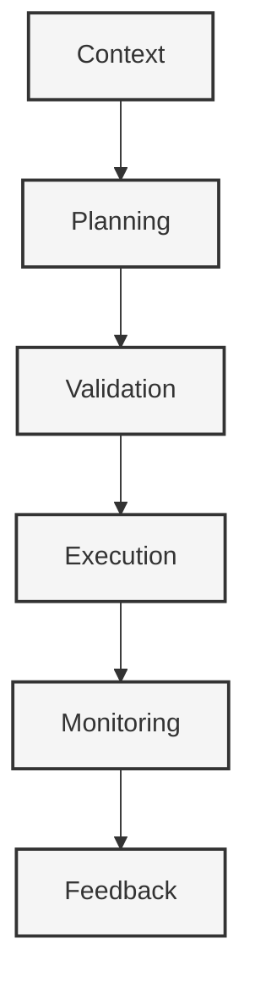

# Action Execution System

#actions #execution #workflow #automation

Related Documents:
- [[20-llm-pipelines|LLM Pipelines]] - Generation of actions and configurations
- [[21-database-schema|Database Schema]] - Storage of actions and results
- [[19-ergonomics|Ergonomics]] - Core philosophy guiding the execution flow

## Core Philosophy



## Action Architecture

### Core Types
```typescript
interface Action {
  id: string
  type: ActionType
  payload: Record<string, any>
  status: ActionStatus
  result?: ActionResult
  metadata: {
    priority: number
    retryCount: number
    timeout: number
  }
}

type ActionType = 
  | "clone_template"
  | "configure_tooling"
  | "modify_files"
  | "deploy"
  | "install_dependencies"
  | "run_tests"
  | "generate_preview"

type ActionStatus = 
  | "pending"
  | "validating"
  | "executing"
  | "completed"
  | "failed"
  | "cancelled"

interface ActionResult {
  success: boolean
  data?: Record<string, any>
  error?: {
    code: string
    message: string
    details?: Record<string, any>
  }
}
```

### Execution Engine
```typescript
class ActionExecutionEngine {
  async plan(context: Context): Promise<Action[]>
  async validate(action: Action): Promise<ValidationResult>
  async execute(action: Action): Promise<ActionResult>
  async monitor(action: Action): Promise<ActionStatus>
  async rollback(action: Action): Promise<void>
}

interface ValidationResult {
  valid: boolean
  issues: {
    severity: "warning" | "error"
    message: string
    field?: string
  }[]
}
```

## Action Implementations

### 1. Template Actions
```typescript
class TemplateActions {
  async cloneTemplate(template: Template): Promise<ActionResult>
  async configureTemplate(config: TemplateConfig): Promise<ActionResult>
  async validateTemplate(template: Template): Promise<ValidationResult>
}

interface TemplateConfig {
  path: string
  variables: Record<string, any>
  features: string[]
  customizations: Record<string, any>
}
```

### 2. File System Actions
```typescript
class FileSystemActions {
  async modifyFiles(changes: FileChange[]): Promise<ActionResult>
  async installDependencies(packages: string[]): Promise<ActionResult>
  async runScripts(scripts: string[]): Promise<ActionResult>
}

interface FileChange {
  path: string
  content: string
  operation: "create" | "modify" | "delete"
}
```

### 3. Deployment Actions
```typescript
class DeploymentActions {
  async deployPreview(context: Context): Promise<ActionResult>
  async generatePreviewUrl(deployment: Deployment): Promise<string>
  async monitorDeployment(deploymentId: string): Promise<DeploymentStatus>
}

interface Deployment {
  id: string
  url?: string
  status: DeploymentStatus
  logs: string[]
}
```

## Execution Flow

### 1. Planning Phase
```typescript
interface ActionPlan {
  actions: Action[]
  dependencies: {
    [actionId: string]: string[] // dependent action IDs
  }
  metadata: {
    estimatedDuration: number
    requiredResources: string[]
  }
}

class ActionPlanner {
  async createPlan(context: Context): Promise<ActionPlan>
  async optimizePlan(plan: ActionPlan): Promise<ActionPlan>
  async validatePlan(plan: ActionPlan): Promise<ValidationResult>
}
```

### 2. Execution Phase
```typescript
interface ExecutionContext {
  plan: ActionPlan
  currentAction: Action
  results: Record<string, ActionResult>
  metadata: {
    startTime: Date
    progress: number
    logs: string[]
  }
}

class ActionExecutor {
  async executeAction(action: Action): Promise<ActionResult>
  async handleFailure(action: Action, error: Error): Promise<void>
  async rollbackAction(action: Action): Promise<void>
}
```

### 3. Monitoring Phase
```typescript
interface ActionMonitor {
  async trackProgress(action: Action): Promise<{
    status: ActionStatus
    progress: number
    logs: string[]
  }>

  async collectMetrics(action: Action): Promise<{
    duration: number
    resourceUsage: Record<string, number>
    performance: Record<string, number>
  }>
}
```

## Error Handling

### 1. Recovery Strategies
```typescript
interface RecoveryStrategy {
  type: "retry" | "fallback" | "skip" | "abort"
  maxAttempts: number
  backoffStrategy: "linear" | "exponential"
  fallbackAction?: Action
}

class ErrorHandler {
  async handleError(error: Error, context: ExecutionContext): Promise<void>
  async determineStrategy(error: Error): Promise<RecoveryStrategy>
  async executeRecovery(strategy: RecoveryStrategy): Promise<void>
}
```

### 2. Rollback Management
```typescript
interface RollbackPlan {
  actions: Action[]
  order: "forward" | "reverse"
  strategy: "all-or-nothing" | "best-effort"
}

class RollbackManager {
  async createRollbackPlan(actions: Action[]): Promise<RollbackPlan>
  async executeRollback(plan: RollbackPlan): Promise<void>
  async validateRollbackResult(result: ActionResult): Promise<boolean>
}
```

## Best Practices

### 1. Execution Principles
- Atomic operations where possible
- Idempotent actions
- Predictable outcomes

### 2. Resource Management
- Efficient resource allocation
- Proper cleanup
- Resource pooling

### 3. Monitoring
- Real-time progress tracking
- Detailed logging
- Performance metrics

## Future Enhancements

### 1. Advanced Features
- Parallel execution
- Distributed actions
- Custom action types

### 2. Optimization
- Smart scheduling
- Resource prediction
- Caching strategies 