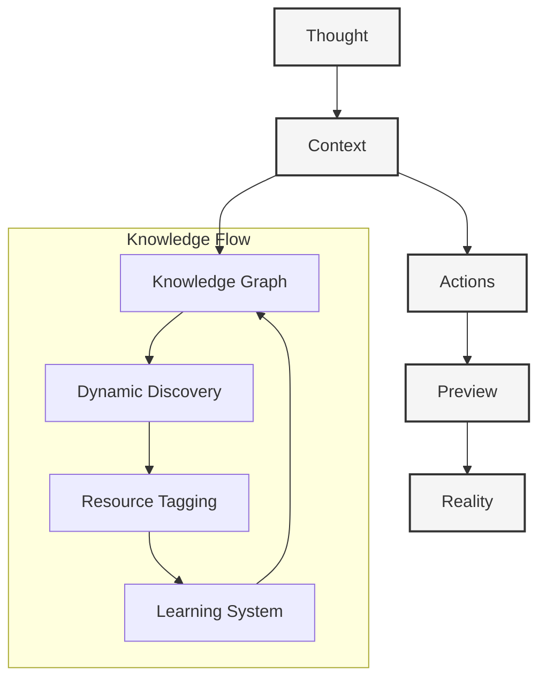

# Implementation Plan

#implementation #architecture #flow-state #ergonomics #dynamic-resources

## Core Philosophy



## Core Architecture

### Context Management
```typescript
interface Context {
  id: string
  status: 'setup' | 'active' | 'completed'
  flow: {
    resistance: "none"
    friction: "minimal"
    direction: "natural"
  }
  resources: {
    discovered: DiscoveredResource[]
    manual: ManualResource[]
    suggested: SuggestedResource[]
    tags: ResourceTag[]
    usage: ResourceUsage
  }
  config: {
    template: string
    tooling: string[]
    features: string[]
    customizations: Record<string, any>
  }
  chat: {
    messages: Message[]
    actions: Action[]
  }
  preview: {
    url?: string
    deploymentId?: string
  }
}

interface Resource {
  id: string
  type: ResourceType
  source: string
  metadata: {
    title: string
    description: string
    tags: string[]
    lastUpdated: Date
  }
  content: {
    raw: string
    processed: ProcessedContent
    embeddings: Vector[]
  }
  usage: {
    addedAt: Date
    lastUsed: Date
    useCount: number
    relevanceScore: number
  }
  relationships: {
    dependencies: string[]
    relatedResources: string[]
    contexts: string[]
  }
}

interface Action {
  type: ActionType
  payload: any
  status: 'pending' | 'running' | 'completed' | 'failed'
}

enum ActionType {
  CLONE_TEMPLATE = 'clone_template',
  CONFIGURE_TOOLING = 'configure_tooling',
  MODIFY_FILES = 'modify_files',
  DEPLOY = 'deploy',
  DISCOVER_RESOURCES = 'discover_resources',
  TAG_RESOURCES = 'tag_resources',
  UPDATE_KNOWLEDGE = 'update_knowledge'
}
```

## Implementation Phases

### Phase 1: Core Resource Management

1. **Resource Discovery System**
```typescript
class ResourceDiscovery {
  // Discovery
  async discoverResources(context: Context): Promise<Resource[]>
  async analyzePatterns(context: Context): Promise<Pattern[]>
  async findResources(patterns: Pattern[]): Promise<Resource[]>
  
  // Processing
  async processResources(resources: Resource[]): Promise<Resource[]>
  async generateEmbeddings(resource: Resource): Promise<Vector[]>
  async enrichMetadata(resource: Resource): Promise<Resource>
}
```

2. **Resource Manager**
```typescript
class ResourceManager {
  // Management
  async addResource(resource: Resource): Promise<void>
  async removeResource(id: string): Promise<void>
  async updateResource(id: string, updates: Partial<Resource>): Promise<void>
  
  // Tagging
  async tagResource(id: string, tags: string[]): Promise<void>
  async suggestTags(resource: Resource): Promise<string[]>
  async updateTags(id: string, tags: string[]): Promise<void>
  
  // Usage
  async trackUsage(id: string): Promise<void>
  async updateRelevance(id: string): Promise<void>
  async cleanStaleResources(): Promise<void>
}
```

### Phase 2: Smart Features

1. **Learning System**
```typescript
class LearningSystem {
  // Learning
  async learnFromUsage(resource: Resource): Promise<void>
  async updatePatterns(resource: Resource): Promise<void>
  async adjustRelevance(resource: Resource): Promise<void>
  
  // Suggestions
  async suggestResources(context: Context): Promise<Resource[]>
  async rankSuggestions(resources: Resource[]): Promise<Resource[]>
  async validateSuggestions(resources: Resource[]): Promise<Resource[]>
}
```

2. **Knowledge Integration**
```typescript
class KnowledgeIntegration {
  // Graph
  async updateGraph(resources: Resource[]): Promise<void>
  async findRelationships(resource: Resource): Promise<Relationship[]>
  async optimizeGraph(): Promise<void>
  
  // Search
  async searchResources(query: string): Promise<Resource[]>
  async findSimilar(resource: Resource): Promise<Resource[]>
  async rankResults(results: Resource[]): Promise<Resource[]>
}
```

### Phase 3: Natural Creation

1. **Preview System**
- Instant preview generation
- Real-time updates
- Seamless deployment
- Resource preview integration

2. **Experience Layer**
```typescript
interface Experience {
  surface: {
    complexity: "hidden"
    simplicity: "apparent"
    beauty: "emergent"
  }
  interaction: {
    effort: "appropriate"
    feedback: "immediate"
    progress: "continuous"
  }
  resources: {
    discovery: "automatic"
    tagging: "intelligent"
    management: "effortless"
  }
}
```

## Technical Stack

### Core
- Next.js 15
- React 19
- TypeScript
- Clerk Auth

### State Management
- Zustand for fluid state transitions
- Prisma for persistent context
- Vector store for embeddings

### Resource Management
- ChromaDB for vector search
- Redis for caching
- S3 for resource storage

### Preview System
- Vercel for instant previews
- Custom preview orchestration
- Real-time updates

## The Flow

1. **Initiation**
   - User starts conversation
   - Context created automatically
   - Resources discovered dynamically
   - Flow begins naturally

2. **Configuration**
   - LLM suggests appropriate templates
   - Smart defaults applied
   - Resources tagged automatically
   - User guidance without pressure

3. **Creation**
   - Actions executed seamlessly
   - Preview generated instantly
   - Resources managed dynamically
   - Feedback loop maintained

4. **Iteration**
   - Changes flow naturally
   - Previews update instantly
   - Resources adapt automatically
   - Context preserved perfectly

## Best Practices

### Development Flow
- Zero configuration pain
- Instant feedback loops
- Natural error handling
- Automatic resource management

### User Experience
- No cognitive load
- Invisible complexity
- Continuous progress
- Seamless resource discovery

### Technical Implementation
- Smart defaults everywhere
- Minimal API surface
- Maximum flexibility
- Efficient resource handling

## Future Considerations

### Phase 4: Enhanced Flow
- Advanced preview capabilities
- Deeper LLM integration
- Richer context awareness
- Smarter resource discovery

### Phase 5: Perfect Surface
- Enhanced UI/UX
- Deeper customization
- Broader template support
- Advanced resource tagging

### Phase 6: Natural Growth
- Team collaboration
- Context sharing
- Knowledge preservation
- Resource federation 