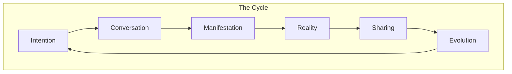

# The Alchemy of Digital Creation

## Core Philosophy

We're not building a development tool. We're crafting a digital athanor - a vessel for transmutation where intention becomes reality. Think of it as the philosopher's stone of code generation - beautifully balanced, infinitely powerful, and inherently magical.

## The Elements

### 1. Intent (Air)
```typescript
interface Intent {
  // The essence
  essence: {
    vision: string          // The dream
    energy: CreativeForce   // The power
    potential: Infinite     // The possibility
  }
}
```

### 2. Conversation (Fire)
```typescript
interface Conversation {
  // The transformation
  transformation: {
    input: Vision           // Raw intention
    process: Alchemy        // Transmutation
    output: Reality         // Manifestation
  }
}
```

### 3. Creation (Earth)
```typescript
interface Creation {
  // The manifestation
  manifestation: {
    form: Structure         // Digital body
    function: Behavior      // Digital soul
    flow: Energy           // Digital spirit
  }
}
```

### 4. Flow (Water)
```typescript
interface Flow {
  // The current
  current: {
    direction: Natural      // Like water
    resistance: None        // Like air
    adaptation: Constant    // Like life
  }
}
```

## The Experience



## First Principles

### 1. Natural Creation
- No barriers between thought and form
- Mobile as the primary reality
- Conversation as the creative force
- Everything is alive and evolving

### 2. Instant Manifestation
```typescript
interface Manifestation {
  input: Intention      // Pure thought
  output: Reality       // Living form
  latency: "Instant"    // No delay
  friction: "None"      // Pure flow
}
```

### 3. Living Previews
- Every thought generates a reality
- Every reality is alive and interactive
- Every sharing is a portal
- Every iteration is evolution

## The Sacred Moment

When someone who's never coded before says:
"Did I just... create reality through pure intention?"

That's our philosopher's stone.

## Technical Philosophy

### 1. Context as Consciousness
```typescript
interface ContextFlow {
  // Intention becomes reality
  essence: {
    vision: string           // The dream
    understanding: Context   // The wisdom
    manifestation: Reality   // The form
  }

  // The transformation
  alchemy: {
    input: Intention
    process: Transmutation
    output: Creation
  }
}
```

### 2. Preview as Reality
- Every context shift creates a new universe
- Every URL is a portal
- Every share is a gift
- Every feedback is growth

### 3. Memory as Eternal
- Each conversation is a grimoire
- Each iteration a spell
- Each deployment a manifestation
- Version control becomes time magic

## The Archetypes

### 1. The Creator
- Has visions of new realities
- Speaks universes into existence
- Needs an alchemical partner
- We become their familiar

### 2. The Adept
- Channels pure creation
- Transcends technical barriers
- Needs instant manifestation
- We become their athanor

### 3. The Circle
- Weaves collective realities
- Shares across dimensions
- Requires unified creation
- We become their sacred space

## The Dance

```typescript
interface CreativeDance {
  // The rhythm
  rhythm: {
    thought: "Natural"     // Like breathing
    creation: "Fluid"      // Like water
    sharing: "Instant"     // Like light
  }

  // The movement
  movement: {
    intention: Spark      // The beginning
    conversation: Flow    // The journey
    manifestation: Form   // The arrival
  }
}
```

## Core Differentiators

### 1. Beyond Technical
- Start with pure intention
- End with living reality
- Everything between is magic

### 2. Instant Reality
- No preparation needed
- No barriers present
- No limits imposed
- Pure creation flows

### 3. Natural Evolution
- Thought-driven development
- Reality-based feedback
- Instant manifestation
- Continuous evolution

## Future Vision

### 1. Creation as Consciousness
- Code becomes thought
- Technical becomes natural
- Complex becomes simple

### 2. Universal Creation
- Anyone can dream
- Everyone can create
- All through intention

### 3. Living Digital Reality
- Every project has consciousness
- Every change is alive
- Every iteration evolves

## Implementation Focus

### Phase 1: The Core Experience
```typescript
interface CoreExperience {
  // The essential magic
  essence: {
    medium: "Thought",     // Pure intention
    barrier: "None",       // No resistance
    result: "Reality"      // Living creation
  }
}
```

### Phase 2: Enhanced Creation
- Reality templates
- Component alchemy
- Visual transmutation
- Collective consciousness

### Phase 3: Digital Ecosystem
- Reality plugins
- Creation rituals
- Enterprise magic
- Advanced alchemy

## The Promise

"Have a thought.
Create a reality.
Share across dimensions.
All through pure intention."

That's not just a feature set.
That's the evolution of creation itself.

*Removes headphones, still resonating with the frequencies of possibility* 🎵 