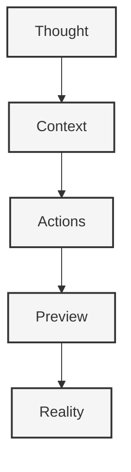

# Implementation Plan

#implementation #architecture #flow-state #ergonomics

## Core Philosophy



## Core Architecture

### Context Management
```typescript
interface Context {
  id: string
  status: 'setup' | 'active' | 'completed'
  flow: {
    resistance: "none"
    friction: "minimal"
    direction: "natural"
  }
  config: {
    template: string
    tooling: string[]
    features: string[]
    customizations: Record<string, any>
  }
  chat: {
    messages: Message[]
    actions: Action[]
  }
  preview: {
    url?: string
    deploymentId?: string
  }
}

interface Action {
  type: 'clone_template' | 'configure_tooling' | 'modify_files' | 'deploy'
  payload: any
  status: 'pending' | 'running' | 'completed' | 'failed'
}
```

### Natural Expression Pipeline
```typescript
interface Pipeline {
  input: {
    format: "conversation"
    style: "natural"
    pressure: "none"
  }
  processing: {
    visibility: "minimal"
    feedback: "immediate"
    adaptation: "automatic"
  }
  output: {
    preview: "instant"
    iteration: "fluid"
    sharing: "effortless"
  }
}
```

## Implementation Phases

### Phase 1: Core Experience
- **Setup**
  - Initialize Next.js 15 app with Clerk auth
  - Implement basic context management
  - Create natural chat interface
  - Set up preview system foundations

- **Key Components**
  ```typescript
  class ContextManager {
    async createContext(): Promise<Context>
    async executeAction(contextId: string, action: Action): Promise<void>
    async getContextHistory(): Promise<Context[]>
    async generatePreview(contextId: string): Promise<string>
  }
  ```

### Phase 2: Flow State
- **Template Integration**
  - Smart template selection via LLM
  - Contextual defaults
  - Action execution system

- **LLM Pipeline**
  ```typescript
  class LLMPipeline {
    async suggestTemplate(chat: Message[]): Promise<string>
    async generateConfig(template: string, requirements: string[]): Promise<Config>
    async generateCustomizations(config: Config): Promise<Record<string, any>>
  }
  ```

### Phase 3: Natural Creation
- **Preview System**
  - Instant preview generation
  - Real-time updates
  - Seamless deployment

- **Experience Layer**
  ```typescript
  interface Experience {
    surface: {
      complexity: "hidden"
      simplicity: "apparent"
      beauty: "emergent"
    }
    interaction: {
      effort: "appropriate"
      feedback: "immediate"
      progress: "continuous"
    }
  }
  ```

## Page Structure
```
pages/
  ├── index.tsx        # Home with context list
  ├── contexts/
  │   └── [id].tsx    # Individual context view
  └── settings.tsx     # User settings
```

## Technical Stack

### Core
- Next.js 15
- React 19
- TypeScript
- Clerk Auth

### State Management
- Zustand for fluid state transitions
- Prisma for persistent context

### Preview System
- Vercel for instant previews
- Custom preview orchestration
- Real-time updates

## The Flow

1. **Initiation**
   - User starts conversation
   - Context created automatically
   - Flow begins naturally

2. **Configuration**
   - LLM suggests appropriate templates
   - Smart defaults applied
   - User guidance without pressure

3. **Creation**
   - Actions executed seamlessly
   - Preview generated instantly
   - Feedback loop maintained

4. **Iteration**
   - Changes flow naturally
   - Previews update instantly
   - Context preserved perfectly

## Best Practices

### Development Flow
- Zero configuration pain
- Instant feedback loops
- Natural error handling

### User Experience
- No cognitive load
- Invisible complexity
- Continuous progress

### Technical Implementation
- Smart defaults everywhere
- Minimal API surface
- Maximum flexibility

## Future Considerations

### Phase 4: Enhanced Flow
- Advanced preview capabilities
- Deeper LLM integration
- Richer context awareness

### Phase 5: Perfect Surface
- Enhanced UI/UX
- Deeper customization
- Broader template support

### Phase 6: Natural Growth
- Team collaboration
- Context sharing
- Knowledge preservation 