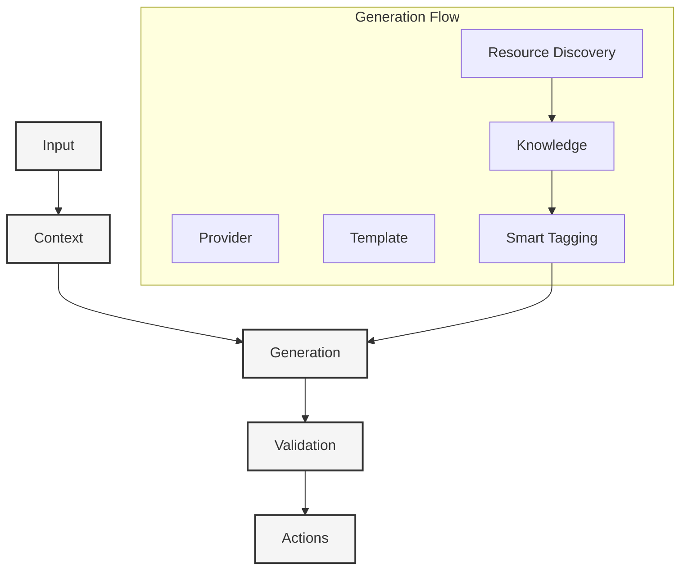

# Context Generation Workflow

#context #generation #workflow #pipeline #dynamic-resources

Related Documents:
- [[02-ai-integration|AI Integration]] - Provider system and core AI functionality
- [[20-llm-pipelines|LLM Pipelines]] - Template system and generation
- [[13-smart-context-handling|Smart Context]] - Knowledge graph integration
- [[21-database-schema|Database Schema]] - Context storage
- [[22-action-execution|Action Execution]] - Action generation
- [[08-notification-system|Notification System]] - Progress updates

## Core Architecture



## Core Components

### 1. Resource Discovery
```typescript
class ResourceDiscovery {
  constructor(
    private provider: AIProvider,
    private knowledge: KnowledgeGraph,
    private notifications: NotificationService
  ) {}

  async discover(context: Context): Promise<Resource[]> {
    // Start discovery
    await this.notifications.start('resource-discovery')
    
    try {
      // Analyze context
      const patterns = await this.analyzeContext(context)
      
      // Discover resources
      const resources = await this.findResources(patterns)
      
      // Process and tag
      const processed = await this.processResources(resources)
      const tagged = await this.tagResources(processed)
      
      // Update knowledge graph
      await this.knowledge.addResources(tagged)
      
      // Notify completion
      await this.notifications.complete('resource-discovery')
      
      return tagged
    } catch (error) {
      await this.notifications.error('resource-discovery', error)
      throw error
    }
  }

  private async analyzeContext(context: Context): Promise<Pattern[]> {
    // Analyze imports, dependencies, code patterns
    const imports = await this.extractImports(context)
    const deps = await this.analyzeDependencies(context)
    const patterns = await this.detectPatterns(context)
    
    return [...imports, ...deps, ...patterns]
  }

  private async findResources(patterns: Pattern[]): Promise<Resource[]> {
    // Search for relevant resources
    const discovered = await Promise.all(
      patterns.map(pattern => this.searchResources(pattern))
    )
    
    return discovered.flat()
  }

  private async processResources(resources: Resource[]): Promise<Resource[]> {
    // Process and enrich resources
    return Promise.all(
      resources.map(async resource => {
        const processed = await this.processContent(resource)
        const enriched = await this.enrichMetadata(processed)
        return enriched
      })
    )
  }

  private async tagResources(resources: Resource[]): Promise<Resource[]> {
    // Generate and apply smart tags
    return Promise.all(
      resources.map(async resource => {
        const tags = await this.generateTags(resource)
        return { ...resource, tags }
      })
    )
  }
}
```

### 2. Generation Pipeline
```typescript
class ContextGenerator {
  constructor(
    private provider: AIProvider,
    private pipeline: PipelineEngine,
    private discovery: ResourceDiscovery,
    private notifications: NotificationService
  ) {}
  
  async generate(input: ContextInput): Promise<Context> {
    // Initialize generation
    await this.notifications.start('context-generation')
    
    try {
      // Load template
      const template = await this.pipeline.loadTemplate('context')
      
      // Generate context
      const result = await this.pipeline.process(template, input)
      
      // Parse and validate
      const context = await this.parseContext(result.response)
      await this.validateContext(context)
      
      // Discover resources
      const resources = await this.discovery.discover(context)
      context.resources = resources
      
      // Generate actions
      const actions = await this.generateActions(context)
      
      // Notify completion
      await this.notifications.complete('context-generation')
      
      return { ...context, actions }
    } catch (error) {
      await this.notifications.error('context-generation', error)
      throw error
    }
  }
}
```

## Integration Points

### 1. Provider Integration
```typescript
// See [[02-ai-integration]]
interface ProviderConfig {
  id: string
  model: string
  temperature: number
  maxTokens?: number
}

class ProviderManager {
  constructor(private registry: ProviderRegistry) {}
  
  async getProvider(config: ProviderConfig): Promise<AIProvider> {
    const provider = this.registry.getProvider(config.id)
    await provider.initialize(config)
    return provider
  }
}
```

### 2. Pipeline Integration
```typescript
// See [[20-llm-pipelines]]
class ContextPipeline extends PipelineEngine {
  async generateContext(input: ContextInput): Promise<Context> {
    // Load context template
    const template = await this.loadTemplate('context-generation')
    
    // Process with provider
    const result = await this.process(template, input)
    
    // Parse and enrich
    const context = await this.parseContext(result.response)
    return this.enrichContext(context)
  }
}
```

### 3. Notification Integration
```typescript
// See [[08-notification-system]]
class NotificationService {
  async start(type: string): Promise<void> {
    await this.notify({
      type: 'context-generation-started',
      status: 'in-progress'
    })
  }
  
  async complete(type: string): Promise<void> {
    await this.notify({
      type: 'context-generation-completed',
      status: 'success'
    })
  }
  
  async error(type: string, error: Error): Promise<void> {
    await this.notify({
      type: 'context-generation-failed',
      status: 'error',
      error: error.message
    })
  }
}
```

## Best Practices

### 1. Input Validation
- Validate requirements
- Check stack compatibility
- Verify constraints
- Sanitize input
- Validate resource access

### 2. Generation Flow
- Handle errors gracefully
- Stream progress updates
- Monitor performance
- Cache results
- Track resource discovery

### 3. Provider Management
- Handle provider errors
- Support fallbacks
- Optimize tokens
- Track usage
- Monitor resource quotas

### 4. Output Quality
- Validate context
- Check actions
- Test integrations
- Monitor results
- Verify resource relevance

## Future Enhancements

### 1. Advanced Features
- Multi-provider generation
- Parallel processing
- Smart caching
- Quality metrics
- Advanced resource discovery
- Intelligent tagging
- Usage analytics

### 2. Integration
- More providers
- Custom validators
- Analytics tools
- Monitoring systems

### 3. Optimization
- Smart routing
- Cost management
- Performance tuning
- Resource optimization 