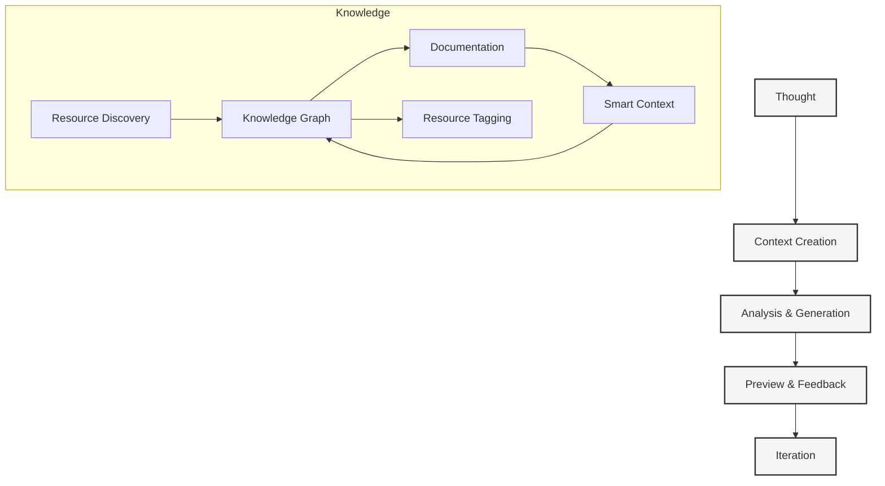

# Context Management System

#context #management #workflow #system #dynamic-resources

Related Documents:
- [[20-llm-pipelines|LLM Pipelines]] - Template selection and generation
- [[21-database-schema|Database Schema]] - Data storage and relationships
- [[22-action-execution|Action Execution]] - Action execution system
- [[19-ergonomics|Ergonomics]] - Core philosophy
- [[13-smart-context-handling|Smart Context]] - Knowledge graph integration

## Core Philosophy



## Context Architecture

### 1. Core Types
```typescript
interface Context {
  // Identity
  id: string
  type: 'project' | 'feature' | 'documentation'
  status: 'setup' | 'active' | 'completed'

  // Flow Control
  flow: {
    resistance: "none"
    friction: "minimal"
    direction: "natural"
  }

  // Content
  content: {
    title: string
    description: string
    requirements: string[]
    constraints: string[]
  }

  // Technical
  technical: {
    stack: TechStack
    features: string[]
    architecture: string[]
    integrations: string[]
  }

  // Resources
  resources: {
    discovered: DiscoveredResource[]
    manual: ManualResource[]
    suggested: SuggestedResource[]
    tags: ResourceTag[]
    usage: ResourceUsage
  }

  // Knowledge
  knowledge: {
    documentation: Document[]
    references: Reference[]
    links: Link[]
    graph: KnowledgeGraph
  }

  // Progress
  pipeline: {
    stage: PipelineStage
    progress: number
    actions: Action[]
  }

  // Preview
  preview: {
    url?: string
    deploymentId?: string
    status: PreviewStatus
  }
}

interface Resource {
  id: string
  type: ResourceType
  source: string
  metadata: {
    title: string
    description: string
    tags: string[]
    lastUpdated: Date
  }
  content: {
    raw: string
    processed: ProcessedContent
    embeddings: Vector[]
  }
  usage: {
    addedAt: Date
    lastUsed: Date
    useCount: number
    relevanceScore: number
  }
  relationships: {
    dependencies: string[]
    relatedResources: string[]
    contexts: string[]
  }
}

enum ResourceType {
  DOCUMENTATION = 'documentation',
  REPOSITORY = 'repository',
  API_REFERENCE = 'api_reference',
  WEBSITE = 'website',
  COMMUNITY = 'community',
  USER_ANNOTATION = 'user_annotation'
}

interface TechStack {
  framework: 'next' | 'remix' | 'astro'
  language: 'typescript' | 'javascript'
  styling: 'tailwind' | 'styled-components' | 'css-modules'
  state: 'zustand' | 'redux' | 'jotai'
  database: 'prisma' | 'drizzle' | 'mongoose'
}

type PipelineStage = 
  | 'setup'
  | 'analysis'
  | 'generation'
  | 'preview'
  | 'feedback'
  | 'iteration'
```

### 2. Knowledge Management
```typescript
interface KnowledgeGraph {
  // Graph structure
  nodes: {
    id: string
    type: 'code' | 'doc' | 'architecture' | 'resource'
    content: string
    metadata: Record<string, any>
  }[]
  
  edges: {
    source: string
    target: string
    type: string
    metadata: Record<string, any>
  }[]

  // Resource Management
  resources: {
    discover(): Promise<Resource[]>
    suggest(): Promise<Resource[]>
    tag(resource: Resource, tags: string[]): Promise<void>
    track(resource: Resource): Promise<void>
  }

  // Operations
  operations: {
    addNode(node: Node): void
    addEdge(edge: Edge): void
    findReferences(nodeId: string): Reference[]
    generateEmbeddings(): Promise<void>
  }
}

interface Document {
  // Structure
  title: string
  content: string
  format: 'markdown' | 'mdx' | 'notebook'
  
  // References
  references: {
    code: CodeReference[]
    docs: DocReference[]
    external: ExternalReference[]
  }

  // Export
  export: {
    toObsidian(): string
    toNotion(): Record<string, any>
    toMarkdown(): string
  }
}
```

### 3. Pipeline Management
```typescript
interface Pipeline {
  // Stages
  stages: {
    setup: SetupStage
    analysis: AnalysisStage
    generation: GenerationStage
    preview: PreviewStage
    feedback: FeedbackStage
    iteration: IterationStage
  }

  // Flow
  flow: {
    current: PipelineStage
    history: PipelineStage[]
    next(): Promise<void>
    previous(): Promise<void>
  }

  // Integration
  integration: {
    llm: LLMPipeline
    actions: ActionSystem
    preview: PreviewSystem
  }
}

interface Stage {
  status: 'pending' | 'active' | 'completed'
  progress: number
  actions: Action[]
  
  start(): Promise<void>
  complete(): Promise<void>
  rollback(): Promise<void>
}
```

## Implementation Flow

### 1. Context Creation
```typescript
class ContextManager {
  // Creation
  async createContext(input: ContextInput): Promise<Context>
  async importFromRepository(repo: string): Promise<Context>
  
  // Management
  async updateContext(id: string, updates: Partial<Context>): Promise<Context>
  async archiveContext(id: string): Promise<void>
  
  // Resource Management
  async discoverResources(id: string): Promise<Resource[]>
  async suggestResources(id: string): Promise<Resource[]>
  async tagResource(id: string, resource: Resource, tags: string[]): Promise<void>
  async trackResourceUsage(id: string, resource: Resource): Promise<void>
  
  // Knowledge
  async generateDocumentation(id: string): Promise<Document[]>
  async updateKnowledgeGraph(id: string): Promise<void>
}
```

### 2. Pipeline Execution
```typescript
class PipelineManager {
  // Execution
  async startPipeline(contextId: string): Promise<void>
  async pausePipeline(contextId: string): Promise<void>
  async resumePipeline(contextId: string): Promise<void>
  
  // Monitoring
  async getStatus(contextId: string): Promise<PipelineStatus>
  async getLogs(contextId: string): Promise<PipelineLog[]>
  
  // Control
  async skipStage(contextId: string, stage: PipelineStage): Promise<void>
  async retryStage(contextId: string, stage: PipelineStage): Promise<void>
}
```

### 3. Knowledge Integration
```typescript
class KnowledgeManager {
  // Graph
  async buildGraph(contextId: string): Promise<KnowledgeGraph>
  async updateGraph(contextId: string): Promise<void>
  
  // Export
  async exportToObsidian(contextId: string): Promise<void>
  async exportToNotion(contextId: string): Promise<void>
  
  // Search
  async searchKnowledge(query: string): Promise<SearchResult[]>
  async findReferences(nodeId: string): Promise<Reference[]>
}
```

## Best Practices

### 1. Context Management
- Maintain atomic contexts
- Preserve context history
- Enable easy navigation
- Support context sharing
- Automate resource discovery
- Enable flexible tagging
- Track resource usage

### 2. Knowledge Organization
- Use consistent formatting
- Maintain bidirectional links
- Keep documentation current
- Enable easy discovery
- Automate resource indexing
- Support smart suggestions
- Monitor resource relevance

### 3. Pipeline Execution
- Provide clear progress
- Enable stage skipping
- Support rollbacks
- Maintain audit logs

## Future Considerations

### 1. Advanced Features
- Multi-context relationships
- Custom pipeline stages
- Advanced knowledge graphs
- AI-powered insights
- Dynamic resource discovery
- Smart tagging system
- Usage-based suggestions

### 2. Integration Options
- IDE plugins
- CI/CD integration
- Team collaboration
- Analytics dashboard

### 3. Knowledge Evolution
- Automated updates
- Learning patterns
- Context suggestions
- Smart references 