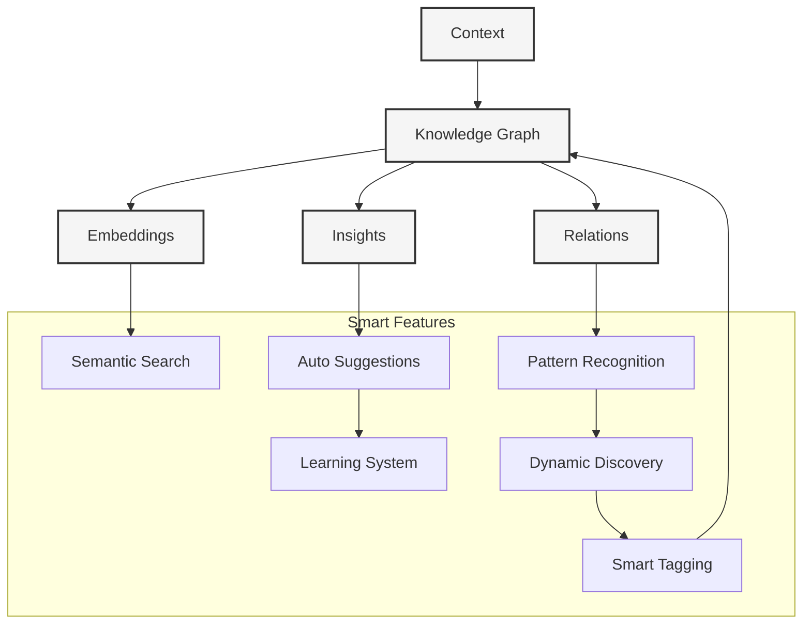

# Smart Context Handling

#context #knowledge-graph #intelligence #dynamic-resources

Related Documents:
- [[05-context-management|Context Management]] - Core context system
- [[07-context-generation-workflow|Generation Workflow]] - Generation pipeline
- [[20-llm-pipelines|LLM Pipelines]] - Template generation
- [[09-package-integrations|Package Integrations]] - Integration points

## Core Architecture



## Knowledge Graph

### 1. Core Types
```typescript
interface KnowledgeGraph {
  // Nodes
  nodes: Map<string, Node>
  edges: Map<string, Edge>
  
  // Resources
  resources: Map<string, Resource>
  tags: Map<string, Tag>
  
  // Metadata
  metadata: {
    version: string
    lastUpdated: Date
    stats: GraphStats
  }
}

interface Node {
  id: string
  type: NodeType
  content: string
  metadata: NodeMetadata
  resources: Resource[]
  tags: Tag[]
}

interface Resource {
  id: string
  type: ResourceType
  source: string
  content: string
  metadata: ResourceMetadata
  embeddings: Vector[]
  usage: ResourceUsage
  relationships: ResourceRelationships
}

interface Tag {
  id: string
  name: string
  type: TagType
  metadata: TagMetadata
  resources: string[] // Resource IDs
  confidence: number
  created: {
    timestamp: Date
    method: 'auto' | 'manual'
    source: string
  }
}
```

### 2. Smart Features

```typescript
class SmartContext {
  constructor(
    private graph: KnowledgeGraph,
    private discovery: ResourceDiscovery,
    private learning: LearningSystem
  ) {}

  // Dynamic Discovery
  async discoverResources(context: Context): Promise<Resource[]> {
    // Analyze context patterns
    const patterns = await this.discovery.analyzePatterns(context)
    
    // Find relevant resources
    const resources = await this.discovery.findResources(patterns)
    
    // Process and enrich
    return this.discovery.processResources(resources)
  }

  // Smart Tagging
  async generateTags(resource: Resource): Promise<Tag[]> {
    // Extract features
    const features = await this.extractFeatures(resource)
    
    // Generate tags
    const tags = await this.learning.suggestTags(features)
    
    // Validate and filter
    return this.validateTags(tags)
  }

  // Resource Management
  async trackUsage(resource: Resource): Promise<void> {
    // Update usage stats
    await this.graph.updateUsage(resource.id)
    
    // Learn from usage
    await this.learning.learnFromUsage(resource)
    
    // Update relationships
    await this.updateRelationships(resource)
  }

  // Smart Suggestions
  async suggestResources(context: Context): Promise<Resource[]> {
    // Get context features
    const features = await this.getContextFeatures(context)
    
    // Find similar resources
    const similar = await this.findSimilarResources(features)
    
    // Rank by relevance
    return this.rankResources(similar)
  }
}

class ResourceDiscovery {
  async analyzePatterns(context: Context): Promise<Pattern[]> {
    return [
      ...await this.analyzeCode(context),
      ...await this.analyzeDependencies(context),
      ...await this.analyzeDocumentation(context)
    ]
  }

  async findResources(patterns: Pattern[]): Promise<Resource[]> {
    const discovered = await Promise.all(
      patterns.map(pattern => this.searchResources(pattern))
    )
    return this.deduplicateResources(discovered.flat())
  }

  async processResources(resources: Resource[]): Promise<Resource[]> {
    return Promise.all(
      resources.map(async resource => {
        const processed = await this.processContent(resource)
        const enriched = await this.enrichMetadata(processed)
        const embedded = await this.generateEmbeddings(enriched)
        return embedded
      })
    )
  }
}

class LearningSystem {
  async learnFromUsage(resource: Resource): Promise<void> {
    // Update usage patterns
    await this.updatePatterns(resource)
    
    // Adjust relevance scores
    await this.adjustRelevance(resource)
    
    // Learn relationships
    await this.learnRelationships(resource)
  }

  async suggestTags(features: Feature[]): Promise<Tag[]> {
    // Generate candidate tags
    const candidates = await this.generateCandidates(features)
    
    // Score candidates
    const scored = await this.scoreCandidates(candidates)
    
    // Filter and rank
    return this.rankTags(scored)
  }
}
```

## Best Practices

### 1. Resource Management
- Enable automatic discovery
- Support manual additions
- Track usage patterns
- Monitor relevance
- Clean stale resources

### 2. Tag Management
- Use consistent naming
- Support hierarchies
- Allow custom tags
- Track confidence
- Enable bulk updates

### 3. Learning System
- Learn from usage
- Adapt to patterns
- Improve suggestions
- Handle edge cases
- Maintain quality

### 4. Performance
- Optimize searches
- Cache results
- Batch operations
- Monitor memory
- Scale horizontally

## Future Considerations

### 1. Advanced Features
- Multi-modal embeddings
- Graph neural networks
- Active learning
- Federated learning
- Advanced pattern recognition
- Intelligent resource routing
- Automated cleanup

### 2. Integration
- External knowledge bases
- Expert systems
- Machine learning models
- Analytics platforms
- Version control systems
- Documentation platforms
- Team collaboration tools

### 3. Optimization
- Query optimization
- Memory management
- Distributed processing
- Real-time updates
- Resource prioritization
- Smart caching strategies
- Load balancing
``` 
</rewritten_file>