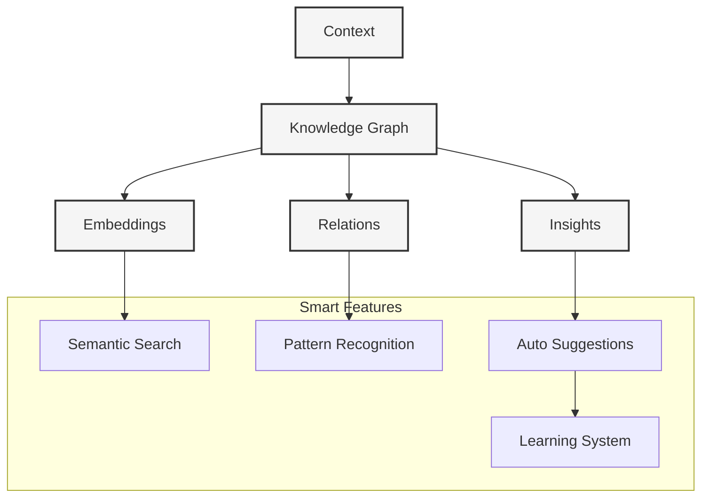

# Smart Context Handling

#context #knowledge-graph #intelligence

Related Documents:
- [[05-context-management|Context Management]] - Core context system
- [[07-context-generation-workflow|Generation Workflow]] - Generation pipeline
- [[20-llm-pipelines|LLM Pipelines]] - Template generation

## Core Architecture



## Knowledge Graph

### 1. Core Types
```typescript
interface KnowledgeGraph {
  // Nodes
  nodes: Map<string, Node>
  edges: Map<string, Edge>
  
  // Metadata
  metadata: {
    version: string
    lastUpdated: Date
    stats: GraphStats
  }
}

interface Node {
  // Identity
  id: string
  type: NodeType
  data: any
  
  // Embeddings
  embedding: number[]
  similarity: number
  
  // Relations
  edges: Edge[]
  neighbors: Node[]
}

interface Edge {
  // Identity
  id: string
  type: EdgeType
  weight: number
  
  // Nodes
  source: Node
  target: Node
  
  // Metadata
  metadata: Record<string, any>
}
```

### 2. Graph Manager
```typescript
class GraphManager {
  // Graph Operations
  async addNode(node: Node): Promise<void>
  async addEdge(edge: Edge): Promise<void>
  async removeNode(nodeId: string): Promise<void>
  async removeEdge(edgeId: string): Promise<void>
  
  // Queries
  async findNode(id: string): Promise<Node>
  async findEdge(id: string): Promise<Edge>
  async findPath(source: Node, target: Node): Promise<Node[]>
  
  // Analytics
  async analyze(): Promise<Analysis>
  async visualize(): Promise<Visualization>
}
```

### 3. Embedding System
```typescript
class EmbeddingSystem {
  // Generation
  async generateEmbedding(data: any): Promise<number[]>
  async updateEmbedding(node: Node): Promise<void>
  
  // Search
  async findSimilar(embedding: number[]): Promise<Node[]>
  async rankSimilarity(nodes: Node[]): Promise<Node[]>
  
  // Clustering
  async cluster(nodes: Node[]): Promise<Cluster[]>
  async findPatterns(clusters: Cluster[]): Promise<Pattern[]>
}
```

## Smart Features

### 1. Semantic Search
```typescript
class SemanticSearch {
  // Search
  async search(query: string): Promise<SearchResult[]>
  async filter(results: SearchResult[], criteria: Criteria): Promise<SearchResult[]>
  
  // Ranking
  async rank(results: SearchResult[]): Promise<SearchResult[]>
  async score(result: SearchResult): Promise<number>
  
  // Suggestions
  async suggest(query: string): Promise<string[]>
  async autocomplete(partial: string): Promise<string[]>
}
```

### 2. Pattern Recognition
```typescript
class PatternRecognition {
  // Analysis
  async analyze(data: any[]): Promise<Pattern[]>
  async validate(pattern: Pattern): Promise<boolean>
  
  // Learning
  async learn(patterns: Pattern[]): Promise<void>
  async predict(input: any): Promise<Prediction[]>
  
  // Optimization
  async optimize(pattern: Pattern): Promise<Pattern>
  async refine(predictions: Prediction[]): Promise<Prediction[]>
}
```

### 3. Auto Suggestions
```typescript
class AutoSuggestions {
  // Generation
  async generate(context: Context): Promise<Suggestion[]>
  async validate(suggestion: Suggestion): Promise<boolean>
  
  // Learning
  async learn(feedback: Feedback): Promise<void>
  async adapt(preferences: Preferences): Promise<void>
  
  // Personalization
  async personalize(user: User): Promise<void>
  async recommend(context: Context): Promise<Recommendation[]>
}
```

## Best Practices

### 1. Knowledge Management
- Implement versioning
- Enable backups
- Use incremental updates
- Monitor graph health

### 2. Performance
- Optimize embeddings
- Cache frequent queries
- Use batch processing
- Monitor latency

### 3. Quality
- Validate data
- Clean inputs
- Handle edge cases
- Monitor accuracy

## Future Considerations

### 1. Advanced Features
- Multi-modal embeddings
- Graph neural networks
- Active learning
- Federated learning

### 2. Integration
- External knowledge bases
- Expert systems
- Machine learning models
- Analytics platforms

### 3. Optimization
- Query optimization
- Memory management
- Distributed processing
- Real-time updates 