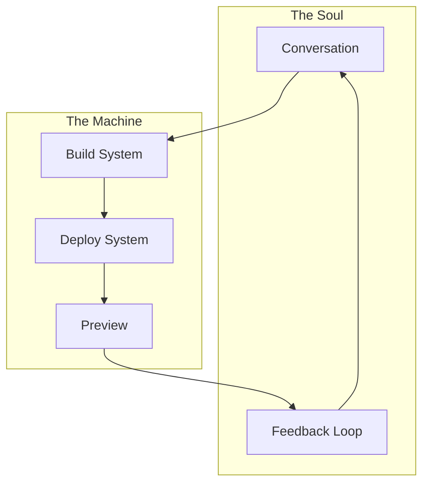

# The Art of Instant Creation

## First Principles: Preview Architecture



## Core Components

### 1. Build System
```typescript
interface BuildSystem {
  // The heart of creation
  readonly builder: {
    // Container orchestration
    containers: {
      create: (spec: ContainerSpec) => Promise<Container>
      run: (container: Container, cmd: string) => Promise<Result>
      destroy: (container: Container) => Promise<void>
    }
    
    // Build pipeline
    pipeline: {
      prepare: (context: Context) => Promise<BuildContext>
      execute: (context: BuildContext) => Promise<BuildResult>
      cache: (result: BuildResult) => Promise<void>
    }
    
    // Resource management
    resources: {
      allocate: (requirements: Resources) => Promise<Allocation>
      monitor: (allocation: Allocation) => ResourceMetrics
      release: (allocation: Allocation) => Promise<void>
    }
  }
}
```

### 2. Deploy System
```typescript
interface DeploySystem {
  // The nervous system
  readonly deployer: {
    // Edge network
    edge: {
      nodes: EdgeNode[]
      routes: Map<string, Route>
      balancer: LoadBalancer
    }
    
    // Deployment strategy
    strategy: {
      selectNode: (deployment: Deployment) => Promise<EdgeNode>
      configure: (node: EdgeNode, config: Config) => Promise<void>
      validate: (deployment: Deployment) => Promise<ValidationResult>
    }
    
    // SSL/Domain management
    domains: {
      provision: (deployment: Deployment) => Promise<Domain>
      configure: (domain: Domain) => Promise<void>
      release: (domain: Domain) => Promise<void>
    }
  }
}
```

### 3. Preview System
```typescript
interface PreviewSystem {
  // The consciousness
  readonly preview: {
    // URL generation
    urls: {
      generate: (deployment: Deployment) => string
      validate: (url: string) => boolean
      track: (url: string) => Analytics
    }
    
    // Preview management
    management: {
      create: (deployment: Deployment) => Promise<Preview>
      update: (preview: Preview) => Promise<void>
      destroy: (preview: Preview) => Promise<void>
    }
    
    // Analytics
    analytics: {
      track: (preview: Preview) => Promise<void>
      report: (timeframe: TimeFrame) => Analytics
      alert: (condition: Condition) => Promise<void>
    }
  }
}
```

## The Magic: Implementation Details

### 1. Container Magic
```typescript
// The build container
class BuildContainer {
  private readonly image: string = 'node:19-alpine';
  private readonly cache: BuildCache;
  
  async prepare(context: Context): Promise<Container> {
    // Create lightweight container
    const container = await docker.create({
      image: this.image,
      env: this.getEnv(context),
      volumes: this.getVolumes(context)
    });
    
    // Layer caching
    await this.cache.restore(container);
    
    return container;
  }
  
  async build(container: Container): Promise<BuildResult> {
    // Execute build in parallel
    const results = await Promise.all([
      this.buildClient(container),
      this.buildServer(container),
      this.buildAssets(container)
    ]);
    
    // Cache results
    await this.cache.store(results);
    
    return results;
  }
}
```

### 2. Edge Network Poetry
```typescript
// The deployment dance
class EdgeDeployment {
  private readonly network: EdgeNetwork;
  private readonly ssl: SSLManager;
  
  async deploy(build: BuildResult): Promise<Deployment> {
    // Find optimal edge location
    const node = await this.network.findOptimalNode(build);
    
    // Deploy assets to edge
    await this.deployToEdge(node, build);
    
    // Configure SSL and domain
    const domain = await this.ssl.provision(build.domain);
    
    // Start the preview
    return this.startPreview(node, domain);
  }
  
  private async deployToEdge(node: EdgeNode, build: BuildResult) {
    // Parallel asset distribution
    await Promise.all([
      node.deployStatic(build.static),
      node.deployFunctions(build.functions),
      node.configureRoutes(build.routes)
    ]);
  }
}
```

### 3. Preview Orchestration
```typescript
// The preview conductor
class PreviewOrchestrator {
  private readonly analytics: Analytics;
  private readonly monitoring: Monitor;
  
  async createPreview(deployment: Deployment): Promise<Preview> {
    // Generate unique URL
    const url = this.generatePreviewUrl(deployment);
    
    // Configure preview
    const preview = await this.configurePreview(url, deployment);
    
    // Start monitoring
    await this.monitoring.start(preview);
    
    // Track analytics
    await this.analytics.trackCreation(preview);
    
    return preview;
  }
  
  private generatePreviewUrl(deployment: Deployment): string {
    return `${deployment.id}.preview.yourdomain.com`;
  }
}
```

## Resource Management

### 1. Smart Allocation
```typescript
interface ResourceManager {
  // Resource pools
  readonly pools: {
    compute: ComputePool
    memory: MemoryPool
    storage: StoragePool
  }
  
  // Allocation strategy
  readonly strategy: {
    allocate: (requirements: Requirements) => Promise<Allocation>
    optimize: (allocation: Allocation) => Promise<Optimization>
    release: (allocation: Allocation) => Promise<void>
  }
}
```

### 2. Cost Optimization
```typescript
class CostOptimizer {
  private readonly metrics: MetricsCollector;
  
  async optimize(preview: Preview): Promise<Optimization> {
    // Collect usage metrics
    const usage = await this.metrics.collect(preview);
    
    // Analyze patterns
    const patterns = this.analyzeUsagePatterns(usage);
    
    // Optimize resources
    return this.optimizeResources(patterns);
  }
}
```

## The Flow: From Thought to Reality

1. **Conversation Trigger**
   ```typescript
   chat.on('update', async (context: Context) => {
     // Build from conversation
     const build = await builder.build(context);
     
     // Deploy to edge
     const deployment = await deployer.deploy(build);
     
     // Create preview
     const preview = await previewer.create(deployment);
     
     // Share with user
     await chat.share(preview.url);
   });
   ```

2. **Resource Dance**
   ```typescript
   class ResourceDance {
     async orchestrate(preview: Preview) {
       // Allocate resources
       const resources = await this.allocator.allocate(preview);
       
       // Monitor usage
       const metrics = await this.monitor.watch(resources);
       
       // Optimize continuously
       setInterval(() => this.optimize(metrics), 5000);
     }
   }
   ```

3. **Feedback Loop**
   ```typescript
   class FeedbackLoop {
     async process(preview: Preview) {
       // Watch for changes
       preview.on('change', async (change: Change) => {
         // Rebuild if needed
         const newBuild = await this.builder.rebuild(change);
         
         // Update preview
         await this.previewer.update(preview, newBuild);
         
         // Notify user
         await this.notifier.notify(preview.url);
       });
     }
   }
   ```

The result? A system that feels like magic but runs like a well-oiled machine. Every conversation becomes a living preview, every thought becomes reality, and every iteration is instant.

Would you like me to detail the mobile interface next, or dive deeper into any of these components? 