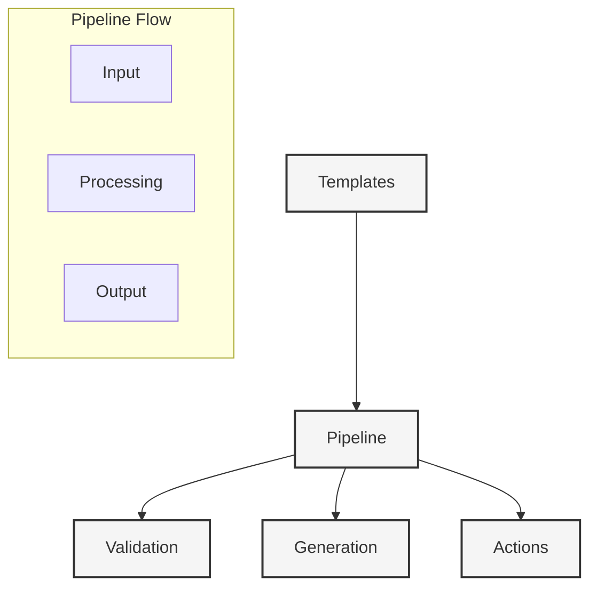

# LLM Pipelines

#llm #pipelines #templates #generation

Related Documents:
- [[02-ai-integration|AI Integration]] - Provider system and core AI functionality
- [[07-context-generation-workflow|Context Generation]] - Generation pipeline integration
- [[13-smart-context-handling|Smart Context]] - Knowledge graph and embeddings
- [[21-database-schema|Database Schema]] - Pipeline data storage
- [[22-action-execution|Action Execution]] - Action generation and validation

## Core Architecture



## Template System

### 1. Core Types
```typescript
interface Template {
  id: string
  name: string
  description: string
  version: string
  
  // Template content
  content: string
  variables: Variable[]
  
  // Validation
  schema: z.ZodSchema
  examples: Example[]
  
  // Provider settings
  providerConfig?: {
    id: string
    model: string
    temperature: number
  }
}

interface Variable {
  name: string
  type: 'string' | 'number' | 'boolean' | 'object'
  description: string
  required: boolean
  default?: any
}

interface Example {
  input: Record<string, any>
  expected: string
}
```

### 2. Pipeline Engine
```typescript
class PipelineEngine {
  constructor(
    private templateEngine: TemplateEngine,
    private provider: AIProvider
  ) {}
  
  async process(
    template: Template,
    input: Record<string, any>
  ): Promise<PipelineResult> {
    // Validate input
    await this.validateInput(template, input)
    
    // Process template
    const prompt = await this.templateEngine.render(template, input)
    
    // Generate with provider
    const response = await this.provider.generateText(prompt)
    
    // Validate output
    await this.validateOutput(template, response)
    
    return { response, metadata: this.collectMetadata() }
  }
}
```

## Integration Points

### 1. Context Generation
```typescript
// See [[07-context-generation-workflow]]
class ContextPipeline extends PipelineEngine {
  async generateContext(input: ContextInput): Promise<Context> {
    const template = await this.loadTemplate('context-generation')
    const result = await this.process(template, input)
    return this.parseContext(result.response)
  }
}
```

### 2. Action Generation
```typescript
// See [[22-action-execution]]
class ActionPipeline extends PipelineEngine {
  async generateActions(context: Context): Promise<Action[]> {
    const template = await this.loadTemplate('action-generation')
    const result = await this.process(template, { context })
    return this.parseActions(result.response)
  }
}
```

### 3. Knowledge Integration
```typescript
// See [[13-smart-context-handling]]
class KnowledgePipeline extends PipelineEngine {
  async enrichContext(context: Context): Promise<Context> {
    const template = await this.loadTemplate('knowledge-enrichment')
    const result = await this.process(template, { context })
    return this.mergeKnowledge(context, result.response)
  }
}
```

## Best Practices

### 1. Template Design
- Keep templates focused
- Use clear variable names
- Include examples
- Version templates

### 2. Pipeline Management
- Handle errors gracefully
- Log pipeline steps
- Monitor performance
- Cache results

### 3. Validation
- Validate inputs
- Check outputs
- Test examples
- Monitor quality

### 4. Provider Integration
- Handle provider errors
- Support streaming
- Optimize tokens
- Track usage

## Future Enhancements

### 1. Advanced Features
- Template versioning
- Pipeline composition
- Parallel processing
- Result caching

### 2. Integration
- More providers
- Custom validators
- Analytics tools
- Monitoring systems

### 3. Optimization
- Smart routing
- Cost management
- Performance tuning
- Resource optimization 