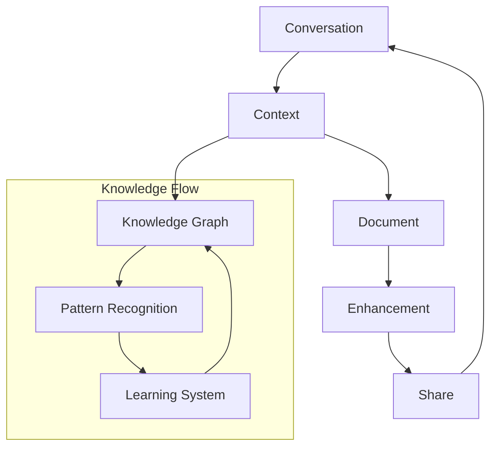

# Living Documentation System

#documentation #workflow #context #knowledge

Related Documents:
- [[05-context-management|Context Management]] - Core context system
- [[07-context-generation-workflow|Generation Workflow]] - Generation pipeline
- [[13-smart-context-handling|Smart Context]] - Knowledge graph integration

## Core Philosophy

Documentation isn't an afterthought - it's a living, breathing entity that evolves naturally with your code. Every conversation, decision, and context exploration automatically shapes itself into structured documentation.



## Core Architecture

### 1. Knowledge Flow
```typescript
interface KnowledgeFlow {
  // Core state management
  state: {
    contextDepth: number        // Understanding depth
    flowState: FlowState        // Documentation flow
    relevance: number          // Context relevance
    intention: DocIntent       // Documentation intent
  }

  // Documentation systems
  documentation: {
    conversation: ConversationCapture  // Dialogue tracking
    context: ContextExtraction        // Meaning extraction
    structure: DocumentStructure      // Organization
  }

  // Transformation systems
  transformation: {
    visual: VisualTransform          // Visual docs
    semantic: SemanticTransform      // Meaning transform
    temporal: TemporalTransform      // Evolution
  }
}
```

### 2. Document Intelligence
```typescript
interface DocumentIntelligence {
  // Analysis systems
  analysis: {
    conversation: DialogueAnalysis   // Conversation patterns
    context: ContextAnalysis        // Context patterns
    structure: StructureAnalysis    // Document patterns
  }

  // Adaptation systems
  adaptation: {
    format: FormatAdapter           // Output format
    style: StyleAdapter            // Presentation
    depth: DepthAdapter           // Complexity
  }

  // Learning systems
  learning: {
    patterns: PatternLearning
    evolution: DocEvolution
    optimization: ContentOpt
  }
}
```

## Core Features

### 1. Context Capture
- Smart conversation analysis
- Decision tracking
- Code change linking
- Knowledge graph integration

### 2. Auto-Organization
- Topic clustering
- Hierarchy generation
- Related content linking
- Pattern recognition

### 3. Doc Generation
- Mintlify-optimized output
- Beautiful code examples
- Interactive previews
- Real-time updates

### 4. Living Updates
- Real-time sync
- Version tracking
- Change highlighting
- Usage analytics

## Implementation

### Phase 1: Foundation
- Conversation capture system
- Context extraction engine
- Document structure generator
- Transformation pipeline
- Basic intelligence features

### Phase 2: Enhancement
- Advanced pattern recognition
- Smart adaptation system
- Deep learning integration
- Multi-format support
- Team collaboration features

### Phase 3: Evolution
- Neural documentation features
- Quantum context handling
- Universal knowledge sharing
- Reality synthesis integration

## Best Practices

### 1. Documentation Flow
- Let documentation emerge naturally
- Focus on knowledge capture
- Enable continuous updates
- Preserve context always

### 2. Content Quality
- Maintain clear structure
- Ensure code alignment
- Track document health
- Monitor usage patterns

### 3. Team Integration
- Enable easy sharing
- Support collaboration
- Track contributions
- Measure impact

## Future Vision

### 1. Advanced Features
- Direct knowledge transfer
- Pattern synthesis
- Learning optimization
- Context harmonization

### 2. Integration Points
- Universal knowledge bases
- Team workspaces
- Distribution networks
- Reality augmentation

### 3. Evolution Path
- Self-improving docs
- Context-aware updates
- Team synchronization
- Knowledge federation
``` 
</rewritten_file>