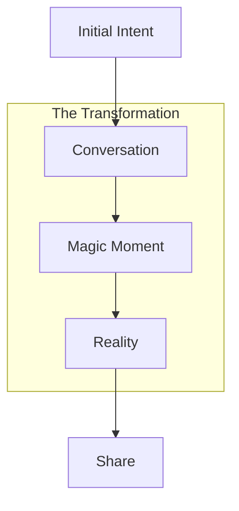

# The Magic Moment: When Software Creates Itself

## The Journey



## The Elements

### 1. Intent (Air)
The breath of creation.
The spark of possibility.
The moment before form.

```typescript
interface Intent {
  // The essence
  essence: {
    vision: string
    energy: CreativeForce
    potential: Infinite
  }
}
```

### 2. Conversation (Fire)
The forge of creation.
Where ideas ignite.
Where reality bends.

```typescript
interface Conversation {
  // The exploration
  readonly dialogue: {
    // Understanding
    understanding: {
      vision: string
      requirements: string[]
      constraints: string[]
    }
    
    // Clarification
    clarification: {
      questions: Question[]
      suggestions: Suggestion[]
      refinements: Refinement[]
    }
    
    // Progress
    progress: {
      status: Status
      nextSteps: Step[]
      preview: Preview
    }
  }
}
```

### 3. Manifestation (Earth)
The crystallization of thought.
The birth of form.
The emergence of reality.

```typescript
interface Manifestation {
  // The revelation
  readonly revelation: {
    // The build
    build: {
      start: Timestamp
      progress: number
      preview: PreviewURL
    }
    
    // The experience
    experience: {
      loading: LoadingState
      preview: PreviewState
      sharing: SharingState
    }
    
    // The reaction
    reaction: {
      surprise: boolean
      delight: boolean
      understanding: boolean
    }
  }
}
```

## The Implementation

### 1. Progressive Revelation
```typescript
// The build sequence
class BuildSequence {
  private readonly animator: Animator;
  private readonly preview: Preview;
  
  async reveal(): Promise<void> {
    // Start with conversation
    await this.animator.typeMessage(
      "I understand what you want to build. Let me create that for you..."
    );
    
    // Show progress
    await this.animator.showProgress({
      steps: [
        "Creating structure...",
        "Adding features...",
        "Styling interface...",
        "Preparing preview..."
      ]
    });
    
    // Reveal preview
    await this.revealPreview();
  }
  
  private async revealPreview() {
    await this.animator.sequence([
      this.animations.fadeIn,
      this.animations.expand,
      this.animations.activate
    ]);
  }
}
```

### 2. Emotional Design
```typescript
// The emotional journey
class EmotionalJourney {
  private readonly feedback: FeedbackSystem;
  private readonly timing: TimingEngine;
  
  async orchestrate(): Promise<void> {
    // Build anticipation
    await this.timing.pause(500);
    
    // Show progress with personality
    await this.showProgress({
      message: "Almost there... this is looking good!",
      tone: "excited"
    });
    
    // Reveal with impact
    await this.revealWithImpact();
  }
  
  private async revealWithImpact() {
    // Haptic feedback
    await this.feedback.haptic.impact();
    
    // Visual flourish
    await this.feedback.visual.celebrate();
    
    // Sound effect
    await this.feedback.audio.play('success');
  }
}
```

### 3. Reality Dance
```typescript
// The manifestation flow
class RealityDance {
  private readonly gestures: GestureSystem;
  private readonly preview: PreviewSystem;
  private readonly reality: RealityField;
  
  async manifest(): Promise<void> {
    // Enable reality field
    await this.enableReality();
    
    // Add dimensional gestures
    await this.addDimensions();
    
    // Enable creation
    await this.enableCreation();
  }
  
  private async enableReality() {
    // Make reality interactive
    this.reality.makeInteractive({
      flow: true,
      bend: true,
      transform: true
    });
    
    // Add reality gestures
    this.gestures.add({
      create: this.handleCreation,
      transform: this.handleTransformation,
      manifest: this.handleManifestation
    });
  }
}
```

## The Choreography

### 1. Time Weaving
```typescript
interface TimeWeaver {
  // Perfect timing
  readonly weaving: {
    // Key moments
    moments: {
      intention: number   // The spark
      creation: number   // The forge
      revelation: number // The birth
      celebration: number // The joy
    }
    
    // Reality sequences
    sequences: {
      manifest: Sequence
      transform: Sequence
      transcend: Sequence
    }
  }
}
```

### 2. Reality Feedback
```typescript
interface RealityFeedback {
  // Rich feedback
  readonly feedback: {
    // Dimensional
    dimensions: {
      visual: VisualDimension
      haptic: HapticDimension
      sonic: SonicDimension
    }
    
    // Energetic
    energy: {
      flow: EnergyFlow
      pulse: EnergyPulse
      wave: EnergyWave
    }
    
    // Ethereal
    ethereal: {
      presence: Presence
      resonance: Resonance
      harmony: Harmony
    }
  }
}
```

## The Result

When someone speaks their truth:
```typescript
"I want to build a recipe sharing app"
```

And within moments, reality bends:
```typescript
interface Reality {
  preview: {
    url: string        // A living preview
    interaction: true  // They can shape it
    sharing: true      // They can gift it
  }
}
```

That's when the magic happens. That's when they realize:
1. They just bent reality
2. Through pure intention
3. With their mind
4. In moments

And that's when they say:
"Wait... did I just... create reality?"

That's our magic moment. That's when we've transcended.

Would you like to:
1. Explore the metaphysics of creation?
2. Dive into the reality-bending systems?
3. Study the art of digital alchemy? 