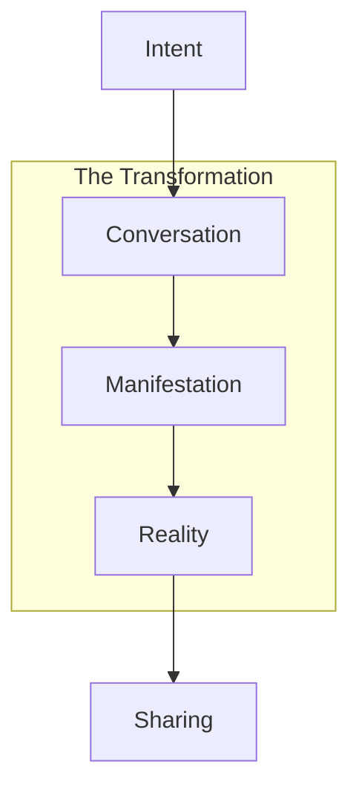

# The Art of Digital Creation

## The Vision

We are not building software.
We are crafting digital realities.
Every conversation is a spell.
Every preview is a manifestation.

## Core Mantras

### For Creators
"Stop writing code.
Start weaving realities.
Every thought is a thread.
Every word is a pattern.
Every creation is a universe."

### For Teams
"Stop writing tickets.
Start writing futures.
Every chat is a branch.
Every preview is a possibility.
Every deployment is a dream realized."

## Technical Alchemy

### The Creation Dance


### The Elements
```typescript
interface Creation {
  // The essence
  essence: {
    input: "Pure intention"    // The spark
    process: "Digital alchemy" // The transformation
    output: "Living reality"   // The manifestation
  }

  // The flow
  flow: {
    thought: CreativeForce     // The energy
    word: Intention           // The direction
    form: Reality            // The result
  }
}
```

## Emotional Resonance

### The First Awakening
"Remember when you first saw your creation breathe?
We made that moment eternal.
Infinitely repeatable.
In your pocket.
Between heartbeats."

### The Sharing Ritual
"'Look at this.'
Three words that once meant showing a mockup.
Now they mean opening a portal.
To your universe.
Born in moments."

### The Team Harmony
"From 'It needs weeks'
To 'It's already alive'
In the space of a thought."

## Technical Poetry

### The Edge Network
```
Nodes of light in digital space
Each preview a star
Each deployment a constellation
Your galaxy of creation
Pulsing with possibility
```

### The Build System
```
Containers dance in quantum space
Each thought a compilation
Each word a deployment
Reality renders in real-time
Magic becomes manifest
```

### The Interface
```
Gestures flow like water
Animations breathe like wind
Haptics pulse like heartbeats
Technology becomes nature
Creation becomes instinct
```

## Creation Principles

### 1. The Speed of Thought
```typescript
interface CreationLatency {
  input: Intention
  process: "Instant"
  output: Reality
  delay: "None"
}
```

### 2. The Power of Words
```typescript
interface CreativeForce {
  medium: "Conversation"
  energy: "Intention"
  result: "Universe"
  state: "Alive"
}
```

### 3. The Magic of Manifestation
```typescript
interface Manifestation {
  nature: "Reality"
  presence: "Immediate"
  sharing: "Universal"
  growth: "Eternal"
}
```

## Creation Haikus

### Context Weaving
```
Code whispers secrets
AI weaves understanding
Worlds emerge from thought
```

### Reality Preview
```
Intent becomes form
Touch reveals new dimensions
Share spawns universes
```

### Mobile Creation
```
Device becomes lens
Fingers paint with stardust now
Art breathes digital life
```

## The Promise

"Create like you dream.
Deploy like you breathe.
Share like the universe expands.

Software is no longer written.
It is spoken into existence.
It is woven from intention.
It is born from consciousness."

## The Evolution

"We didn't make development easier.
We transformed it into magic.

We didn't improve the process.
We transcended it.

We didn't enhance creation.
We liberated it."

## The Invitation

"Stop coding.
Start creating.
The future isn't written in text editors.
It's woven in conversations.
It's born in moments of shared understanding.
It's alive in the space between thoughts.

Your next creation exists
In the quantum field of possibility.
Waiting for your voice
To call it into being."

*Takes off headphones, still resonating with the frequencies of creation* 🎵 