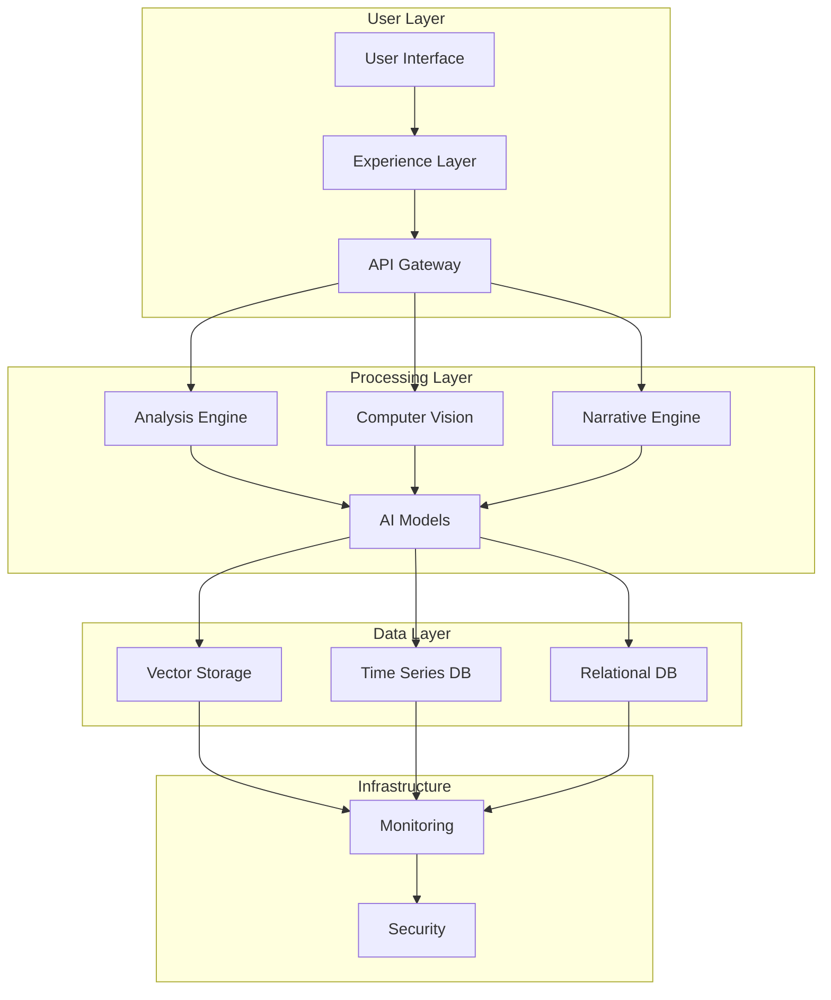

# Architecture Overview

Related Documents:
- [[../implementation/01-implementation-roadmap|Implementation Roadmap]] - Implementation plan
- [[12-ai-platform-strategy|AI Platform Strategy]] - AI infrastructure
- [[13-security|Security Architecture]] - Security framework
- [[14-cost-management|Cost Management]] - Resource optimization
- [[../index|Project Index]] - Project overview

## System Architecture

Our architecture is designed to deliver a comprehensive football analytics platform that combines real-time analysis, computer vision, and narrative generation. This document provides an overview of all architectural components and their relationships.

### 1. Core Components


## Architecture Components

### 1. Core Systems
- [[01-data-architecture|Data Architecture]] - Data infrastructure and flow
- [[02-event-processing|Event Processing]] - Real-time event handling
- [[03-storage-strategy|Storage Strategy]] - Data storage and retrieval
- [[05-analysis-architecture|Analysis Architecture]] - Analysis pipeline

### 2. AI Components
- [[06-pattern-recognition|Pattern Recognition]] - Pattern detection system
- [[07-context-engine|Context Engine]] - Context understanding
- [[08-narrative-generation|Narrative Generation]] - Content generation
- [[12-ai-platform-strategy|AI Platform Strategy]] - AI infrastructure

### 3. Infrastructure
- [[09-model-training|Model Training]] - Training infrastructure
- [[10-model-deployment|Model Deployment]] - Deployment system
- [[11-monitoring|Monitoring Systems]] - System monitoring
- [[13-security|Security Architecture]] - Security framework

## Integration Points

### 1. External Systems
```typescript
interface ExternalIntegrations {
  data: {
    providers: ["Opta", "StatsBomb", "Wyscout"]
    formats: ["JSON", "CSV", "Streaming"]
    protocols: ["REST", "GraphQL", "WebSocket"]
  }

  video: {
    sources: ["Broadcast", "Stadium", "Training"]
    formats: ["H.264", "HEVC", "VP9"]
    quality: ["HD", "4K", "8K"]
  }

  analytics: {
    providers: ["Google", "Mixpanel", "PostHog"]
    metrics: MetricConfig[]
    events: EventConfig[]
  }
}
```

### 2. Internal Systems
```typescript
interface InternalIntegrations {
  services: {
    analysis: ServiceConfig
    vision: ServiceConfig
    narrative: ServiceConfig
  }

  storage: {
    vector: StorageConfig
    timeseries: StorageConfig
    relational: StorageConfig
  }

  monitoring: {
    metrics: MetricConfig
    logging: LogConfig
    tracing: TraceConfig
  }
}
```

## Quality Standards

### 1. Performance Requirements
- API Response: < 100ms
- Real-time Analysis: < 500ms
- Video Processing: 30fps
- Data Freshness: < 1s

### 2. Scalability Targets
- Concurrent Users: 100K+
- Events/Second: 10K+
- Storage: Petabyte-scale
- Availability: 99.99%

## Security & Compliance

### 1. Security Measures
- End-to-end Encryption
- Role-based Access Control
- Audit Logging
- Threat Detection

### 2. Compliance Requirements
- GDPR Compliance
- Data Protection
- Privacy Standards
- Security Certifications

## Related Documentation

### 1. Implementation
- [[../implementation/01-implementation-roadmap|Implementation Roadmap]]
- [[../implementation/02-technical-specifications|Technical Specifications]]

### 2. Development
- [[../4-workflows/development-workflow|Development Workflow]]
- [[../4-workflows/deployment-workflow|Deployment Workflow]]

### 3. Operations
- [[../4-workflows/monitoring-workflow|Monitoring Workflow]]
- [[../4-workflows/incident-response|Incident Response]] 