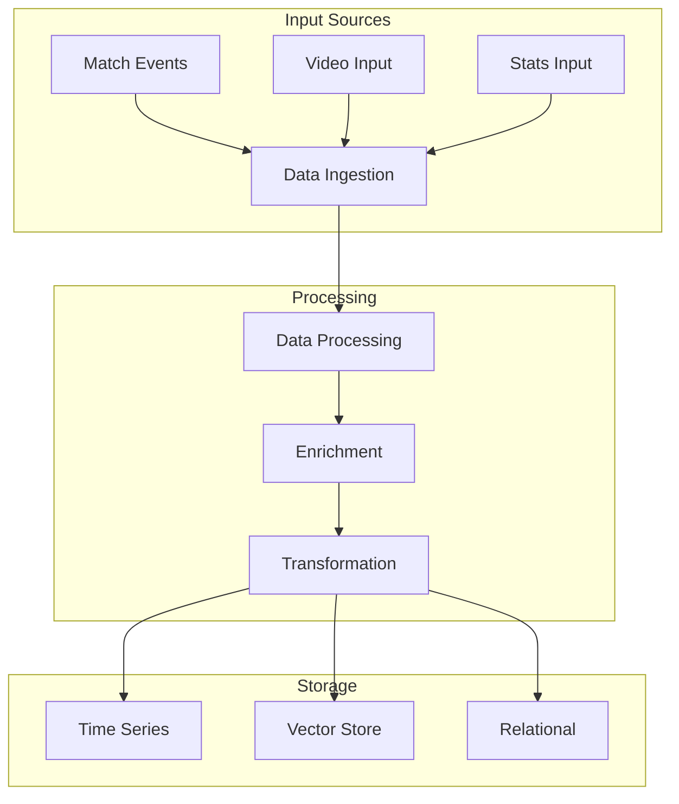
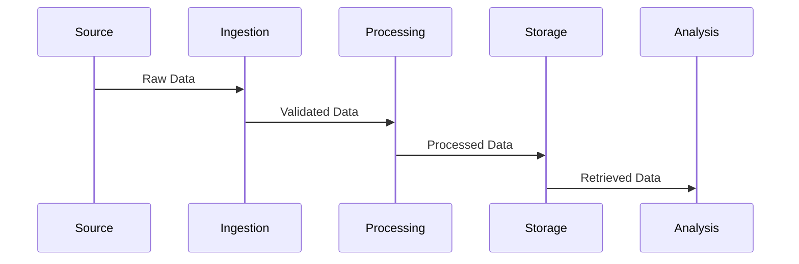
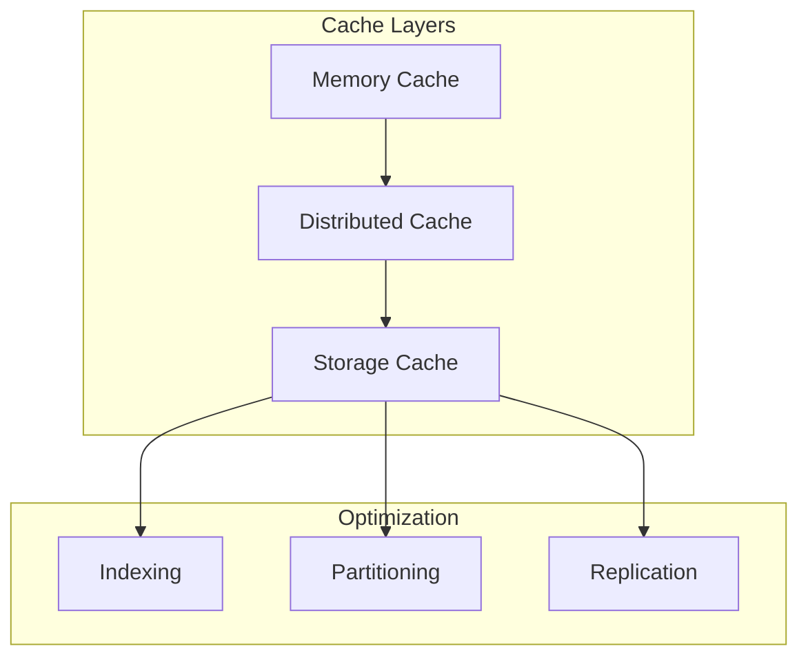

# Data Architecture

Related Documents:
- [[00-overview|Architecture Overview]] - System overview
- [[02-event-processing|Event Processing]] - Event handling
- [[03-storage-strategy|Storage Strategy]] - Storage architecture
- [[05-analysis-architecture|Analysis Architecture]] - Analysis system
- [[12-ai-platform-strategy|AI Platform Strategy]] - AI infrastructure

## Overview

Our data architecture is designed to handle the complexity of football data, from real-time match events to historical analytics, supporting both structured and unstructured data processing needs.

## Data Infrastructure

### 1. Data Flow Architecture


## Data Models

### 1. Core Models
```typescript
interface MatchEvent {
  id: string
  timestamp: number
  type: EventType
  location: Point
  players: Player[]
  team: Team
  metadata: EventMetadata
}

interface Player {
  id: string
  position: Position
  stats: PlayerStats
  tracking: TrackingData
}

interface Team {
  id: string
  formation: Formation
  tactics: TacticalData
  stats: TeamStats
}
```

### 2. Analysis Models
```typescript
interface AnalysisData {
  patterns: {
    tactical: TacticalPattern[]
    technical: TechnicalPattern[]
    temporal: TemporalPattern[]
  }

  context: {
    historical: HistoricalContext
    situational: SituationalContext
    comparative: ComparativeContext
  }

  insights: {
    primary: PrimaryInsight[]
    derived: DerivedInsight[]
    composite: CompositeInsight[]
  }
}
```

## Data Processing

### 1. Processing Pipeline


### 2. Processing Configuration
```typescript
interface ProcessingConfig {
  ingestion: {
    sources: DataSource[]
    validation: ValidationRule[]
    enrichment: EnrichmentRule[]
  }

  transformation: {
    pipeline: TransformStep[]
    rules: ProcessingRule[]
    validation: ValidationConfig[]
  }

  output: {
    formats: OutputFormat[]
    destinations: Destination[]
    validation: QualityCheck[]
  }
}
```

## Data Quality

### 1. Quality Framework
```typescript
interface QualityFramework {
  validation: {
    rules: ValidationRule[]
    checks: QualityCheck[]
    metrics: QualityMetric[]
  }

  monitoring: {
    metrics: MonitoringMetric[]
    alerts: AlertConfig[]
    reporting: ReportConfig[]
  }

  governance: {
    policies: Policy[]
    standards: Standard[]
    compliance: ComplianceCheck[]
  }
}
```

### 2. Quality Metrics
- Data Accuracy: > 99.99%
- Processing Latency: < 100ms
- Data Freshness: < 1s
- Completeness: > 99.9%

## Integration Points

### 1. External Systems
```typescript
interface ExternalIntegration {
  providers: {
    stats: ["Opta", "StatsBomb", "Wyscout"]
    video: ["Broadcast", "Stadium"]
    tracking: ["ChyronHego", "Stats Perform"]
  }

  protocols: {
    ingestion: ["REST", "GraphQL", "WebSocket"]
    streaming: ["RTMP", "HLS", "WebRTC"]
    export: ["REST", "GraphQL", "Streaming"]
  }
}
```

### 2. Internal Systems
```typescript
interface InternalIntegration {
  services: {
    analysis: AnalysisService
    storage: StorageService
    processing: ProcessingService
  }

  pipelines: {
    realtime: RealtimePipeline
    batch: BatchPipeline
    streaming: StreamingPipeline
  }
}
```

## Performance Optimization

### 1. Caching Strategy


### 2. Performance Metrics
- Ingestion Rate: > 10K events/s
- Processing Throughput: > 5K events/s
- Query Response: < 50ms
- Cache Hit Rate: > 90%

## Related Documentation

### 1. Implementation
- [[../implementation/01-implementation-roadmap|Implementation Roadmap]]
- [[../implementation/02-technical-specifications|Technical Specifications]]

### 2. Development
- [[../4-workflows/data-workflow|Data Workflow]]
- [[../4-workflows/quality-workflow|Quality Workflow]] 