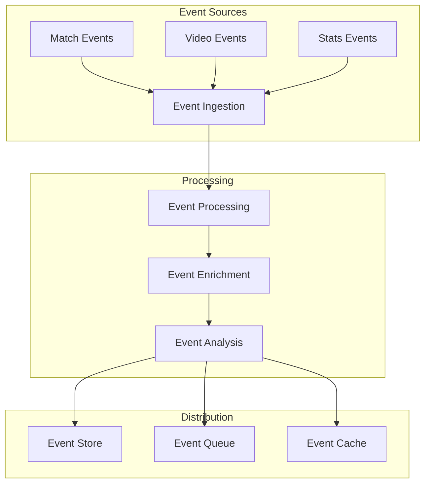
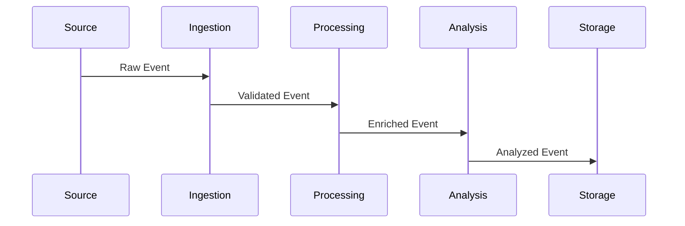
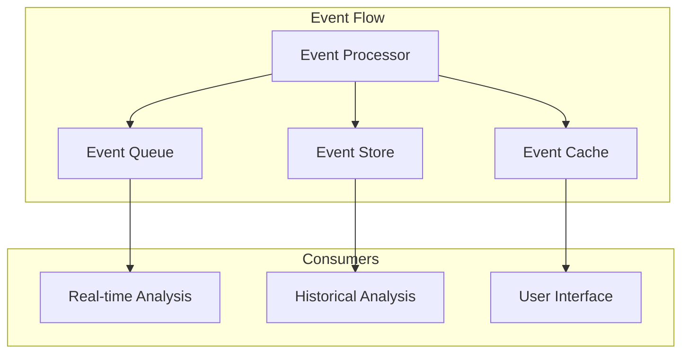

# Event Processing Architecture

Related Documents:
- [[00-overview|Architecture Overview]] - System overview
- [[01-data-architecture|Data Architecture]] - Data infrastructure
- [[03-storage-strategy|Storage Strategy]] - Storage architecture
- [[05-analysis-architecture|Analysis Architecture]] - Analysis system
- [[12-ai-platform-strategy|AI Platform Strategy]] - AI infrastructure

## Overview

Our event processing architecture is designed to handle real-time football events, from basic match events to complex tactical patterns, ensuring low-latency processing and high-throughput analysis.

## Event Infrastructure

### 1. Event Flow Architecture


## Event Models

### 1. Core Events
```typescript
interface MatchEvent {
  id: string
  type: EventType
  timestamp: number
  source: EventSource
  data: EventData
  metadata: EventMetadata
}

interface EventData {
  basic: BasicEventData
  advanced: AdvancedEventData
  derived: DerivedEventData
}

interface EventMetadata {
  confidence: number
  latency: number
  processing: ProcessingMetadata
}
```

### 2. Event Processing
```typescript
interface EventProcessor {
  pipeline: {
    stages: ProcessingStage[]
    transforms: Transform[]
    enrichments: Enrichment[]
  }

  analysis: {
    patterns: PatternAnalysis[]
    context: ContextAnalysis[]
    insights: InsightGeneration[]
  }

  output: {
    streams: EventStream[]
    storage: StorageConfig[]
    cache: CacheConfig[]
  }
}
```

## Processing Pipeline

### 1. Pipeline Architecture


### 2. Pipeline Configuration
```typescript
interface PipelineConfig {
  ingestion: {
    sources: EventSource[]
    validation: ValidationRule[]
    batching: BatchConfig[]
  }

  processing: {
    enrichment: EnrichmentRule[]
    transformation: TransformRule[]
    validation: ValidationConfig[]
  }

  analysis: {
    patterns: PatternConfig[]
    context: ContextConfig[]
    insights: InsightConfig[]
  }
}
```

## Event Distribution

### 1. Distribution System


### 2. Distribution Config
```typescript
interface DistributionConfig {
  queues: {
    realtime: QueueConfig
    batch: QueueConfig
    priority: QueueConfig
  }

  routing: {
    rules: RoutingRule[]
    filters: FilterRule[]
    transformations: TransformRule[]
  }

  delivery: {
    guarantees: DeliveryGuarantee[]
    retry: RetryConfig[]
    monitoring: MonitoringConfig[]
  }
}
```

## Performance Optimization

### 1. Optimization Strategy
```typescript
interface OptimizationStrategy {
  throughput: {
    batching: BatchStrategy
    parallelization: ParallelStrategy
    partitioning: PartitionStrategy
  }

  latency: {
    caching: CacheStrategy
    routing: RoutingStrategy
    prioritization: PriorityStrategy
  }

  resources: {
    scaling: ScalingStrategy
    allocation: AllocationStrategy
    monitoring: MonitoringStrategy
  }
}
```

### 2. Performance Metrics
- Event Ingestion: > 10K events/s
- Processing Latency: < 50ms
- Distribution Latency: < 10ms
- End-to-end Latency: < 100ms

## Quality Assurance

### 1. Quality Framework
```typescript
interface QualityFramework {
  validation: {
    rules: ValidationRule[]
    checks: QualityCheck[]
    metrics: QualityMetric[]
  }

  monitoring: {
    metrics: MonitoringMetric[]
    alerts: AlertConfig[]
    reporting: ReportConfig[]
  }

  testing: {
    unit: TestConfig[]
    integration: TestConfig[]
    performance: TestConfig[]
  }
}
```

### 2. Quality Metrics
- Event Accuracy: > 99.99%
- Data Completeness: > 99.9%
- Processing Success: > 99.99%
- System Availability: > 99.99%

## Related Documentation

### 1. Implementation
- [[../implementation/01-implementation-roadmap|Implementation Roadmap]]
- [[../implementation/02-technical-specifications|Technical Specifications]]

### 2. Development
- [[../4-workflows/event-workflow|Event Workflow]]
- [[../4-workflows/processing-workflow|Processing Workflow]] 