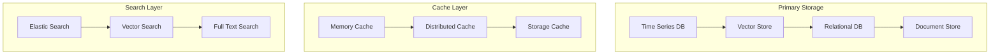
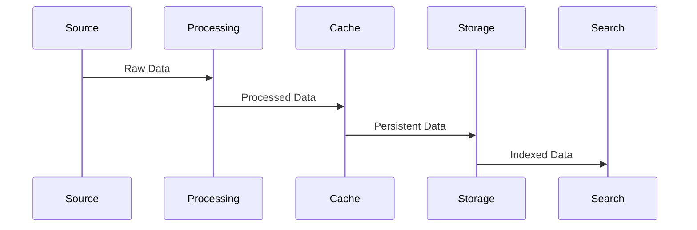
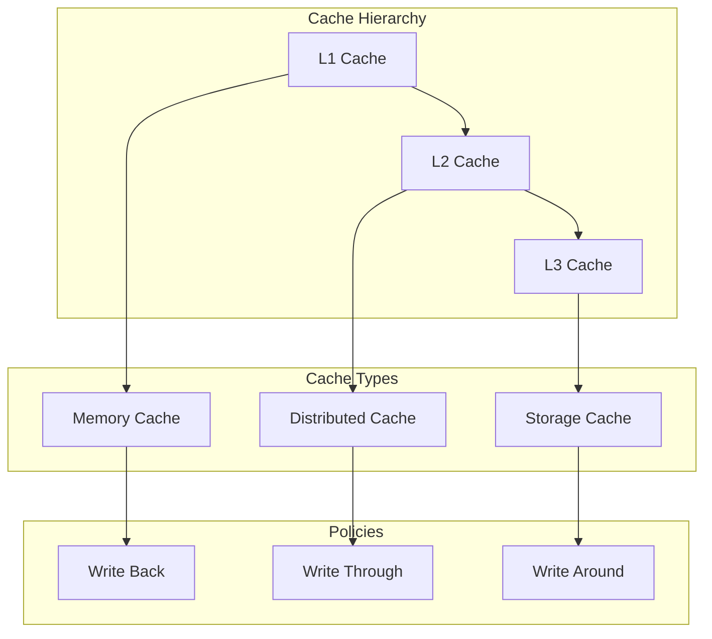
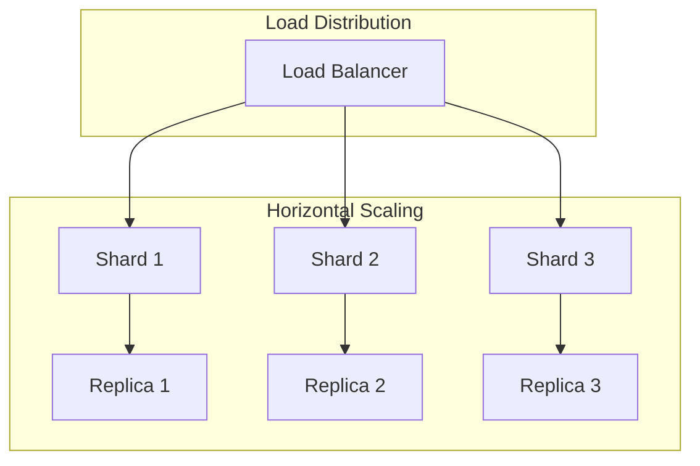

# Storage Strategy

Related Documents:
- [[00-overview|Architecture Overview]] - System overview
- [[01-data-architecture|Data Architecture]] - Data infrastructure
- [[02-event-processing|Event Processing]] - Event handling
- [[05-analysis-architecture|Analysis Architecture]] - Analysis system
- [[12-ai-platform-strategy|AI Platform Strategy]] - AI infrastructure

## Overview

Our storage strategy implements a multi-modal approach to handle the diverse data types in football analytics, from real-time events to historical patterns and narratives.

## Storage Architecture

### 1. Storage Layer Design


## Storage Models

### 1. Data Models
```typescript
interface StorageModel {
  timeseries: {
    events: TimeSeriesEvent[]
    metrics: TimeSeriesMetric[]
    telemetry: TelemetryData[]
  }

  vector: {
    embeddings: Embedding[]
    patterns: Pattern[]
    similarities: Similarity[]
  }

  relational: {
    entities: Entity[]
    relationships: Relationship[]
    metadata: Metadata[]
  }

  document: {
    narratives: Narrative[]
    analysis: Analysis[]
    context: Context[]
  }
}
```

### 2. Storage Configuration
```typescript
interface StorageConfig {
  databases: {
    timeseries: TimeSeriesConfig
    vector: VectorConfig
    relational: RelationalConfig
    document: DocumentConfig
  }

  caching: {
    memory: MemoryCacheConfig
    distributed: DistributedCacheConfig
    storage: StorageCacheConfig
  }

  search: {
    elastic: ElasticConfig
    vector: VectorSearchConfig
    fulltext: FullTextConfig
  }
}
```

## Data Management

### 1. Data Flow


### 2. Management Configuration
```typescript
interface DataManagement {
  lifecycle: {
    ingestion: IngestionConfig
    processing: ProcessingConfig
    storage: StorageConfig
    archival: ArchivalConfig
  }

  policies: {
    retention: RetentionPolicy[]
    backup: BackupPolicy[]
    recovery: RecoveryPolicy[]
  }

  optimization: {
    compression: CompressionConfig[]
    partitioning: PartitionConfig[]
    indexing: IndexConfig[]
  }
}
```

## Performance Optimization

### 1. Caching Strategy


### 2. Performance Config
```typescript
interface PerformanceConfig {
  caching: {
    strategy: CacheStrategy
    policies: CachePolicy[]
    invalidation: InvalidationConfig[]
  }

  optimization: {
    indexes: IndexStrategy[]
    partitioning: PartitionStrategy[]
    replication: ReplicationStrategy[]
  }

  monitoring: {
    metrics: MetricConfig[]
    alerts: AlertConfig[]
    reporting: ReportConfig[]
  }
}
```

## Scalability & Reliability

### 1. Scalability Architecture


### 2. Reliability Config
```typescript
interface ReliabilityConfig {
  replication: {
    strategy: ReplicationStrategy
    topology: TopologyConfig
    sync: SyncConfig
  }

  backup: {
    schedule: Schedule[]
    retention: RetentionConfig[]
    verification: VerificationConfig[]
  }

  recovery: {
    rto: RTOConfig
    rpo: RPOConfig
    procedures: RecoveryProcedure[]
  }
}
```

## Quality Assurance

### 1. Quality Framework
```typescript
interface QualityFramework {
  consistency: {
    model: ConsistencyModel
    checks: ConsistencyCheck[]
    repair: RepairStrategy[]
  }

  durability: {
    guarantees: DurabilityGuarantee[]
    verification: VerificationConfig[]
    recovery: RecoveryConfig[]
  }

  monitoring: {
    metrics: MonitoringMetric[]
    alerts: AlertConfig[]
    reporting: ReportConfig[]
  }
}
```

### 2. Quality Metrics
- Write Latency: < 10ms
- Read Latency: < 5ms
- Consistency: > 99.99%
- Durability: > 99.999%

## Related Documentation

### 1. Implementation
- [[../implementation/01-implementation-roadmap|Implementation Roadmap]]
- [[../implementation/02-technical-specifications|Technical Specifications]]

### 2. Development
- [[../4-workflows/storage-workflow|Storage Workflow]]
- [[../4-workflows/backup-workflow|Backup Workflow]] 