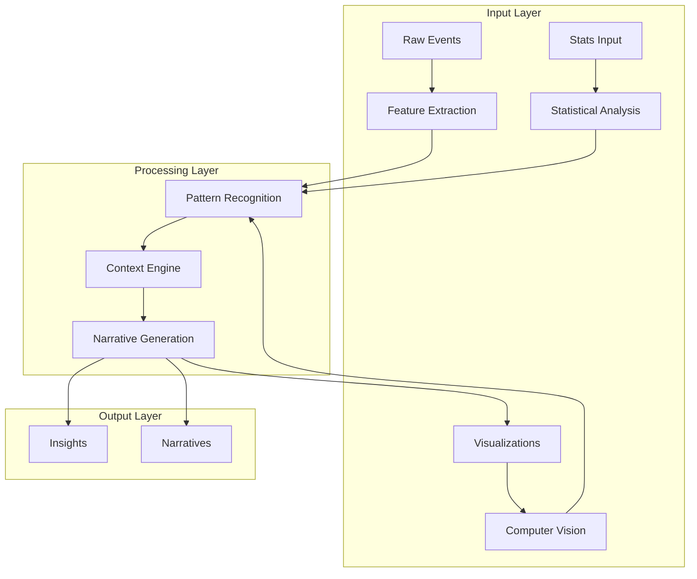
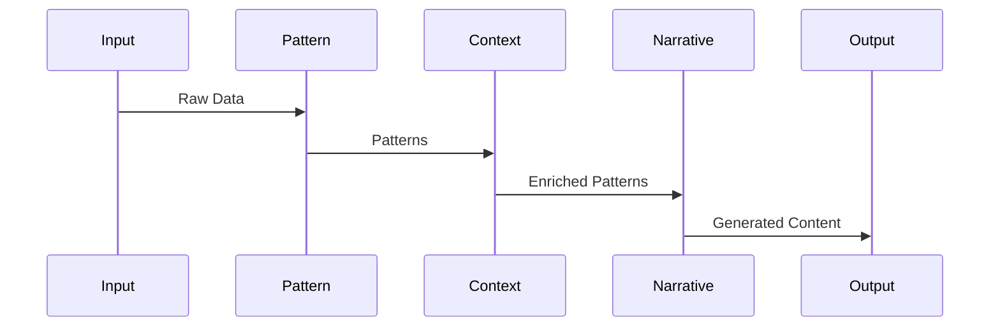
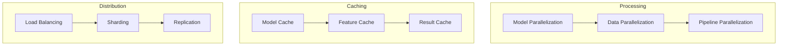

# Analysis Architecture

Related Documents:
- [[00-overview|Architecture Overview]] - System overview
- [[01-data-architecture|Data Architecture]] - Data infrastructure
- [[02-event-processing|Event Processing]] - Event handling
- [[03-storage-strategy|Storage Strategy]] - Storage architecture
- [[12-ai-platform-strategy|AI Platform Strategy]] - AI infrastructure

## Overview

Our analysis architecture transforms raw football data into meaningful insights through a combination of pattern recognition, contextual understanding, and narrative generation. The system processes both real-time and historical data to reveal the deeper stories within the game.

## Analysis Infrastructure

### 1. Analysis Flow Architecture


## Analysis Components

### 1. Pattern Recognition System
```typescript
interface PatternRecognition {
  detectors: {
    tactical: TacticalDetector[]
    technical: TechnicalDetector[]
    temporal: TemporalDetector[]
  }

  analysis: {
    patterns: PatternAnalyzer[]
    significance: SignificanceAnalyzer[]
    correlation: CorrelationAnalyzer[]
  }

  output: {
    patterns: Pattern[]
    insights: PatternInsight[]
    confidence: ConfidenceScore[]
  }
}
```

### 2. Context Engine
```typescript
interface ContextEngine {
  sources: {
    historical: HistoricalData[]
    situational: SituationalData[]
    environmental: EnvironmentalData[]
  }

  analysis: {
    relevance: RelevanceAnalyzer[]
    impact: ImpactAnalyzer[]
    trends: TrendAnalyzer[]
  }

  enrichment: {
    context: ContextData[]
    metadata: MetadataEnricher[]
    relations: RelationshipBuilder[]
  }
}
```

## Processing Pipeline

### 1. Pipeline Architecture


### 2. Pipeline Configuration
```typescript
interface AnalysisPipeline {
  extraction: {
    features: FeatureConfig[]
    metrics: MetricConfig[]
    signals: SignalConfig[]
  }

  processing: {
    models: ModelConfig[]
    algorithms: AlgorithmConfig[]
    validation: ValidationConfig[]
  }

  generation: {
    insights: InsightConfig[]
    narratives: NarrativeConfig[]
    visuals: VisualConfig[]
  }
}
```

## Analysis Models

### 1. Core Models
```typescript
interface AnalysisModel {
  patterns: {
    tactical: TacticalModel[]
    technical: TechnicalModel[]
    temporal: TemporalModel[]
  }

  context: {
    historical: HistoricalModel[]
    situational: SituationalModel[]
    environmental: EnvironmentalModel[]
  }

  generation: {
    insights: InsightModel[]
    narratives: NarrativeModel[]
    visuals: VisualModel[]
  }
}
```

### 2. Model Training
```typescript
interface ModelTraining {
  datasets: {
    training: DatasetConfig[]
    validation: DatasetConfig[]
    testing: DatasetConfig[]
  }

  pipelines: {
    preprocessing: PreprocessConfig[]
    training: TrainingConfig[]
    evaluation: EvaluationConfig[]
  }

  optimization: {
    hyperparameters: HyperparamConfig[]
    architecture: ArchitectureConfig[]
    performance: PerformanceConfig[]
  }
}
```

## Performance Optimization

### 1. Optimization Strategy


### 2. Performance Config
```typescript
interface PerformanceConfig {
  compute: {
    gpu: GPUConfig[]
    cpu: CPUConfig[]
    memory: MemoryConfig[]
  }

  optimization: {
    caching: CacheStrategy[]
    batching: BatchStrategy[]
    distribution: DistributionStrategy[]
  }

  monitoring: {
    metrics: MetricConfig[]
    alerts: AlertConfig[]
    logging: LogConfig[]
  }
}
```

## Quality Assurance

### 1. Quality Framework
```typescript
interface QualityFramework {
  validation: {
    accuracy: AccuracyMetric[]
    precision: PrecisionMetric[]
    recall: RecallMetric[]
  }

  monitoring: {
    performance: PerformanceMetric[]
    reliability: ReliabilityMetric[]
    latency: LatencyMetric[]
  }

  testing: {
    unit: UnitTestConfig[]
    integration: IntegrationTestConfig[]
    system: SystemTestConfig[]
  }
}
```

### 2. Quality Metrics
- Pattern Recognition Accuracy: > 95%
- Context Relevance: > 90%
- Narrative Quality: > 4.5/5
- System Latency: < 500ms

## Related Documentation

### 1. Implementation
- [[../implementation/01-implementation-roadmap|Implementation Roadmap]]
- [[../implementation/02-technical-specifications|Technical Specifications]]

### 2. Development
- [[../4-workflows/analysis-workflow|Analysis Workflow]]
- [[../4-workflows/model-workflow|Model Workflow]] 