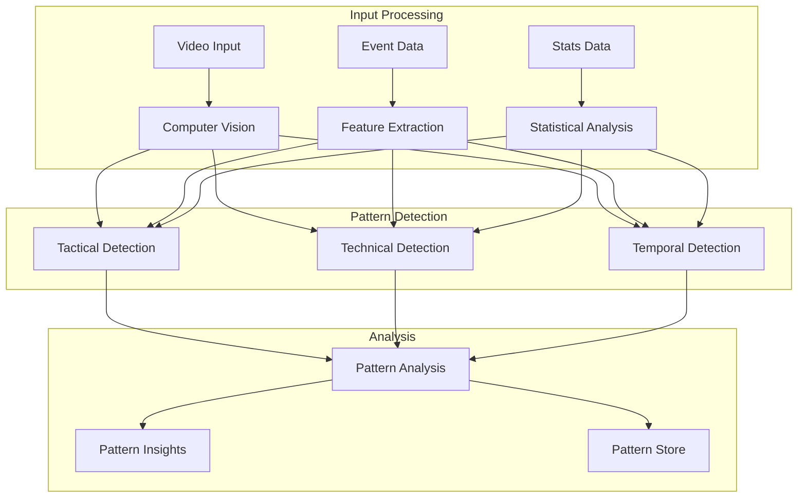
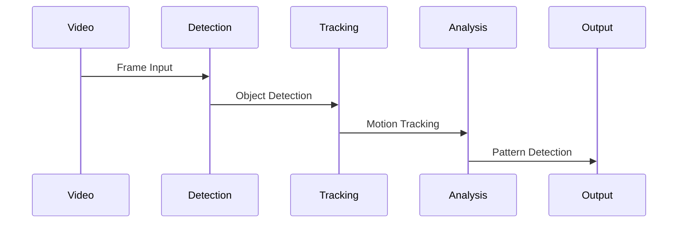
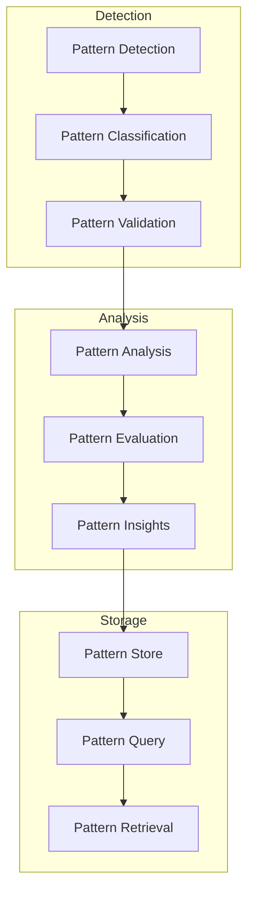

# Pattern Recognition System

Related Documents:
- [[00-overview|Architecture Overview]] - System overview
- [[05-analysis-architecture|Analysis Architecture]] - Analysis system
- [[07-context-engine|Context Engine]] - Context understanding
- [[08-narrative-generation|Narrative Generation]] - Content generation
- [[12-ai-platform-strategy|AI Platform Strategy]] - AI infrastructure

## Overview

Our pattern recognition system identifies and analyzes complex patterns in football matches, from tactical formations to technical skills and temporal trends. The system combines computer vision, spatial analysis, and deep learning to understand the game's intricate dynamics.

## System Architecture

### 1. Pattern Recognition Flow


## Pattern Models

### 1. Tactical Patterns
```typescript
interface TacticalPattern {
  formation: {
    structure: FormationStructure
    dynamics: FormationDynamics
    transitions: FormationTransition[]
  }

  pressing: {
    triggers: PressTrigger[]
    intensity: PressIntensity
    coverage: PressCoverage
  }

  buildup: {
    progression: BuildupProgression[]
    channels: BuildupChannel[]
    variations: BuildupVariation[]
  }
}
```

### 2. Technical Patterns
```typescript
interface TechnicalPattern {
  passing: {
    networks: PassingNetwork[]
    sequences: PassSequence[]
    styles: PassingStyle[]
  }

  movement: {
    patterns: MovementPattern[]
    coordination: MovementCoordination[]
    spacing: SpacialDistribution[]
  }

  possession: {
    control: PossessionControl[]
    transitions: PossessionTransition[]
    pressure: PressureResistance[]
  }
}
```

## Detection Systems

### 1. Computer Vision Pipeline


### 2. Detection Configuration
```typescript
interface DetectionConfig {
  vision: {
    models: VisionModel[]
    tracking: TrackingConfig[]
    calibration: CalibrationConfig[]
  }

  analysis: {
    algorithms: AlgorithmConfig[]
    thresholds: ThresholdConfig[]
    validation: ValidationConfig[]
  }

  output: {
    patterns: PatternConfig[]
    confidence: ConfidenceConfig[]
    metadata: MetadataConfig[]
  }
}
```

## Analysis Components

### 1. Pattern Analysis
```typescript
interface PatternAnalysis {
  recognition: {
    classifiers: PatternClassifier[]
    validators: PatternValidator[]
    evaluators: PatternEvaluator[]
  }

  metrics: {
    significance: SignificanceMetric[]
    frequency: FrequencyMetric[]
    effectiveness: EffectivenessMetric[]
  }

  context: {
    historical: HistoricalContext[]
    situational: SituationalContext[]
    tactical: TacticalContext[]
  }
}
```

### 2. Analysis Pipeline


## Performance Optimization

### 1. Optimization Strategy
```typescript
interface OptimizationStrategy {
  compute: {
    gpu: GPUOptimization[]
    distributed: DistributedCompute[]
    batching: BatchProcessing[]
  }

  memory: {
    caching: CacheStrategy[]
    streaming: StreamStrategy[]
    prefetching: PrefetchStrategy[]
  }

  storage: {
    indexing: IndexStrategy[]
    partitioning: PartitionStrategy[]
    compression: CompressionStrategy[]
  }
}
```

### 2. Performance Metrics
- Detection Latency: < 50ms
- Analysis Throughput: > 30fps
- Pattern Accuracy: > 95%
- System Reliability: > 99.9%

## Quality Assurance

### 1. Quality Framework
```typescript
interface QualityFramework {
  validation: {
    accuracy: AccuracyMetric[]
    precision: PrecisionMetric[]
    recall: RecallMetric[]
  }

  testing: {
    unit: UnitTest[]
    integration: IntegrationTest[]
    performance: PerformanceTest[]
  }

  monitoring: {
    metrics: MonitoringMetric[]
    alerts: AlertConfig[]
    reporting: ReportConfig[]
  }
}
```

### 2. Quality Metrics
- Pattern Detection Accuracy: > 95%
- False Positive Rate: < 1%
- Processing Speed: > 30fps
- Model Confidence: > 90%

## Related Documentation

### 1. Implementation
- [[../implementation/01-implementation-roadmap|Implementation Roadmap]]
- [[../implementation/02-technical-specifications|Technical Specifications]]

### 2. Development
- [[../4-workflows/pattern-workflow|Pattern Workflow]]
- [[../4-workflows/vision-workflow|Vision Workflow]] 