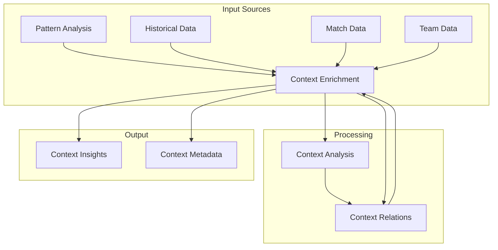
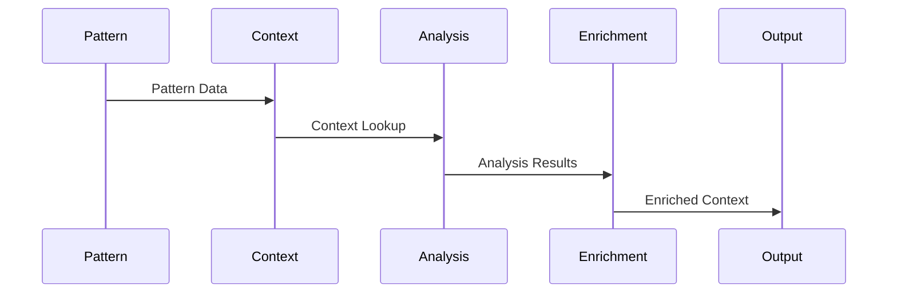
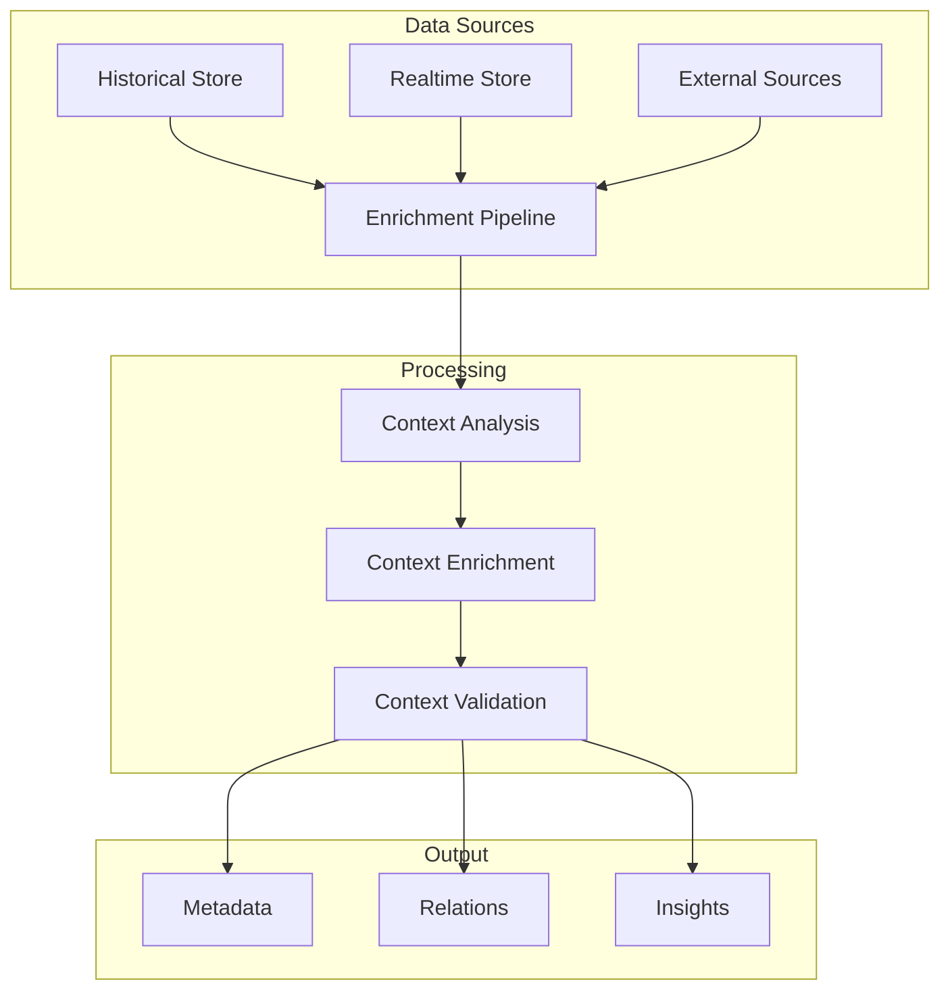

# Context Engine

Related Documents:
- [[00-overview|Architecture Overview]] - System overview
- [[05-analysis-architecture|Analysis Architecture]] - Analysis system
- [[06-pattern-recognition|Pattern Recognition]] - Pattern detection
- [[08-narrative-generation|Narrative Generation]] - Content generation
- [[12-ai-platform-strategy|AI Platform Strategy]] - AI infrastructure

## Overview

Our context engine enriches raw patterns with historical, situational, and environmental context to create meaningful insights. It serves as the bridge between pattern recognition and narrative generation, providing the depth and relevance needed to tell compelling football stories.

## System Architecture

### 1. Context Processing Flow


## Context Models

### 1. Historical Context
```typescript
interface HistoricalContext {
  matches: {
    history: MatchHistory[]
    patterns: PatternHistory[]
    statistics: StatisticsHistory[]
  }

  teams: {
    performance: TeamPerformance[]
    tactics: TacticalHistory[]
    evolution: TeamEvolution[]
  }

  players: {
    statistics: PlayerStats[]
    development: PlayerDevelopment[]
    interactions: PlayerInteractions[]
  }
}
```

### 2. Situational Context
```typescript
interface SituationalContext {
  match: {
    phase: MatchPhase
    momentum: MomentumState
    intensity: IntensityLevel
  }

  tactical: {
    formation: FormationContext
    strategy: StrategyContext
    adaptations: TacticalAdaptation[]
  }

  environmental: {
    competition: CompetitionContext
    venue: VenueContext
    conditions: MatchConditions
  }
}
```

## Analysis Components

### 1. Context Analysis
```typescript
interface ContextAnalysis {
  relevance: {
    evaluators: RelevanceEvaluator[]
    weights: WeightConfig[]
    thresholds: ThresholdConfig[]
  }

  significance: {
    calculators: SignificanceCalculator[]
    factors: SignificanceFactor[]
    impact: ImpactAssessment[]
  }

  relationships: {
    builders: RelationshipBuilder[]
    graphs: RelationshipGraph[]
    patterns: RelationshipPattern[]
  }
}
```

### 2. Analysis Pipeline


## Enrichment System

### 1. Context Enrichment
```typescript
interface ContextEnrichment {
  sources: {
    historical: HistoricalSource[]
    realtime: RealtimeSource[]
    external: ExternalSource[]
  }

  processors: {
    analyzers: ContextAnalyzer[]
    enrichers: DataEnricher[]
    validators: EnrichmentValidator[]
  }

  output: {
    metadata: MetadataGenerator[]
    relations: RelationBuilder[]
    insights: InsightGenerator[]
  }
}
```

### 2. Enrichment Pipeline


## Performance Optimization

### 1. Optimization Strategy
```typescript
interface OptimizationStrategy {
  caching: {
    historical: CacheConfig[]
    realtime: CacheConfig[]
    computed: CacheConfig[]
  }

  computation: {
    parallel: ParallelConfig[]
    distributed: DistributedConfig[]
    streaming: StreamConfig[]
  }

  storage: {
    indexing: IndexStrategy[]
    partitioning: PartitionStrategy[]
    replication: ReplicationStrategy[]
  }
}
```

### 2. Performance Metrics
- Context Lookup: < 50ms
- Enrichment Time: < 100ms
- Analysis Latency: < 200ms
- System Throughput: > 1000 req/s

## Quality Assurance

### 1. Quality Framework
```typescript
interface QualityFramework {
  validation: {
    accuracy: AccuracyMetric[]
    relevance: RelevanceMetric[]
    completeness: CompletenessMetric[]
  }

  monitoring: {
    performance: PerformanceMetric[]
    reliability: ReliabilityMetric[]
    consistency: ConsistencyMetric[]
  }

  testing: {
    unit: UnitTestConfig[]
    integration: IntegrationTestConfig[]
    system: SystemTestConfig[]
  }
}
```

### 2. Quality Metrics
- Context Accuracy: > 95%
- Relevance Score: > 90%
- Enrichment Quality: > 95%
- System Reliability: > 99.9%

## Related Documentation

### 1. Implementation
- [[../implementation/01-implementation-roadmap|Implementation Roadmap]]
- [[../implementation/02-technical-specifications|Technical Specifications]]

### 2. Development
- [[../4-workflows/context-workflow|Context Workflow]]
- [[../4-workflows/enrichment-workflow|Enrichment Workflow]] 