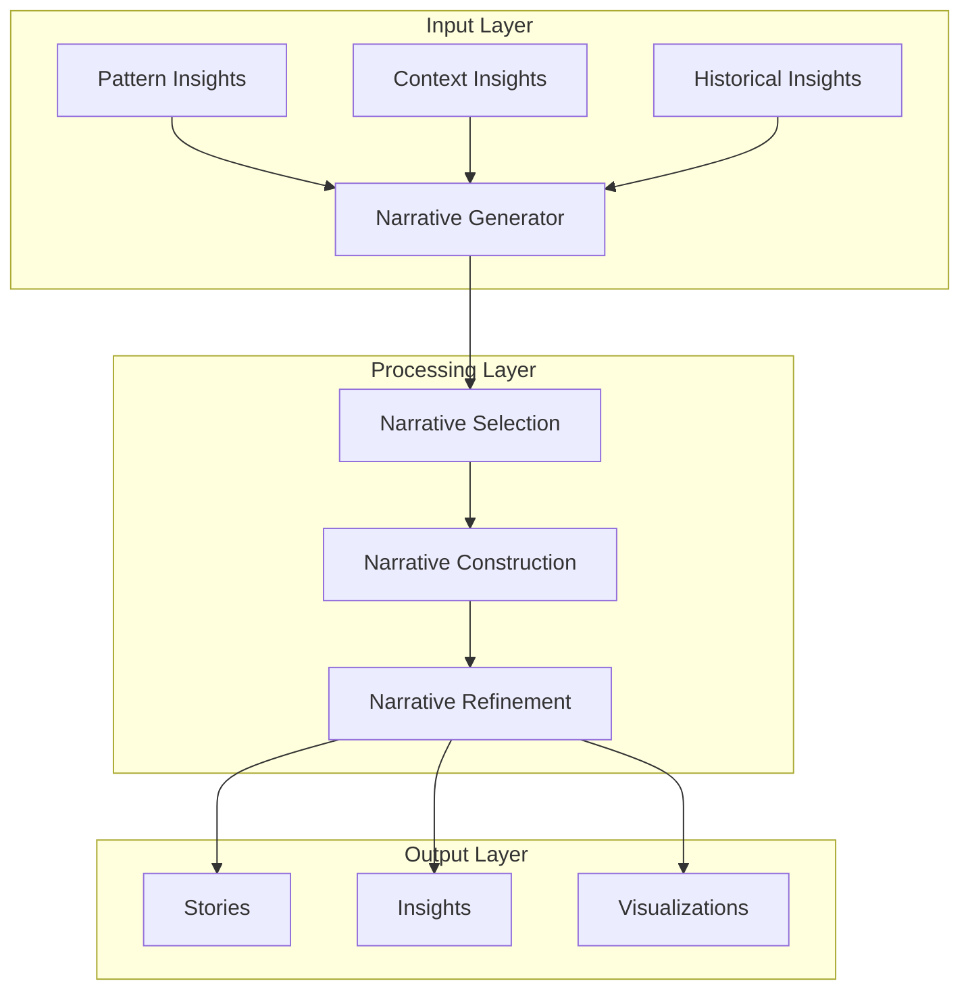
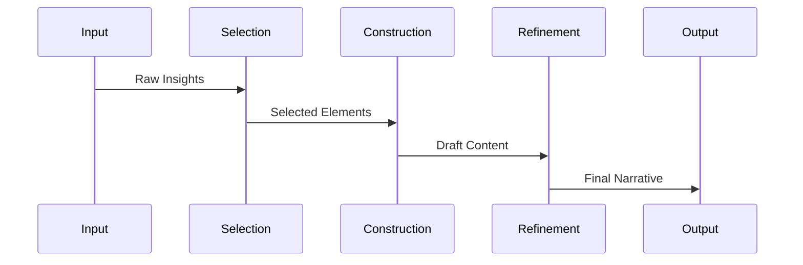
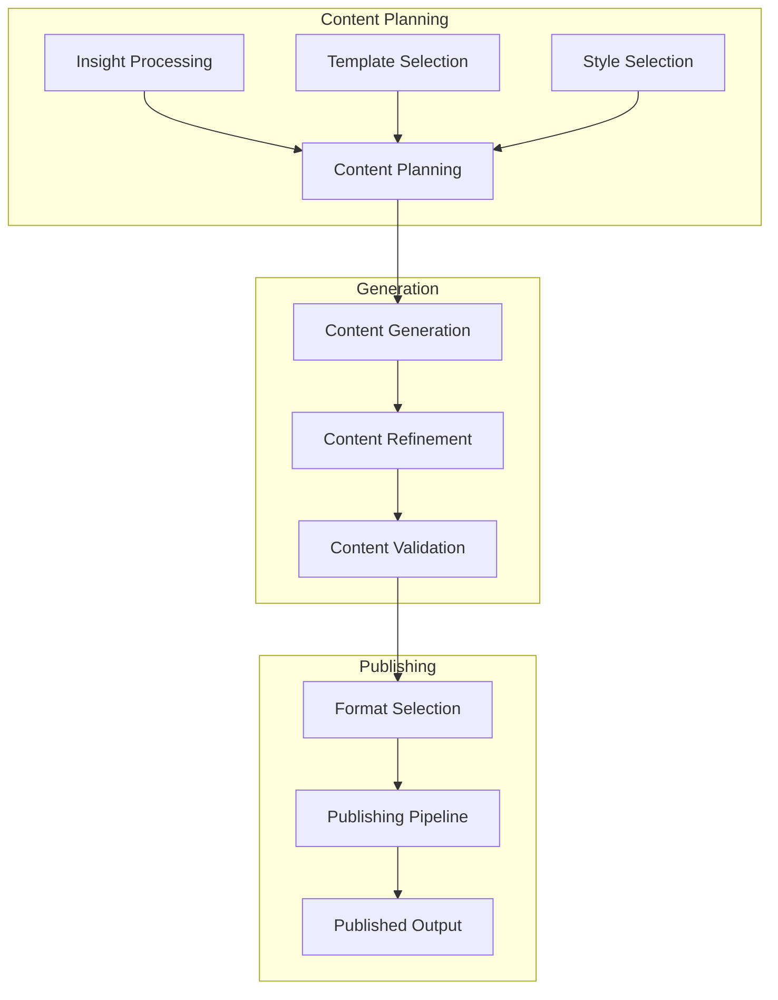

# Narrative Generation System

Related Documents:
- [[00-overview|Architecture Overview]] - System overview
- [[05-analysis-architecture|Analysis Architecture]] - Analysis system
- [[06-pattern-recognition|Pattern Recognition]] - Pattern detection
- [[07-context-engine|Context Engine]] - Context understanding
- [[12-ai-platform-strategy|AI Platform Strategy]] - AI infrastructure

## Overview

Our narrative generation system transforms enriched patterns and contextual insights into compelling football stories. Using advanced natural language processing and narrative intelligence, it crafts engaging content that reveals the deeper meaning within the beautiful game.

## System Architecture

### 1. Narrative Generation Flow


## Narrative Models

### 1. Story Structure
```typescript
interface StoryStructure {
  elements: {
    setup: StorySetup[]
    development: StoryDevelopment[]
    resolution: StoryResolution[]
  }

  components: {
    characters: Character[]
    events: Event[]
    themes: Theme[]
  }

  flow: {
    pacing: PacingControl
    tension: TensionCurve
    resolution: ResolutionPath
  }
}
```

### 2. Content Models
```typescript
interface ContentModel {
  templates: {
    match: MatchTemplate[]
    analysis: AnalysisTemplate[]
    insight: InsightTemplate[]
  }

  styles: {
    technical: TechnicalStyle
    emotional: EmotionalStyle
    narrative: NarrativeStyle
  }

  formats: {
    text: TextFormat[]
    visual: VisualFormat[]
    interactive: InteractiveFormat[]
  }
}
```

## Generation Components

### 1. Narrative Generator
```typescript
interface NarrativeGenerator {
  selection: {
    patterns: PatternSelector[]
    context: ContextSelector[]
    themes: ThemeSelector[]
  }

  construction: {
    structure: StructureBuilder[]
    content: ContentBuilder[]
    flow: FlowController[]
  }

  refinement: {
    style: StyleRefiner[]
    coherence: CoherenceChecker[]
    quality: QualityEvaluator[]
  }
}
```

### 2. Generation Pipeline


## Content Generation

### 1. Content Types
```typescript
interface ContentTypes {
  match: {
    preview: PreviewContent[]
    live: LiveContent[]
    analysis: AnalysisContent[]
  }

  insights: {
    tactical: TacticalInsight[]
    technical: TechnicalInsight[]
    statistical: StatisticalInsight[]
  }

  stories: {
    features: FeatureStory[]
    profiles: ProfileStory[]
    trends: TrendStory[]
  }
}
```

### 2. Generation Flow


## Performance Optimization

### 1. Optimization Strategy
```typescript
interface OptimizationStrategy {
  generation: {
    parallel: ParallelGeneration[]
    batching: BatchGeneration[]
    caching: CacheStrategy[]
  }

  processing: {
    pipeline: PipelineConfig[]
    distribution: DistributionConfig[]
    scheduling: ScheduleConfig[]
  }

  delivery: {
    streaming: StreamConfig[]
    buffering: BufferConfig[]
    compression: CompressionConfig[]
  }
}
```

### 2. Performance Metrics
- Generation Time: < 500ms
- Refinement Time: < 200ms
- Publishing Latency: < 100ms
- System Throughput: > 100 stories/s

## Quality Assurance

### 1. Quality Framework
```typescript
interface QualityFramework {
  content: {
    accuracy: AccuracyMetric[]
    coherence: CoherenceMetric[]
    engagement: EngagementMetric[]
  }

  style: {
    consistency: ConsistencyMetric[]
    tone: ToneMetric[]
    readability: ReadabilityMetric[]
  }

  technical: {
    performance: PerformanceMetric[]
    reliability: ReliabilityMetric[]
    scalability: ScalabilityMetric[]
  }
}
```

### 2. Quality Metrics
- Content Quality: > 4.5/5
- Narrative Coherence: > 95%
- Style Consistency: > 90%
- System Reliability: > 99.9%

## Related Documentation

### 1. Implementation
- [[../implementation/01-implementation-roadmap|Implementation Roadmap]]
- [[../implementation/02-technical-specifications|Technical Specifications]]

### 2. Development
- [[../4-workflows/narrative-workflow|Narrative Workflow]]
- [[../4-workflows/content-workflow|Content Workflow]] 