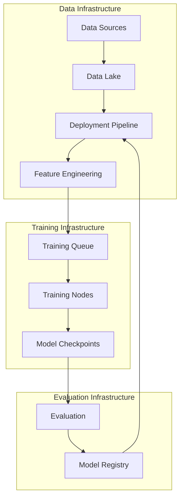
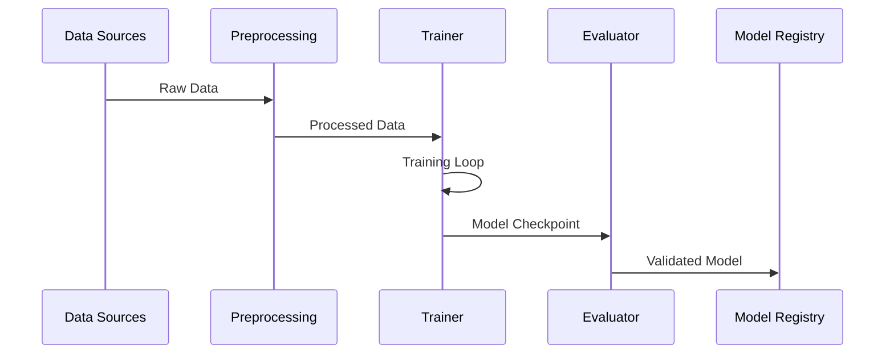
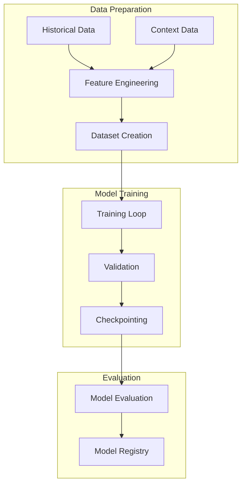
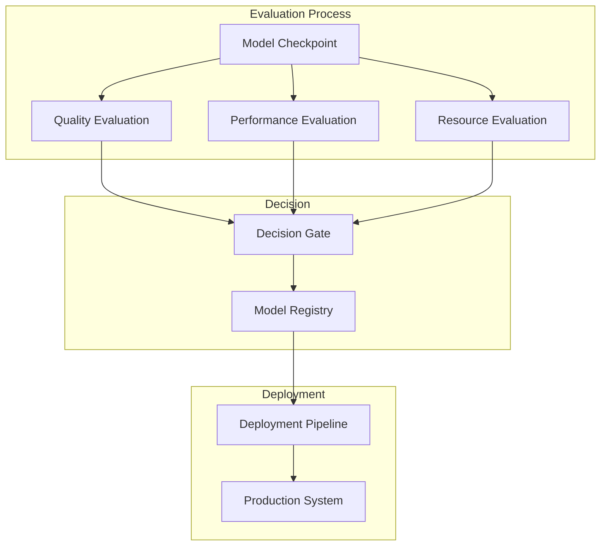
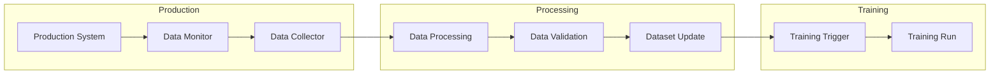

# AI Model Training Infrastructure

## Overview

Our AI training infrastructure supports the development and continuous improvement of our pattern recognition, context understanding, and narrative generation models. This document outlines the training architecture, pipelines, and quality assurance processes.

## Training Architecture

### 1. Infrastructure Overview


### 2. Model Training Pipeline
```typescript
interface TrainingPipeline {
  infrastructure: {
    compute: {
      gpu: "A100" | "V100"
      memory: number
      storage: number
    }
    
    scaling: {
      minNodes: number
      maxNodes: number
      autoScaling: boolean
    }
    
    monitoring: {
      metrics: string[]
      alerts: AlertConfig[]
      logging: LogConfig
    }
  }

  dataProcessing: {
    preprocessing: PreprocessingConfig
    augmentation: AugmentationConfig
    validation: ValidationConfig
  }

  training: {
    distributed: boolean
    precision: "fp16" | "fp32"
    gradientAccumulation: number
  }
}
```

## Training Workflows

### 1. Pattern Recognition Training


### 2. Context Engine Training


### 3. Language Model Training
```typescript
interface LanguageModelTraining {
  pretraining: {
    corpus: string[]
    vocabulary: VocabConfig
    architecture: ModelArchitecture
  }

  finetuning: {
    dataset: DatasetConfig
    objectives: TrainingObjective[]
    evaluation: EvalMetrics[]
  }

  specialization: {
    domain: "football"
    tasks: string[]
    metrics: MetricSet
  }
}
```

## Model Evaluation

### 1. Evaluation Metrics
```typescript
interface EvaluationMetrics {
  accuracy: {
    pattern: PatternMetrics
    context: ContextMetrics
    narrative: NarrativeMetrics
  }

  performance: {
    latency: LatencyMetrics
    throughput: ThroughputMetrics
    resource: ResourceMetrics
  }

  quality: {
    coherence: CoherenceMetrics
    relevance: RelevanceMetrics
    engagement: EngagementMetrics
  }
}
```

### 2. Evaluation Pipeline


## Continuous Training

### 1. Data Collection


### 2. Model Updates
```typescript
interface ModelUpdateSystem {
  monitoring: {
    metrics: MetricSet
    triggers: TriggerConfig[]
    thresholds: ThresholdConfig
  }

  updates: {
    strategy: "continuous" | "scheduled"
    validation: ValidationConfig
    rollback: RollbackConfig
  }

  deployment: {
    strategy: DeploymentStrategy
    stages: string[]
    validation: ValidationConfig
  }
}
```

## Quality Assurance

### 1. Training Quality
- Model Convergence
- Validation Metrics
- Resource Utilization
- Training Stability

### 2. Model Quality
- Accuracy Metrics
- Performance Metrics
- Resource Metrics
- Quality Metrics

## Related Documents

- [[06-pattern-recognition|Pattern Recognition]]
- [[07-context-engine|Context Engine]]
- [[08-narrative-generation|Narrative Generation]]
- [[10-model-deployment|Model Deployment]] 