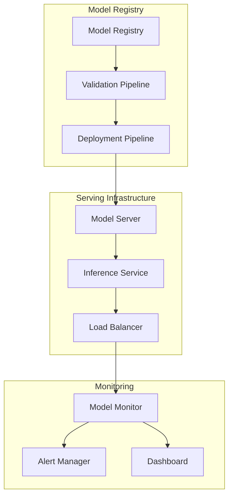
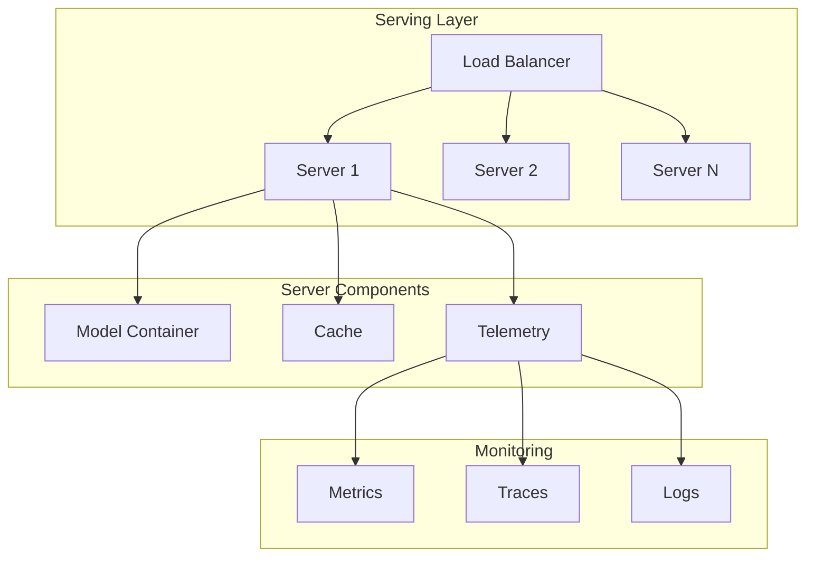
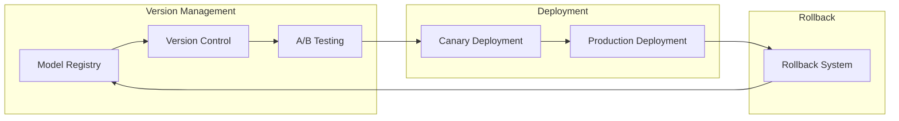
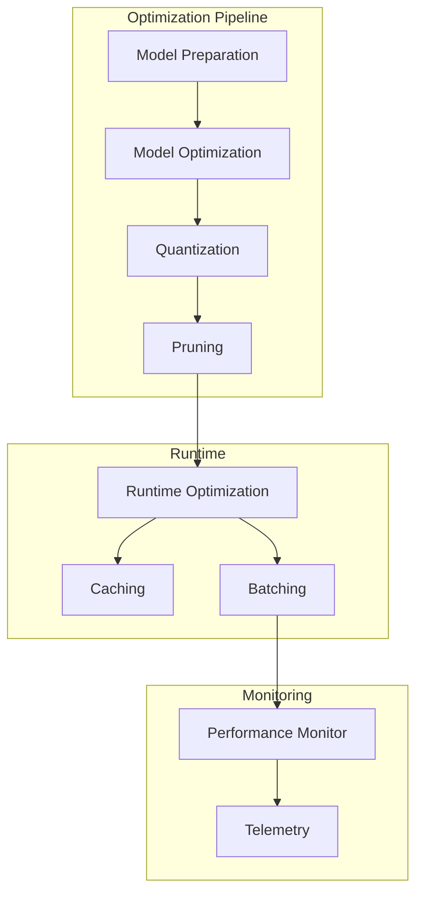
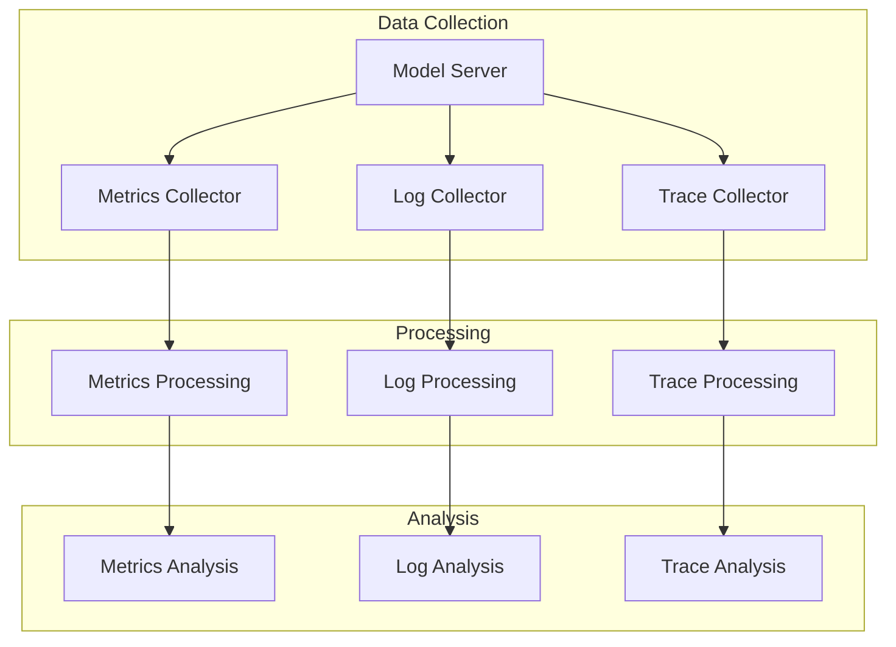

# Model Deployment & Serving

## Overview

Our model deployment infrastructure ensures reliable, scalable, and efficient serving of AI models in production. This document outlines the deployment architecture, serving infrastructure, and monitoring systems.

## Deployment Architecture

### 1. System Overview


### 2. Deployment Pipeline
```typescript
interface DeploymentPipeline {
  validation: {
    tests: ValidationTest[]
    metrics: MetricThresholds
    gates: QualityGate[]
  }

  deployment: {
    strategy: "blue-green" | "canary" | "rolling"
    stages: DeploymentStage[]
    rollback: RollbackConfig
  }

  monitoring: {
    metrics: MetricConfig[]
    alerts: AlertRule[]
    dashboards: DashboardConfig[]
  }
}
```

## Serving Infrastructure

### 1. Model Serving


### 2. Inference Configuration
```typescript
interface InferenceConfig {
  serving: {
    engine: "TensorRT" | "ONNX" | "TorchServe"
    batchSize: number
    timeout: number
  }

  optimization: {
    precision: "fp16" | "fp32"
    quantization: QuantConfig
    caching: CacheConfig
  }

  scaling: {
    minReplicas: number
    maxReplicas: number
    targetUtilization: number
  }
}
```

## Model Versioning

### 1. Version Control


### 2. Version Management
```typescript
interface VersionManagement {
  versioning: {
    strategy: VersionStrategy
    metadata: MetadataConfig
    tracking: TrackingConfig
  }

  testing: {
    abTests: ABTestConfig[]
    metrics: TestMetrics[]
    decisions: DecisionConfig[]
  }

  rollout: {
    strategy: RolloutStrategy
    phases: RolloutPhase[]
    monitoring: MonitorConfig[]
  }
}
```

## Performance Optimization

### 1. Inference Optimization


### 2. Runtime Configuration
```typescript
interface RuntimeConfig {
  optimization: {
    batching: BatchConfig
    caching: CacheConfig
    prefetching: PrefetchConfig
  }

  resources: {
    cpu: CPUConfig
    memory: MemoryConfig
    gpu: GPUConfig
  }

  monitoring: {
    metrics: MetricConfig[]
    profiling: ProfilingConfig
    logging: LogConfig
  }
}
```

## Monitoring & Alerting

### 1. Monitoring System


### 2. Alert Configuration
```typescript
interface AlertConfig {
  metrics: {
    performance: AlertRule[]
    accuracy: AlertRule[]
    resource: AlertRule[]
  }

  thresholds: {
    warning: ThresholdConfig
    critical: ThresholdConfig
    emergency: ThresholdConfig
  }

  notifications: {
    channels: NotificationChannel[]
    escalation: EscalationPolicy[]
    scheduling: ScheduleConfig[]
  }
}
```

## Quality Assurance

### 1. Service Quality
- Availability: > 99.99%
- Latency: < 100ms
- Throughput: > 1000 QPS
- Error Rate: < 0.1%

### 2. Model Quality
- Inference Accuracy
- Resource Utilization
- Cache Hit Rate
- Response Time

## Related Documents

- [[09-model-training|Model Training]]
- [[11-monitoring|Monitoring Systems]]
- [[12-scaling|Scaling Architecture]]
- [[13-reliability|Reliability Engineering]] 