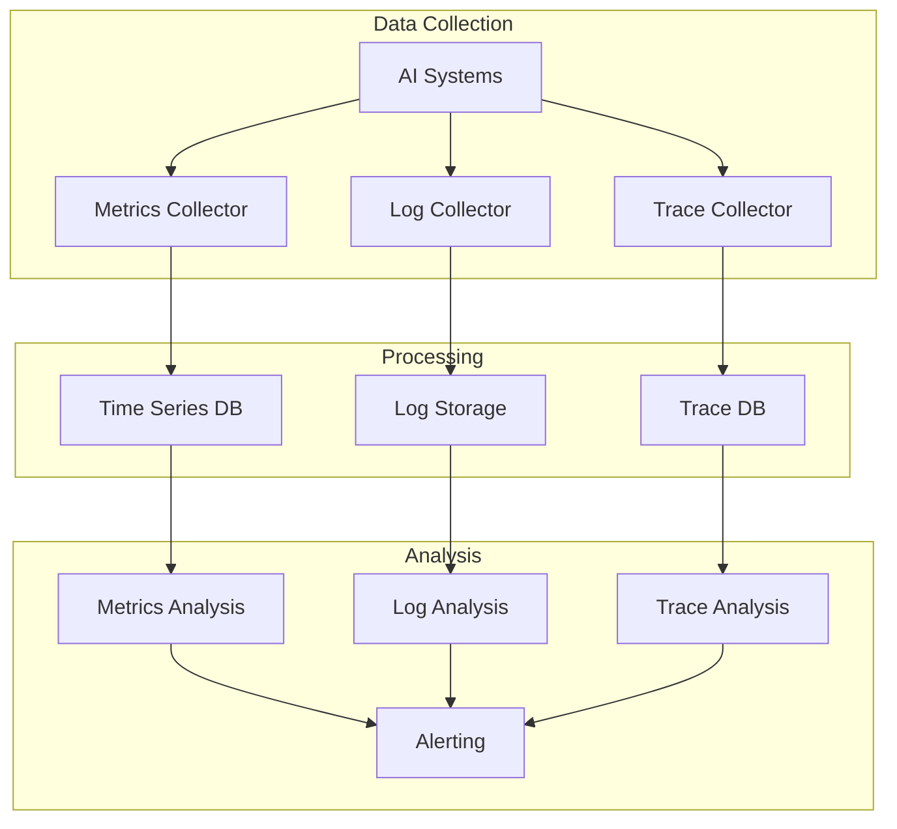
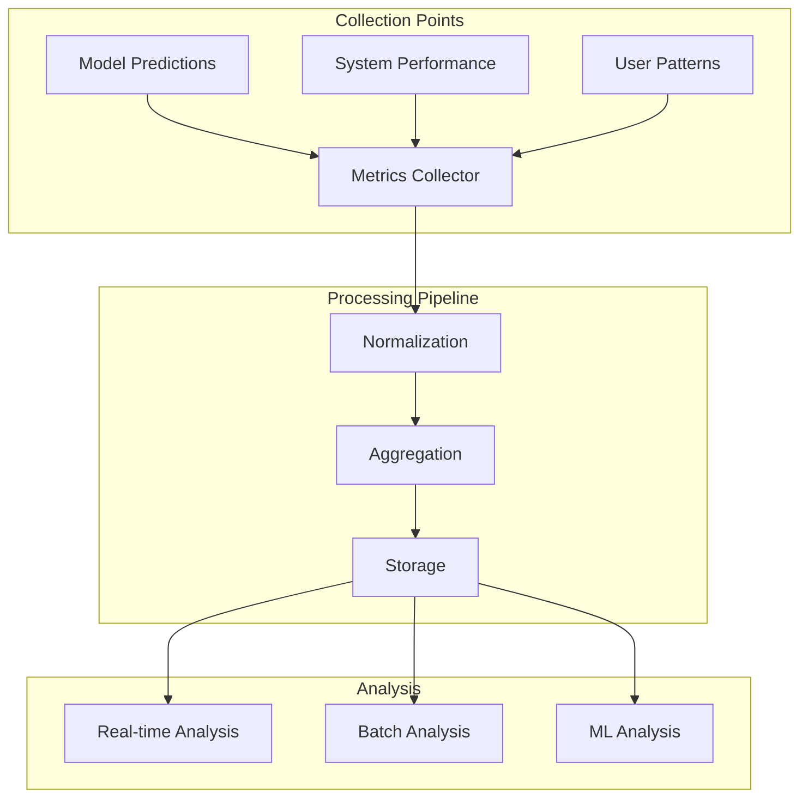
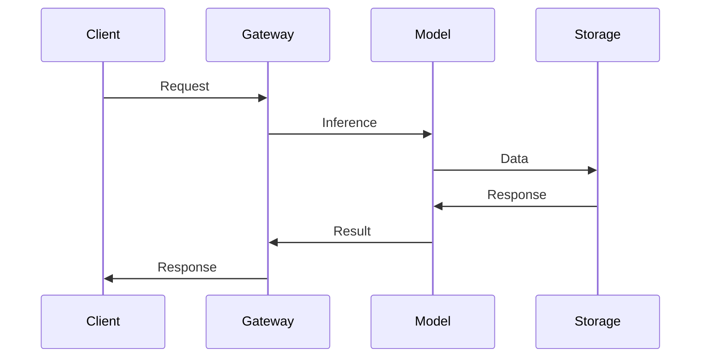
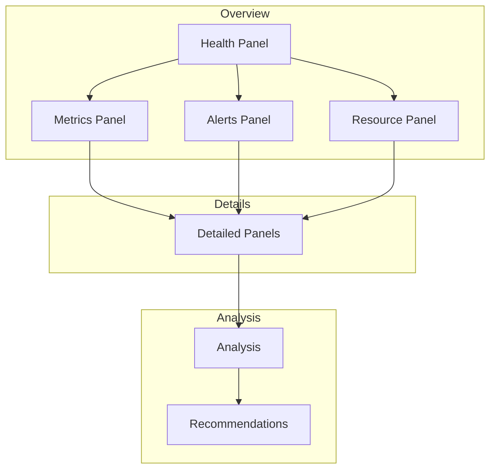
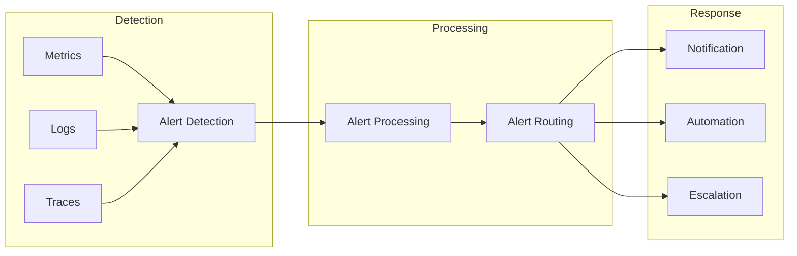
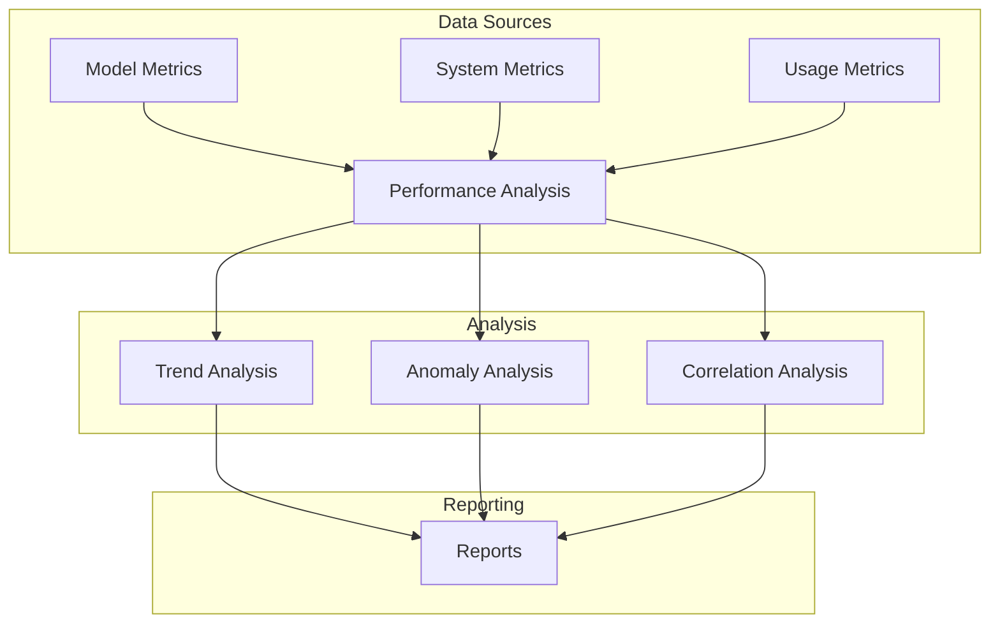

# AI System Monitoring & Observability

## Overview

Our monitoring and observability infrastructure provides comprehensive insights into the health, performance, and quality of our AI systems. This document outlines the monitoring architecture, metrics collection, and analysis systems.

## Monitoring Architecture

### 1. System Overview


### 2. Metric Categories
```typescript
interface MetricCategories {
  model: {
    accuracy: AccuracyMetrics
    latency: LatencyMetrics
    throughput: ThroughputMetrics
  }

  system: {
    resource: ResourceMetrics
    availability: AvailabilityMetrics
    errors: ErrorMetrics
  }

  business: {
    usage: UsageMetrics
    quality: QualityMetrics
    impact: ImpactMetrics
  }
}
```

## Observability Components

### 1. Metrics Collection


### 2. Log Management
```typescript
interface LogManagement {
  collection: {
    sources: LogSource[]
    formats: LogFormat[]
    levels: LogLevel[]
  }

  processing: {
    parsing: ParsingConfig
    enrichment: EnrichmentConfig
    indexing: IndexConfig
  }

  analysis: {
    queries: QueryConfig[]
    alerts: AlertConfig[]
    dashboards: DashboardConfig[]
  }
}
```

### 3. Tracing System


## Monitoring Dashboards

### 1. Model Performance Dashboard
```typescript
interface ModelDashboard {
  metrics: {
    accuracy: AccuracyPanel[]
    latency: LatencyPanel[]
    throughput: ThroughputPanel[]
  }

  analysis: {
    trends: TrendPanel[]
    anomalies: AnomalyPanel[]
    correlations: CorrelationPanel[]
  }

  alerts: {
    current: AlertPanel[]
    history: AlertHistoryPanel[]
    analysis: AlertAnalysisPanel[]
  }
}
```

### 2. System Health Dashboard


## Alert Management

### 1. Alert Configuration
```typescript
interface AlertSystem {
  rules: {
    performance: AlertRule[]
    quality: AlertRule[]
    resource: AlertRule[]
  }

  routing: {
    severity: SeverityLevel[]
    targets: AlertTarget[]
    schedules: Schedule[]
  }

  response: {
    automation: AutomationRule[]
    escalation: EscalationPolicy[]
    documentation: ResponseDoc[]
  }
}
```

### 2. Alert Flow


## Analysis & Reporting

### 1. Performance Analysis


### 2. Report Generation
```typescript
interface ReportGeneration {
  scheduling: {
    frequency: Schedule[]
    triggers: Trigger[]
    distribution: Distribution[]
  }

  content: {
    sections: ReportSection[]
    metrics: MetricSet[]
    visualizations: VisualizationSet[]
  }

  delivery: {
    formats: ReportFormat[]
    channels: DeliveryChannel[]
    recipients: Recipient[]
  }
}
```

## Quality Metrics

### 1. System Quality
- Data Collection Coverage: > 99.9%
- Metric Accuracy: > 99.99%
- Alert Accuracy: > 99%
- Response Time: < 1m

### 2. Analysis Quality
- Trend Detection Accuracy: > 95%
- Anomaly Detection Accuracy: > 90%
- Correlation Analysis Accuracy: > 85%
- Report Generation Time: < 5m

## Related Documents

- [[09-model-training|Model Training]]
- [[10-model-deployment|Model Deployment]]
- [[12-scaling|Scaling Architecture]]
- [[13-reliability|Reliability Engineering]] 