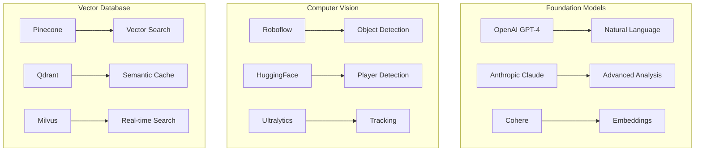
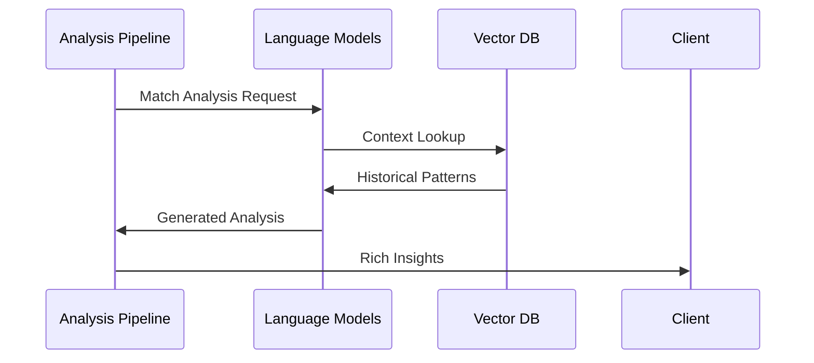
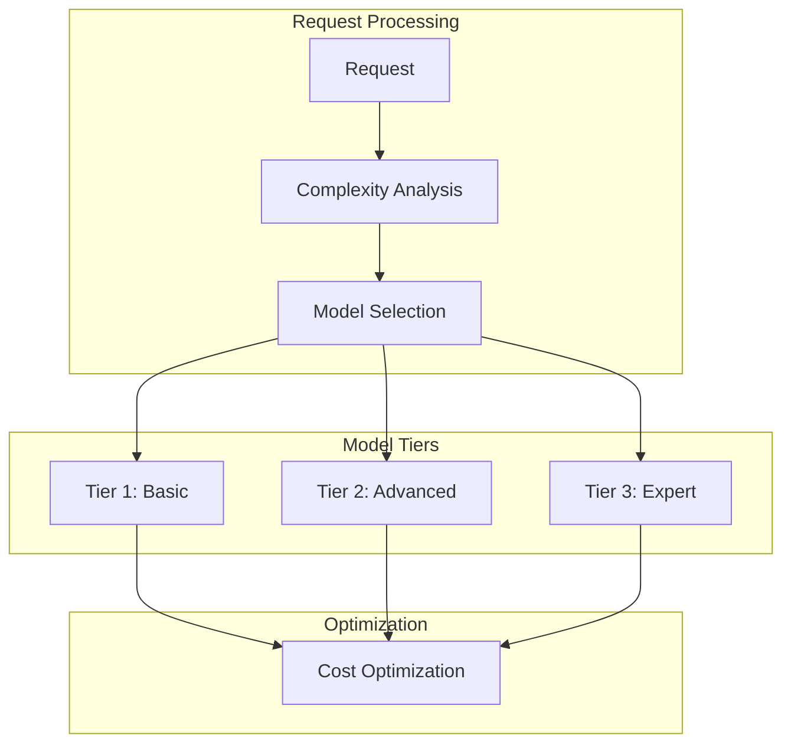

# AI Platform Strategy & Integration

Related Documents:
- [[00-overview|Architecture Overview]] - System architecture overview
- [[09-model-training|Model Training]] - Training infrastructure
- [[10-model-deployment|Model Deployment]] - Deployment strategy
- [[11-monitoring|Monitoring Systems]] - System monitoring
- [[../implementation/01-implementation-roadmap|Implementation Roadmap]] - Implementation timeline
- [[13-security|Security Architecture]] - Security framework
- [[14-cost-management|Cost Management]] - Resource optimization

## Overview

Our AI infrastructure leverages best-in-class platforms and services to deliver advanced football analytics, pattern recognition, and narrative generation. This document outlines our platform choices, integration strategies, and implementation details.

## Platform Architecture

See also:
- [[06-pattern-recognition|Pattern Recognition]] - Pattern detection system
- [[07-context-engine|Context Engine]] - Context understanding
- [[08-narrative-generation|Narrative Generation]] - Content generation

### 1. Core AI Platforms


## Implementation Details

See also:
- [[01-data-architecture|Data Architecture]] - Data infrastructure
- [[02-event-processing|Event Processing]] - Event handling
- [[03-storage-strategy|Storage Strategy]] - Data storage

### 1. Language Model Integration


### 2. Vision Model Pipeline
```typescript
interface VisionPipeline {
  preprocessing: {
    provider: "Roboflow"
    steps: [
      "frame-extraction",
      "normalization",
      "augmentation"
    ]
    config: PreprocessConfig
  }

  detection: {
    provider: "Ultralytics"
    models: {
      players: "yolov8x-pose"
      ball: "yolov8x"
      field: "yolov8-seg"
    }
    confidence: 0.85
  }

  tracking: {
    provider: "ByteTrack"
    config: {
      algorithm: "SORT"
      minConfidence: 0.7
      maxAge: 30
    }
  }

  analysis: {
    provider: "HuggingFace"
    models: {
      formation: "facebook/detr-resnet-101"
      tactics: "microsoft/resnet-50"
      movement: "google/vit-base"
    }
  }
}
```

### 3. Vector Storage Configuration
```typescript
interface VectorStorageConfig {
  pinecone: {
    environment: "gcp-starter"
    metric: "cosine"
    pods: {
      type: "p2.x1"
      replicas: 3
      shards: 1
    }
    indexes: {
      patterns: {
        dimensions: 1536
        metadata: PatternMetadata
      }
      tactics: {
        dimensions: 768
        metadata: TacticalMetadata
      }
    }
  }

  qdrant: {
    collections: {
      realtime: {
        vectors: {
          size: 1536
          distance: "Cosine"
        }
        optimization: {
          indexing: "hnsw"
          payload: PayloadConfig
        }
      }
      cache: {
        vectors: {
          size: 768
          distance: "Dot"
        }
        optimization: {
          indexing: "flat"
          payload: CacheConfig
        }
      }
    }
  }
}
```

## Platform-Specific Features

See also:
- [[05-analysis-architecture|Analysis Architecture]] - Analysis system
- [[../implementation/02-technical-specifications|Technical Specifications]] - Technical details

### 1. OpenAI Integration
```typescript
interface OpenAIConfig {
  models: {
    analysis: {
      model: "gpt-4-turbo-preview"
      temperature: 0.2
      maxTokens: 4096
      topP: 0.9
    }
    generation: {
      model: "gpt-4-turbo-preview"
      temperature: 0.7
      maxTokens: 2048
      topP: 0.95
    }
    embedding: {
      model: "text-embedding-3-large"
      dimensions: 1536
      normalize: true
    }
  }

  features: {
    functions: boolean
    vision: boolean
    streaming: boolean
    tools: ToolConfig[]
  }

  integration: {
    api: "azure" | "openai"
    version: string
    endpoints: EndpointConfig[]
  }
}
```

### 2. Anthropic Integration
```typescript
interface AnthropicConfig {
  models: {
    analysis: {
      model: "claude-3-opus"
      temperature: 0.1
      maxTokens: 4096
    }
    generation: {
      model: "claude-3-sonnet"
      temperature: 0.5
      maxTokens: 2048
    }
  }

  features: {
    vision: boolean
    tools: ToolConfig[]
    streaming: boolean
  }

  integration: {
    api: "anthropic"
    version: string
    endpoints: EndpointConfig[]
  }
}

## Cost Optimization

See also:
- [[14-cost-management|Cost Management Strategy]] - Cost management
- [[10-model-deployment|Model Deployment]] - Deployment optimization
- [[11-monitoring|Monitoring Systems]] - Resource monitoring

### 1. Model Selection Strategy


### 2. Cost Management
```typescript
interface CostManagement {
  thresholds: {
    daily: number
    monthly: number
    perRequest: number
  }

  optimization: {
    caching: CacheStrategy
    batching: BatchStrategy
    fallback: FallbackStrategy
  }

  monitoring: {
    metrics: CostMetrics[]
    alerts: AlertConfig[]
    reports: ReportConfig[]
  }
}
```

## Quality & Security

See also:
- [[13-security|Security Architecture]] - Security framework
- [[11-monitoring|Monitoring Systems]] - Quality monitoring
- [[10-model-deployment|Model Deployment]] - Deployment quality

### 1. Quality Metrics
- Model Performance: > 95% accuracy
- Response Time: < 500ms
- Availability: > 99.99%
- Cost Efficiency: < $0.01 per request

### 2. Security Measures
- API Key Rotation
- Request Encryption
- Data Privacy
- Access Control 