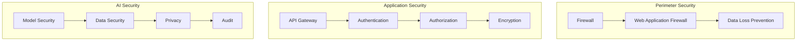
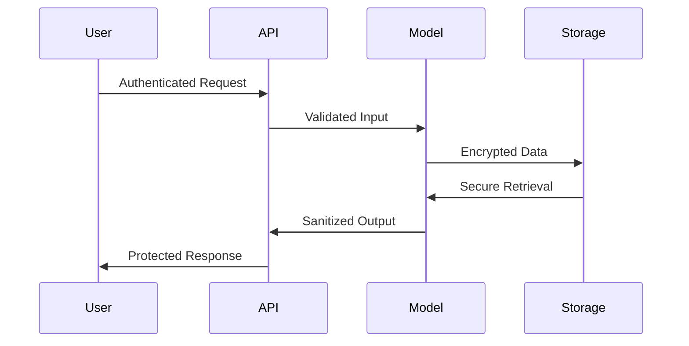
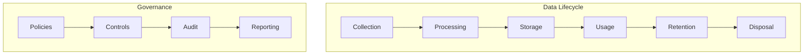
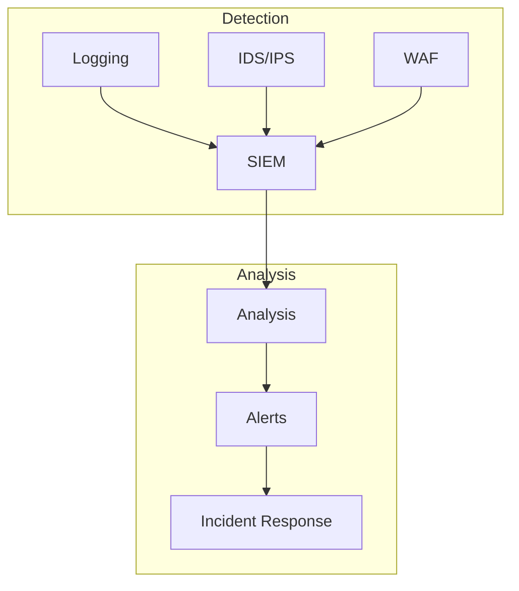

# Security Architecture

Related Documents:
- [[00-overview|Architecture Overview]] - System architecture overview
- [[12-ai-platform-strategy|AI Platform Strategy]] - AI infrastructure
- [[14-cost-management|Cost Management]] - Resource optimization
- [[10-model-deployment|Model Deployment]] - Deployment security
- [[11-monitoring|Monitoring Systems]] - Security monitoring
- [[../implementation/02-technical-specifications|Technical Specifications]] - Technical details

## Overview

Our security architecture ensures the protection of AI systems, data, and user privacy while maintaining compliance with global regulations. This document outlines our security measures, protocols, and best practices.

## Security Framework

See also:
- [[01-data-architecture|Data Architecture]] - Data security
- [[03-storage-strategy|Storage Strategy]] - Storage security
- [[05-analysis-architecture|Analysis Architecture]] - Analysis security

### 1. System Security Overview


## AI-Specific Security

See also:
- [[06-pattern-recognition|Pattern Recognition]] - Pattern security
- [[07-context-engine|Context Engine]] - Context security
- [[08-narrative-generation|Narrative Generation]] - Generation security

### 1. Model Security
```typescript
interface ModelSecurity {
  access: {
    authentication: AuthConfig
    authorization: AuthzConfig
    rateLimit: RateLimitConfig
  }

  protection: {
    inputValidation: ValidationConfig
    outputSanitization: SanitizationConfig
    adversarialDefense: DefenseConfig
  }

  monitoring: {
    logging: LogConfig
    alerting: AlertConfig
    auditing: AuditConfig
  }
}
```

### 2. Data Security Flow


## Privacy & Compliance

See also:
- [[02-event-processing|Event Processing]] - Event security
- [[09-model-training|Model Training]] - Training security
- [[10-model-deployment|Model Deployment]] - Deployment security

### 1. Privacy Framework
```typescript
interface PrivacyFramework {
  dataProtection: {
    pii: PIIConfig
    anonymization: AnonymizationConfig
    pseudonymization: PseudonymizationConfig
  }

  consent: {
    collection: ConsentConfig
    processing: ProcessingConfig
    retention: RetentionConfig
  }

  compliance: {
    gdpr: GDPRConfig
    ccpa: CCPAConfig
    hipaa: HIPAAConfig
  }
}
```

### 2. Data Governance


## Access Control

See also:
- [[11-monitoring|Monitoring Systems]] - Access monitoring
- [[../implementation/01-implementation-roadmap|Implementation Roadmap]] - Security implementation

### 1. RBAC Configuration
```typescript
interface RBACConfig {
  roles: {
    admin: Permission[]
    analyst: Permission[]
    user: Permission[]
  }

  permissions: {
    model: {
      access: AccessLevel[]
      operations: Operation[]
    }
    data: {
      access: AccessLevel[]
      operations: Operation[]
    }
  }

  enforcement: {
    policies: Policy[]
    rules: Rule[]
    auditing: AuditConfig
  }
}
```

### 2. API Security
```typescript
interface APISecurityConfig {
  gateway: {
    provider: "AWS API Gateway" | "Kong" | "Apigee"
    authentication: AuthMethod[]
    rateLimit: RateLimit
  }

  endpoints: {
    security: SecurityConfig[]
    validation: ValidationConfig[]
    monitoring: MonitoringConfig[]
  }

  protection: {
    ddos: DDoSConfig
    injection: InjectionConfig
    xss: XSSConfig
  }
}
```

## Monitoring & Incident Response

See also:
- [[11-monitoring|Monitoring Systems]] - Monitoring architecture
- [[10-model-deployment|Model Deployment]] - Deployment monitoring

### 1. Security Monitoring


### 2. Incident Response
```typescript
interface IncidentResponse {
  detection: {
    sources: Source[]
    rules: Rule[]
    thresholds: Threshold[]
  }

  response: {
    procedures: Procedure[]
    teams: Team[]
    communication: CommConfig[]
  }

  recovery: {
    plans: Plan[]
    testing: TestConfig[]
    documentation: DocConfig[]
  }
}
```

## Quality Assurance

See also:
- [[14-cost-management|Cost Management]] - Security costs
- [[11-monitoring|Monitoring Systems]] - Quality monitoring

### 1. Security Testing
- Penetration Testing
- Vulnerability Scanning
- Security Audits
- Compliance Reviews

### 2. Security Metrics
- Authentication Success Rate: > 99.99%
- Incident Response Time: < 15 minutes
- Security Update Time: < 24 hours
- Audit Compliance: 100% 