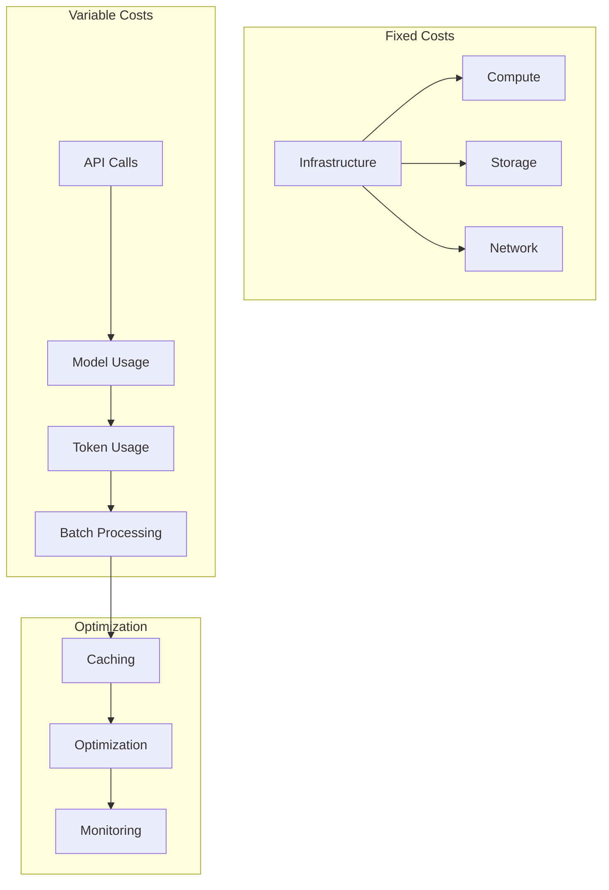
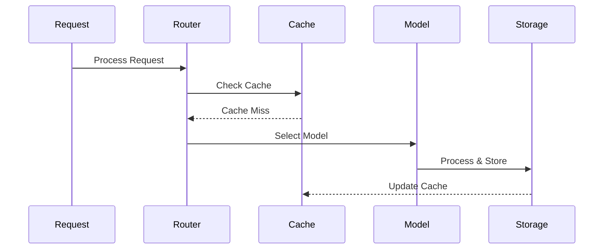
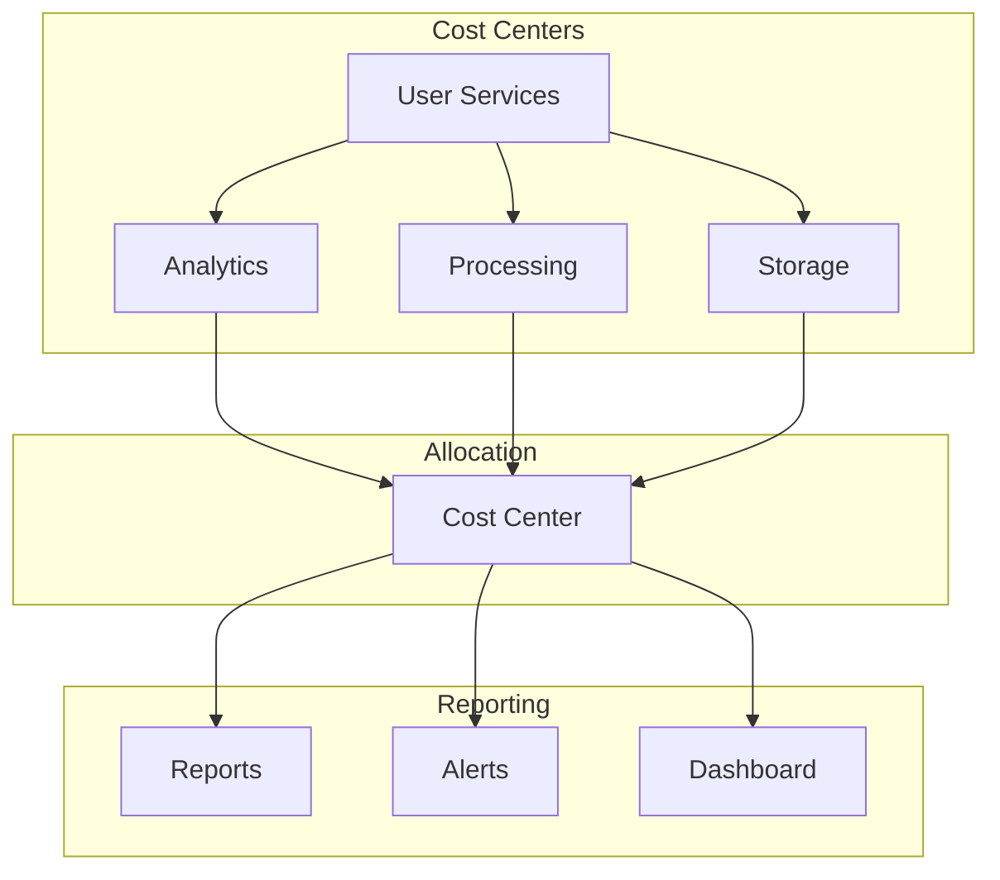
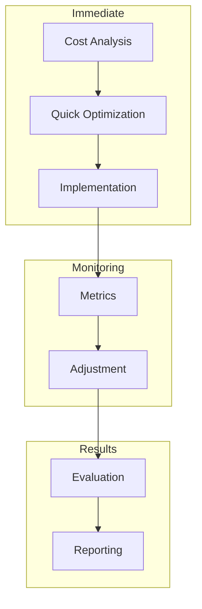

# Cost Management Strategy

Related Documents:
- [[00-overview|Architecture Overview]] - System architecture overview
- [[12-ai-platform-strategy|AI Platform Strategy]] - AI infrastructure
- [[13-security|Security Architecture]] - Security framework
- [[09-model-training|Model Training]] - Training costs
- [[10-model-deployment|Model Deployment]] - Deployment costs
- [[11-monitoring|Monitoring Systems]] - Cost monitoring

## Overview

Our cost management strategy ensures efficient utilization of AI resources while maintaining high-quality service delivery. This document outlines our approach to cost optimization, monitoring, and control across our AI platform infrastructure.

## Cost Architecture

See also:
- [[01-data-architecture|Data Architecture]] - Data costs
- [[03-storage-strategy|Storage Strategy]] - Storage costs
- [[05-analysis-architecture|Analysis Architecture]] - Analysis costs

### 1. Cost Structure Overview


## Resource Optimization

See also:
- [[06-pattern-recognition|Pattern Recognition]] - Pattern optimization
- [[07-context-engine|Context Engine]] - Context optimization
- [[08-narrative-generation|Narrative Generation]] - Generation optimization

### 1. Model Usage Optimization
```typescript
interface ModelOptimization {
  selection: {
    strategy: "cost" | "performance" | "balanced"
    rules: SelectionRule[]
    fallback: FallbackConfig
  }

  caching: {
    strategy: CacheStrategy
    ttl: number
    invalidation: InvalidationRule[]
  }

  batching: {
    enabled: boolean
    maxSize: number
    timeout: number
  }
}
```

### 2. Resource Allocation


## Cost Control Measures

See also:
- [[02-event-processing|Event Processing]] - Event costs
- [[09-model-training|Model Training]] - Training optimization
- [[10-model-deployment|Model Deployment]] - Deployment optimization

### 1. Usage Controls
```typescript
interface UsageControls {
  rateLimit: {
    requests: {
      perSecond: number
      perMinute: number
      perHour: number
    }
    tokens: {
      perRequest: number
      perUser: number
      perDay: number
    }
    costs: {
      perRequest: number
      perUser: number
      perDay: number
    }
  }

  quotas: {
    free: QuotaConfig
    basic: QuotaConfig
    premium: QuotaConfig
    enterprise: QuotaConfig
  }
}
```

### 2. Cost Allocation


## Monitoring & Reporting

See also:
- [[11-monitoring|Monitoring Systems]] - Cost monitoring
- [[../implementation/01-implementation-roadmap|Implementation Roadmap]] - Cost implementation

### 1. Cost Monitoring
```typescript
interface CostMonitoring {
  metrics: {
    usage: {
      compute: MetricConfig
      storage: MetricConfig
      api: MetricConfig
    }
    costs: {
      current: MetricConfig
      projected: MetricConfig
      historical: MetricConfig
    }
    efficiency: {
      utilization: MetricConfig
      optimization: MetricConfig
      savings: MetricConfig
    }
  }

  alerts: {
    thresholds: ThresholdConfig[]
    notifications: NotificationConfig[]
    actions: ActionConfig[]
  }
}
```

### 2. Cost Analysis
```typescript
interface CostAnalysis {
  reports: {
    daily: ReportConfig
    weekly: ReportConfig
    monthly: ReportConfig
  }

  analysis: {
    trends: TrendConfig
    patterns: PatternConfig
    anomalies: AnomalyConfig
  }

  recommendations: {
    optimization: OptimizationRec[]
    savings: SavingsRec[]
    efficiency: EfficiencyRec[]
  }
}
```

## Optimization Strategies

See also:
- [[12-ai-platform-strategy|AI Platform Strategy]] - AI optimization
- [[10-model-deployment|Model Deployment]] - Deployment optimization

### 1. Short-term Optimization


### 2. Long-term Strategy
```typescript
interface OptimizationStrategy {
  infrastructure: {
    scaling: ScalingStrategy
    reservation: ReservationStrategy
    migration: MigrationStrategy
  }

  operations: {
    automation: AutomationStrategy
    efficiency: EfficiencyStrategy
    maintenance: MaintenanceStrategy
  }

  innovation: {
    research: ResearchStrategy
    testing: TestingStrategy
    implementation: ImplementationStrategy
  }
}
```

## Quality Metrics

See also:
- [[11-monitoring|Monitoring Systems]] - Performance monitoring
- [[13-security|Security Architecture]] - Security costs

### 1. Cost Efficiency
- Cost per Request: < $0.01
- Resource Utilization: > 80%
- Cache Hit Rate: > 90%
- Optimization Rate: > 15%

### 2. Budget Compliance
- Budget Variance: < 5%
- Cost Predictability: > 90%
- Savings Target: > 20%
- ROI: > 300% 