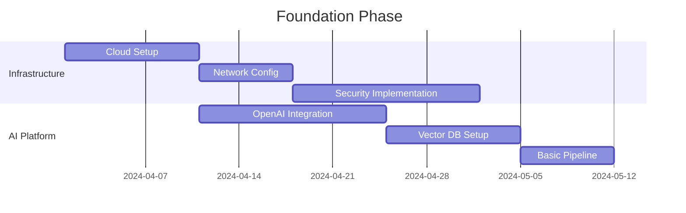
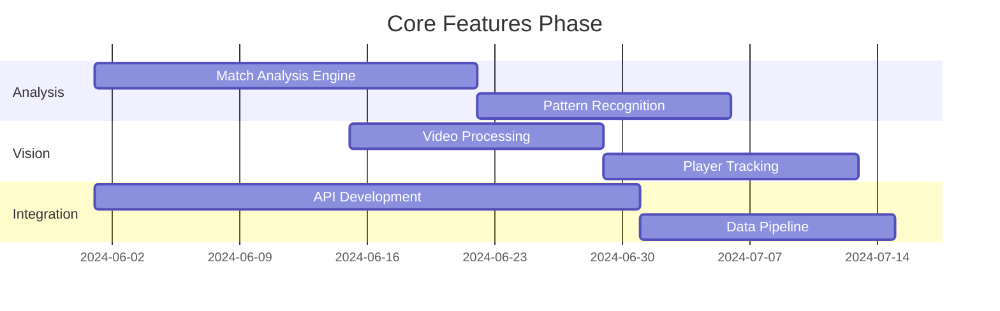
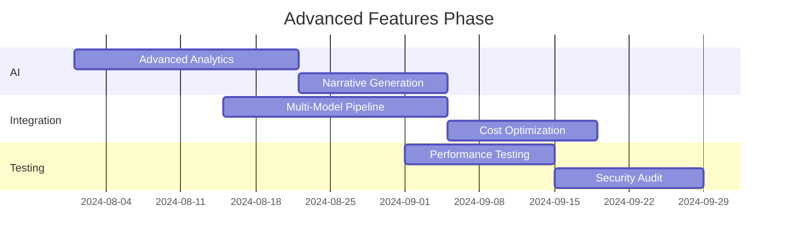
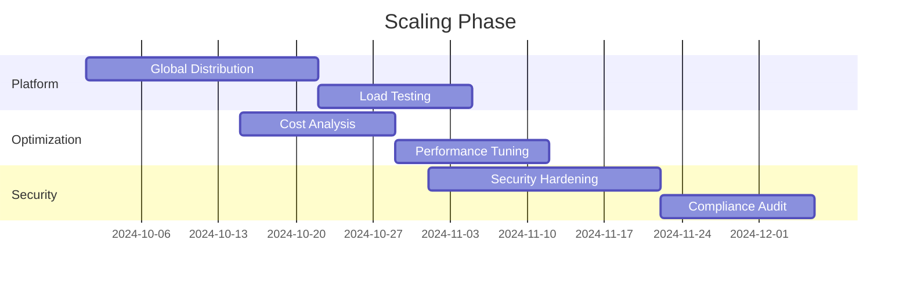

# Implementation Roadmap

Related Documents:
- [[../architecture/12-ai-platform-strategy|AI Platform Strategy]] - Core AI infrastructure
- [[../architecture/13-security|Security Architecture]] - Security framework
- [[../architecture/14-cost-management|Cost Management]] - Resource optimization
- [[02-technical-specifications|Technical Specifications]] - Detailed specifications
- [[../1-core-systems/ai-integration|AI Integration]] - AI system implementation
- [[../4-workflows/development-workflow|Development Workflow]] - Development practices

## Overview

This document outlines the phased implementation plan for Drib's AI-powered football analytics platform, incorporating our technical decisions and platform integrations.

## Phase 1: Foundation (Months 1-2)

See also: [[../3-infrastructure/cloud-setup|Cloud Infrastructure Setup]]

### 1. Infrastructure Setup


### 2. Core Components
```typescript
interface Phase1Deliverables {
  infrastructure: {
    cloud: {
      provider: "AWS" | "GCP"
      services: [
        "Kubernetes",
        "Container Registry",
        "Load Balancer",
        "Monitoring"
      ]
    }
    security: {
      auth: "Auth0"
      encryption: "AWS KMS"
      network: "CloudFlare"
    }
  }

  aiPlatform: {
    language: {
      provider: "OpenAI"
      models: ["gpt-4-turbo-preview"]
      integration: "REST API"
    }
    storage: {
      vector: "Pinecone"
      cache: "Redis"
      data: "PostgreSQL"
    }
  }
}
```

## Phase 2: Core Features (Months 3-4)

See also: 
- [[../1-core-systems/match-analysis|Match Analysis Engine]]
- [[../1-core-systems/computer-vision|Computer Vision Pipeline]]
- [[../1-core-systems/data-pipeline|Data Pipeline Architecture]]

### 1. Feature Implementation


### 2. Technical Components
```typescript
interface Phase2Deliverables {
  analysis: {
    match: {
      engine: "Custom + GPT-4"
      features: [
        "live-analysis",
        "pattern-detection",
        "tactical-insights"
      ]
    }
    vision: {
      preprocessing: "Roboflow"
      detection: "YOLOv8"
      tracking: "ByteTrack"
    }
  }

  integration: {
    api: {
      gateway: "Kong"
      documentation: "OpenAPI 3.0"
      monitoring: "Datadog"
    }
    pipeline: {
      streaming: "Apache Kafka"
      processing: "Apache Flink"
      storage: "TimescaleDB"
    }
  }
}
```

## Phase 3: Advanced Features (Months 5-6)

See also:
- [[../1-core-systems/narrative-generation|Narrative Generation]]
- [[../1-core-systems/pattern-recognition|Pattern Recognition]]
- [[../4-workflows/testing-workflow|Testing Strategy]]

### 1. Feature Expansion


### 2. Advanced Components
```typescript
interface Phase3Deliverables {
  ai: {
    analytics: {
      models: {
        primary: "GPT-4"
        specialized: "Claude-3"
        embedding: "Cohere"
      }
      features: [
        "deep-analysis",
        "predictive-insights",
        "tactical-recommendations"
      ]
    }
    generation: {
      narrative: "Custom + GPT-4"
      visualization: "D3.js + Custom"
      interaction: "Real-time"
    }
  }

  optimization: {
    cost: {
      caching: "Multi-level"
      batching: "Dynamic"
      routing: "Smart"
    }
    performance: {
      scaling: "Auto"
      distribution: "Global"
      monitoring: "Full-stack"
    }
  }
}
```

## Phase 4: Scaling & Optimization (Months 7-8)

See also:
- [[../3-infrastructure/scaling|Scaling Architecture]]
- [[../3-infrastructure/monitoring|Monitoring System]]
- [[../3-infrastructure/security|Security Implementation]]

### 1. Scale Implementation


### 2. Production Readiness
```typescript
interface Phase4Deliverables {
  scaling: {
    infrastructure: {
      regions: string[]
      capacity: ScalingConfig
      redundancy: RedundancyConfig
    }
    performance: {
      optimization: OptimizationConfig
      monitoring: MonitoringConfig
      alerts: AlertConfig
    }
  }

  security: {
    hardening: {
      network: NetworkConfig
      application: AppConfig
      data: DataConfig
    }
    compliance: {
      standards: string[]
      audits: AuditConfig
      documentation: DocConfig
    }
  }
}
```

## Quality Gates

See also: [[../4-workflows/quality-assurance|Quality Assurance Process]]

### 1. Performance Metrics
- API Response Time: < 200ms
- Model Inference Time: < 500ms
- System Availability: > 99.99%
- Error Rate: < 0.1%

### 2. Quality Checks
- Code Coverage: > 90%
- Security Compliance: 100%
- API Documentation: Complete
- Performance Tests: Passed

## Risk Management

See also: [[../4-workflows/risk-management|Risk Management Process]]

### 1. Technical Risks
- AI Model Performance
- Scaling Challenges
- Integration Complexity
- Cost Management

### 2. Mitigation Strategies
- Phased Rollout
- Continuous Testing
- Performance Monitoring
- Cost Controls 