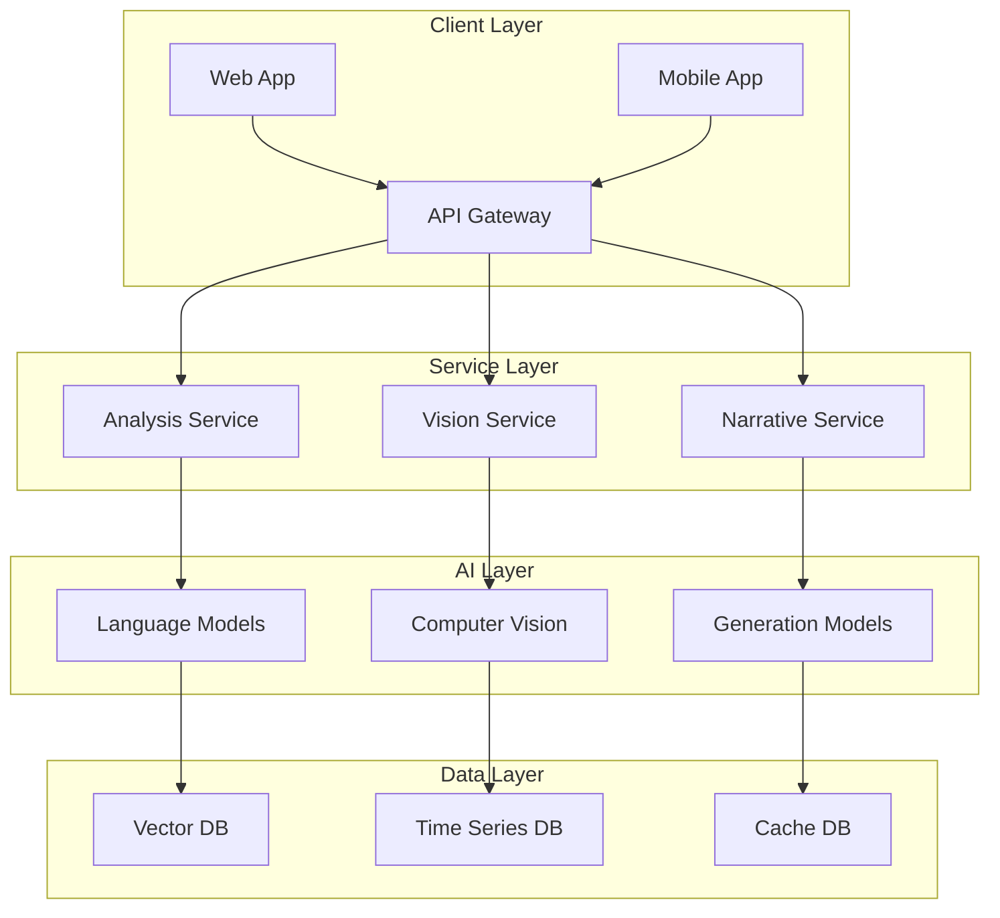
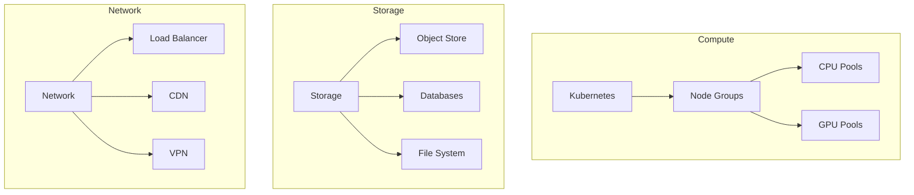

# Technical Specifications

Related Documents:
- [[01-implementation-roadmap|Implementation Roadmap]] - Implementation timeline
- [[../architecture/12-ai-platform-strategy|AI Platform Strategy]] - AI infrastructure
- [[../2-frontend/architecture|Frontend Architecture]] - Client architecture
- [[../1-core-systems/api-design|API Design]] - API architecture
- [[../1-core-systems/data-models|Data Models]] - Core data models
- [[../3-infrastructure/deployment|Deployment Architecture]] - Infrastructure setup

## Overview

This document provides detailed technical specifications for implementing Drib's AI-powered football analytics platform, focusing on system architecture, integrations, and implementation requirements.

## System Architecture

See also: [[../architecture/system-overview|System Architecture Overview]]

### 1. High-Level Architecture


### 2. Service Specifications
```typescript
interface ServiceSpecs {
  analysis: {
    service: {
      language: "TypeScript"
      framework: "NestJS"
      scaling: "Horizontal"
    }
    dependencies: {
      primary: {
        openai: "^1.12.0"
        anthropic: "^0.9.0"
        pinecone: "^1.1.0"
      }
      infrastructure: {
        kafka: "^2.1.0"
        redis: "^7.2.0"
        postgres: "^14.0"
      }
    }
    apis: {
      internal: "gRPC"
      external: "REST"
      streaming: "WebSocket"
    }
  }

  vision: {
    service: {
      language: "Python"
      framework: "FastAPI"
      scaling: "GPU-based"
    }
    dependencies: {
      primary: {
        roboflow: "^1.0.0"
        ultralytics: "^8.0.0"
        bytetrack: "^1.0.0"
      }
      infrastructure: {
        opencv: "^4.8.0"
        pytorch: "^2.1.0"
        cuda: "^12.0"
      }
    }
    apis: {
      internal: "gRPC"
      processing: "CUDA"
      streaming: "RTMP"
    }
  }
}
```

## Implementation Requirements

See also: 
- [[../4-workflows/development-setup|Development Environment Setup]]
- [[../3-infrastructure/kubernetes|Kubernetes Configuration]]
- [[../4-workflows/ci-cd|CI/CD Pipeline]]

### 1. Development Environment
```typescript
interface DevelopmentEnv {
  local: {
    docker: {
      version: "24.0.0"
      compose: "2.24.0"
      images: ContainerConfig[]
    }
    kubernetes: {
      version: "1.28"
      tools: ["kubectl", "helm", "k9s"]
      configs: K8sConfig[]
    }
    tools: {
      ide: "VSCode"
      extensions: string[]
      configs: ToolConfig[]
    }
  }

  ci: {
    platform: "GitHub Actions"
    stages: ["lint", "test", "build", "deploy"]
    environments: ["dev", "staging", "prod"]
  }
}
```

### 2. Infrastructure Requirements


## API Specifications

See also:
- [[../1-core-systems/api-documentation|API Documentation]]
- [[../1-core-systems/api-security|API Security]]
- [[../1-core-systems/api-versioning|API Versioning]]

### 1. Analysis API
```typescript
interface AnalysisAPI {
  endpoints: {
    match: {
      analysis: {
        path: "/v1/match/analysis"
        method: "POST"
        input: MatchAnalysisInput
        output: AnalysisResult
      }
      patterns: {
        path: "/v1/match/patterns"
        method: "GET"
        input: PatternQuery
        output: PatternResult[]
      }
    }
    tactics: {
      analysis: {
        path: "/v1/tactics/analysis"
        method: "POST"
        input: TacticsInput
        output: TacticsResult
      }
    }
  }

  models: {
    input: {
      match: MatchData
      video: VideoData
      events: EventData[]
    }
    output: {
      analysis: AnalysisData
      patterns: PatternData
      insights: InsightData
    }
  }
}
```

### 2. Vision API
```typescript
interface VisionAPI {
  endpoints: {
    tracking: {
      players: {
        path: "/v1/vision/players"
        method: "POST"
        input: VideoFrame
        output: TrackingResult
      }
      ball: {
        path: "/v1/vision/ball"
        method: "POST"
        input: VideoFrame
        output: BallTracking
      }
    }
    analysis: {
      formation: {
        path: "/v1/vision/formation"
        method: "POST"
        input: FrameSequence
        output: FormationAnalysis
      }
    }
  }

  streaming: {
    protocol: "WebRTC"
    formats: ["H.264", "VP8"]
    quality: StreamQuality
  }
}
```

## Data Models

See also:
- [[../1-core-systems/data-schema|Database Schema]]
- [[../1-core-systems/vector-storage|Vector Storage Design]]
- [[../1-core-systems/caching|Caching Strategy]]

### 1. Core Models
```typescript
interface CoreModels {
  match: {
    metadata: MatchMetadata
    events: MatchEvent[]
    analysis: AnalysisData
    patterns: PatternData[]
  }

  player: {
    tracking: TrackingData
    stats: PlayerStats
    patterns: PlayerPatterns
  }

  team: {
    formation: FormationData
    tactics: TacticsData
    patterns: TeamPatterns
  }
}
```

### 2. Storage Models
```typescript
interface StorageModels {
  vector: {
    dimensions: 1536
    metadata: {
      type: "pattern" | "tactic" | "event"
      context: StorageContext
      timestamp: number
    }
    indexes: {
      primary: "patterns"
      secondary: "tactics"
    }
  }

  timeseries: {
    metrics: MetricConfig[]
    retention: RetentionPolicy
    aggregation: AggregationRules
  }

  cache: {
    keys: KeyPattern[]
    ttl: TTLConfig
    invalidation: InvalidationRules
  }
}
```

## Quality Requirements

See also:
- [[../4-workflows/performance-testing|Performance Testing]]
- [[../4-workflows/load-testing|Load Testing]]
- [[../4-workflows/security-testing|Security Testing]]

### 1. Performance Requirements
- API Latency: < 100ms (p95)
- Batch Processing: < 1s
- Real-time Analysis: < 500ms
- Stream Processing: 30fps

### 2. Scalability Requirements
- Concurrent Users: 100K+
- Events/Second: 10K+
- Storage: Petabyte-scale
- Processing: GPU-optimized

## Security Requirements

See also:
- [[../architecture/13-security|Security Architecture]]
- [[../3-infrastructure/authentication|Authentication System]]
- [[../3-infrastructure/encryption|Encryption Implementation]]

### 1. Authentication & Authorization
- OAuth 2.0 / OIDC
- Role-based Access Control
- API Key Management
- Rate Limiting

### 2. Data Protection
- End-to-end Encryption
- Data Anonymization
- Secure Storage
- Audit Logging 