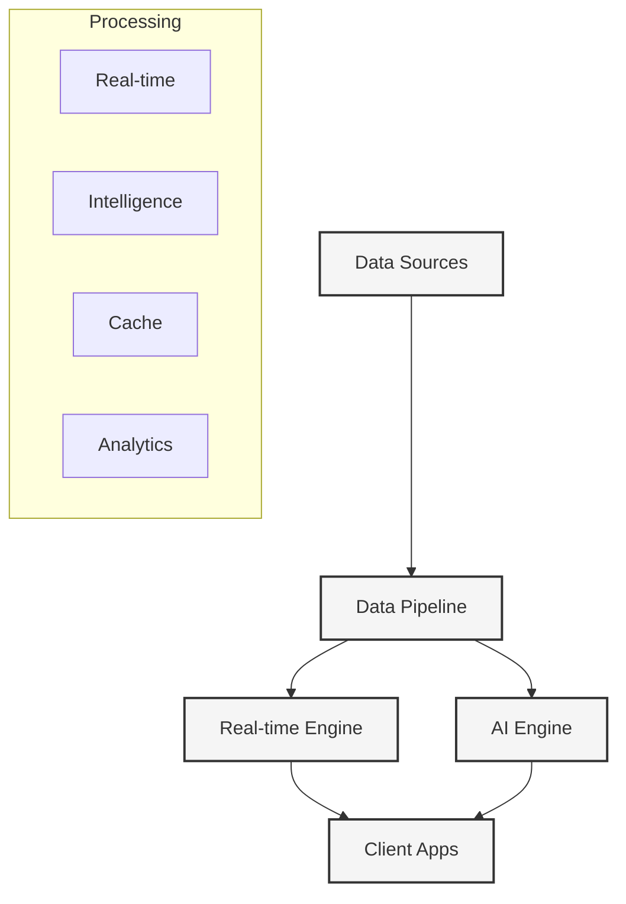

# System Architecture

#architecture #technical #infrastructure

## Core Architecture



## System Components

### 1. Data Integration Layer
```typescript
interface DataProvider {
  // Core data fetching
  fetchLiveMatches(): Promise<Match[]>
  fetchMatchDetails(id: string): Promise<MatchDetail>
  fetchPlayerStats(id: string): Promise<PlayerStats>
  
  // Real-time updates
  subscribeToMatch(id: string): Observable<MatchUpdate>
  subscribeToStats(id: string): Observable<StatsUpdate>
  
  // Historical data
  fetchHistoricalData(query: HistoryQuery): Promise<HistoricalData>
}

class DataPipeline {
  // Data processing
  async processMatchData(data: RawMatch): Promise<ProcessedMatch>
  async enrichWithStats(match: Match): Promise<EnrichedMatch>
  async correlateEvents(events: Event[]): Promise<CorrelatedEvents>
  
  // Data validation
  async validateData(data: any): Promise<ValidationResult>
  async reconcileConflicts(conflicts: Conflict[]): Promise<Resolution>
}
```

### 2. Real-time Engine
```typescript
class RealTimeEngine {
  // Match updates
  async broadcastUpdate(update: Update): Promise<void>
  async processEvent(event: Event): Promise<void>
  
  // State management
  async syncState(matchId: string): Promise<MatchState>
  async handleConflict(conflict: Conflict): Promise<Resolution>
  
  // Client connections
  async manageConnections(matchId: string): Promise<void>
  async optimizeBandwidth(connection: Connection): Promise<void>
}

interface MatchState {
  match: Match
  events: Event[]
  stats: Stats
  predictions: Prediction[]
  analysis: Analysis
}
```

### 3. AI Engine
```typescript
class AIEngine {
  // Core analysis
  async analyzeTactics(match: Match): Promise<TacticalAnalysis>
  async predictOutcomes(state: MatchState): Promise<Predictions>
  async generateInsights(data: MatchData): Promise<Insights>
  
  // Computer vision
  async analyzeMovement(video: VideoStream): Promise<MovementAnalysis>
  async detectEvents(frame: Frame): Promise<Events>
  
  // NLP
  async generateCommentary(events: Event[]): Promise<Commentary>
  async analyzeDiscussion(thread: Thread): Promise<ThreadAnalysis>
}

interface AIModels {
  tactical: TacticalModel
  prediction: PredictionModel
  vision: VisionModel
  language: LanguageModel
}
```

### 4. Client Applications
```typescript
interface ClientApp {
  // State management
  syncState(state: AppState): void
  handleUpdate(update: Update): void
  
  // User experience
  renderMatch(match: Match): void
  showAnalysis(analysis: Analysis): void
  
  // Offline support
  cacheData(data: CacheData): void
  syncOfflineChanges(): void
}

class MatchView {
  // Real-time updates
  handleLiveUpdate(update: Update): void
  updateStats(stats: Stats): void
  
  // AI integration
  showPredictions(predictions: Prediction[]): void
  displayInsights(insights: Insight[]): void
}
```

## Technical Stack

### Core Infrastructure
- Next.js 15 App Router
- React 19
- TypeScript 5
- WebSocket/SSE

### Data Layer
- PostgreSQL (Match data)
- Redis (Real-time cache)
- Vector DB (AI embeddings)
- Time-series DB (Statistics)

### AI Infrastructure
- TensorFlow.js (Client-side ML)
- PyTorch (Server ML)
- Hugging Face (NLP)
- Custom CV models

### Real-time Stack
- WebSocket clusters
- Redis Pub/Sub
- SSE for updates
- Service Workers

## Scalability Considerations

### 1. Data Processing
- Distributed processing
- Stream processing
- Batch analytics
- Data partitioning

### 2. Real-time System
- Connection pooling
- Load balancing
- Message queuing
- State synchronization

### 3. AI Processing
- Model optimization
- Inference scaling
- Batch prediction
- Edge computing

### 4. Client Delivery
- CDN optimization
- Progressive loading
- Bandwidth management
- Cache strategies

## Development Guidelines

### 1. Data Management
- Validate all sources
- Handle conflicts
- Maintain consistency
- Optimize storage

### 2. Real-time Features
- Minimize latency
- Handle disconnects
- Sync states
- Manage bandwidth

### 3. AI Integration
- Model versioning
- Quality monitoring
- Resource optimization
- Fallback handling

### 4. Client Performance
- Progressive enhancement
- Offline support
- Battery optimization
- Memory management

## Monitoring & Analytics

### 1. System Health
- Service metrics
- Error tracking
- Performance monitoring
- Resource usage

### 2. User Experience
- Client performance
- Feature usage
- Error rates
- User satisfaction

### 3. AI Performance
- Model accuracy
- Inference speed
- Resource usage
- Quality metrics

## Security Considerations

### 1. Data Protection
- End-to-end encryption
- Data anonymization
- Access control
- Audit logging

### 2. API Security
- Rate limiting
- Authentication
- Input validation
- Output sanitization

### 3. AI Safety
- Bias monitoring
- Output validation
- Model security
- Data privacy 