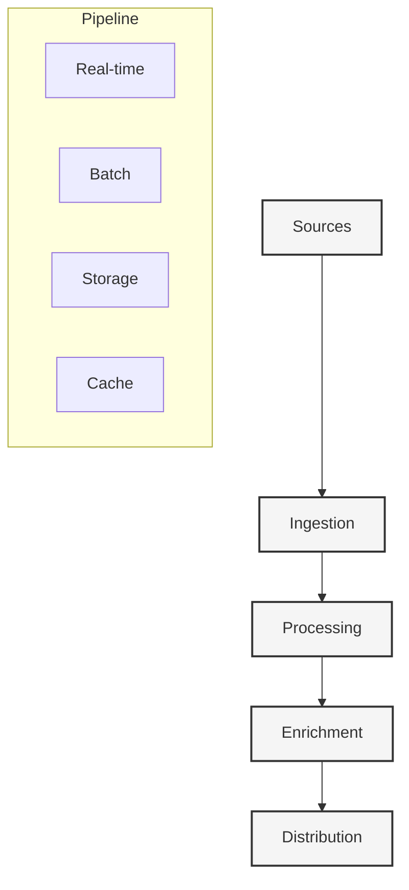

# Football Data Pipeline

#data #integration #real-time

## Overview

The data pipeline is the backbone of Drib, responsible for ingesting, processing, and distributing football data from multiple sources while maintaining real-time capabilities and data accuracy.

## Core Architecture



## Data Sources

### 1. Live Match Data
```typescript
interface LiveDataProvider {
  // Core match data
  fetchLiveMatches(): Promise<Match[]>
  subscribeToMatch(id: string): Observable<MatchUpdate>
  
  // Event stream
  subscribeToEvents(matchId: string): Observable<Event>
  fetchEventHistory(matchId: string): Promise<Event[]>
  
  // Statistics
  fetchLiveStats(matchId: string): Promise<Stats>
  subscribeToStats(matchId: string): Observable<StatsUpdate>
}
```

### 2. Historical Data
```typescript
interface HistoricalProvider {
  // Match history
  fetchMatchHistory(query: HistoryQuery): Promise<Match[]>
  fetchTeamHistory(teamId: string): Promise<TeamHistory>
  
  // Player data
  fetchPlayerHistory(playerId: string): Promise<PlayerHistory>
  fetchCareerStats(playerId: string): Promise<CareerStats>
  
  // Competition data
  fetchSeasonData(seasonId: string): Promise<Season>
  fetchCompetitionHistory(compId: string): Promise<Competition>
}
```

### 3. Statistical Data
```typescript
interface StatsProvider {
  // Advanced stats
  fetchAdvancedStats(matchId: string): Promise<AdvancedStats>
  fetchPlayerMetrics(playerId: string): Promise<PlayerMetrics>
  
  // Analysis
  fetchTeamAnalysis(teamId: string): Promise<TeamAnalysis>
  fetchPlayerAnalysis(playerId: string): Promise<PlayerAnalysis>
  
  // Predictions
  fetchPredictions(matchId: string): Promise<Predictions>
  fetchTrends(entityId: string): Promise<Trends>
}
```

## Data Processing

### 1. Ingestion Pipeline
```typescript
class IngestionPipeline {
  // Data collection
  async collectLiveData(source: DataSource): Promise<LiveData>
  async collectHistoricalData(source: DataSource): Promise<HistoricalData>
  
  // Validation
  async validateData(data: RawData): Promise<ValidationResult>
  async normalizeData(data: RawData): Promise<NormalizedData>
  
  // Error handling
  async handleSourceError(error: SourceError): Promise<void>
  async retryCollection(params: RetryParams): Promise<void>
}
```

### 2. Processing Engine
```typescript
class ProcessingEngine {
  // Core processing
  async processMatchData(data: RawMatch): Promise<ProcessedMatch>
  async processEvents(events: RawEvent[]): Promise<ProcessedEvent[]>
  
  // Enrichment
  async enrichWithStats(match: Match): Promise<EnrichedMatch>
  async enrichWithContext(event: Event): Promise<EnrichedEvent>
  
  // Analysis
  async analyzePatterns(data: MatchData): Promise<Patterns>
  async detectAnomalies(data: TimeSeriesData): Promise<Anomalies>
}
```

### 3. Distribution System
```typescript
class DistributionSystem {
  // Real-time distribution
  async broadcastUpdate(update: Update): Promise<void>
  async notifySubscribers(event: Event): Promise<void>
  
  // Caching
  async cacheData(data: CacheableData): Promise<void>
  async invalidateCache(params: InvalidationParams): Promise<void>
  
  // Client delivery
  async optimizePayload(data: any): Promise<OptimizedData>
  async compressData(data: any): Promise<CompressedData>
}
```

## Data Models

### 1. Core Models
```typescript
interface Match {
  id: string
  competition: Competition
  homeTeam: Team
  awayTeam: Team
  score: Score
  events: Event[]
  stats: Stats
  status: MatchStatus
  timeline: Timeline
}

interface Event {
  id: string
  type: EventType
  minute: number
  second: number
  players: Player[]
  location: Location
  data: EventData
}

interface Stats {
  possession: PossessionStats
  shots: ShotStats
  passes: PassStats
  defense: DefenseStats
  advanced: AdvancedStats
}
```

### 2. Analysis Models
```typescript
interface Analysis {
  tactical: TacticalAnalysis
  technical: TechnicalAnalysis
  physical: PhysicalAnalysis
  trends: TrendAnalysis
}

interface Prediction {
  type: PredictionType
  probability: number
  factors: Factor[]
  confidence: number
}

interface Pattern {
  type: PatternType
  frequency: number
  significance: number
  context: PatternContext
}
```

## Performance Optimization

### 1. Real-time Optimization
- Message compression
- Delta updates
- Priority queuing
- Connection pooling

### 2. Data Optimization
- Incremental processing
- Batch analytics
- Caching strategies
- Index optimization

### 3. Resource Management
- Load balancing
- Auto-scaling
- Resource pooling
- Connection management

## Quality Assurance

### 1. Data Validation
- Source verification
- Schema validation
- Consistency checks
- Anomaly detection

### 2. Error Handling
- Retry mechanisms
- Fallback sources
- Error recovery
- Data reconciliation

### 3. Monitoring
- Pipeline metrics
- Quality metrics
- Performance metrics
- Health checks

## Future Enhancements

### 1. Advanced Processing
- ML-based validation
- Automated corrections
- Pattern recognition
- Predictive caching

### 2. Integration
- New data sources
- Custom providers
- API partnerships
- Data marketplaces

### 3. Optimization
- Edge processing
- Stream processing
- Real-time analytics
- Custom protocols 